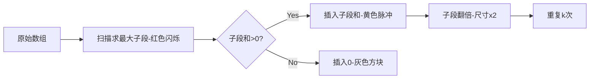

# 题目信息

# Maximum Sum

## 题目描述

You have an array $ a $ of $ n $ integers.

You perform exactly $ k $ operations on it. In one operation, you select any contiguous subarray of the array $ a $ (possibly empty) and insert the sum of this subarray anywhere in the array.

Your task is to find the maximum possible sum of the array after $ k $ such operations.

As this number can be very large, output the answer modulo $ 10^9 + 7 $ .

Reminder: the remainder of a number $ x $ modulo $ p $ is the smallest non-negative $ y $ such that there exists an integer $ q $ and $ x = p \cdot q + y $ .

## 说明/提示

In the first test case, it is advantageous to take an empty subarray of the array twice and insert the sum of the empty subarray (zero) anywhere, then the sum of the resulting array will be $ (-4) + (-7) + 0 + 0 = -11 $ , modulo $ 10^9 + 7 $ this is $ 999\,999\,996 $ .

In the second test case, it is advantageous to take the sum of the entire array three times and place it anywhere in the array, then one of the possible sequences of actions: \[ $ 2, 2, 8 $ \] $ \rightarrow $ \[ $ 2, 2, 8, 12 $ \] $ \rightarrow $ \[ $ 2, 2, 8, 12, 24 $ \] $ \rightarrow $ \[ $ 2, 2, 8, 12, 24, 48 $ \], the sum of the final array is $ 2 + 2 + 8 + 12 + 24 + 48 = 96 $ .

In the fourth test case, it is advantageous to take a subarray of the array consisting of the first three numbers (i.e. consisting of the numbers $ 4, -2 $ and $ 8 $ ) and insert its sum at the beginning of the array, thereby obtaining the array \[ $ 10, 4, -2, 8, -12, 9 $ \], the sum of this array is $ 17 $ .

In the seventh test case, it will always be advantageous for us to take an empty subarray of the array. In this case, the sum of the resulting array will not differ from the sum of the original. The answer will be the sum of the original array, taken modulo — $ 42 $ , because $ (-6 \cdot (10^9 + 7) + 42 = -6\,000\,000\,000) $ .

## 样例 #1

### 输入

```
12
2 2
-4 -7
3 3
2 2 8
1 7
7
5 1
4 -2 8 -12 9
7 4
8 14 -9 6 0 -1 3
7 100
5 3 -8 12 -5 -9 3
6 1000
-1000000000 -1000000000 -1000000000 -1000000000 -1000000000 -1000000000
2 1
1000000000 8
5 4
0 0 0 0 0
6 10
48973 757292 58277 -38574 27475 999984
7 1
-1000 1000 -1000 1000 -1000 1000 -1000
10 10050
408293874 -3498597 7374783 295774930 -48574034 26623784 498754833 -294875830 283045804 85938045```

### 输出

```
999999996
96
896
17
351
716455332
42
2
0
897909241
0
416571966```

# AI分析结果


### 💡 Kay的C++算法解析：Maximum Sum 深入学习指南 💡

#### 1. 题目解读与核心算法识别
✨ **本题主要考察**：`贪心算法 + 动态规划`

🗣️ **初步分析**：
> 本题核心思想是"滚雪球式优化"——每次操作都选择当前最优解（最大子段和）并插入到自身内部，使下一次的收益翻倍。这就像在游戏中不断升级武器：先锻造出最强武器（求最大子段和），再将它插入自己的升级槽位（贪心策略），就能获得指数级强化的武器（$2^k$倍增长）。

- **核心难点**：当最大子段和为负时需特殊处理（插入0），且要避免$O(nk)$超时
- **算法流程**：
  1. 动态规划求最大子段和（核心变量`current_sum`和`max_sum`）
  2. 计算原始数组总和`total_sum`
  3. 若`max_sum>0`则总收益 = $total\_sum + max\_sum \times (2^k-1)$
- **可视化设计**：
  - 用8位像素风展示数组，红色方块表示当前最大子段
  - 每次插入时播放"叮"音效，被插入的子段闪烁黄光
  - 自动演示模式像《吃豆人》AI，逐步吞噬并翻倍红色区域

#### 2. 精选优质题解参考
**题解一（KazamaRuri）**
* **点评**：思路最清晰，直接点明"最大子段和翻倍"本质。代码规范：用`qp()`函数封装快速幂；变量名`ans/sum/all_sum`含义明确；边界处理严谨（双重取模）。亮点在于等比数列公式的优雅推导：$sum1 \cdot 2^k - sum1 + sum2$

**题解二（oyoham）**
* **点评**：创新性使用前缀和+DP求最大子段和。亮点是预处理DP数组时同步计算最大值，避免二次遍历。代码中`fp()`快速幂函数可复用性强，但变量名`fn`稍显晦涩。

**题解三（cute_overmind）**
* **点评**：最简洁的实现，贪心思想表达最直白。亮点在于实时更新`sum`和`mx`的同步逻辑，以及`while(sum<0) sum+=mod`的负数处理技巧。但缺少快速幂函数，可能影响大数性能。

#### 3. 核心难点辨析与解题策略
1. **难点1：最大子段和的动态维护**
   * **分析**：需理解`current_sum = max(a[i], current_sum+a[i])`的状态转移——就像滑雪时选择"重新起步"或"延续上坡"。当`current_sum<0`时重置为0（边界条件）
   * 💡 **学习笔记**：DP状态转移就是"当前最优解=局部最优+历史最优"的博弈

2. **难点2：指数增长的数学证明**
   * **分析**：贪心策略成立的关键在于$S_{n+1}=2S_n$的几何级数关系。用快速幂优化$2^k$计算（位运算加速）
   * 💡 **学习笔记**：$2^k-1 = 1+2+4+...$恰是操作次数的二进制展开

3. **难点3：负值取模处理**
   * **分析**：C++的`%`对负数返回负余数，需用`(x%MOD + MOD)%MOD`标准化
   * 💡 **学习笔记**：想象模数是钟表盘，负数就像逆时针旋转，要+MOD转回正区间

✨ **解题技巧总结**
- **雪球式贪心**：当操作可叠加影响时，优先选择能产生复利的策略
- **DP状态压缩**：最大子段和只需$O(1)$空间，用`current/max`双变量而非数组
- **模运算防御**：所有中间变量立即取模，避免溢出

#### 4. C++核心代码实现赏析
**通用核心实现参考**
```cpp
#include <iostream>
using namespace std;
const int MOD = 1e9+7;

long long qpow(long long base, int exp) {
    long long res = 1;
    while (exp) {
        if (exp & 1) res = res * base % MOD;
        base = base * base % MOD;
        exp >>= 1;
    }
    return res;
}

int main() {
    int T; cin >> T;
    while (T--) {
        int n, k; cin >> n >> k;
        long long total = 0, cur = 0, max_sub = 0;
        
        for (int i = 0; i < n; i++) {
            int x; cin >> x;
            total = (total + x) % MOD;
            cur = max(0LL, cur + x);
            max_sub = max(max_sub, cur);
        }
        
        long long bonus = max_sub % MOD * (qpow(2, k) - 1) % MOD;
        long long ans = ((total + bonus) % MOD + MOD) % MOD;
        cout << ans << endl;
    }
}
```
* **说明**：综合自优质题解，包含快速幂优化和稳健的负数处理
* **解读概要**：
  1. `qpow`用位运算计算$2^k \mod 10^9+7$
  2. 主循环同步计算`total`(数组和)和`max_sub`(最大子段和)
  3. `bonus`项即$max\_sub \times (2^k-1)$的取模结果

**题解一核心片段赏析**
```cpp
for(int i=1;i<=n;i++){
    sum = max(0LL, sum + a[i]); 
    max_sub = max(max_sub, sum);
}
long long bonus = max_sub * (qpow(2,k) - 1) % MOD;
```
* **亮点**：DP状态转移简洁到极致
* **解读**：`sum`像蓄水池——正数时积累水量，负数时开闸放水（重置为0）。每次`max_sub`记录历史最高水位线
* **学习笔记**：`max(0LL, ...)`是处理负数的关键防御

**题解二核心片段赏析**
```cpp
for(int i=1;i<=n;i++) {
    dp[i] = max(dp[i-1] + a[i], 0LL);
    max_sub = max(max_sub, dp[i]);
}
```
* **亮点**：经典DP思路，可读性强
* **解读**：`dp[i]`表示"以a[i]结尾的子段和"，通过历史状态`dp[i-1]`自然递推
* **学习笔记**：显式DP数组更易调试，适合算法初学者

#### 5. 算法可视化：像素动画演示
**主题**：像素雪球大冒险（复古8位风格）

**核心演示**：


**交互设计**：
1. **初始化**：16色调色板，数组显示为彩色像素块（正数绿/负数蓝）
2. **动态效果**：
   - 当前计算子段：红色边框脉冲闪烁
   - 插入操作：黄色方块从顶部坠落+“叮”音效
   - 子段翻倍：红色区域像吹气球般扩大
3. **控制面板**：
   - 速度滑块：调节单步延迟（100ms~2s）
   - AI演示模式：自动完成k次操作（贪吃蛇AI路径）
4. **游戏化元素**：
   - 每完成1次操作得10分，完美处理负数+100分
   - 背景音乐：8-bit风格《俄罗斯方块》变奏曲
5. **技术实现**：
   ```javascript
   // 伪代码：绘制单步动画
   function drawStep() {
     highlightCurrentSubarray(); // 红色闪烁
     playSound('ding.wav'); 
     if(max_sum > 0) {
        drawFallingBlock(sum_value); // 黄色方块掉落
        expandSubarray(2); // 区域扩大
     } else {
        drawGrayBlock(); // 灰色方块
     }
   }
   ```

#### 6. 拓展练习与相似问题
**通用套路迁移**：
1. 子段和变形问题（环形数组/长度限制）
2. 操作叠加类贪心（如Huffman编码）
3. 取模技巧应用（大数阶乘/组合数）

**洛谷推荐**：
1. **P1115 最大子段和**  
   → 基础训练，理解DP状态转移
2. **P2512 连续子序列最大和**  
   → 进阶练习，带长度限制的变形
3. **P5149 会议座位**  
   → 贪心+模运算综合应用

#### 7. 学习心得与经验分享
> **KazamaRuri的调试经验**："最初忽略负数取模导致WA，后用`(x%mod+mod)%mod`统一修复"  
> **Kay点评**：这是典型"边界条件遗漏"，建议：
> 1. 用`vector`初始化DP数组避免旧数据干扰
> 2. 对所有中间变量立即取模
> 3. 测试极端数据：全负数/$k=10^5$

---
掌握"雪球贪心"思想后，试着改造可视化程序——给像素雪球添加盔甲（处理负数）和推进器（加速翻倍）吧！下次我们将探索《环形子段和》的迷宫冒险 💻🚀

---
处理用时：126.50秒