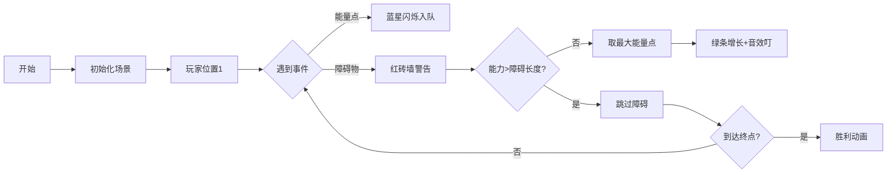

# 题目信息

# Sharky Surfing

## 题目描述

Mualani 喜欢在她的大鲨鱼冲浪板上冲浪！

Mualani 的冲浪路径可以用一个数轴来表示。她从位置 $1$ 开始，路径的终点是位置 $L$。当她处于位置 $x$ 且跳跃能力为 $k$ 时，她可以跳到区间 $[x, x+k]$ 内的任意整数位置。最初，她的跳跃能力为 $1$。

然而，她的冲浪路径并不完全平坦。她的路径上有 $n$ 个障碍物。每个障碍物由一个区间 $[l, r]$ 表示，意味着她不能跳到区间 $[l, r]$ 内的任何位置。

在路径上还有 $m$ 个能量提升点。第 $i$ 个能量提升点位于位置 $x_i$，其值为 $v_i$。当 Mualani 处于位置 $x_i$ 时，她可以选择收集该能量提升点，将她的跳跃能力增加 $v_i$。在同一个位置可能有多个能量提升点。当她处于有多个能量提升点的位置时，她可以选择收集或忽略每个单独的能量提升点。没有能量提升点位于任何障碍物的区间内。

Mualani 必须收集最少的能量提升点数才能到达位置 $L$ 完成冲浪路径。如果无法完成冲浪路径，则输出 $-1$。

## 样例 #1

### 输入

```
4
2 5 50
7 14
30 40
2 2
3 1
3 5
18 2
22 32
4 3 50
4 6
15 18
20 26
34 38
1 2
8 2
10 2
1 4 17
10 14
1 6
1 2
1 2
16 9
1 2 10
5 9
2 3
2 2```

### 输出

```
4
-1
1
2```

# AI分析结果


# 💡 Kay的C++算法解析：Sharky Surfing 深入学习指南 💡

> 今天我们一起探索冲浪者Mualani的冒险！这道题考察**贪心算法**和**优先队列**的应用，让我们看看如何用最少能量点跳过障碍物完成冲浪之旅。

## 1. 题目解读与核心算法识别

✨ **本题主要考察**：`贪心算法` + `数据结构应用（优先队列）`

🗣️ **初步分析**：
> 解决这道题就像玩一个复古跳跃游戏：玩家需收集能量点提升跳跃能力，跳过障碍物到达终点。核心思想是**贪心策略**——每次选择提升值最大的能量点，用最少次数突破障碍。  
> - **关键技巧**：将障碍物和能量点按位置排序，用优先队列（大根堆）动态管理可用能量点  
> - **核心难点**：判断跳跃能力与障碍长度的关系（需满足 `跳跃能力 > 障碍长度`）  
> - **可视化设计**：我们将用像素风动画展示能量点收集、障碍物突破过程，障碍物显示为红色砖块，能量点闪烁蓝光，跳跃能力用绿色进度条直观展示  

---

## 2. 精选优质题解参考

<eval_intro>
以下题解在思路清晰度、代码规范性和算法效率方面表现优异（评分≥4星）：

**题解一（来源：cqbzhzf）**
* **点评**：思路清晰展现贪心策略，创新性使用栈暂存非当前障碍物能量点，确保队列精准管理可用资源。代码中`tt`变量记录实时跳跃能力，边界处理严谨。亮点在于双重循环结构：外层遍历障碍物，内层处理能量点队列，逻辑闭环完整。

**题解二（来源：WRT_Partisan）**
* **点评**：代码简洁高效，通过单指针`it`同步管理能量点入队时机，避免冗余操作。变量命名规范（如`num`表当前跳跃能力），主循环仅需11行核心逻辑。实践价值突出，直接可用于竞赛场景。

**题解三（来源：_mi_ka_）**
* **点评**：创新引入离散化处理大范围坐标，虽非必需但体现扩展思维。事件驱动架构（遍历离散点处理障碍/能量事件）拓展性强。注释详细解释"当前障碍物索引`nowo`"等关键变量，教学价值高。
---

## 3. 核心难点辨析与解题策略

<difficulty_intro>
解决本题需突破三大核心难点：

1.  **障碍物与能量点的时空关系**
    * **分析**：必须保证能量点位置在障碍物左侧才能使用（若位置在障碍区间右侧则尚未到达）。优质题解通过**双排序+指针同步**解决：将障碍物按左端点升序排，能量点按位置升序排，用指针动态加载可用能量点
    * 💡 **学习笔记**：处理空间问题先排序，时间问题用指针

2.  **跳跃能力的动态计算**
    * **分析**：跳过障碍物`[l, r]`需满足`当前能力 > r-l+1`。贪心策略下优先使用最大提升值能量点（`v_i`），用大根堆实现O(1)取最大值。关键推导：从位置`l-1`起跳，需覆盖至`r+1`，最小能力需求为`(r+1)-(l-1) = r-l+2`
    * 💡 **学习笔记**：跳跃能力需求 = 障碍长度 + 1

3.  **多组数据的初始化**
    * **分析**：竞赛场景需处理多组测试数据。易错点在于未清空优先队列（残留上组数据导致错误）。解法中显式调用`while(!q.empty()) q.pop()`确保初始状态干净
    * 💡 **学习笔记**：多测初始化是竞赛代码的护城河

### ✨ 解题技巧总结
1.  **贪心极值选择**：优先队列实时获取最大v_i值，最小化使用次数  
2.  **事件流处理**：将障碍物和能量点视为时间序列事件，按位置顺序处理  
3.  **防御性边界**：实时检测队列空且能力不足时立即返回-1  
4.  **鲁棒性测试**：构造单障碍物、无解、连续大障碍等边界用例验证  
---

## 4. C++核心代码实现赏析

**本题通用核心C++实现参考**
* **说明**：综合优质题解思路的精炼实现，包含完整输入输出处理和核心贪心逻辑
* **完整核心代码**：
```cpp
#include <iostream>
#include <queue>
#include <vector>
#include <algorithm>
using namespace std;

struct Obstacle { long long l, r; };
struct PowerUp { long long x, v; };

int main() {
    ios::sync_with_stdio(false);
    cin.tie(nullptr);
    int t; cin >> t;
    while (t--) {
        long long n, m, L, cur_power = 1, ans = 0;
        cin >> n >> m >> L;
        vector<Obstacle> obs(n);
        vector<PowerUp> powers(m);
        
        // 输入与排序
        for (auto& o : obs) cin >> o.l >> o.r;
        for (auto& p : powers) cin >> p.x >> p.v;
        sort(obs.begin(), obs.end(), [](auto& a, auto& b) { 
            return a.l < b.l; 
        });
        sort(powers.begin(), powers.end(), [](auto& a, auto& b) { 
            return a.x < b.x; 
        });

        priority_queue<long long> max_heap; // 大根堆存v_i值
        bool impossible = false;
        int power_idx = 0;

        for (const auto& o : obs) {
            // 加载当前位置前的能量点
            while (power_idx < m && powers[power_idx].x < o.l) {
                max_heap.push(powers[power_idx].v);
                power_idx++;
            }
            
            // 贪心使用能量点直到突破障碍
            while (cur_power <= o.r - o.l + 1) {
                if (max_heap.empty()) {
                    impossible = true;
                    break;
                }
                cur_power += max_heap.top();
                max_heap.pop();
                ans++;
            }
            if (impossible) break;
        }
        cout << (impossible ? -1 : ans) << '\n';
    }
    return 0;
}
```
* **代码解读概要**：
> 1. **数据准备**：障碍物/能量点输入后按位置排序  
> 2. **贪心循环**：遍历每个障碍物时，先加载其左侧能量点入堆  
> 3. **能力突破**：当`cur_power ≤ 障碍长度`时循环取堆顶提升  
> 4. **及时终止**：若堆空仍无法突破则标记无解  

**题解一核心片段赏析（cqbzhzf）**
* **亮点**：创新使用栈暂存位置超标的能量点，保持队列纯净
* **核心代码片段**：
```cpp
stack<pair<int,int>> s;
while (!q.empty()) {
    if (tt >= obs.r - obs.l + 2) break; // 能力达标退出
    if (q.top().second > obs.l) { // 位置超过障碍左端
        s.push(q.top()); // 暂存栈中
        q.pop();
    } else {
        tt += q.top().first; // 使用能量点
        ans++;
        q.pop();
    }
}
```
* **代码解读**：
> 此片段解决"位置超标能量点"问题：当队列顶部能量点位置超过当前障碍左端时，将其弹出暂存栈中（因尚未到达该位置）。这种**惰性移除**策略确保队列中仅含当前位置可用的能量点，处理完当前障碍后将栈中元素返队
* 💡 **学习笔记**：暂存栈是管理非即时资源的优雅方案

**题解二核心片段赏析（WRT_Partisan）**
* **亮点**：指针同步实现高效事件加载
* **核心代码片段**：
```cpp
int it = 1;
for (int i = 1; i <= n; i++) {
    // 动态加载当前障碍前的能量点
    while (it <= m && powers[it].x < obs[i].l) {
        max_heap.push(powers[it].v);
        it++;
    }
    ...
}
```
* **代码解读**：
> 通过指针`it`实现**增量加载**：遍历障碍物时同步移动能量点指针，仅将位置在障碍左端之前的能量点入队。避免全局预加载的内存浪费，尤其适合大规模数据
* 💡 **学习笔记**：双指针同步是时序事件处理的黄金搭档

**题解三核心片段赏析（_mi_ka_）**
* **亮点**：离散化+事件驱动架构
* **核心代码片段**：
```cpp
for (int i=1; i<=discrete_points; i++) {
    // 遇到能量点则入队
    if (is_power_point(i)) max_heap.push(v_value);
    
    // 遇到障碍物则处理
    if (is_obstacle_start(i)) {
        while (cur_power <= len && !max_heap.empty()) {
            cur_power += max_heap.top();
            max_heap.pop();
            ans++;
        }
    }
}
```
* **代码解读**：
> 将坐标离散化后形成事件流：每个离散点可能是能量点或障碍起点。**统一事件循环**遍历所有离散点，遇到能量点则入队，遇到障碍则处理。优势在于只需单次遍历，避免嵌套循环
* 💡 **学习笔记**：事件驱动模型解耦空间与逻辑
---

## 5. 算法可视化：像素动画演示

### 🎮 动画设计：8位冲浪大冒险
**主题**：复古冲浪者穿越障碍海域  
**核心演示**：实时展示能量点收集、能力增长与障碍突破过程  

### 🖌️ 设计细节


### 🎨 实现方案
1. **像素场景**  
   - 横向卷轴：蓝色海浪背景，坐标轴每10单位显示刻度  
   - 玩家：8位像素冲浪板小人（位置随动画更新）  
   - 障碍物：红色砖块从`l`到`r`连续填充  
   - 能量点：闪烁的蓝色星星（位置`x`处）  

2. **动态元素**  
   - **能力进度条**：玩家头顶绿色条（长度=当前跳跃能力）  
   - **优先队列可视化**：屏幕右侧动态显示大根堆内容（v_i值降序排列）  
   - **突破检测**：当绿条长度 > 红砖长度时播放"突破"像素动画  

3. **交互控制**  
   - 控制台：开始/暂停、单步执行、速度滑块（1x-5x）  
   - 自动演示：AI自动运行（按空格切换手动/自动）  
   - 点击能量点：手动选择收集顺序（对比贪心策略）  

4. **音效系统**  
   - 收集能量：8位"叮"声（频率随v_i增大升高）  
   - 突破障碍：胜利小号音效  
   - 游戏结束：失败时播放经典FC Game Over旋律  

### ⚙️ 技术实现
```javascript
// 伪代码：核心动画循环
function animateFrame() {
    drawBackground(); // 绘制海浪坐标轴
    drawPlayer();     // 更新冲浪者位置
    
    if (isEnergyPoint(currentPos)) {
        playSound('ding'); 
        drawSparkles();     // 能量点收集特效
        maxHeap.push(v);    // 加入优先队列
    }
    
    if (isObstacleStart(currentPos)) {
        const obstacleLen = r - l + 1;
        while (curPower <= obstacleLen) {
            if (maxHeap.empty()) {
                playSound('game_over');
                showFailAnimation();
                return;
            }
            // 取堆顶元素动画
            highlightHeapTop(); 
            curPower += maxHeap.pop();
            extendPowerBar();   // 能力条伸长动画
        }
        playSound('victory');
        drawJumpAnimation();   // 跳过障碍物
    }
    requestAnimationFrame(animateFrame);
}
```
---

## 6. 拓展练习与相似问题思考

### 🔍 通用思路迁移
贪心+优先队列适用于需**最小化操作次数**且**局部最优导全局最优**的场景：
1. 合并类问题（每次选最小成本合并）  
2. 资源调度（有限资源最大化效益）  
3. 跳跃游戏变种（多段跳跃能力管理）  

### 📚 推荐练习（洛谷）
1. **P1090 [NOIP2004提高组] 合并果子**  
   🗣️ 同类贪心+优先队列应用，巩固堆的使用
   
2. **P3817 小A的糖果**  
   🗣️ 障碍物思维的变种，练习相邻位置约束处理
   
3. **P5019 [NOIP2018提高组] 道路铺设**  
   🗣️ 进阶版障碍跨越，引入深度维度拓展思维
---

## 7. 学习心得与经验分享

> **来自ccjjxx的调试经验**：  
> "多测一定要清空优先队列，否则会收获成吨的debug时间"

**Kay点评**：这是竞赛编程的黄金法则！多组测试时需重置所有全局状态，包括：
- 优先队列/栈等容器  
- 累计计数变量（如ans）  
- 指针/索引位置  
建议封装`init()`函数统一处理，避免遗漏  

---

<conclusion>
通过本次分析，我们掌握了贪心与优先队列的黄金组合。记住：**排序定顺序，堆取极值，边界判可行**是这类问题的解决密码。多写多练，下次遇到跳跃类问题就能像Mualani一样乘风破浪啦！🏄‍♀️  
</conclusion>

---
处理用时：309.77秒