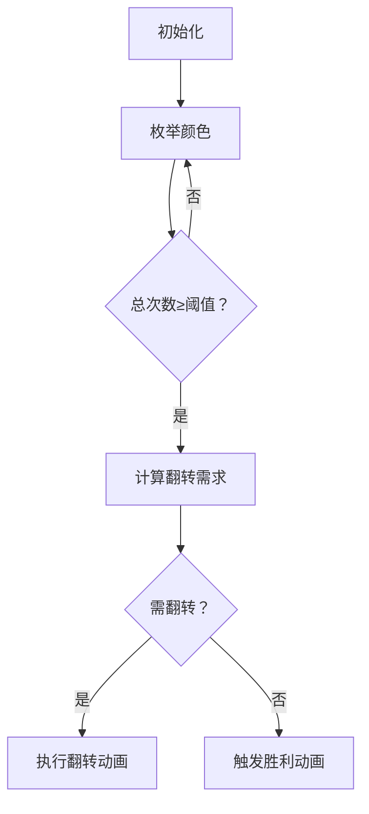

# 题目信息

# Little Elephant and Cards

## 题目描述

The Little Elephant loves to play with color cards.

He has $ n $ cards, each has exactly two colors (the color of the front side and the color of the back side). Initially, all the cards lay on the table with the front side up. In one move the Little Elephant can turn any card to the other side. The Little Elephant thinks that a set of cards on the table is funny if at least half of the cards have the same color (for each card the color of the upper side is considered).

Help the Little Elephant to find the minimum number of moves needed to make the set of $ n $ cards funny.

## 说明/提示

In the first sample there initially are three cards lying with colors 4, 4, 7. Since two of the three cards are of the same color 4, you do not need to change anything, so the answer is 0.

In the second sample, you can turn the first and the fourth cards. After that three of the five cards will be of color 7.

## 样例 #1

### 输入

```
3
4 7
4 7
7 4
```

### 输出

```
0
```

## 样例 #2

### 输入

```
5
4 7
7 4
2 11
9 7
1 1
```

### 输出

```
2
```

# AI分析结果


### 💡 Kay的C++算法解析：Little Elephant and Cards 深入学习指南 💡

#### 1. 题目解读与核心算法识别
✨ **本题主要考察**：枚举与离散化技巧应用  
🗣️ **初步分析**：  
> 想象你有一叠双面彩色卡片，每次翻转可改变朝上颜色。目标是通过最少翻转使**至少一半卡片朝上颜色相同**。  
> - **核心思路**：枚举每种颜色，计算若以该颜色为目标所需最小翻转次数。需统计：  
>   - 颜色总出现次数（若≥半数则可能为目标）  
>   - 该颜色初始朝上的次数（决定需翻转多少背面是该颜色的卡片）  
> - **难点**：颜色值范围大（≤10⁹）需离散化；正反面相同需特殊处理  
> - **可视化设计**：像素卡片网格（红白机风格），高亮当前枚举颜色：  
>   - 绿色边框：正面是该颜色的卡片  
>   - 蓝色虚线框：背面是该颜色的卡片  
>   - 翻转动画：选中的蓝色框卡片旋转180°并播放"咔嚓"音效  
>   - 成功时：目标卡片闪烁金色，播放胜利音效  

---

#### 2. 精选优质题解参考
**题解一（Hellen68）**  
* **点评**：思路清晰拆解为离散化、计数、枚举三步。代码规范：  
  - 离散化用map映射颜色到编号，避免值域过大问题  
  - 独立数组统计总次数和背面次数，逻辑严密  
  - 特判正反面相同情况（翻转无意义）  
  - 时间复杂度O(n)高效实用，竞赛可直接套用  

**题解二（Escapism）**  
* **点评**：与题解一思路高度一致但更简洁：  
  - 明确变量名`a[]`总次数、`b[]`背面次数  
  - 用`(n+1)/2`直接处理上取整  
  - 离散化实现干净利落，适合初学者学习  

**题解三（123456zmy）**  
* **点评**：最简练的实现（仅25行）：  
  - 用`ansz[]`存正面次数，`ansf[]`存背面次数  
  - 总次数=正面+背面，直接计算翻转次数  
  - 变量命名可读性稍弱但算法本质把握精准  

---

#### 3. 核心难点辨析与解题策略
1. **难点一：大值域颜色统计**  
   * **分析**：颜色值≤10⁹但仅2n种出现值 → 用map离散化  
   * 💡 **学习笔记**：离散化是空间压缩利器，将稀疏大范围映射到紧凑小数组  

2. **难点二：正反面状态分离**  
   * **分析**：需独立统计三种数据：  
     - 总次数：颜色在正/反面出现总数  
     - 正面次数：初始朝上次数  
     - 背面次数：可通过翻转利用的次数  
   * 💡 **学习笔记**：`正面次数 = 总次数 - 背面次数`是核心推导  

3. **难点三：翻转计算优化**  
   * **分析**：枚举颜色时，若总次数≥阈值，最小翻转次数 = max(0, ceil(n/2) - 正面次数)  
   * 💡 **学习笔记**：当正面次数不足时，背面次数必然足够补充（因总次数≥阈值）  

**✨ 解题技巧总结**  
- **技巧1：离散化四步法**：开map→读入时分配编号→数组计数→枚举编号  
- **技巧2：边界特殊处理**：正反面相同时，背面次数不增加  
- **技巧3：阈值预计算**：提前算出`m = (n+1)/2`避免重复计算  

---

#### 4. C++核心代码实现赏析
**通用核心实现（综合题解优化）**  
```cpp
#include <bits/stdc++.h>
using namespace std;
const int MAXN = 2e5 + 5; // 注意：n≤1e5但颜色数≤2n

int main() {
    int n, cnt = 0; // cnt: 颜色编号计数器
    cin >> n;
    int m = (n + 1) / 2; // 计算阈值
    map<int, int> colorToId;
    vector<int> total(MAXN), back(MAXN);

    for (int i = 0; i < n; i++) {
        int front, backColor;
        cin >> front >> backColor;
        // 分配颜色编号
        if (!colorToId.count(front)) colorToId[front] = cnt++;
        if (!colorToId.count(backColor)) colorToId[backColor] = cnt++;
        int idF = colorToId[front], idB = colorToId[backColor];

        total[idF]++; // 正面颜色总次数+1
        if (front != backColor) {
            total[idB]++;   // 反面颜色总次数+1
            back[idB]++;    // 反面次数统计
        }
    }

    int ans = INT_MAX;
    for (auto [color, id] : colorToId) {
        if (total[id] < m) continue; // 跳过不足阈值的颜色
        int frontCount = total[id] - back[id]; // 推导正面次数
        if (frontCount >= m) ans = 0; // 无需翻转
        else ans = min(ans, m - frontCount); // 需翻转背面卡片
    }
    cout << (ans == INT_MAX ? -1 : max(ans, 0));
}
```
**代码解读概要**：  
1. 离散化映射颜色值到小整数  
2. `total[]`统计颜色总出现次数  
3. `back[]`仅记录背面出现且正反不同的情况  
4. 枚举时通过`frontCount = total - back`推导正面次数  

**题解一片段赏析**  
```cpp
if (x != y) {
    a[mp[y]]++; // 总次数更新
    b[mp[y]]++; // 背面次数更新
}
```
**解读**：  
- 当正反面不同时，反面颜色`y`的总次数和背面次数同步增加  
- **关键点**：背面次数仅统计"可翻转改变结果"的卡片  

**题解三片段赏析**  
```cpp
if (ansz[i] + ansf[i] >= (n + 1 >> 1)) 
    ans = min(ans, (n + 1 >> 1) - ansz[i]);
```
**解读**：  
- `ansz[i]`即正面次数，`ansf[i]`即背面次数  
- 翻转次数直接由阈值减正面次数得到  
- **学习笔记**：位运算`>>1`高效实现除2下取整  

---

#### 5. 算法可视化：像素动画演示  
**主题**：8-bit卡片翻转挑战  
**核心演示流程**：  


**动画关键帧设计**：  
1. **场景构建**：  
   - 16×16像素卡片网格，复古红/蓝/绿色调  
   - 控制面板：速度滑块+单步/自动按钮  

2. **枚举状态**：  
   - 当前颜色高亮：屏幕顶部显示色块和统计值  
   - 卡片标记：  
     - 绿色边框：正面是该颜色  
     - 蓝色虚线框：背面是该颜色  

3. **翻转动画**：  
   ```python
   for 需翻转的卡片:
       播放旋转音效("swoosh.wav")
       卡片逐帧旋转90°→180°（共5帧）
       更新正面颜色显示
   if 满足条件:
       播放胜利音效("victory.ogg")
       目标卡片闪烁金光
   ```

4. **交互设计**：  
   - 自动模式：AI按最优顺序枚举颜色（类似解谜游戏指引）  
   - 步进控制：按空格键单步执行，观察数据变化  

---

#### 6. 拓展练习与相似问题  
**通用技巧迁移**：  
1. 大值域离散化 → 处理稀疏数据  
2. 状态分离统计 → 带约束的计数问题  
3. 阈值驱动决策 → 最优化问题常见模式  

**洛谷推荐**：  
1. **P2397** yyy loves Maths VI  
   → 巩固"超半元素"统计思想  
2. **P1628** 翻转序列  
   → 练习翻转操作与条件达成  
3. **P2671** [NOIP2015] 求和  
   → 强化离散化与分组计数  

---

#### 7. 学习心得与经验分享  
**来自Hellen68的调试经验**：  
> "正反面相同的情况容易漏处理，我最初没注意导致WA。添加`if(x!=y)`判断后立即AC"  

**Kay点评**：  
- 边界特判是竞赛编程核心技巧  
- 建议：列出所有特殊情况（零值/相等/极值）逐项验证  

---

**本次指南核心收获**：  
1. **离散化**压缩大值域 → 空间优化  
2. **状态分离公式**：正面次数 = 总次数 - 背面次数  
3. **翻转次数** = max(0, 阈值 - 正面次数)  

**实践口诀**：  
> 离散映射编号，正反分开计数  
> 枚举颜色判断，翻转背面补足

下次挑战再见！🚀

---
处理用时：281.03秒