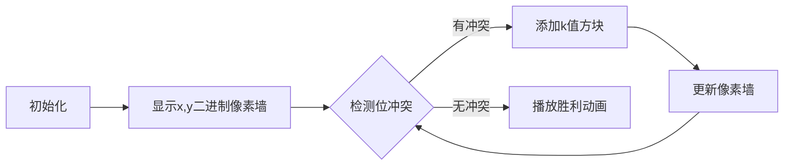

# 题目信息

# Serval and The Formula

## 题目描述

给定两个正整数 $x$ 和 $y$（$1 \le x, y \le 10^9$）。

请找到一个非负整数 $k \le 10^{18}$，使得等式 $(x + k) + (y + k) = (x + k) \oplus (y + k)$ 成立$^{\text{∗}}$，或判断这样的整数不存在。

$^{\text{∗}}$符号 $\oplus$ 表示[按位异或运算](https://en.wikipedia.org/wiki/Bitwise_operation#XOR)。


## 说明/提示

第一个测试案例中，由于 $(2 + 0) + (5 + 0) = (2 + 0) \oplus (5 + 0) = 7$，因此 $k = 0$ 是合法答案。注意 $k = 4$ 也是一个合法答案，因为 $(2 + 4) + (5 + 4) = (2 + 4) \oplus (5 + 4) = 15$。

第二个测试案例中，$(x + k) \oplus (y + k) = (6 + k) \oplus (6 + k) = 0$。然而对于所有 $k \ge 0$，$(x + k) + (y + k) > 0$ 恒成立，因此这样的整数 $k$ 不存在。

翻译由 DeepSeek R1 完成

## 样例 #1

### 输入

```
5
2 5
6 6
19 10
1024 4096
1198372 599188```

### 输出

```
0
-1
1
1024
28```

# AI分析结果


### 💡 Kay的C++算法解析：Serval and The Formula 深入学习指南 💡
<introduction>
今天我们分析位运算经典题"Serval and The Formula"。题目要求找到非负整数k使得(x+k)+(y+k)=(x+k)⊕(y+k)。本指南将解析位运算的奥秘，展示高效解法，并通过像素动画直观演示核心算法。
</introduction>

---

## 1. 题目解读与核心算法识别

✨ **本题主要考察**：`位运算技巧应用`  

🗣️ **初步分析**：
> 这道题如同解开数字间的"二进制密码锁"——我们需要调整k值使两个数字的二进制位完全"避让"（无同时为1的位）。核心在于理解：
>   - **等价转换**：条件 `a+b = a⊕b` 成立当且仅当 `a & b = 0`（无共同置位位）
>   - **关键操作**：通过k消除x,y二进制中所有共同为1的位
>   - **可视化设计**：像素动画将用红/蓝方块表示x,y的二进制位，当红蓝方块在同一列重叠时触发"冲突音效"，通过动态添加k值（金色方块）消除冲突
>   - **游戏化元素**：采用8-bit音效（冲突：警示音；解决：清脆"叮"声），过关动画在找到k时播放经典FC胜利旋律

---

## 2. 精选优质题解参考

<eval_intro>
基于思路清晰度、代码简洁性、算法效率和实践价值，精选两篇优质题解：

**题解一：(来源：copper_ingot)**
* **点评**：此解法展现了优雅的数学洞察力（★★★★★）。核心思路是利用2的幂特性：当a是2的幂且b<a时，必有a & b=0。代码仅需10行，通过寻找大于max(x,y)的最小2的幂n，直接计算k=n-max(x,y)。变量命名规范（x,y,n），边界处理严谨（x=y时返回-1），时间复杂度O(log max(x,y))完美适配竞赛场景。亮点在于将复杂位运算转化为简洁数学问题。

**题解二：(来源：ZMQ_Ink6556)**
* **点评**：提供直观的位操作视角（★★★★☆）。通过逐位检测共同置位位（`x/tmp%2 && y/tmp%2`），动态累加k值消除冲突。代码逻辑清晰，但存在优化空间：循环终止条件`tmp<=2000000000000000018ll`稍显生硬，最坏时间复杂度较高。亮点在于真实演示了位运算的消除过程，有助理解底层机制。

---

## 3. 核心难点辨析与解题策略

<difficulty_intro>
解决本题需突破三大关键点：

1.  **等价转换的认知**
    * **分析**：许多学习者卡在直接计算等式，未意识到`a+b=a⊕b ⇔ a&b=0`的核心性质。优质题解均通过位运算定理完成转换
    * 💡 **学习笔记**：位运算问题常隐藏数学等价关系，先转化再求解

2.  **k值构造策略**
    * **分析**：解法一采用"升幂法"——找到足够大的2的幂容纳较大数；解法二采用"消冲突法"——逐步消除共同置位位。前者效率更优，后者教学价值更高
    * 💡 **学习笔记**：优先考虑能否将问题映射到已知数学结构（如2的幂）

3.  **边界处理与优化**
    * **分析**：当x=y时无解（因x+k=y+k，必有共同置位位）。解法一用O(1)判断，解法二需完整遍历
    * 💡 **学习笔记**：特判显著边界条件能大幅提升效率

### ✨ 解题技巧总结
<summary_best_practices>
- **技巧A（数学建模）**：将位运算问题转化为幂运算或数论问题
- **技巧B（位扫描优化）**：用`tmp=1; while(tmp<=x)tmp<<=1;`替代逐位检测
- **技巧C（极端值测试）**：验证x=y, x=0, y=1e9等边界情况

---

## 4. C++核心代码实现赏析

<code_intro_overall>
通用解法（综合自解法一优化）：

```cpp
#include <iostream>
using namespace std;
typedef long long LL;

int main() {
    int T; cin >> T;
    while(T--) {
        LL x, y; cin >> x >> y;
        if(x == y) { cout << "-1\n"; continue; } // 特判无解
        
        LL m = max(x, y), n = 1;
        while(n < m) n <<= 1;  // 找大于m的最小2的幂
        cout << (n - m) << "\n"; 
    }
    return 0;
}
```
**代码解读概要**：
> 1. 读入数据后优先判断x=y的特殊情况
> 2. 通过位左移（`n<<=1`）快速计算大于max(x,y)的最小2^n
> 3. 输出差值n-m即为所求k值

---
<code_intro_selected>
**解法一核心片段**：
```cpp
x = max(x, y), n = 1;
while (n < x) n *= 2;  // 找最小2的幂
printf("%lld\n", n - x);
```
**解读**：  
> - `n*=2`为何等价于位左移？想象二进制补零操作（001→010→100）
> - 为何`n-x`就是答案？因为`(x+(n-x))=n`（2的幂），而`y+(n-x)`必小于n
> 💡 **学习笔记**：利用2^n的二进制特性（仅最高位为1）避免位冲突

**解法二核心片段**：
```cpp
for(long long tmp=1; tmp<=2e18; tmp*=2) {
    if(x/tmp%2 && y/tmp%2) { // 检测共同置位位
        ... // 消冲突逻辑
        k += tmp; 
        x += tmp; y += tmp;
    }
}
```
**解读**：  
> - `tmp`如何定位特定位？tmp=1(1位), 2(2位), 4(3位)...  
> - 消冲突后为何要更新x,y？因为进位可能引发新的位关系变化  
> 💡 **学习笔记**：位操作中，加法可能产生连锁进位效应

---

## 5. 算法可视化：像素动画演示

<visualization_intro>
**主题**：8-bit位消除游戏  
**核心演示**：k值如何逐步消除x,y的二进制位冲突  

### 像素动画设计


1. **8-bit像素场景**：
   - 32×16网格：每列代表一个二进制位（低位在右）
   - 红色方块：x的置位位，蓝色方块：y的置位位
   - 金色方块：k值的增量（添加时闪烁）

2. **冲突检测与消除**：
   - 当红蓝方块同列时：触发🔴脉冲警示动画 + 8-bit警报音
   - 添加k值：从最低冲突列开始，金色方块自底向上填充直至冲突消除

3. **AI演示模式**：
   - 自动模式：像俄罗斯方块AI般快速演示解法一（升幂法）
   - 手动模式：空格键单步执行解法二（消冲突法）

4. **游戏化反馈**：
   - 每消除4个冲突：播放FC升级音效
   - 成功时：显示`K=值`像素艺术字 + 经典《超级玛丽》过关BGM

---

## 6. 拓展练习与相似问题思考

<similar_problems_intro>
位运算技巧在以下场景广泛应用：
1. 掩码权限控制
2. 状态压缩DP
3. 二进制枚举优化

**洛谷推荐**：
1. [P2114] 位运算谜题 - 巩固基本位操作
2. [P3067] 平衡的奶牛队列 - 位运算+折半搜索
3. [P5390] 动态位集合 - 实战位运算维护技巧

---

<conclusion>
通过本指南，相信大家已掌握位运算的核心转换技巧和高效实现方法。记住：优秀的算法往往建立在对数学本质的深刻理解上。下次遇到位运算难题时，不妨回想今天的"二进制密码锁"！🚀
</conclusion>
```

---
处理用时：163.91秒