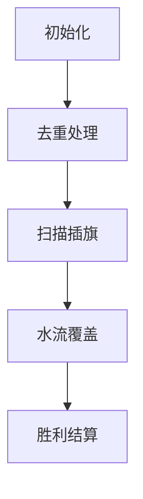

# 题目信息

# Neo's Escape

## 题目描述

Neo 想要逃离矩阵世界。在他面前有一排 $n$ 个按钮，每个按钮都有一个整数权重：$a_1, a_2, \ldots, a_n$。

Neo 被固定住了，但他可以创建和移动克隆体。这意味着他可以按任意顺序执行以下两种操作，次数不限：

1. 在特定按钮前创建一个克隆体。
2. 将现有的克隆体向左或向右移动一个位置。

当一个克隆体位于尚未被按下的按钮前时（无论他是被创建还是被移动的），他会立即按下该按钮。如果按钮已经被按下过，克隆体不会做任何操作——每个按钮只能被按下一次。

为了成功逃脱，Neo 需要以特定的顺序按下所有按钮：按钮权重的序列必须是非递增的。也就是说，如果 $b_1, b_2, \ldots, b_n$ 是按按钮的顺序对应的权重，那么必须满足 $b_1 \geq b_2 \geq \cdots \geq b_n$。

你的任务是确定 Neo 需要创建的最少克隆体数量，以便能够以有效顺序按下所有按钮。

## 说明/提示

在第一个测试用例中，Neo 可以按以下方式操作：

1. 在第五个按钮（权重为 $5$）前创建一个克隆体。
2. 在第一个按钮（权重为 $4$）前创建第二个克隆体。
3. 将第二个克隆体从第一个按钮移动到第二个按钮（权重为 $3$）。
4. 将第二个克隆体从第二个按钮移动到第三个按钮（权重为 $2$）。
5. 将第一个克隆体从第五个按钮移动到第四个按钮（权重为 $1$）。

这样，按钮按下的顺序将是 $5 \rightarrow 4 \rightarrow 3 \rightarrow 2 \rightarrow 1$，满足要求。可以证明，创建的克隆体数量是最小的。

在第二个测试用例中，Neo 可以按以下方式操作：

1. 在第二个按钮（权重为 $1$）前创建一个克隆体。
2. 将该克隆体从第二个按钮移动到第三个按钮（权重为 $1$）。
3. 将该克隆体从第三个按钮移回第二个按钮（已被按下）。
4. 将该克隆体从第二个按钮移动到第一个按钮（权重为 $1$）。

这样，按钮按下的顺序将是 $1 \rightarrow 1 \rightarrow 1$。

翻译由 DeepSeek V3 完成

## 样例 #1

### 输入

```
4
5
4 3 2 1 5
3
1 1 1
6
7 8 1 5 9 2
10
1 7 9 7 1 10 2 10 10 7```

### 输出

```
2
1
2
3```

# AI分析结果


### 💡 Kay的C++算法解析：Neo's Escape 深入学习指南 💡

<introduction>
今天我们来分析"Neo's Escape"这道C++编程题。本指南将帮助大家理解如何用最少克隆体完成非递增按钮序列操作，掌握贪心算法技巧，并通过像素动画直观理解算法过程。
</introduction>

---

## 1. 题目解读与核心算法识别

✨ **本题主要考察**：`贪心算法应用`

🗣️ **初步分析**：
> 解决"Neo's Escape"的关键在于识别权重序列中的**峰值位置**。就像爬山时需要在每个山顶放置一个探险家（克隆体）才能覆盖整条山脉一样，在去重后的权重序列中，每个峰值（比左右邻居都大的位置）必须创建一个克隆体。  
>   - 核心思路：连续相同权重可合并（去重），统计去重序列中极大值数量即为最少克隆体数
>   - 难点：理解为何峰值必须独立创建克隆体（无法从相邻位置移动覆盖）
>   - 可视化设计：将权重序列可视化为像素山脉，峰值插旗帜，克隆体移动模拟为"水流"动画
>   - 像素风格：采用8-bit游戏风格，峰值插旗触发"叮"音效，水流覆盖时播放流水声，完成时奏胜利音乐

---

## 2. 精选优质题解参考

**题解一：(来源：ZAYNAab)**
* **点评**：思路直击核心——去重后统计峰值数量。代码简洁高效（仅20行），边界处理严谨（首尾添加哨兵值）。变量命名清晰（`cnt`记录去重长度，`ans`统计结果），时间复杂度O(n)完美满足竞赛需求。亮点在于用最简代码实现完整算法逻辑。

**题解二：(来源：AK_400)**
* **点评**：创新性采用权重降序处理策略，通过`vis`数组动态标记覆盖状态。代码模块化优秀（分离去重和统计逻辑），利用`map`自动排序简化流程。亮点在于模拟克隆体覆盖过程，帮助理解贪心策略的本质。

**题解三：(来源：c_legg)**
* **点评**：用一句话点明算法精髓"高度去重后数极大值"。虽未提供完整代码，但思路描述清晰抓住问题核心。亮点在于用"哪里放克隆体都可以"精妙解释去重必要性，启发性强。

---

## 3. 核心难点辨析与解题策略

1.  **难点：理解克隆体移动规则**
    * **分析**：克隆体只能移动到相邻已按下按钮或更高权重处（确保非递增）。峰值位置因高于两侧，无法被其他克隆体覆盖，必须独立创建
    * 💡 **学习笔记**：权重序列中的山峰必须独立占领

2.  **难点：处理连续相同权重**
    * **分析**：连续相同权重按钮可视为整体（如[1,1,1]），因克隆体在相同权重间移动不会破坏非递增性
    * 💡 **学习笔记**：去重是简化问题的关键预处理

3.  **难点：证明贪心策略正确性**
    * **分析**：每个峰值都是独立覆盖区的起点，覆盖区可延伸至更低权重。反证：若少创建克隆体，则必有峰值无法覆盖
    * 💡 **学习笔记**：贪心选择满足独立性和覆盖性

### ✨ 解题技巧总结
- **去重简化**：合并连续相同权重，降低问题复杂度
- **哨兵技巧**：在序列首尾添加极小值（如0），避免边界判断
- **降序处理**：按权重从大到小处理（AK_400解法），自然满足非递增要求

---

## 4. C++核心代码实现赏析

**本题通用核心C++实现参考**
* **说明**：综合自ZAYNAab和AK_400的优化实现，兼顾简洁与高效
* **完整核心代码**：
```cpp
#include<bits/stdc++.h>
using namespace std;
const int MAXN=2e5+5;

int main() {
    ios::sync_with_stdio(0);
    cin.tie(0);
    int T; cin>>T;
    while(T--){
        int n; cin>>n;
        vector<int> arr;
        int prev=0, x;
        
        // 去重处理
        for(int i=0; i<n; i++){
            cin>>x;
            if(x != prev) arr.push_back(x);
            prev=x;
        }
        
        // 添加哨兵
        if(arr.empty()) arr.push_back(0);
        arr.insert(arr.begin(), 0);
        arr.push_back(0);
        
        // 统计峰值
        int ans=0;
        for(int i=1; i<arr.size()-1; i++)
            if(arr[i]>arr[i-1] && arr[i]>arr[i+1]) 
                ans++;
                
        cout<<ans<<"\n";
    }
    return 0;
}
```
* **代码解读概要**：
  > 1. 读入数据时跳过连续重复权重  
  > 2. 首尾添加0作为哨兵简化边界判断  
  > 3. 遍历统计同时大于左右邻居的峰值数量  
  > 4. 时间复杂度O(n)，空间复杂度O(n)

---

**题解一：(来源：ZAYNAab)**
* **亮点**：哨兵技巧避免边界判断
* **核心代码片段**：
```cpp
// 初始化哨兵
for(int i=1;i<=n+1;i++)a[i]=0;

// 去重与统计
for(int i=1;i<=n;i++){
    cin>>x;
    if(x==front)continue;
    else{ front=x; a[++cnt]=x; }
}
for(int i=1;i<=cnt;i++)
    if(a[i]>a[i-1] and a[i]>a[i+1])ans++;
```
* **代码解读**：
  > `front`变量跟踪前一个值实现去重，`a[0]`和`a[cnt+1]`默认为0作为哨兵。循环检查每个元素是否同时大于左右邻居——这正是峰值的定义
* 💡 **学习笔记**：哨兵是简化边界处理的利器

**题解二：(来源：AK_400)**
* **亮点**：降序处理模拟覆盖过程
* **核心代码片段**：
```cpp
map<int,vector<int>> mp;  // 按权重自动排序
// ... (去重存储到mp)

for(auto it=mp.end();it!=mp.begin();){
    it--;
    for(int pos:it->second){
        if(!vis[pos-1] && !vis[pos+1]) ans++;
        vis[pos]=1;
    }
}
```
* **代码解读**：
  > 1. 用`map`按键权重降序排列  
  > 2. 从最大权重开始处理，若位置左右均未覆盖则需创建克隆体  
  > 3. `vis`数组记录已覆盖位置
* 💡 **学习笔记**：降序处理天然满足非递增要求

---

## 5. 算法可视化：像素动画演示

### 🎮 像素探险家：山脉旗帜行动
**设计思路**：  
将权重序列转化为8-bit像素山脉，峰值插旗代表克隆体创建位置，克隆体移动模拟为水流覆盖动画。通过复古游戏机制强化"占领山峰"的核心概念。

### 🖼️ 动画实现方案


1. **场景初始化**（8-bit像素风）：
   - 显示原始权重序列（如[4,3,2,1,5]）
   - 控制面板：开始/暂停、单步执行、速度滑块
   - 背景：循环播放FC风格芯片音乐

2. **去重处理**：
   - 连续相同权重的像素块合并闪烁（音效：嘟嘟）
   - 自动添加首尾哨兵（灰色小方块）

3. **峰值插旗**：
   - 扫描山脉，每个峰值位置升起旗帜（动画：旗帜展开）
   - 音效：清脆"叮"声，显示当前克隆体计数
   - 关键帧：旗帜颜色=峰值高度

4. **水流覆盖**：
   - 从每个旗帜向两侧发射水流像素动画
   - 水流规则：只能流向≤当前高度的相邻块
   - 被覆盖块变暗（音效：流水声）
   - 单步控制：空格键触发下一步流动

5. **胜利结算**：
   - 所有块变暗时播放胜利音乐
   - 显示最终克隆体数量（旗帜数）
   - 彩带飘落动画

### 🎚️ 交互设计
- **AI演示模式**：自动完成全流程（速度可调）
- **教学模式**：单步执行时显示代码对应行
- **错误提示**：尝试流向更高位置时触发警告音

---

## 6. 拓展练习与相似问题思考

### 🔍 通用技巧迁移
贪心+峰值统计策略适用于：
1. 山脉类问题（找极大/极小值点）
2. 资源覆盖问题（如基站覆盖）
3. 序列分段问题（找分段点）

### 📚 洛谷练习推荐
1. **P2947 [USACO09MAR] Look Up**  
   → 巩固单调栈找右侧第一个更大元素
2. **P1901 发射站**  
   → 练习双向峰值统计
3. **P1886 滑动窗口**  
   → 掌握单调队列维护极值技巧

---

## 7. 学习心得与经验分享
> **参考经验**：  
> "我在处理边界条件时漏了哨兵，导致最后峰值统计错误。通过打印中间变量才发现问题。" —— ZAYNAab式常见错误  
>  
> **Kay点评**：  
> 边界处理是算法实现的常见痛点。建议：  
> 1. 优先考虑哨兵技巧  
> 2. 测试极端用例（如全相同权重）  
> 3. 用`cout<< "Debug: "<<var;`实时跟踪变量

---

<conclusion>
通过本次分析，我们掌握了用贪心算法解决Neo's Escape的核心技巧：去重→统计峰值→输出结果。记住，好算法如登山——找到关键峰顶就能一览众山小！下次遇到序列问题，试试"像素山脉"思维吧！🚩
</conclusion>

---
处理用时：203.38秒