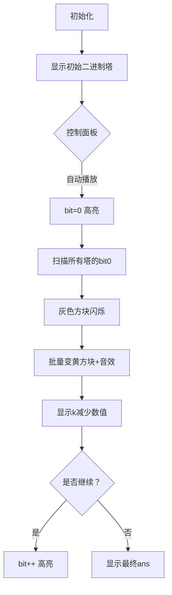

# 题目信息

# Make It Beautiful

## 题目描述

给定一个包含 $ n $ 个整数的数组 $ a $。我们定义一个数字 $ x $ 的**美丽值**为其二进制表示中 $ 1 $ 的个数。我们定义一个数组的美丽值为其所有数字美丽值的总和。

在一次操作中，你可以选择一个下标 $ i $（$ 1 \le i \le n $）并将 $ a_i $ 增加 $ 1 $。

在最多进行 $ k $ 次操作后，求数组可能达到的最大美丽值。

## 说明/提示

在第一个测试用例中，$ a = [0, 1, 7, 2, 4] $。

- 第一次操作选择 $ i = 1 $，新数组为 $ a = [1, 1, 7, 2, 4] $。
- 第二次操作选择 $ i = 4 $，新数组为 $ a = [1, 1, 7, 3, 4] $。

该数组的美丽值为 $ 1 + 1 + 3 + 2 + 1 = 8 $。另一个具有相同美丽值的有效解是 $ [0, 1, 7, 3, 5] $。在第三个测试用例中，$ a = [3] $。由于不要求必须使用恰好 $ k $ 次操作，最优解是不进行任何操作。

## 样例 #1

### 输入

```
5
5 2
0 1 7 2 4
5 3
0 1 7 2 4
1 1
3
3 0
2 0 3
1 100000000000
0```

### 输出

```
8
9
2
3
36```

# AI分析结果


# 💡 Kay的C++算法解析：Make It Beautiful 深入学习指南 💡

**引言**  
今天我们一起分析"Make It Beautiful"这道C++编程题。题目要求在最多k次操作（每次将某个元素加1）后，最大化数组所有元素的二进制中1的个数（popcount）之和。本指南将带您深入理解位运算贪心策略的精髓！

---

## 1. 题目解读与核心算法识别

✨ **本题主要考察**：`位运算贪心` (编程技巧应用)

🗣️ **初步分析**：  
> 解决本题的关键在于理解**位贡献的贪心策略**。想象每个数字的二进制表示像一座大楼，每个比特位是一层楼。我们的目标是用最少的"砖块"（操作次数）建造最多的"完整楼层"（1的个数）。贪心策略就是优先填补最底层的空缺（最低位的0），因为这样效率最高！  
> - **核心思路**：优先填补最低位的0（操作代价最小），再逐步处理高位
> - **算法流程**：  
>   1. 计算初始popcount总和  
>   2. 从最低位(bit0)向高位枚举  
>   3. 统计当前位为0的数字数量  
>   4. 用剩余操作次数尽可能填补这些0  
> - **可视化设计**：  
>   采用8位像素风格展示数字的二进制位（0=灰色方块，1=黄色方块）。动画将：  
>   - 高亮当前处理的比特位（红色边框）  
>   - 批量填补时显示"砖块消耗"特效  
>   - 伴随"叮"（操作成功）和"胜利旋律"（完成一位）音效  
>   - 控制面板支持单步/自动播放（调速滑块）

---

## 2. 精选优质题解参考

**题解一（DrDuck）**  
* **点评**：思路清晰展现了贪心本质（优先填补最低位0），代码规范使用`lowbit(~x)`技巧巧妙定位最低位0。虽然优先队列实现直观，但在大数据量时效率略低。亮点在于将树状数组的`lowbit`逆向应用，体现了创造性思维。

**题解二（Swordmaker）**  
* **点评**：采用高效的按位批量处理策略，时间复杂度优化至O(nlogV)。代码使用`pos[]`数组统计每位的0的个数，结构清晰。边界处理严谨（如`1ll<<(i-1)`防溢出），实践价值高，特别适合大k场景。

**题解三（残阳如血）**  
* **点评**：代码简洁有力，直接枚举比特位并使用`lowbit(~x)`技巧。亮点在于内层循环的`flag`优化，当k不足时及时跳出。虽然效率稍逊批量处理，但代码更易理解，适合初学者掌握位操作本质。

---

## 3. 核心难点辨析与解题策略

1.  **贪心策略的选择**  
    * **分析**：为什么优先填补最低位的0？因为bit i的填补代价是2ⁱ，低位代价指数级小于高位。优质题解都采用从低到高的扫描顺序，确保每次操作收益最大化。
    * 💡 **学习笔记**：位贪心的黄金法则——先补低位0，性价比最高！

2.  **批量处理 vs 单点操作**  
    * **分析**：当k较大时（如1e18），逐个操作（题解一）效率低。批量处理（题解二）统计每位的0的个数后整体计算，将复杂度从O(klog n)优化到O(nlogV)。
    * 💡 **学习笔记**：大数据量时，用空间换时间（数组统计）优于动态维护（优先队列）

3.  **边界与溢出处理**  
    * **分析**：位运算需特别注意：
      - 使用`1ll<<bit`避免int溢出
      - 枚举上限到60位（2⁶⁰≈1e18）
      - 当k<当前位代价时及时break
    * 💡 **学习笔记**：位操作必做三检：范围、溢出、类型！

### ✨ 解题技巧总结
- **技巧1：逆向位运算**  
  `lowbit(~x)`快速定位最低位0（比`x & -x`更巧妙）
- **技巧2：批量统计优化**  
  预处理每位的0的个数，避免重复计算
- **技巧3：操作次数分流**  
  当k≥count*cost时全处理，否则部分处理：  
  `ans += k / cost; k = 0;`
- **技巧4：内置函数利用**  
  `__builtin_popcountll()`快速计算初始popcount

---

## 4. C++核心代码实现赏析

**本题通用核心C++实现参考**  
* **说明**：综合优质题解优化，采用按位批量处理策略，兼顾效率与可读性
* **完整核心代码**：
```cpp
#include <bits/stdc++.h>
#define int long long
using namespace std;

signed main() {
    ios::sync_with_stdio(0);
    cin.tie(0);
    int T; cin >> T;
    while (T--) {
        int n, k; cin >> n >> k;
        vector<int> a(n);
        int ans = 0;
        
        // 1. 计算初始popcount总和
        for (int i = 0; i < n; i++) {
            cin >> a[i];
            ans += __builtin_popcountll(a[i]);
        }

        // 2. 从低到高枚举比特位
        for (int bit = 0; bit <= 60; bit++) {
            long long cost = (1LL << bit); // 当前位填补代价
            int count = 0; // 统计该位为0的数字个数

            for (int i = 0; i < n; i++) 
                if (!(a[i] & (1LL << bit))) 
                    count++;

            if (!count) continue; // 无空缺则跳过
            
            if (k >= cost * count) { // 全处理
                k -= cost * count;
                ans += count;
            } else { // 部分处理
                ans += k / cost;
                k = 0;
                break;
            }
        }
        cout << ans << '\n';
    }
    return 0;
}
```
* **代码解读概要**：  
  1. 读入数据并计算初始popcount和  
  2. 从bit0到bit60枚举：  
     - 计算填补代价`cost=2ᵇⁱᵗ`  
     - 统计该位为0的数字数量`count`  
  3. 根据剩余k决定全处理/部分处理  
  4. 注意防溢出：`1LL<<bit`确保long long运算

---

**题解一片段赏析（DrDuck）**  
* **亮点**：创造性使用`lowbit(~x)`定位最低位0
* **核心代码片段**：
```cpp
int lowbit(int x) {
    x = ~x;      // 关键！取反后最低位0变1
    return x & -x; // 获取最低位1对应的值
}
while (k) {
    int now = q.top().w;
    int nd = lowbit(now); // 获取填补代价
    if (k < nd) break;
    k -= nd;
    ans++; // popcount增加1
    now += nd; // 执行填补
    q.push({now});
}
```
* **代码解读**：  
  > `lowbit(~x)`是精髓！取反后原数最低位0的位置变成1，此时`x&-x`正好得到该位权重。优先队列每次选出填补代价最小的数，更新后重新入队。注意每个数可能被多次操作（如7→8→9）
* 💡 **学习笔记**：位运算的逆向思维常带来突破！

**题解二片段赏析（Swordmaker）**  
* **亮点**：`pos[]`数组实现O(1)批量查询
* **核心代码片段**：
```cpp
int pos[70] = {0}; // 存储每bit的0的个数

void solve(int x) { // 统计函数
    for (int i = 1; i <= 70; i++) {
        if (!(x & 1)) pos[i]++; // 最低位为0时计数
        x >>= 1; // 右移处理下一位
    }
}

// 主逻辑
for (int i = 1; i <= 70; i++) {
    long long cost = 1LL << (i - 1);
    if (k >= cost * pos[i]) { // 批量处理
        ans += pos[i];
        k -= cost * pos[i];
    }
}
```
* **代码解读**：  
  > 预处理函数`solve()`遍历每个数字的比特位，`pos[i]`记录第i位（最低位=1）的0的个数。主循环中直接使用`cost*pos[i]`计算总消耗，实现批量操作
* 💡 **学习笔记**：预处理是优化多重循环的利器！

**题解三片段赏析（残阳如血）**  
* **亮点**：内循环`flag`优化及时终止
* **核心代码片段**：
```cpp
for (int bit = 0; bit < 63; bit++) {
    bool flag = false;
    for (int j = 0; j < n; j++) {
        if (lowbit(~a[j]) == (1LL << bit)) {
            if (k >= (1LL << bit)) {
                k -= (1LL << bit);
                a[j] |= (1LL << bit); // 填补操作
            } else { flag = true; break; }
        }
    }
    if (flag) break;
}
```
* **代码解读**：  
  > 外循环枚举比特位，内循环检查哪些数字在当前位有最低位0。`flag`设计巧妙：当某数字需要填补但k不足时，立即跳出内循环并终止后续位处理
* 💡 **学习笔记**：循环内设置终止标志可避免无效计算

---

## 5. 算法可视化：像素动画演示

**主题**：8位像素风格"比特建造者"  
**核心演示**：动态展示按位批量填补过程，融入复古游戏元素

### 设计思路
> 采用FC红白机像素风格（16色调色板），将每个数字显示为7x8像素方块组成的二进制塔。灰色方块(0)变为黄色方块(1)的动画配合"叮"音效，强化操作感知。批量处理时显示"位填充风暴"特效，帮助理解效率优化。

### 动画帧步骤


**关键交互**：  
1. **像素场景**：  
   - 数字塔：每座塔高10像素（bit0-bit9），地基显示十进制值  
   - 状态栏：当前操作位(bit)、剩余k、总ans  
2. **控制面板**：  
   - 速度滑块(1x-5x)  
   - 单步/播放/暂停/重置  
   - AI演示模式（自动完成最优填补路径）  
3. **动态效果**：  
   - 当前位高亮（红色脉冲边框）  
   - 批量填补时显示"位填充风暴"动画（多塔同时变色）  
   - 操作音效：  
     * 填补：8-bit "叮"声（频率=2000+500*bit）  
     * 完成一位：短促胜利旋律  
     * 错误：低沉警示音  
4. **游戏化元素**：  
   - 每完成4位解锁"字节工程师"成就（像素勋章+音效）  
   - 最终ans≥初始值150%时播放全屏烟花

---

## 6. 拓展练习与相似问题思考

**通用技巧迁移**  
位贪心策略还适用于：
1. 最小操作使数字按位或等于目标（CF1654E）
2. 二进制重排列问题（LeetCode 2237）
3. 最大异或和问题（结合字典树）

**洛谷推荐**  
1. **P2114 [NOI2014] 起床困难综合症**  
   🗣️ 位运算贪心经典，强化按位决策能力
2. **P1582 倒水**  
   🗣️ 二进制特性应用，理解"最低位0"的物理意义
3. **P1106 删数问题**  
   🗣️ 不同场景的贪心策略对比，培养迁移能力

---

## 7. 学习心得与经验分享

> **参考经验（残阳如血）**：  
> "多测不清空，爆零两行泪——统计数组pos[]必须每次初始化！"  
>
> **点评**：  
> 这是算法竞赛的血泪教训！位运算题常需维护辅助数组，务必：  
> 1. 在循环内声明数组（利用作用域）  
> 2. 或显式memset重置  
> 3. 编写`init()`函数统一初始化  
> 养成习惯可避免90%的提交错误

---

**结语**  
通过本次分析，我们深入掌握了位贪心的核心思想与实现技巧。记住：二进制问题本质是"位的独立贡献"，而贪心策略的灵魂在于"代价收益的权衡"。下次遇到类似问题，不妨先画个二进制塔分析！💪

---
处理用时：205.48秒