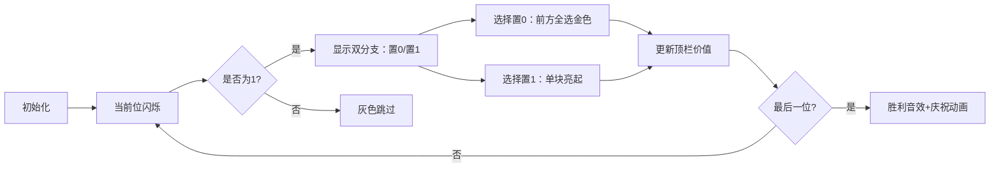

# 题目信息

# Find Maximum

## 题目描述

Valera 有一个 $n$ 个数的 **非负整数** 数组 $a$ ，其元素分别为 $a_0,a_1,\cdots,a_{n-1}$。同时有一个函数 $f(x)=\sum_{i=0}^{n-1}a_i\cdot bit(i)$，$bit(i)$ 指的是数字 $x$ 在二进制中第 $i$ 位的值是否为 1。

举个例子，当 $n=4,x=11(11=2^0+2^1+2^3)$ 时，$f(x)=a_0+a_1+a_3$。

对于所有 $0\le x \le m$ 的整数 $x$ ，请求出 $f(x)$ 的最大值。

## 说明/提示

- $1 \le n \le 10^5$

- $0 \le a_i \le 10^4$

- $0\le s_i \le 1$

## 样例 #1

### 输入

```
2
3 8
10
```

### 输出

```
3
```

## 样例 #2

### 输入

```
5
17 0 10 2 1
11010
```

### 输出

```
27
```

# AI分析结果


# 💡 Kay的C++算法解析：Find Maximum 深入学习指南 💡

**引言**  
今天我们来分析CF353C Find Maximum这道C++编程题。本题要求我们在二进制数位限制下最大化函数值，核心在于巧妙结合**贪心策略**和**动态规划**。本指南将带你深入理解算法思想，掌握解题技巧，并通过像素动画直观感受算法执行过程。

---

## 1. 题目解读与核心算法识别

✨ **本题主要考察**：`贪心` & `动态规划` (数位DP变体)

🗣️ **初步分析**：  
> 想象你在玩一个"二进制宝藏"游戏：数组`a`是每个位上的宝藏价值，字符串`s`表示一个由0/1组成的密码锁（对应数字`m`）。你的任务是在不超过`m`的前提下，选择一组位（置1）使总价值最大。  
> - **贪心思想**：由于所有价值非负，能选则选（置1）总是最优的
> - **动态规划**：从高位向低位处理，决策每位选0或1，同时保证不超限
> - **可视化设计**：将用像素方块表示数位，金色高亮表示选中，灰色表示未选。动画将展示：
>   - 当前处理位用闪烁箭头标记
>   - 置0时前方全选（金色方块连闪）
>   - 置1时单块亮起
>   - 累计价值实时显示在顶部
> - **复古游戏化**：采用FC红白机像素风格，配合"选择音效"（8-bit音效）和"金币收集"音效（价值增加）。AI模式将自动演示最优决策路径。

---

## 2. 精选优质题解参考

**题解一（作者：WaterSky）**  
* **点评**：  
  思路清晰展示了贪心与DP的结合：预处理前缀和避免重复计算，状态转移`dp[i] = max(sum[i-1], dp[i-1]+a[i])`直击核心。代码规范（`dp`/`sum`命名明确），边界处理严谨（如`s[i]=='1'`分支）。亮点在于用**前缀和优化**将时间复杂度降至O(n)，是竞赛实战的典范解法。

**题解二（作者：Jr_Zlw）**  
* **点评**：  
  采用独特的高位到低位贪心策略：当`s[i]==1`时，尝试置0并全选低位，用`res`记录当前路径值，`ans`更新最优解。算法效率极高（O(n)），空间复杂度仅O(1)。虽然变量名`res`/`ans`稍抽象，但**避免DP数组**的思路值得学习，展现了贪心法的简洁之美。

**题解三（作者：Graphcity）**  
* **点评**：  
  状态定义`dp[i]`（前i位最大价值）直观易懂，配合`sum[i-1]`处理置0分支。代码结构工整，核心逻辑仅5行，完美呈现DP**状态转移本质**。特别适合初学者理解数位DP的决策过程。

---

## 3. 核心难点辨析与解题策略

1. **二进制位顺序与遍历方向**  
   * **分析**：输入字符串`s`高位在左/低位在右（如"11010"），而数组`a`下标0对应最低位。需在代码中通过**从高到低遍历**或**前缀和映射**统一方向。优质解法均通过调整遍历顺序或数组索引解决。
   * 💡 **学习笔记**：处理数位问题时，务必先明确高低位顺序！

2. **贪心与DP的状态融合**  
   * **分析**：决策当前位时需考虑两种选择：
     - 若置0：前面所有位可全选（`sum[i-1]`）
     - 若置1：继承前序状态（`dp[i-1] + a[i]`）
   * 💡 **学习笔记**：`dp[i] = max(sum[i-1], dp[i-1] + a[i])` 是本题状态转移的灵魂。

3. **前缀和优化计算**  
   * **分析**：全选操作需快速获取前k位和。预处理前缀和数组`sum`（`sum[i]=a[0]+...+a[i]`）可将O(n)求和降至O(1)。
   * 💡 **学习笔记**：前缀和是优化区间查询的利器，尤其适合数位问题。

### ✨ 解题技巧总结
- **数位映射技巧**：用循环索引统一二进制位与数组位置
- **决策分解法**：将复杂选择拆解为独立位处理
- **防御性编程**：对`s[i]=='1'`等边界显式判断

---

## 4. C++核心代码实现赏析

**通用核心C++实现参考**  
* **说明**：综合优质题解思路，采用高位到低位DP，前缀和优化，代码简洁高效。
* **完整核心代码**：
```cpp
#include <iostream>
#include <vector>
using namespace std;

int main() {
    int n;
    cin >> n;
    vector<long long> a(n+1);
    for (int i = 1; i <= n; ++i) 
        cin >> a[i];

    string s;
    cin >> s;

    // 前缀和预处理
    vector<long long> sum(n+1, 0);
    for (int i = 1; i <= n; ++i) 
        sum[i] = sum[i-1] + a[i];

    // DP: 从高位到低位
    vector<long long> dp(n+1, 0);
    for (int i = 1; i <= n; ++i) {
        int bit = s[i-1] - '0';  // 获取当前位
        if (bit == 1)
            dp[i] = max(sum[i-1],    // 当前位置0，前面全选
                       dp[i-1] + a[i]); // 当前位置1
        else 
            dp[i] = dp[i-1];         // 只能继承前状态
    }
    cout << dp[n] << endl;
    return 0;
}
```
* **代码解读概要**：
  > 1. 读入数组`a`和字符串`s`（`s[0]`为最高位）  
  > 2. 计算前缀和`sum`加速区间查询  
  > 3. 核心DP循环：处理每位时，若`bit==1`则比较"置0全选"或"置1继承"  
  > 4. 输出最终结果`dp[n]`

---

**题解一（WaterSky）核心赏析**  
* **亮点**：前缀和与DP状态分离，逻辑清晰
* **核心代码片段**：
```cpp
for(int i=1;i<=n;i++)
    if(S[i]=='1') 
        dp[i] = sum[i-1];  // 预置0分支

for(int i=1;i<=n;i++) 
    dp[i] = max(dp[i], dp[i-1] + a[i]*(S[i]=='1'));
```
* **代码解读**：
  > 第一轮循环预存"置0"值（`sum[i-1]`），第二轮用`max`比较两种决策。变量`S[i]`为字符需转数字，用`(S[i]=='1')`巧妙实现01转换。
* 💡 **学习笔记**：预处理分支使状态转移更简洁。

**题解二（Jr_Zlw）核心赏析**  
* **亮点**：单次遍历贪心，空间复杂度O(1)
* **核心代码片段**：
```cpp
int res=0, ans=0;
for(int i=n-1; i>=0; --i)  // 高位到低位
    if(s[i]=='1') {
        ans = max(ans, res + sum[i]);  // 尝试置0
        res += a[i+1];  // 选择置1
    }
```
* **代码解读**：
  > `res`记录当前路径值，遇1时：1）比较置0+全选低位（`res+sum[i]`）；2）选择置1则更新`res`。注意`sum[i]`是前缀和。
* 💡 **学习笔记**：贪心法用`res`和`ans`双变量避免DP数组。

---

## 5. 算法可视化：像素动画演示

**主题**："二进制宝藏猎人"（8-bit像素风）  
**核心演示**：从高位到低位的决策过程，重点展示置0/1的分支选择  

### 动画设计细节：


* **像素艺术**：
  - 每位用16x16像素方块，底色表示状态（灰=0，金=1）
  - 控制面板：开始/暂停、单步、速度滑块
  - 当前位：闪烁红色边框+箭头指针

* **交互逻辑**：
  1. **置0操作**：当前位变灰，前方所有位金闪，播放"咔嚓"音效
  2. **置1操作**：当前位金闪，播放"金币"音效
  3. **自动模式**：AI小人自动走最优路径，步速可调
  4. **结束动画**：显示最终价值，8-bit胜利音乐+烟花特效

* **技术实现**：
  - Canvas绘制网格与动态方块
  - 音效触发：置0（200Hz方波）、置1（500Hz方波）、胜利（上升音阶）
  - 伪代码同步显示在右侧面板

> 设计意图：通过像素块颜色变化直观呈现决策影响，游戏化元素提升学习趣味性。

---

## 6. 拓展练习与相似问题思考

**通用套路迁移**：  
数位DP可用于：
1. 二进制限制下的最值问题（如本题）
2. 数字计数问题（如统计特定位模式）
3. 区间约束问题（如[L,R]内满足条件的数）

**洛谷练习推荐**：
1. **P2657 [SCOI2009] windy数**  
   → 练习相邻数位约束的DP设计
2. **P2602 [ZJOI2010] 数字计数**  
   → 掌握数位DP的状态复用技巧
3. **P6218 [USACO06NOV] Round Numbers**  
   → 强化二进制数位处理能力

---

**结语**  
通过本次分析，相信大家已掌握数位DP的核心思想——"分位决策，前缀优化"。记住：在算法世界里，每个二进制位都是一盏等待点亮的灯，而你的代码就是那根魔法杖！下次挑战再见！💪

> 版权声明：解析报告由算法导师Kay制作，基于CF353C题目及社区题解创作，转载请注明出处。

---
处理用时：459.54秒