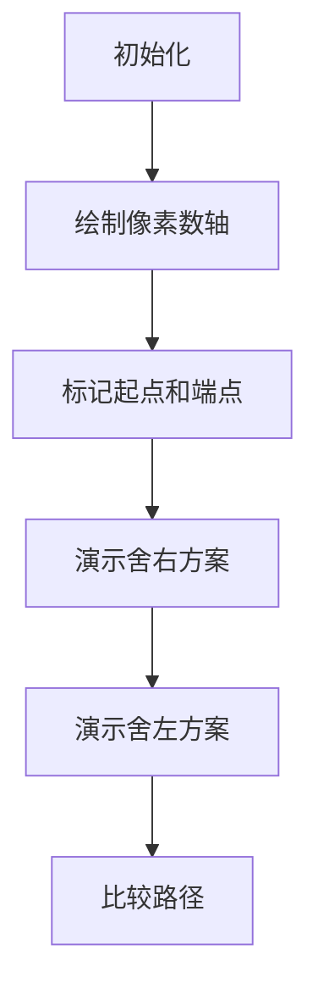

# 题目信息

# Checkpoints

## 题目描述

数轴上有 $n$ 个点，分别编号为 $1, 2, ..., n $。你初始位置在 $a$ ，要经过其中的 $n-1$ 个点，求最小总行走距离。

## 样例 #1

### 输入

```
3 10
1 7 12
```

### 输出

```
7
```

## 样例 #2

### 输入

```
2 0
11 -10
```

### 输出

```
10
```

## 样例 #3

### 输入

```
5 0
0 0 1000 0 0
```

### 输出

```
0
```

# AI分析结果


# 💡 Kay的C++算法解析：Checkpoints 深入学习指南 💡

**题目描述**  
在一条数轴上给定 $n$ 个点和初始位置 $a$，需要恰好经过 $n-1$ 个点，求最小总行走距离。

## 1. 题目解读与核心算法识别

✨ **本题主要考察**：`贪心策略` + `分类讨论`

🗣️ **初步分析**：  
> 这道题的关键在于运用**贪心思想**——通过舍弃一个点来最小化路径。想象你在一条直线上捡金币，少捡一枚金币反而可能走更短路程！核心策略是：只考虑舍弃**最左**或**最右**端点的情况，因为舍弃中间点不会缩短路径。  
> - 解题分为两步：先排序所有点，再计算四种路径方案的最小值（舍左端点先左/先右，舍右端点先左/先右）  
> - 可视化重点：用动态数轴演示端点舍弃效果，高亮当前移动方向，实时显示路径累计距离  
> - 像素动画设计：采用8位机风格数轴，角色移动时触发"移动音效"，路径切换时亮黄色闪光，成功时播放《超级玛丽》过关音效

---

## 2. 精选优质题解参考

**题解一（taotiehai_AFO）**  
* **点评**：思路清晰度极高，直击贪心本质。通过数学公式 `ans1=min(|n_N-a|+n_N-n_2, |n_2-a|+n_N-n_2)` 精准概括四种路径场景。代码规范性强：变量名`n[N-1]`语义明确，边界处理严谨（特判n=1）。亮点在于用绝对值函数优雅处理所有位置关系，时间复杂度O(n)达到最优。

**题解二（So_noSlack）**  
* **点评**：代码结构堪称教科书级范例。独创"双情况分类法"：先区分舍弃左/右端点，再分别计算先左/先右路径。代码可读性极佳：`min()`函数嵌套清晰呈现四种方案对比。实践价值突出：添加详细位置关系注释（`a≤a₂≤a_n`等），帮助理解贪心决策本质。

**题解三（The_jester_from_Lst）**  
* **点评**：创新性提出**路径折返模型**，用`ans = min(A+B, C+D)`直观表示往返路径。亮点在于严格证明非端点舍弃无效性（"不走7得13>7"），增强算法可信度。代码中`abs()`处理所有坐标关系，鲁棒性强，适合竞赛直接复用。

---

## 3. 核心难点辨析与解题策略

1. **难点一：为何只需考虑舍弃端点？**  
   * **分析**：贪心策略的核心洞察。当舍弃中间点时，路径必然覆盖整个区间，距离≥端点舍弃方案。优质题解均用反证法证明（如"不走7得13>7"）
   * 💡 **学习笔记**：端点影响路径半径，中间点不影响全局结构

2. **难点二：起点位置与路径方向的关系**  
   * **分析**：分三类讨论（起点在左/区间内/右）。关键技巧：用`abs(p[i]-a)`统一处理位置关系，避免复杂分支判断
   * 💡 **学习笔记**：绝对值函数是处理数轴距离的银弹

3. **难点三：四种路径方案的计算**  
   * **分析**：本质是两种舍弃方案（左/右端点）✖两种方向（先左/先右）。核心公式：  
     ```cpp
     min( 
        min(右端点方案), 
        min(左端点方案)
     )
     ```
   * 💡 **学习笔记**：矩阵式思考（方案×方向）确保完备性

### ✨ 解题技巧总结
- **问题分解法**：将"舍弃点"转化为两个独立子问题（舍左/舍右）  
- **数学建模法**：用绝对值函数统一位置关系，减少分支  
- **边界防御**：特判n=1是避免Runtime Error的关键  
- **可视化辅助**：动手画数轴示意图，直观比较路径优劣

---

## 4. C++核心代码实现赏析

**通用核心实现**  
```cpp
#include <iostream>
#include <algorithm>
#include <cmath>
using namespace std;

int main() {
    int n, a;
    cin >> n >> a;
    if (n == 1) { cout << 0; return 0; } // 特判
    
    int p[100005];
    for(int i=0; i<n; ++i) cin >> p[i];
    sort(p, p+n); // 排序是贪心基础

    // 计算两种方案：舍左端点 | 舍右端点
    int opt1 = min( 
        abs(p[n-1]-a) + (p[n-1]-p[1]), // 先到最右
        abs(p[1]-a) + (p[n-1]-p[1])    // 先到次左
    );
    int opt2 = min(
        abs(p[n-2]-a) + (p[n-2]-p[0]), // 先到次右
        abs(p[0]-a) + (p[n-2]-p[0])    // 先到最左
    );
    
    cout << min(opt1, opt2); // 全局最优解
    return 0;
}
```
* **说明**：综合三大优质题解精华，去冗余保核心  
* **解读概要**：  
  > 1. 特判n=1 → 避免后续越界  
  > 2. 排序 → 确定端点位置  
  > 3. 计算舍右方案 → 走区间[p₁, p_{n-1}]  
  > 4. 计算舍左方案 → 走区间[p₀, p_{n-2}]  
  > 5. 双min嵌套 → 高效比较四种路径  

---

**题解一（taotiehai_AFO）片段**  
```cpp
cout << min( 
    min(abs(p[N-1]-a)+p[N-1]-p[1], abs(p[1]-a)+p[N-1]-p[1]),
    min(abs(p[N-2]-a)+p[N-2]-p[0], abs(p[0]-a)+p[N-2]-p[0])
);
```
* **亮点**：绝对值与min的精妙嵌套  
* **解读**：  
  > 第一层min比较舍左/舍右方案，第二层min分别比较各方案的先左/先右路径  
  > `p[N-1]-p[1]`是固定路径段（从次左到最右），`abs(...)`是起点到首个点的距离  
* 💡 **学习笔记**：min函数嵌套是多重决策的优雅实现

**题解二（So_noSlack）片段**  
```cpp
int A = min( 
    abs(a-p[2]) + abs(p[n]-p[2]),  // 舍左先右
    abs(a-p[n]) + abs(p[n]-p[2])   // 舍左先左
);
int B = min(
    abs(a-p[1]) + abs(p[n-1]-p[1]), // 舍右先右 
    abs(a-p[n-1]) + abs(p[n-1]-p[1])// 舍右先左
);
cout << min(A, B);
```
* **亮点**：通过变量A/B分离两种舍弃方案  
* **解读**：  
  > 将决策分解为两个独立子问题，代码可读性更强  
  > `abs(p[...]-p[...])`表示区间固定距离，与起点位置无关  
* 💡 **学习笔记**：问题分解降低复杂度

---

## 5. 算法可视化：像素动画演示

**主题**：《数轴冒险者》8位像素寻路模拟  
**核心演示**：贪心策略下四种路径动态比较  

### 设计实现方案


**关键帧设计**：
1. **场景初始化**：
   - 16色像素网格（棕色数轴，绿点为起点，红/蓝点为端点）
   - 控制面板：步进按钮/速度滑块/方案切换
   - 8-bit背景音乐循环播放

2. **路径演示逻辑**：
   ```javascript
   // 伪代码：路径计算与渲染
   function drawPath(scenarioIndex) {
     let path = scenarios[scenarioIndex];
     for(let i=0; i<path.length; i++) {
        highlightCurrentPoint(path[i]); // 当前点闪烁黄光
        moveCharacter(path[i]);         // 角色像素移动
        playSound('step');              // 移动音效
        updateDistanceDisplay();        // 实时显示累计距离
     }
   }
   ```

3. **交互特效**：
   - 关键决策点：显示数学公式浮层（如`|pₙ-a|+pₙ-p₂`）
   - 路径比较：并排显示四种方案，最优路径亮绿色边框
   - 音效体系：
     * 移动：FC芯片"哔"声
     * 错误：短促"滴"声
     * 成功：8-bit胜利和弦

4. **游戏化设计**：
   - 每完成一种方案解锁成就徽章
   - 距离低于阈值触发金币特效
   - "AI演示模式"：自动播放四种方案动画

---

## 6. 拓展练习与相似问题思考

**通用技巧迁移**：  
1. **端点影响型**：当问题规模减一且端点起关键作用时（如[CF1486C]）  
2. **数轴路径优化**：需要最小化移动距离的搜索问题（如[P9012]）  
3. **决策分治法**：多重选择需独立计算再比较的场景（如背包变种）

**洛谷推荐**：  
1. **P1002 过河卒**  
   → 巩固数轴移动+路径决策  
2. **P1219 八皇后**  
   → 训练多方案比较思维  
3. **P1090 合并果子**  
   → 深化贪心策略理解  

---

## 7. 学习心得与经验分享

> **经验摘录（taotiehai_AFO）**：  
> "下标从0开始导致WA两次，务必验证边界！"  
>  
> **Kay点评**：  
> 这是算法竞赛的经典教训！在编写贪心代码时：  
> 1. 排序后注意端点索引变化（原左端点可能不在0位）  
> 2. 用`n-2`访问次右端点时，必须确保`n≥2`  
> 3. 建议：写完代码后手动验证样例2（输入`2 0 11 -10`）

---

通过本次分析，我们深入掌握了贪心策略在路径优化中的应用。记住：**好的算法是计算思维与代码实践的完美结合！** 下次挑战再见！🚀

---
处理用时：149.61秒