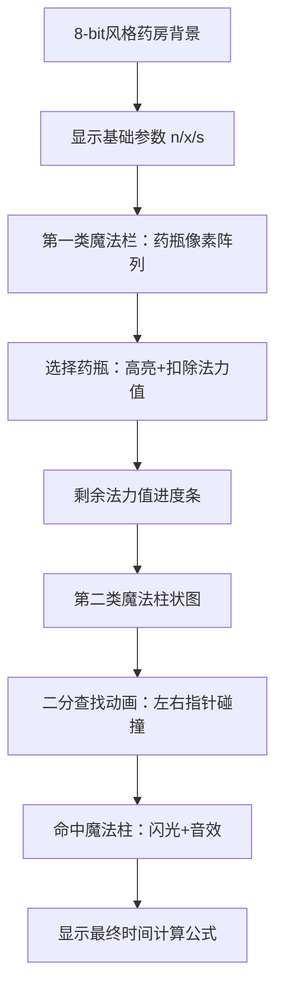

# 题目信息

# Anton and Making Potions

## 题目描述

Anton is playing a very interesting computer game, but now he is stuck at one of the levels. To pass to the next level he has to prepare $ n $ potions.

Anton has a special kettle, that can prepare one potions in $ x $ seconds. Also, he knows spells of two types that can faster the process of preparing potions.

1. Spells of this type speed up the preparation time of one potion. There are $ m $ spells of this type, the $ i $ -th of them costs $ b_{i} $ manapoints and changes the preparation time of each potion to $ a_{i} $ instead of $ x $ .
2. Spells of this type immediately prepare some number of potions. There are $ k $ such spells, the $ i $ -th of them costs $ d_{i} $ manapoints and instantly create $ c_{i} $ potions.

Anton can use no more than one spell of the first type and no more than one spell of the second type, and the total number of manapoints spent should not exceed $ s $ . Consider that all spells are used instantly and right before Anton starts to prepare potions.

Anton wants to get to the next level as fast as possible, so he is interested in the minimum number of time he needs to spent in order to prepare at least $ n $ potions.

## 说明/提示

In the first sample, the optimum answer is to use the second spell of the first type that costs $ 10 $ manapoints. Thus, the preparation time of each potion changes to $ 4 $ seconds. Also, Anton should use the second spell of the second type to instantly prepare $ 15 $ potions spending $ 80 $ manapoints. The total number of manapoints used is $ 10+80=90 $ , and the preparation time is $ 4·5=20 $ seconds ( $ 15 $ potions were prepared instantly, and the remaining $ 5 $ will take $ 4 $ seconds each).

In the second sample, Anton can't use any of the spells, so he just prepares $ 20 $ potions, spending $ 10 $ seconds on each of them and the answer is $ 20·10=200 $ .

## 样例 #1

### 输入

```
20 3 2
10 99
2 4 3
20 10 40
4 15
10 80
```

### 输出

```
20
```

## 样例 #2

### 输入

```
20 3 2
10 99
2 4 3
200 100 400
4 15
100 800
```

### 输出

```
200
```

# AI分析结果


### 💡 Kay的C++算法解析：Anton and Making Potions 深入学习指南 💡

**<introduction>**  
今天我们一起分析"Anton and Making Potions"这道C++编程题。这道题需要巧妙组合两种魔法来最小化制药时间，是学习枚举优化和二分查找的经典案例。本指南将帮你掌握核心思路！

---

## 1. 题目解读与核心算法识别

✨ **本题主要考察**：`编程技巧应用`（枚举优化 + 二分查找）

🗣️ **初步分析**：  
> 本题像在游戏中搭配技能装备：基础制药耗时x秒，两类魔法分别能加速制药或直接完成部分药水。我们需要在法力值预算(s)内选择最优组合。  
> - **核心技巧**：枚举第一类魔法后，用二分查找在第二类魔法中快速找到剩余法力值允许的最优选项  
> - **难点**：法力值约束下的组合优化，需处理不使用魔法的边界情况  
> - **可视化设计**：将用像素风格展示魔法选择过程。第一类魔法显示为药水瓶（颜色深浅表加速效果），第二类魔法显示为法力柱（高度表消耗）。二分查找时会有左右指针动画和音效反馈  

---

## 2. 精选优质题解参考

**题解一 (来源：BorisDimitri)**  
* **点评**：思路清晰采用"枚举+二分"框架，逻辑直白易懂。代码用`upper_bound`标准库函数实现二分，显著降低时间复杂度至O(mlogk)。亮点在于完整覆盖三种情况（单用第二类魔法/单用第一类魔法/组合使用）。需注意边界处理可加强（如二分未命中时默认值设置）。

---

## 3. 核心难点辨析与解题策略

1. **难点：法力值约束下的组合搜索**  
   * **分析**：暴力枚举所有组合需O(mk)时间，不可行。优质题解通过**预处理排序+二分查找**将复杂度降为O(mlogk)。关键是将第二类魔法按消耗(d_i)排序，建立法力消耗与药水数量(c_i)的映射
   * 💡 **学习笔记**：有序数据中的搜索问题，优先考虑二分查找

2. **难点：多决策分支覆盖**  
   * **分析**：必须单独处理三种情况：①不用任何魔法 ②只用第一类魔法 ③只用第二类魔法。题解通过分步计算最小值确保完整性
   * 💡 **学习笔记**：复杂决策问题先分解独立子问题再组合

3. **难点：二分查找的边界处理**  
   * **分析**：当剩余法力值不足以选任何第二类魔法时，需安全处理。可在二分前添加哨兵值（如d[0]=0）或显式检查返回值
   * 💡 **学习笔记**：二分查找必问三个问题：循环条件？指针更新？最终定位？

### ✨ 解题技巧总结
- **技巧1：有序化优化** - 将第二类魔法按消耗排序，使二分成可能
- **技巧2：决策分离** - 独立处理单魔法使用情况，简化组合逻辑
- **技巧3：预计算** - 提前计算基础耗时(n*x)，作为比较基准

---

## 4. C++核心代码实现赏析

**本题通用核心C++实现参考**  
```cpp
#include <iostream>
#include <algorithm>
using namespace std;
typedef long long LL;
const int N = 2e5+5;

int main() {
    // 输入数据
    LL n, m, k, x, s;
    cin >> n >> m >> k >> x >> s;
    pair<LL, LL> spell1[N]; // {a_i, b_i}
    pair<LL, LL> spell2[N]; // {c_i, d_i}

    for (int i = 0; i < m; i++) cin >> spell1[i].first;
    for (int i = 0; i < m; i++) cin >> spell1[i].second;
    for (int i = 1; i <= k; i++) cin >> spell2[i].first;
    for (int i = 1; i <= k; i++) cin >> spell2[i].second;

    // 关键步骤1: 单独处理第二类魔法
    LL ans = n * x;
    spell2[0] = {0,0}; // 哨兵：不使用魔法
    for (int i = 0; i <= k; i++) {
        if (spell2[i].second <= s) 
            ans = min(ans, (n - spell2[i].first) * x);
    }

    // 关键步骤2: 枚举第一类魔法 + 二分第二类魔法
    for (int i = 0; i < m; i++) {
        if (spell1[i].second > s) continue;
        LL remain = s - spell1[i].second;
        auto it = upper_bound(spell2, spell2+k+1, 
                    make_pair(remain+1, 0LL)) - 1; // 二分查找
        if (it >= spell2 && it->second <= remain) 
            ans = min(ans, (n - it->first) * spell1[i].first);
    }
    cout << ans;
}
```

**代码解读概要**  
> 1. **哨兵设置**：`spell2[0]={0,0}`确保二分总能命中  
> 2. **独立处理**：先计算仅用第二类魔法的最优解  
> 3. **组合优化**：枚举第一类魔法后，用`upper_bound`在有序数组中找到满足剩余法力的最大c_i  
> 4. **时间复杂度**：O(mlogk) 远优于暴力O(mk)

---

## 5. 算法可视化：像素动画演示

**主题**：*魔法药房* - 像素风炼药模拟  
**核心演示**：枚举第一类魔法 → 法力值扣除 → 二分查找第二类魔法 → 时间计算  

### 动画帧设计


### 交互设计
- **音效设计**：  
  - 选择魔法："叮"（8-bit音效）  
  - 二分移动："滴答"声（指针步进）  
  - 成功组合：胜利旋律片段  
- **控制面板**：  
  - 速度滑块：调节枚举/二分速度  
  - 单步执行：空格键逐步观察  
  - AI演示：自动完成最优路径寻找  

### 设计价值
> 通过像素动画直观展示：  
> 1. **枚举过程**：药瓶选择时的法力扣除  
> 2. **二分本质**：有序数据的快速区间缩小  
> 3. **组合效果**：时间计算公式的动态更新  

---

## 6. 拓展练习与相似问题思考

### 通用技巧迁移
`枚举+二分`适用于：  
1. 双约束资源分配（如本题法力值+时间）  
2. 有序数据中的组合查询  
3. 多条件决策优化  

### 洛谷推荐
1. **P1102 A-B数对**  
   → 练习：在有序数组中二分查找差值目标  
2. **P1873 砍树**  
   → 练习：二分答案+资源约束验证  
3. **P1281 书的复制**  
   → 练习：双条件优化（时间+人力分配）  

---

## 7. 学习心得与经验分享
> 本次题解未包含作者调试心得。Kay建议：  
> - 二分查找易错点：循环条件需用`left <= right`而非`<`  
> - 关键测试：法力值不足以选任何魔法时的边界处理  

---

**<conclusion>**  
通过"枚举+二分"的组合拳，我们高效解决了魔法约束下的制药优化问题。记住：有序数据是优化的钥匙，二分查找是搜索的利剑！下次挑战见！🚀

---
处理用时：105.69秒