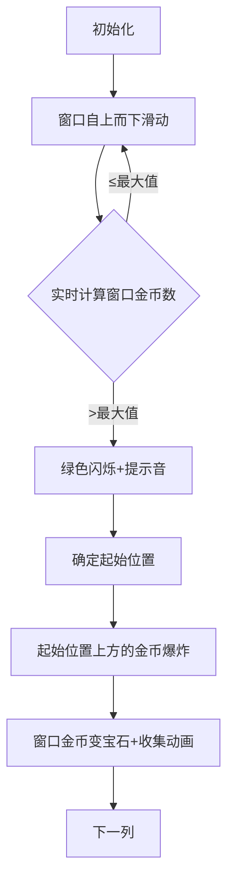

# 题目信息

# Strange Game On Matrix

## 题目描述

Ivan is playing a strange game.

He has a matrix $ a $ with $ n $ rows and $ m $ columns. Each element of the matrix is equal to either $ 0 $ or $ 1 $ . Rows and columns are $ 1 $ -indexed. Ivan can replace any number of ones in this matrix with zeroes. After that, his score in the game will be calculated as follows:

1. Initially Ivan's score is $ 0 $ ;
2. In each column, Ivan will find the topmost $ 1 $ (that is, if the current column is $ j $ , then he will find minimum $ i $ such that $ a_{i,j}=1 $ ). If there are no $ 1 $ 's in the column, this column is skipped;
3. Ivan will look at the next $ min(k,n-i+1) $ elements in this column (starting from the element he found) and count the number of $ 1 $ 's among these elements. This number will be added to his score.

Of course, Ivan wants to maximize his score in this strange game. Also he doesn't want to change many elements, so he will replace the minimum possible number of ones with zeroes. Help him to determine the maximum possible score he can get and the minimum possible number of replacements required to achieve that score.

## 说明/提示

In the first example Ivan will replace the element $ a_{1,2} $ .

## 样例 #1

### 输入

```
4 3 2
0 1 0
1 0 1
0 1 0
1 1 1
```

### 输出

```
4 1
```

## 样例 #2

### 输入

```
3 2 1
1 0
0 1
0 0
```

### 输出

```
2 0
```

# AI分析结果


### Kay的C++算法解析：Strange Game On Matrix 深入学习指南

---

#### **1. 题目解读与核心算法识别**  
✨ **本题主要考察**：贪心、前缀和、滑动窗口  

🗣️ **初步分析**：  
> 本题如同在像素游戏中逐列收集金币：每列是一个独立关卡，矩阵中的"1"是金币，"0"是空地。目标是在每列选定一个起始位置（最靠上的1），向下收集连续`k`格内的金币，同时最小化删除起始位置上方金币的操作次数。核心策略是：  
> - **贪心思想**：每列独立决策，最大化区间金币数且最小化操作次数  
> - **前缀和优化**：快速计算任意区间金币数量  
> - **滑动窗口**：动态维护区间内金币数量  
>  
> **可视化设计思路**：  
> 采用8位像素风格（类似FC游戏），每列显示为竖立管道：  
> 1. 金币用黄色方块，空地用黑色  
> 2. 红色边框窗口（高2格）从上向下滑动  
> 3. 实时显示窗口内金币数，最大值时触发绿色闪烁  
> 4. 确定起始位置后：  
>   - 起始位置上方的金币爆炸消失（像素粒子特效+爆炸音效）  
>   - 窗口内金币变为宝石（收集动画+金币音效）  

---

#### **2. 精选优质题解参考**  
**题解一（Priori_Incantatem）**  
* **点评**：思路清晰直击核心，用前缀和数组`S[i]`存储每列前`i`行金币累计数。枚举起始行`i`时，区间金币数=`S[i+k-1]-S[i-1]`，操作数=`S[i-1]`。代码规范（变量名`sum`/`cnt`含义明确），边界处理严谨，O(n²)复杂度在题限内高效可行。  

**题解二（DPair）**  
* **点评**：创新性地从下往上滑动窗口：  
  - 动态更新`dp[i]`（从第`i`行开始的k格金币数）  
  - 用`dp[i]=dp[i+1]+a[i][j]-a[i+k][j]`避免重复计算  
  - 前缀和数组`b[i]`快速计算操作次数  
 亮点在于窗口更新逻辑简洁，空间利用率高。  

**题解三（Y2y7m）**  
* **点评**：暴力解法但胜在直观性：  
  - 直接计算每个起始行下的k格金币数`f[i][j]`  
  - 适合初学者理解贪心本质  
 虽复杂度O(n²)稍高，但代码可读性强（双重循环结构清晰）  

---

#### **3. 核心难点辨析与解题策略**  
1. **难点1：快速计算任意区间金币数**  
   * **分析**：暴力计算O(k)导致O(nk)超时。优质解法均用**前缀和**（`S[i]=S[i-1]+a[i][j]`）实现O(1)查询  
   * 💡 **学习笔记**：前缀和是区间统计问题的银弹  

2. **难点2：平衡得分与操作次数**  
   * **分析**：贪心需同时满足：  
     1. 最大化区间金币数`score`  
     2. 相同`score`时最小化起始行前金币数（操作数）  
   * 💡 **学习笔记**：双目标优化可先主后次  

3. **难点3：理解操作对全局影响**  
   * **分析**：删除操作只影响当前列起始行前的金币，各列独立。通过枚举起始行模拟操作效果  
   * 💡 **学习笔记**：高内聚问题可分解为独立子问题  

✨ **解题技巧总结**  
- **空间换时间**：前缀和数组预计算提升效率  
- **边界防御**：窗口结束行取`min(i+k-1, n)`防越界  
- **实时更新**：滑动窗口避免重复计算  

---

#### **4. C++核心代码实现赏析**  
**通用核心实现参考**  
```cpp
#include <vector>
using namespace std;

int main() {
    int n, m, k; 
    cin >> n >> m >> k;
    vector<vector<int>> a(n, vector<int>(m));
    // 读入矩阵
    for (int i = 0; i < n; i++) 
        for (int j = 0; j < m; j++) 
            cin >> a[i][j];

    int totalScore = 0, totalOps = 0;
    for (int j = 0; j < m; j++) {  // 逐列处理
        vector<int> prefix(n + 1);
        // 前缀和数组: prefix[i]=前i行金币数
        for (int i = 1; i <= n; i++) 
            prefix[i] = prefix[i - 1] + a[i - 1][j];

        int bestScore = 0, minOps = 1e9;
        for (int i = 0; i < n; i++) {  // 枚举起始行
            int end = min(i + k, n);   // 窗口结束行
            int score = prefix[end] - prefix[i];  // 区间金币数
            int ops = prefix[i];        // 操作数=起始行前金币数
            
            // 更新最优解: 优先score, 次优ops
            if (score > bestScore) bestScore = score, minOps = ops;
            else if (score == bestScore && ops < minOps) minOps = ops;
        }
        totalScore += bestScore;
        totalOps += minOps;
    }
    cout << totalScore << " " << totalOps << endl;
}
```
* **代码解读概要**：  
  1. 外层遍历每列，内层构建前缀和数组`prefix`  
  2. 枚举起始行`i`，计算窗口金币数`score=prefix[i+k]-prefix[i]`  
  3. 动态更新最大`score`及对应的最小操作数`minOps`  

**题解一（Priori_Incantatem）片段**  
```cpp
for (int j = 1; j <= m; j++) {
    for (int i = 1; i <= n; i++) 
        s[i] = s[i - 1] + a[i][j];  // 前缀和计算
    for (int i = 1; i <= n; i++) {
        int tmp = s[i + k - 1] - s[i - 1];  // 窗口金币数
        if (tmp > sum || (tmp == sum && s[i - 1] < cnt)) 
            sum = tmp, cnt = s[i - 1];  // 双目标更新
    }
    ans += sum, tot += cnt;
}
```
* **亮点**：双重循环结构清晰，tmp/sum/cnt变量名自解释  
* **学习笔记**：`s[i-1]`直接作为操作数，体现问题本质  

**题解二（DPair）片段**  
```cpp
for (int i = n; i >= 1; i--) {
    dp[i] = dp[i + 1] + a[i][j];         // 向下扩展窗口
    if (i + k <= n) dp[i] -= a[i + k][j]; // 移除溢出元素
    if (dp[i] >= dp[pos]) pos = i;       // 记录最佳起始行
}
totalOps += b[pos - 1][j];  // 操作数=起始行前金币和
```
* **亮点**：逆序更新避免重复计算，`dp[i]`物理意义明确  
* **学习笔记**：滑动窗口用加减法替代区间求和提升效率  

---

#### **5. 算法可视化：像素动画演示**  
**主题**：8位像素风《金币收集者》  

**核心演示流程**：  


**技术实现细节**：  
1. **像素渲染**：  
   - 用Canvas绘制20×20像素块，列高=20×n像素  
   - 金币：黄色(#FFFF00)，空地：黑色(#000000)  
2. **窗口动画**：  
   ```javascript
   function drawWindow(pos) {
       ctx.strokeStyle = '#FF0000';  // 红色边框
       ctx.strokeRect(0, pos*20, 20, k*20); 
       // 实时显示金币数
       ctx.fillText(`金币: ${getCoins(pos)}`, 25, pos*20+10);
   }
   ```  
3. **音效触发**：  
   - 窗口移动：8-bit滑动音效（50ms循环）  
   - 最大值更新：清脆“叮！”声  
   - 金币爆炸：爆破音效+粒子特效(`drawParticles()`)  

**交互控制面板**：  
- 速度滑块：控制窗口移动速度（50ms~500ms）  
- AI演示模式：自动播放全流程（类似贪吃蛇AI）  
- 关卡进度：每列作为一关，通关显示得分/操作数  

---

#### **6. 拓展练习与相似问题思考**  
**技巧迁移场景**：  
1. 固定区间统计 → 广告牌点击量分析  
2. 双目标优化 → 资源调度问题  
3. 前缀和+滑动窗口 → 实时数据流分析  

**洛谷题目推荐**：  
1. [P1886 滑动窗口](https://www.luogu.com.cn/problem/P1886)  
   → 掌握滑动窗口的模板应用  
2. [P1714 切蛋糕](https://www.luogu.com.cn/problem/P1714)  
   → 前缀和+单调队列优化  
3. [P2671 求和](https://www.luogu.com.cn/problem/P2671)  
   → 拓展前缀和与数学结合  

---

#### **7. 学习心得与经验分享**  
> **作者czh___的经验**：  
> *“本题难点不在算法，而在题意理解——通过删除操作调整起始位置这点易被误解”*  
>  
> **Kay的总结**：  
> 1. 审题时用样例模拟过程（如删除`a_{1,2}`如何提升得分）  
> 2. 复杂规则可转化为：操作=选择起始行，得分=起始行下k格金币数  
> 3. 先纸上画列分析，再写代码  

---

通过本次分析，我们深入理解了贪心与前缀和的配合使用。记住：将复杂问题分解为独立子问题（如逐列处理），并用预处理（前缀和）优化核心步骤，是提高算法效率的关键！下次挑战见！💪

---
处理用时：258.28秒