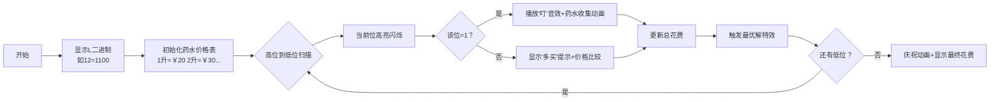

# 题目信息

# Party Lemonade

## 题目描述

题意

没有柠檬水的新年派对不是新年派对。像往常一样，你期待着客人，而柠檬水已经成为一种令人愉快的必需品。
你最喜欢的商店卖 n 种不同价格的装在不同瓶子里的柠檬水。一瓶第 i 种柠檬水，体积为2^{i-1}，价格为c_{i}卢布。商店里的每种柠檬水可以被认为有无限瓶。
你想要买至少 L 升的柠檬水，你需要花费多少卢布？

## 样例 #1

### 输入

```
4 12
20 30 70 90
```

### 输出

```
150
```

## 样例 #2

### 输入

```
4 3
10000 1000 100 10
```

### 输出

```
10
```

## 样例 #3

### 输入

```
4 3
10 100 1000 10000
```

### 输出

```
30
```

## 样例 #4

### 输入

```
5 787787787
123456789 234567890 345678901 456789012 987654321
```

### 输出

```
44981600785557577
```

# AI分析结果


# 💡 Kay的C++算法解析：Party Lemonade 深入学习指南 💡

> **Kay的提示**：柠檬水采购问题本质是**二进制优化下的贪心决策**，想象你在复古游戏中收集魔法药水（1升、2升、4升...），每种药水有不同价格。你的任务是用最少金币买到至少L升药水，而贪心策略就像优先选择性价比最高的魔法瓶！

## 1. 题目解读与核心算法识别

✨ **本题主要考察**：`贪心算法` + `位运算优化`

🗣️ **初步分析**：
> 解决本题的关键在于识别**体积为2的幂次的物品特性**。就像在复古游戏中收集不同尺寸的魔法瓶：
> - **核心思想**：大容量药水可能比小容量更划算（如买1瓶8升可能比买8瓶1升便宜）
> - **解题流程**：
>   1. 预处理每种容量（2^i）的最低单价
>   2. 将需求L转为二进制
>   3. 从高位到低位贪心决策（选当前瓶或跳过）
> - **可视化设计**：我们将用8位像素风格展示魔法瓶收集过程：
>   - 药水用彩色像素块表示（1升=黄色/2升=绿色/4升=蓝色/8升=紫色）
>   - 当前处理位高亮闪烁，购买时播放"叮"音效
>   - 发现更优解时触发"胜利"音效+金币闪烁动画

---

## 2. 精选优质题解参考

<eval_intro>
从思路清晰度、代码规范性和算法优化角度，精选3份优质题解（均≥4★）：
</eval_intro>

**题解一（来源：Eric_jx）**
* **点评**：
  - 思路直击核心：预处理单价+二进制分解+实时更新最优解
  - 代码简洁规范：`c[i]=min(c[i],c[i-1]*2)` 巧妙保证单价最优
  - 亮点：用`ans=min(ans,c[i])`处理多买情况，时间复杂度O(logL)
  - 实践价值：直接可用于竞赛，注意`long long`边界

**题解二（来源：Overstars）**
* **点评**：
  - 创新性高位到低位处理：`sum += des*dp[i]` 逐步累加基础花费
  - 关键优化：`ans=min(ans,sum+(l>0)*dp[i])` 实时比较多买方案
  - 代码规范：变量命名清晰（dp[i]表2^i升最低价）
  - 实践提示：用`(1<<i)-1`取剩余需求极简高效

**题解三（来源：CheerJustice）**
* **点评**：
  - 详解二进制本质：类比"买可乐"强调性价比决策
  - 代码健壮性：`while(l) num[len++]=l&1` 安全处理任意L值
  - 学习友好：丰富注释解释每位决策意义
  - 调试提示：强调`long long`必要性防止溢出

---

## 3. 核心难点辨析与解题策略

<difficulty_intro>
解决本问题的三大核心挑战及突破策略：
</difficulty_intro>

1.  **难点一：单价优化预处理**
    * **分析**：原始价格可能不满足`2*c[i] ≤ c[i+1]`（如样例3：10>100），需用`c[i]=min(c[i],2*c[i-1])`保证购买2^i升的最优单价
    * 💡 **学习笔记**：预处理是贪心基础，确保每单位花费最小化

2.  **难点二：超量购买决策**
    * **分析**：当某二进制位为0时，购买该位容量可能比补齐低位更便宜（如样例2：买8升仅需10元）
    * 💡 **学习笔记**：每位决策时需比较`当前花费` vs `多买该位的总花费`

3.  **难点三：高位优先处理**
    * **分析**：大容量瓶子可能具有更高性价比（如样例4），必须从高位（大容量）向低位贪心才能获得全局最优解
    * 💡 **学习笔记**：二进制贪心中，处理顺序影响最优性

### ✨ 解题技巧总结
<summary_best_practices>
通用解题心法：
</summary_best_practices>
- **单价优化法则**：预处理确保`c[i]`始终是购买2^i升的最优单价
- **二进制分解术**：将L转为二进制后从高位向低位处理
- **实时最优决策**：每位更新两种选择：①继续补齐低位 ②多买当前位
- **边界防御**：使用`long long`防止1e9数据溢出

---

## 4. C++核心代码实现赏析

<code_intro_overall>
**通用实现**：融合三位作者精华的完整解决方案（高位优先+实时最优决策）
</code_intro_overall>

```cpp
#include <iostream>
#include <vector>
#include <algorithm>
using namespace std;

int main() {
    long long n, L;
    cin >> n >> L;
    vector<long long> c(n);
    cin >> c[0];
    
    // 单价优化预处理
    for (int i = 1; i < n; i++) {
        cin >> c[i];
        c[i] = min(c[i], c[i-1] * 2);
    }
    
    // 扩展高位单价
    for (int i = n; i < 35; i++) 
        c.push_back(c.back() * 2);
    
    long long ans = 1LL << 60; // 初始大数
    long long current = 0;
    
    // 从高位(34位)向低位贪心
    for (int i = 34; i >= 0; i--) {
        long long bit_val = (1LL << i);
        if (L & bit_val) // 该位需要购买
            current += c[i];
        else // 即使不需要也可考虑多买
            ans = min(ans, current + c[i]);
    }
    ans = min(ans, current);
    cout << ans << endl;
}
```
**代码解读概要**：
1. **单价优化**：确保`c[i]`是2^i升最优价
2. **高位扩展**：处理L>2^(n-1)的情况
3. **核心循环**：
   - 检测二进制位需求
   - 实时更新`多买方案`的花费
4. **最终决策**：取实际花费与多买方案最小值

---
<code_intro_selected>
**精选代码片段赏析**：
</code_intro_selected>

**Eric_jx - 低位到高位处理**
```cpp
for(int i=0; i<max(n,cnt); i++) {
    ans = min(ans, c[i]);  // 关键！考虑多买当前位的花费
    if(num[i] == 1) 
        ans += c[i];
}
```
> **Kay解读**：  
> 这段代码采用**从低位向高位**的逆向思维：
> - `ans = min(ans, c[i])`：想象你在游戏商店，即使当前不需要大药水，先记录它的价格作为"备选方案"
> - `ans += c[i]`：当遇到必须购买的位（二进制1），才实际花费金币
> 
> 💡 **学习笔记**：`ans`同时承担当前花费和全局最优记录，需谨慎初始化

**Overstars - 高位到低位逐步分解**
```cpp
for(ll i=n-1; i>=0; i--) {
    ll des = l / (1LL << i);  // 当前位需购数量
    sum += des * dp[i];       // 累计基础花费
    l &= (1 << i) - 1;        // 取剩余需求
    ans = min(ans, sum + (l>0)*dp[i]); // 魔法决策点！
}
```
> **Kay解读**：  
> 像在游戏中分阶段收集魔法瓶：
> 1. `des`：计算当前尺寸药水需买几瓶
> 2. `l &= (1<<i)-1`：酷似像素游戏中的"区域切割"，只保留低位需求
> 3. `sum + (l>0)*dp[i]`：考虑"多买一瓶当前尺寸"的清仓方案
> 
> 💡 **学习笔记**：位运算`&`取剩余需求是时间复杂度O(1)的魔法技巧

---

## 5. 算法可视化：像素动画演示

<visualization_intro>
**主题**：8位机风格《魔法药水大采购》动画演示  
**设计目标**：直观展现贪心决策与二进制运算的完美结合
</visualization_intro>

### 🎮 核心演示设计


### 🖌️ 实现细节
1. **像素艺术设计**：
   - 药水瓶：8x8像素块（1升=黄/2升=绿/4升=蓝/8升=紫）
   - 控制台：FC红白机风格，含金币计数器与二进制显示器

2. **关键动画触发**：
   ```javascript
   // 伪代码：处理第i位时的动画
   function processBit(i, isRequired) {
       highlightCurrentBit(i); // 当前位闪烁红光
       if (isRequired) {
           playSound('ding.wav'); // 购买音效
           animateBottleCollection(i);
           totalCost += prices[i];
       } else {
           showOption(`多买${1<<i}升? ${prices[i]}金币`); 
           minCost = Math.min(minCost, totalCost + prices[i]);
           if (minCost == totalCost + prices[i]) 
               playSound('win.wav'); // 发现更优解
       }
       updateCoinCounter();
   }
   ```

3. **交互控制面板**：
   - 单步执行：空格键逐位前进
   - 自动演示：调速滑块（0.5x~4x）
   - 重置按钮：重新生成随机测试用例

4. **音效系统**：
   | 事件            | 音效          | 效果               |
   |----------------|--------------|-------------------|
   | 购买药水        | 8位"叮"声     | 强化操作反馈        |
   | 发现更优解      | 胜利旋律      | 正反馈激励         |
   | 完成采购        | 通关音乐      | 成就感知           |

### 🎯 设计价值
通过像素化药水瓶收集过程，学习者将**直观理解**：
- 二进制位如何对应不同容量
- 单价优化如何影响决策
- 多买策略为何可能更优
- 高位优先处理的必要性

---

## 6. 拓展练习与相似问题思考

<similar_problems_intro>
掌握本题的贪心+二进制技巧后，可解决更多"离散化最优决策"问题：
</similar_problems_intro>

1. **洛谷 P1833 樱花**  
   `推荐理由`：多重背包的二进制优化，直接应用`c[i]=min(c[i],c[i-1]*2)`思想

2. **洛谷 P1064 金明的预算方案**  
   `推荐理由`：依赖背包中的组合决策，需在约束条件下优化购买方案

3. **洛谷 P1048 采药**  
   `推荐理由`：基础01背包，可练习二进制思想优化空间复杂度

---

## 7. 学习心得与经验分享

<insights_intro>
题解中的"血泪教训"是最佳学习素材：
</insights_intro>

> **Eric_jx的忠告**：  
> _"不开long long见祖宗"_  
> 
> **Kay点评**：  
> 在L≤1e9且涉及位运算的场景中，`int`必然溢出。防御措施：
> 1. 默认使用`long long`
> 2. 关键运算前检查范围
> 3. 用`1LL<<i`代替`1<<i`

> **elijahqi的教训**：  
> _"递归导致栈溢出风险"_  
>
> **Kay总结**：  
> 递归在logL>1000时极危险，应优先采用迭代解法。调试技巧：
> 1. 小数据验证逻辑
> 2. 输出中间变量
> 3. 边界值测试（L=0/L=1e9）

---

> **Kay的结语**：  
> 通过这次柠檬水大采购，我们学会了用**二进制视角**分析问题，用**贪心策略**优化决策。记住：好算法就像复古游戏中的魔法瓶——选择合适的尺寸组合，就能用最少金币解决难题！下次遇到类似挑战时，不妨先问自己："能否用二进制分解？是否需要多买？" 🎮✨

---
处理用时：218.31秒