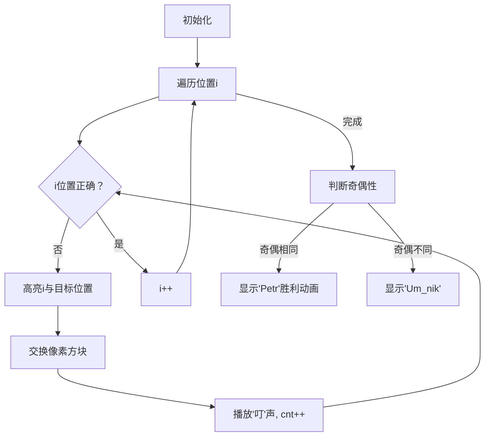

# 题目信息

# Petr and Permutations

## 题目描述

Petr likes to come up with problems about randomly generated data. This time problem is about random permutation. He decided to generate a random permutation this way: he takes identity permutation of numbers from $ 1 $ to $ n $ and then $ 3n $ times takes a random pair of different elements and swaps them. Alex envies Petr and tries to imitate him in all kind of things. Alex has also come up with a problem about random permutation. He generates a random permutation just like Petr but swaps elements $ 7n+1 $ times instead of $ 3n $ times. Because it is more random, OK?!

You somehow get a test from one of these problems and now you want to know from which one.

## 说明/提示

Please note that the sample is not a valid test (because of limitations for $ n $ ) and is given only to illustrate input/output format. Your program still has to print correct answer to this test to get AC.

Due to randomness of input hacks in this problem are forbidden.

## 样例 #1

### 输入

```
5
2 4 5 1 3
```

### 输出

```
Petr
```

# AI分析结果


# 💡 Kay的C++算法解析：Petr and Permutations 深入学习指南 💡

## 1. 题目解读与核心算法识别

✨ **本题主要考察**：`编程技巧应用`与`数学奇偶性分析`

🗣️ **初步分析**：
> 解决本题的关键在于理解**操作次数的奇偶性差异**。想象你有一副被打乱的扑克牌，Petr洗牌3n次，Alex洗牌7n+1次，两种洗牌次数的奇偶性不同（如n为奇数时3n是奇数而7n+1是偶数）。我们通过计算**还原序列的最小交换次数**或**逆序对数的奇偶性**来区分操作者，就像通过数牌面上的折痕判断洗牌次数一样。
> - 核心思路：利用奇偶性不变原理（每次交换改变奇偶性），比较计算值与操作次数的奇偶匹配度
> - 可视化设计：采用8位像素风格动画，用不同颜色方块表示数字，高亮交换位置，实时显示交换次数计数器。加入FC游戏音效（交换时"叮"声，完成时胜利音效）和自动演示模式（AI逐步解题）

---

## 2. 精选优质题解参考

**题解一（pufanyi）**
* **点评**：思路直击要害——提出O(n)复杂度的还原序列算法，通过最小交换次数的奇偶性判断操作者。代码简洁高效（变量`aa`数组存储序列，`ans`计数），边界处理完整（while循环确保完全还原）。实践价值高，可直接用于竞赛。

**题解二（caoshuchen）**
* **点评**：双解法展示全面性，既给出O(n)还原序列实现，又提供逆序对解法。代码规范（辅助数组`t`记录位置），证明严谨（详述奇偶性变化原理）。特别亮点是解释了"额外交换不影响奇偶性"的核心洞察。

**题解三（201012280925LSY）**
* **点评**：还原序列算法的高效实现，亮点在位置映射数组`b`的运用。代码逻辑清晰（先更新位置映射再交换），实践性强（直接计算3n与交换次数的奇偶差）。变量命名`h`暂存位置稍显简略但无碍理解。

---

## 3. 核心难点辨析与解题策略

1. **关键点：操作次数奇偶性转化**
   * **分析**：核心是将3n与7n+1的奇偶差异转化为可计算量。优质题解通过两种途径实现：①还原序列的最小交换次数奇偶性=初始操作次数的奇偶性 ②逆序对数的奇偶性=操作次数的奇偶性
   * 💡 **学习笔记**：奇偶性如钟摆——每次交换必改变状态，起点决定终点

2. **关键点：高效还原序列的实现**
   * **分析**：贪心策略（当前位置i不放i则交换）需要快速定位目标位置。题解采用位置映射数组（如`t[a[i]]=i`）将查找复杂度降至O(1)，避免O(n)遍历
   * 💡 **学习笔记**：空间换时间是优化经典策略，映射数组如同"数字GPS"

3. **关键点：逆序对的高效计算**
   * **分析**：O(n²)暴力不可行时，树状数组/归并排序将复杂度降至O(n log n)。核心是理解：交换操作中逆序对奇偶性变化如同开关切换
   * 💡 **学习笔记**：树状数组的sum查询如同"拼图计数"，高效聚合部分信息

### ✨ 解题技巧总结
- **奇偶守恒定位**：当操作次数存在奇偶差异时，将问题转化为奇偶性判断
- **映射加速访问**：用辅助数组记录位置关系，将O(n)查找优化为O(1)
- **边界完备性**：循环终止条件需确保所有元素归位（如while(aa[i]!=i)）

---

## 4. C++核心代码实现赏析

**本题通用核心C++实现参考**
* **说明**：综合自pufanyi和caoshuchen的O(n)解法，体现最优效率
* **完整核心代码**：
```cpp
#include <iostream>
using namespace std;
const int MAXN = 1e6+5;
int a[MAXN], pos[MAXN]; // a: 当前序列, pos: 值->位置映射

int main() {
    int n, cnt = 0;
    cin >> n;
    for (int i = 1; i <= n; ++i) {
        cin >> a[i];
        pos[a[i]] = i; // 初始化位置映射
    }
    for (int i = 1; i <= n; ++i) {
        while (a[i] != i) { // 当前位置不是i
            int target = pos[i]; // i应该在的位置
            swap(a[i], a[target]); // 交换元素
            swap(pos[a[i]], pos[a[target]]); // 更新位置映射
            ++cnt; // 增加交换计数
        }
    }
    cout << ((cnt & 1) == (n & 1) ? "Petr" : "Um_nik");
    return 0;
}
```
* **代码解读概要**：通过位置映射数组`pos`实现O(1)查找目标位置。每次交换同步更新元素位置和映射关系。最终比较交换次数`cnt`与`n`的奇偶性（因3n奇偶同n）

---

**题解一（pufanyi）片段赏析**
* **亮点**：最简实现，无冗余映射
* **核心代码片段**：
```cpp
for(int i = 1; i <= n; ++i) {
    while(aa[i] != i) { // 直接通过值定位
        swap(aa[aa[i]], aa[i]); // 同步交换
        ans++;
    }
}
```
* **代码解读**：
  > 精妙之处在于`aa[aa[i]]`的双重索引——`aa[i]`既是值也是目标位置索引。交换`aa[i]`和`aa[aa[i]]`时，实际将值`aa[i]`送至它的归属地。如同把迷路的人送到他手中地址对应的房间
* 💡 **学习笔记**：利用数组自身存储位置关系，省去额外空间

**题解二（caoshuchen）片段赏析**
* **亮点**：显式位置映射，逻辑更直观
* **核心代码片段**：
```cpp
swap(a[i], a[t[i]]); // t[i]是i的位置
swap(t[i], t[a[i]]); // 更新被交换数的位置
```
* **代码解读**：
  > 第一个`swap`交换元素值，第二个`swap`更新这两个值的位置记录。如同交换两个房间的物品后，同步更新它们的房间登记卡
* 💡 **学习笔记**：双swap确保数据一致性，是位置映射的核心维护逻辑

---

## 5. 算法可视化：像素动画演示

**动画演示主题**：8-bit排序冒险（FC红白机风格）  
**核心演示**：还原序列的交换过程，动态显示奇偶性判断  

**设计框架**：


**实现细节**：
1. **像素渲染**：Canvas绘制16x16像素网格，每个方块：
   - 底色：位置正确=绿色，错误=红色
   - 数字：8-bit字体显示
   - 边框：当前操作位置=闪烁黄框

2. **音效设计**：
   - 交换：FC芯片"叮"声(三角波, 200ms)
   - 完成：胜利音阶(1-3-5和弦)
   - 错误：短促"哔"声(方波, 100ms)

3. **交互控制**：
   ```javascript
   // 伪代码：交换动画核心逻辑
   function swapAnimation(i, target) {
      highlight(i, 'yellow'); // 高亮当前位置
      highlight(target, 'yellow'); 
      playSound('swap'); // 播放音效
      moveBlock(i, target); // 方块交换动画
      updateCounter(++cnt); // 更新计数器
   }
   ```

4. **自动演示**：调速滑块控制步骤间隔(100-1000ms)，AI自动运行至完成

---

## 6. 拓展练习与相似问题思考

**技巧迁移场景**：
1. 操作次数奇偶性判断：如灯开关问题（奇数次改变状态）
2. 排列还原技巧：如循环移位问题（寻找最小循环节）
3. 位置映射应用：如带权值的元素交换（同步更新权重）

**洛谷练习推荐**：
1. **P1908 逆序对**  
   → 巩固树状数组求逆序对，理解奇偶性应用
2. **P1966 [NOIP2013]火柴排队**  
   → 练习位置映射技巧，体验最小化逆序对的实际应用
3. **P1774 最接近神的人**  
   → 强化逆序对与交换次数的关系理解

---

## 7. 学习心得与经验分享

> **经验摘录（caoshuchen）**：  
> "交换操作中逆序对奇偶性必定改变——如同硬币翻转永远改变朝向"

> **Kay的总结**：  
> 本题教会我们：复杂问题常存在简洁的不变量（如奇偶性）。调试时可手动模拟小样例验证奇偶变化规律，这是比打印日志更本质的查错方法。记住，最优雅的解往往源于最深刻的洞察！

本次解析就到这里，继续用代码探索世界的秩序吧！🚀

---
处理用时：271.62秒