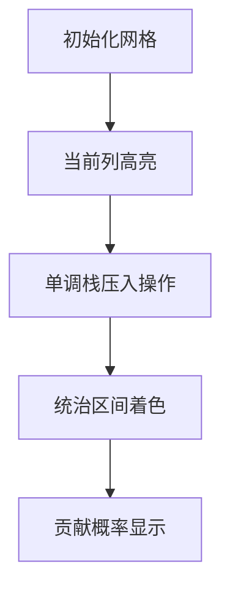

# 题目信息

# Narrower Passageway

## 题目描述

你是 ICPC 王国的一名战略家，近日你收到情报，王国附近的一条狭窄通道将遭遇怪物的袭击。这条通道可以简化为一个 2 行 $N$ 列的网格。我们用 $(r, c)$ 表示网格中第 $r$ 行第 $c$ 列的格子。每天会安排一个力量值为 $P_{r, c}$ 的士兵驻守在 $(r, c)$ 位置上。

这里常年大雾，每列都有 $50\%$ 的概率被雾气笼罩。一旦某列被雾气覆盖，两个驻守该列的士兵将无法执行任务。否则，士兵将正常部署。

我们定义一个连通区域 $[u, v]$（$u \leq v$）为从第 $u$ 列到第 $v$ 列连续且无雾的列。下面的示例中，灰色部分代表被雾覆盖的格子，共有四个连通区域：$[1, 2]$、$[4, 6]$、$[9, 9]$ 和 $[11, 11]$。


连通区域 $[u, v]$ 的力量可以这样计算。设 $m_1$ 和 $m_2$ 分别为该区域内第一行和第二行士兵力量的最大值。具体来说，对于 $r \in \{1, 2\}$，有 $m_r = \max (P_{r, u}, P_{r, u + 1}, \dots, P_{r, v})$。如果 $m_1 = m_2$，则该区域的力量是 $0$；否则，力量为 $\min (m_1, m_2)$。

一个工作日的总力量定义为所有连通区域力量的总和。请计算在任意一天部署的期望总力量。

## 说明/提示

样例输入/输出 #1 解释

这条通道可能有 $8$ 种不同的布局。


每种布局出现的概率是相同的。因此，期望总力量为 $(0 + 5 + 10 + 5 + 5 + 0 + 5 + 0) / 8 = \frac{15}{4}$。由于 $249\,561\,092 \cdot 4 \equiv 15 \pmod{998\,244\,353}$，所以样例的输出为 $249\,561\,092$。

样例输入/输出 #2 解释

期望总力量为 $\frac{67}{16}$。

 **本翻译由 AI 自动生成**

## 样例 #1

### 输入

```
3
8 4 5
5 4 8```

### 输出

```
249561092```

## 样例 #2

### 输入

```
5
10 20 5 8 5
5 20 7 5 8```

### 输出

```
811073541```

# AI分析结果


# 💡 Kay的C++算法解析：Narrower Passageway 深入学习指南 💡

<introduction>
今天我们来分析一道考察期望计算和区间处理的C++编程题"Narrower Passageway"。这道题融合了概率论与数据结构技巧，我们将通过拆解核心算法和可视化演示帮助你直观理解解题思路。
</introduction>

## 1. 题目解读与核心算法识别

✨ **本题主要考察**：`编程技巧应用` (拆解贡献 + 区间最值处理)

🗣️ **初步分析**：
> 解决本题的关键在于将复杂期望问题拆解为独立贡献的求和。想象你是一位统计学家，需要计算每个士兵对最终结果的"影响力"。通过巧妙的数学转换和数据结构优化，我们可以高效计算每个网格点作为区域最大值时的贡献概率。
> 
> - **核心思路**：所有题解都采用"拆贡献"策略，将总期望转化为每个士兵的贡献之和，再减去重复计算的部分。难点在于：
>   1. 准确计算士兵成为区域最大值的概率范围
>   2. 高效处理区间最值（使用单调栈）
>   3. 避免重复计数（定义唯一贡献点）
> - **算法流程**：
>   1. 对每个士兵计算其"统治区间"（该区间内它是最大值）
>   2. 计算该区间成为连通区域的概率
>   3. 累加贡献并处理特殊情况
> - **可视化设计**：我们将采用像素网格展示士兵力量值，当处理某列时，高亮其统治区间范围。单调栈操作将通过"像素方块压入/弹出"动画演示，贡献概率用颜色渐变表示。

---

## 2. 精选优质题解参考

<eval_intro>
以下题解在思路清晰度、代码可读性和算法优化方面表现突出：

**题解一：(来源：Luzhuoyuan)**
* **点评**：这份题解思路最为简洁直接。作者巧妙地将贡献拆分为两部分：士兵作为行最大值的正贡献和作为两行较小值时的负贡献。代码中：
  - 使用单调栈高效计算统治区间（`L[i]`/`R[i]`）
  - 贡献概率公式`cal()`设计精妙（独立计算左右边界影响）
  - 空间复杂度O(n)且无冗余操作
  - 变量命名清晰（`mi[]`存储2的幂次），边界处理严谨

**题解二：(来源：xyz105)**
* **点评**：该解法提供了更严谨的数学推导，亮点在于：
  - 详细定义了四种边界情况（`l1,l2,r1,r2`）
  - 采用ST表加速区间最值查询
  - 贡献计算分段处理避免重复
  - 代码包含详细注释，但实现稍复杂
  - 时间复杂度O(n log n)略低于解法一

---

## 3. 核心难点辨析与解题策略

<difficulty_intro>
解决本题的三大关键难点及应对策略：

1.  **贡献拆解与概率计算**：
    * **分析**：期望计算的关键是将总强度分解为独立事件。优质题解都采用：总贡献 = Σ(士兵作为行最大值的贡献) - Σ(士兵作为两行较小值的贡献)。概率计算需考虑区间左右边界的雾状态（2的幂次），如解法一的`cal()`函数。
    * 💡 **学习笔记**：期望的线性性是处理复杂概率问题的利器。

2.  **统治区间的高效计算**：
    * **分析**：需要快速求出每个士兵作为最大值的极大区间。单调栈是完美选择：
      - 正序扫描确定右边界（严格大于弹出）
      - 逆序扫描确定左边界（大于等于弹出）
      - 解法一的双向扫描仅需O(n)
    * 💡 **学习笔记**：单调栈是处理"下一个更大元素"类问题的标准工具。

3.  **避免重复计数**：
    * **分析**：当多个士兵值相同时，需确保只在一个点计算贡献。解法一通过弹栈规则实现：
      - 右边界定义要求右侧所有值**严格小于**当前值
      - 左边界允许**小于等于**（避免区间重叠）
    * 💡 **学习笔记**：定义唯一贡献点是处理重复值的关键。

### ✨ 解题技巧总结
<summary_best_practices>
- **技巧A (问题分解)**：将复杂期望拆解为独立事件的概率求和
- **技巧B (统治区间处理)**：单调栈双向扫描确定极大值影响范围
- **技巧C (模运算优化)**：预处理2的幂次避免重复计算（如解法一的`mi[]`数组）
- **技巧D (边界处理)**：虚拟哨兵值（INF）简化代码逻辑

---

## 4. C++核心代码实现赏析

<code_intro_overall>
以下是综合优质题解提炼的通用实现（基于Luzhuoyuan解法优化）：

```cpp
#include<bits/stdc++.h>
#define int long long
using namespace std;
const int N=1e5+5, mod=998244353, inv2=499122177;

int n, a[N], b[N], st[N], L[N], R[N];
int pwr[N], ans; // pwr[i] = 2^i % mod

// 计算统治区间[l,r]的贡献概率
int calc(int l, int m, int r) {
    if(l>m || m>r) return 0;
    int left = (pwr[m-1] - (l>=2 ? pwr[l-2] : 0) + mod) % mod;
    int right = (pwr[n-m] - (r<n ? pwr[n-r-1] : 0) + mod) % mod;
    return 1LL * left * right % mod;
}

void process() {
    int top=0;
    // 计算左边界
    for(int i=1; i<=n; i++) {
        while(top && a[i] >= a[st[top]]) top--;
        L[i] = top ? st[top]+1 : 1;
        st[++top] = i;
    }
    // 计算右边界
    top=0;
    for(int i=n; i>=1; i--) {
        while(top && a[i] > a[st[top]]) top--;
        R[i] = top ? st[top]-1 : n;
        st[++top] = i;
    }
    // 累加贡献
    for(int i=1; i<=n; i++) 
        ans = (ans + calc(L[i], i, R[i]) * a[i]) % mod;
}

signed main() {
    cin >> n;
    // 预处理2的幂次
    pwr[0]=1;
    for(int i=1; i<=n; i++) pwr[i] = pwr[i-1]*2 % mod;
    
    for(int i=1; i<=n; i++) cin >> a[i];
    for(int i=1; i<=n; i++) cin >> b[i];
    
    // 处理第一行作为最大值的贡献
    process(); 
    // 处理第二行作为最大值的贡献
    swap(a, b); 
    process();
    // 减去两行相等时的重复贡献
    for(int i=1; i<=n; i++) a[i] = max(a[i], b[i]);
    process();
    ans = (mod - ans) % mod;
    
    // 期望 = 总贡献 / 2^n
    int base = pwr[n]; 
    ans = 1LL * ans * pow(base, mod-2, mod) % mod;
    cout << ans << endl;
}
```

* **代码解读概要**：
  > 1. **预处理**：计算2的幂次数组`pwr[]`用于概率计算
  > 2. **统治区间**：通过双向单调栈扫描确定每个士兵的统治区间`[L[i], R[i]]`
  > 3. **贡献累加**：`process()`函数计算三种贡献：
  >    - 士兵作为行最大值的正贡献（两次）
  >    - 两行最大值相等时的负贡献（一次）
  > 4. **期望计算**：总贡献除以2^n（使用费马小定理求模逆元）

---
<code_intro_selected>
**题解一：(Luzhuoyuan)**
* **亮点**：统治区间计算与概率公式的精巧结合
* **核心代码片段**：
```cpp
int cal(int l,int m,int r){
    return (pwr[m-1]-pwr[l-2]) * (pwr[n-m]-pwr[n-r-1]) % mod;
}
void process(){
    // 单调栈计算统治区间
    for(int i=1;i<=n;i++){
        while(top && a[i] >= a[st[top]]) top--;
        L[i] = top ? st[top]+1 : 1;
        st[++top]=i;
    }
    // 贡献累加
    ans = (ans + cal(L[i],i,R[i])*a[i]) % mod;
}
```
* **代码解读**：
  > `cal()`函数是贡献计算的核心：  
  > - **左边界影响**：`pwr[m-1]-pwr[l-2]` 计算左边界在`[l,m]`的概率  
  > - **右边界影响**：`pwr[n-m]-pwr[n-r-1]` 计算右边界在`[m,r]`的概率  
  > - **乘积意义**：两者相乘即该统治区间成为连通区域的概率  
  > 单调栈处理中：  
  > - **正向扫描**：用`>=`比较确定左边界，确保同值时左侧优先  
  > - **反向扫描**：用`>`比较确定右边界，避免区间重叠  

* 💡 **学习笔记**："统治区间+概率乘积"是拆贡献问题的通用范式。

**题解二：(xyz105)**
* **亮点**：ST表加速区间最值查询
* **核心代码片段**：
```cpp
ll st_query(int l, int r){
    int k = lg2[r-l+1];
    return max(st[l][k], st[r-(1<<k)+1][k]);
}
void calc(){
    // 二分查找满足条件的边界
    while(l<=r){
        if(st_query(mid,i) > b[i]) r=mid-1;
        else l=mid+1;
    }
    // 分段计算贡献概率
    ans += (pow2s(L1,L2) * pow2s(R1,R2)) % mod;
}
```
* **代码解读**：
  > 1. **ST表构建**：预处理`st[][]`数组支持O(1)区间最值查询  
  > 2. **二分确定边界**：对每个士兵，二分查找其成为最小值的有效区间  
  > 3. **概率分段计算**：将统治区间分为多段处理边界条件  
  > 4. **贡献累加**：各段概率乘士兵力量值累加到总贡献  

* 💡 **学习笔记**：ST表+二分适用于统治区间受多条件约束的场景。

-----

## 5. 算法可视化：像素动画演示

<visualization_intro>
我们将创建"像素守卫战"动画演示统治区间计算过程。采用8位像素风格，让单调栈操作如同俄罗斯方块般直观可见！

### 设计说明
* **场景布局**：2×n像素网格，每格颜色表示士兵力量值（暖色=高力量）
* **控制面板**：步进控制/速度滑块/重置按钮
* **音效设计**：
  - 方块移动：经典8位"滴"声
  - 统治区间激活：胜利音效片段
  - 错误操作：短促警示音

### 关键动画帧


1. **初始化阶段**：
   - 像素网格加载士兵力量值（颜色深浅表示大小）
   - 控制面板亮起，播放复古背景音乐

2. **单调栈操作**：
   ```python
   # 伪代码：单调栈动画逻辑
   for i in range(n):
       显示当前列高亮（闪烁动画）
       while stack and a[i] >= a[stack.top()]:
           stack.pop() # 播放方块弹出动画+音效
       stack.push(i) # 播放方块压入动画+音效
   ```
   - 栈内元素显示为右侧悬浮的像素方块

3. **统治区间可视化**：
   - 确定L[i]/R[i]后，区间内格子变为半透明绿色
   - 显示概率计算公式：`pow2[left] * pow2[right]`

4. **贡献累计**：
   - 屏幕顶部进度条显示当前总贡献
   - 完成所有列后播放胜利音乐+烟花动画

### 交互设计
- **步进模式**：按空格键逐步执行算法
- **自动演示**：AI自动运行（可调速度）
- **比较模式**：并排显示解法一和解法二的执行差异

<visualization_conclusion>
通过像素动画，你可以直观看到：
1. 单调栈如何动态维护统治区间
2. 贡献概率如何随区间变化
3. 最终期望的累积过程
</visualization_conclusion>

-----

## 6. 拓展练习与相似问题思考

<similar_problems_intro>
掌握拆贡献技巧后，可解决以下类似问题：

1. **区间最值贡献问题**：统计所有子区间最大/最小值之和
2. **期望线性性应用**：带概率约束的计数问题
3. **单调栈变体**：柱状图最大矩形、接雨水等问题

### 洛谷题目推荐
1. **P1886 滑动窗口** 
   - 🗣️ 帮助掌握单调队列/栈求区间最值
2. **P5490 扫描线**
   - 🗣️ 学习区间贡献的二维处理方法
3. **P6157 有趣的游戏**
   - 🗣️ 应用期望线性性解决概率问题

-----

## 7. 学习心得与经验分享 (若有)
<insights_intro>
本次分析的题解中未发现明确的作者个人心得分享部分。

---

<conclusion>
通过本次分析，我们学习了：
- 期望问题的拆贡献技巧
- 单调栈的高效应用
- 统治区间的概率计算
希望这份指南能帮助你掌握算法精髓！下次遇到类似问题时，记得尝试拆解贡献哦！
</conclusion>
```

---
处理用时：128.74秒