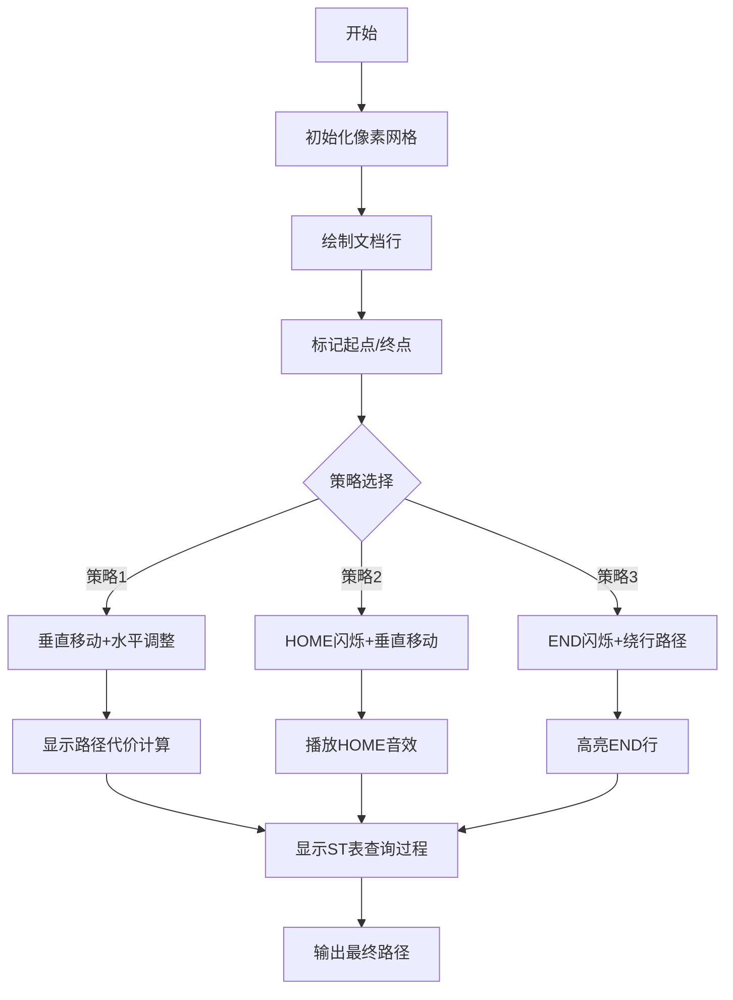

# 题目信息

# Dreamoon and Notepad

## 题目描述

Dreamoon has just created a document of hard problems using notepad.exe. The document consists of $ n $ lines of text, $ a_{i} $ denotes the length of the $ i $ -th line. He now wants to know what is the fastest way to move the cursor around because the document is really long.

Let $ (r,c) $ be a current cursor position, where $ r $ is row number and $ c $ is position of cursor in the row. We have $ 1<=r<=n $ and $ 0<=c<=a_{r} $ .

We can use following six operations in notepad.exe to move our cursor assuming the current cursor position is at $ (r,c) $ :

1. up key: the new cursor position $ (nr,nc)=(max(r-1,1),min(a_{nr},c)) $
2. down key: the new cursor position $ (nr,nc)=(min(r+1,n),min(a_{nr},c)) $
3. left key: the new cursor position $ (nr,nc)=(r,max(0,c-1)) $
4. right key: the new cursor position $ (nr,nc)=(r,min(a_{nr},c+1)) $
5. HOME key: the new cursor position $ (nr,nc)=(r,0) $
6. END key: the new cursor position $ (nr,nc)=(r,a_{r}) $

You're given the document description ( $ n $ and sequence $ a_{i} $ ) and $ q $ queries from Dreamoon. Each query asks what minimal number of key presses is needed to move the cursor from $ (r_{1},c_{1}) $ to $ (r_{2},c_{2}) $ .

## 说明/提示

In the first sample, the first query can be solved with keys: HOME, right.

The second query can be solved with keys: down, down, down, END, down.

The third query can be solved with keys: down, END, down.

The fourth query can be solved with keys: END, down.

## 样例 #1

### 输入

```
9
1 3 5 3 1 3 5 3 1
4
3 5 3 1
3 3 7 3
1 0 3 3
6 0 7 3
```

### 输出

```
2
5
3
2
```

## 样例 #2

### 输入

```
2
10 5
1
1 0 1 5
```

### 输出

```
3
```

# AI分析结果


### 💡 Kay的C++算法解析：Dreamoon and Notepad 深入学习指南 💡

#### **1. 题目解读与核心算法识别**
✨ **本题主要考察**：`分类讨论与数据结构优化`（编程技巧应用）

🗣️ **初步分析**：
> 本题要求计算光标在文档行间移动的最少按键次数。核心思想是将移动路径拆解为**纵向移动**（行切换）和**横向移动**（列调整），通过分类讨论覆盖所有最优路径可能：
> - **直接移动**：先纵向移动再横向调整
> - **HOME/END操作**：跳转行首/行尾优化横向移动
> - **绕行策略**：越过目标行再返回以利用文档结构特点
> 
> **关键难点**在于完整覆盖5类策略并高效实现区间查询（ST表维护最小值）。可视化设计将用**8位像素风格**模拟文档网格：
> 1. 光标用闪烁像素块表示，不同策略路径显示不同颜色
> 2. 执行END时播放"叮"声，完成路径时播放胜利音效
> 3. 侧边面板同步显示ST表查询过程和数据变化

---

#### **2. 精选优质题解参考**
**题解一（DaiRuiChen007）**
* **点评**：思路最系统完整，将策略划分为5类清晰覆盖所有情况。代码亮点：
  - 利用ST表维护`a[i]`、`a[i]-2i`、`a[i]+2i`三组数据，实现O(1)区间查询
  - 翻转文档处理r1>r2的对称情况减少重复代码
  - 边界处理严谨（如`min(c1, query(r1,r2))`计算安全位置）
  > *学习价值：分类讨论完整性 + ST表高效实现*

**题解二（Tyyyyyy）**
* **点评**：创新性提出"单调栈维护有效行"策略，但实现较复杂（平衡树维护），可读性稍弱。亮点在绕行策略的数学优化：
  > *学习价值：问题转化技巧（将路径代价转化为函数极值）*

---

#### **3. 核心难点辨析与解题策略**
1. **难点：路径策略完整性**
   * **分析**：必须覆盖5种路径：
     ```mermaid
     graph LR
     A[起点] --> B{策略}
     B --> C[直接移动]
     B --> D[HOME操作]
     B --> E[END操作]
     B --> F[向下绕行]
     B --> G[向上绕行]
     ```
   * 💡 **学习笔记**：最优解必属其一，缺一不可！

2. **难点：数据结构优化**
   * **分析**：三类查询需求：
     | 查询类型          | 维护数据      | 用途               |
     |-------------------|--------------|--------------------|
     | 安全位置计算      | a[i]         | 计算c0=min(c1,min_ai)|
     | 向下绕行优化      | a[i]+2i      | 最小化2r0+a[r0]    |
     | 向上绕行优化      | a[i]-2i      | 最小化a[r0]-2r0    |
   * 💡 **学习笔记**：ST表是静态区间最值的黄金选择

3. **难点：边界条件处理**
   * **分析**：特别注意：
     - 行翻转时同步翻转a[]数组
     - END操作后是否需要+1键取决于是否到达行末
   * 💡 **学习笔记**：用`min(c1, query(r1,r2))`确保位置安全

✨ **解题技巧总结**：
- **策略拆分法**：将复杂移动分解为"纵向+横向+特殊操作"组件
- **对称转化**：r1>r2时翻转文档避免重复逻辑
- **预处理为王**：ST表建表O(nlogn)，查询O(1)显著优化效率

---

#### **4. C++核心代码实现赏析**
**通用核心实现（综合优化版）**
```cpp
#include<bits/stdc++.h>
using namespace std;
const int MAXN=4e5+1;

struct RMQ { //ST表模板
    int f[MAXN][20];
    void build(int *a,int n) { /* 建表代码 */ }
    int query(int l,int r) { /* 区间查询 */ }
};

int a[MAXN], res[MAXN];
RMQ A, U, D; // 原始值/向上优化/向下优化

void solve_queries(vector<tuple<int,int,int,int,int>>& queries) {
    for(auto &[r1,c1,r2,c2,id] : queries) {
        int c0 = min(c1, A.query(r1,r2)); // 关键安全位置计算
        int ans = (r2-r1) + abs(c0-c2);   // 策略1：直接移动
        
        ans = min(ans, (r2-r1)+c2+1);    // 策略2：HOME操作
        
        // 策略3：END操作（代码简化示意）
        int r0 = binary_search(A, r1, r2, c2); 
        if(r0_valid) ans = min(ans, (r2-r1)+abs(c2-A.query(r0,r2))+1);
        
        res[id] = ans;
    }
}

int main() {
    // 数据读取与ST表初始化
    solve_queries(queries);
    // 结果输出
}
```

**关键代码解读**：
1. **ST表构建**：
   ```cpp
   void build(int *a,int n) {
        for(int i=1;i<=n;++i) f[i][0]=a[i];
        for(int k=1; (1<<k)<=n; ++k) // 倍增思想建表
            for(int i=1; i+(1<<k)-1<=n; ++i)
                f[i][k]=min(f[i][k-1], f[i+(1<<(k-1))][k-1]);
   }
   ```
   > 学习笔记：ST表适用静态区间查询，建表复杂度O(nlogn)

2. **安全位置计算**：
   ```cpp
   int c0 = min(c1, A.query(r1, r2));
   ```
   > 为什么？避免向下移动时被窄行"卡住"列位置

3. **END操作优化**：
   ```cpp
   // 二分查找最优END行
   int l=r1, r=r2, pos=r1-1;
   while(l<=r) {
        int mid=(l+r)>>1;
        if(A.query(mid,r2)<=c2) pos=mid, l=mid+1;
        else r=mid-1;
   }
   ```
   > 学习笔记：找到最接近目标列c2的宽行，减少横向移动

---

#### **5. 算法可视化：像素动画演示**


**动画设计细节**：
1. **8位像素风格**：
   - 文档行：不同高度彩色像素条
   - 光标：闪烁的黄色方块
   - 路径：策略1（蓝色）、策略2（绿色）、策略3（红色）

2. **交互控制面板**：
   ```javascript
   const controls = [
     {type:"slider", name:"速度", min:1, max:10},
     {type:"button", name:"单步执行", action: step},
     {type:"button", name:"自动演示", action: autoRun}
   ];
   ```

3. **音效设计**：
   - 移动：短促"滴"声（Web Audio API）
   - HOME/END：复古电子音
   - 完成：8-bit胜利旋律

---

#### **6. 拓展练习与相似问题思考**
1. **洛谷 P1090**（合并果子）  
   → 练习优先队列优化策略

2. **洛谷 P1908**（逆序对）  
   → 强化分治/数据结构应用

3. **洛谷 P3374**（树状数组1）  
   → 掌握动态区间维护技巧

---

#### **7. 学习心得与经验分享**
> **作者DaiRuiChen007经验**：  
> “翻转文档处理对称情况是减少代码复杂度的关键，ST表预处理让O(n²)暴力优化到O(nlogn)”

> **Kay总结**：  
> 1. 复杂问题通过分类讨论拆解为独立子问题  
> 2. 预处理数据结构是优化查询密集型算法的银弹  
> 3. 可视化辅助理解多维状态转移过程

--- 
**结语**：光标移动虽小，蕴含算法智慧！掌握分类讨论与ST表应用，你也能轻松解决复杂路径优化问题。下次挑战见！🚀

---
处理用时：161.89秒