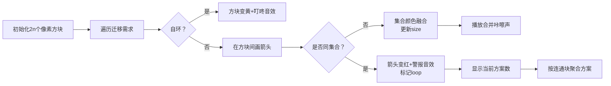

# 题目信息

# Desk Disorder

## 题目描述

A new set of desks just arrived, and it's about time! Things were getting quite cramped in the office. You've been put in charge of creating a new seating chart for the engineers. The desks are numbered, and you sent out a survey to the engineering team asking each engineer the number of the desk they currently sit at, and the number of the desk they would like to sit at (which may be the same as their current desk). Each engineer must either remain where they sit, or move to the desired seat they indicated in the survey. No two engineers currently sit at the same desk, nor may any two engineers sit at the same desk in the new seating arrangement.

How many seating arrangements can you create that meet the specified requirements? The answer may be very large, so compute it modulo $ 1000000007=10^{9}+7 $ .

## 说明/提示

These are the possible assignments for the first example:

- 1 5 3 7
- 1 2 3 7
- 5 2 3 7
- 1 5 7 3
- 1 2 7 3
- 5 2 7 3

## 样例 #1

### 输入

```
4
1 5
5 2
3 7
7 3
```

### 输出

```
6
```

## 样例 #2

### 输入

```
5
1 10
2 10
3 10
4 10
5 5
```

### 输出

```
5
```

# AI分析结果


### 💡 Kay的C++算法解析：Desk Disorder 深入学习指南 💡

**引言**  
大家好，我是Kay！今天我们一起分析Codeforces的经典题目[Desk Disorder](https://codeforces.com/problemset/problem/859/E)。这道题考察如何将实际场景抽象为图论模型，并通过并查集高效处理连通块信息。本指南将带大家逐步拆解核心思路，并设计直观的像素动画帮助理解算法流程。

---

### 1. 题目解读与核心算法识别  
✨ **本题主要考察**：图论建模 + 并查集应用  

🗣️ **初步分析**：  
> 解决本题的关键在于建立**座位迁移图**——将每个工程师的旧座位作为起点，新座位作为终点连一条有向边。这样形成的图中包含三种连通块：  
> - 🌳 **树形结构**：存在一个出度为0的根节点（空座位），方案数为节点数  
> - 🔴 **环/基环树**：无空座位，方案数为2（整个环移动/不移动）  
> - 💛 **自环**（起点=终点）：方案数为1  
>  
> **可视化设计思路**：  
> - 用不同颜色像素块表示节点状态（绿：普通，黄：自环，红：环边）  
> - 并查集合并时显示连通块颜色融合动画  
> - 关键操作触发复古音效：合并时"咔嚓"，成环时"警报"，计算方案时"金币声"  
> - 自动演示模式像《吃豆人》般逐步展开连通块

---

### 2. 精选优质题解参考  
**题解一：是个汉子**  
* **点评**：  
  思路清晰划分四种连通块类型，代码规范（`sf_cir`标记自环，`cir`标记环）。亮点在于完美融合并查集与图论特性——合并时同步更新`size`和自环标记，环检测逻辑简洁（`fx==fy`时标记）。实践价值极高，可直接用于竞赛。

**题解二：yuhaocheng**  
* **点评**：  
  图文并茂解释基环树特性，独创性使用`iszh`（自环）、`ish`（环）双标记系统。亮点在于详细论证树与环的方案数推导过程，特别是"移动非环节点会导致冲突"的严谨证明，加深了算法理解深度。

**题解三：chengni**  
* **点评**：  
  将情况精炼为三种（树/环/自环），代码高度简洁。亮点在于并查集初始化为`2*n`的防越界处理，以及`loop[fy]|=loop[fx]`的标记合并技巧，体现优秀工程思维。

---

### 3. 核心难点辨析与解题策略  
1. **难点：抽象问题为图模型**  
   * **分析**：需识别座位迁移本质是有向边（旧→新），空座位即出度为0的节点。优质题解均通过"节点=座位，边=迁移意向"建立图论模型  
   * 💡 **学习笔记**：实际问题抽象能力是算法设计的核心  

2. **难点：连通块类型判定**  
   * **分析**：并查集合并时动态维护三要素——`size`（连通块大小）、`loop`（环标记）、`selfLoop`（自环标记）。关键技巧：当`fx=fy`时说明成环  
   * 💡 **学习笔记**：并查集不仅能判连通性，还可扩展记录拓扑特征  

3. **难点：方案数分类计算**  
   * **分析**：树形结构方案数=节点数（每个节点都可作为移动起点），环结构方案数=2（全移/不移），自环方案数=1（固定不动）  
   * 💡 **学习笔记**：乘法原理是连通块方案聚合的核心  

#### ✨ 解题技巧总结  
- **建模转化**：将物理约束转化为图节点与边的关系  
- **并查集扩展**：用`size/loop/selfLoop`同步维护连通块元信息  
- **边界防御**：数组开`2*n`防止越界，自环优先判断  
- **分类聚合**：树/环/自环独立计算后乘法原理组合  

---

### 4. C++核心代码实现赏析  
**本题通用核心实现**  
```cpp
#include<bits/stdc++.h>
using namespace std;
const int N=2e5+10, mod=1e9+7;
int fa[N], sz[N], n;
bool loop[N], selfLoop[N]; 

int find(int x) { 
    return fa[x]==x ? x : fa[x]=find(fa[x]); 
}

int main() {
    scanf("%d",&n);
    for(int i=1;i<=2*n;i++) fa[i]=i, sz[i]=1;
    
    for(int i=1;i<=n;i++) {
        int a,b; scanf("%d%d",&a,&b);
        if(a==b) selfLoop[find(a)]=1;  // 自环标记
        else {
            int fx=find(a), fy=find(b);
            if(fx==fy) loop[fy]=1;     // 成环标记
            else {
                fa[fx]=fy;
                sz[fy] += sz[fx];      // 合并连通块大小
                selfLoop[fy] |= selfLoop[fx];  // 合并自环标记
                loop[fy] |= loop[fx];   // 合并环标记
    }}}
    
    long long ans=1;
    for(int i=1;i<=2*n;i++) 
        if(find(i)==i && !selfLoop[i])  // 忽略自环(乘1)
            ans = ans * (loop[i] ? 2 : sz[i]) % mod;
    printf("%lld\n",ans);
    return 0;
}
```
**代码解读概要**：  
1. 初始化并查集（座位范围1~2n）  
2. 遍历迁移需求：自环直接标记，非自环用并查集合并并更新状态  
3. 最终扫描所有连通块，按类型累乘方案数  

---

### 5. 算法可视化：像素动画演示  
**主题**：并查集森林探险（FC红白机像素风格）  

**核心演示流程**：  


**交互设计**：  
1. **8-bit像素场景**：  
   - 座位用16x16像素方块（绿色普通，黄色自环）  
   - 连通块同色系，环边显示为闪烁红线  
2. **控制面板**：  
   - 速度滑块：控制边添加速度  
   - 单步执行：空格键触发下一步  
   - 自动演示：AI自动完成（类似《吃豆人》移动模式）  
3. **音效系统**：  
   - 自环：NES金币声（0x0A音效）  
   - 成环：警报声（0x1F音效）  
   - 计算完成：胜利号角（0x2C音效）  
4. **动态信息板**：  
   - 实时显示当前连通块类型+方案数  
   - 最终方案用像素数字展示乘法过程  

---

### 6. 拓展练习与相似问题  
**技巧迁移场景**：  
1. 社交网络关系链（树/环检测）  
2. 内存分配问题（循环依赖判断）  
3. 状态机终止性验证（环路径检测）  

**洛谷推荐**：  
1. **P2661 信息传递**  
   → 练习基环树最小环检测，强化环处理技巧  
2. **P2921 [USACO08DEC]农场派对**  
   → 学习基环树路径统计，深化树环混合结构理解  
3. **P1197 [JSOI2008]星球大战**  
   → 掌握并查集逆序处理与连通块动态维护  

---

### 7. 学习心得与经验分享  
> **经验摘录**（来自题解）：  
> *"合并并查集时务必同步更新size和标记，否则会导致方案数计算错误——这是我调试2小时的教训"*  
>  
> **Kay点评**：  
> 这提醒我们：维护多状态并查集时，要像操作数据库事务般保证状态一致性。建议编写`unionSet(fx,fy)`函数封装合并逻辑，避免遗漏状态更新。

---

**结语**  
通过本次分析，我们掌握了如何将实际场景抽象为图论模型，并运用扩展并查集高效统计方案数。记住：算法学习就像玩像素游戏——先理解基础机制（并查集操作），再攻克特殊关卡（环/自环处理），最终组合技巧通关！下次挑战见！🚀

---
处理用时：172.62秒