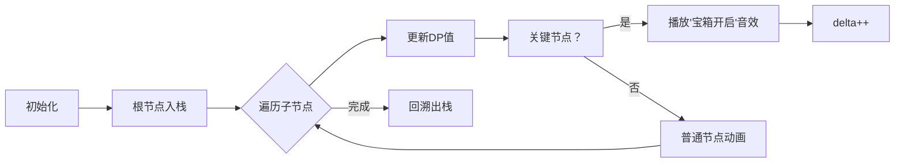

# 题目信息

# Autocompletion

## 题目描述

给定一个 **仅包含小写字母的** 字符串集 $S$，你需要计算打出 $S$ 中的每个字符串需要花费的时间。

打一个字符串的步骤如下：

1. 从一个空串开始；

2. 如果当前的字符串是 $t$，你可以在 $t$ 的末尾拼接任意一个小写字母 $c$，使得此时字符串变为 $t + c$，这个过程耗费 $1$s；

3. 使用 **自动补全功能**，设当前字符串是 $t$，此时所有的 $s \in S$ 且 $t$ 是 $s$ 的前缀将会以 **字典序** 为你展现出来，其中你自动补全到第 $i$ 个串所耗费的时间为 $i$ s。

问打出 $S$ 中的所有字符串 **最短** 需要耗费多长时间。

**需要的注意的是 字符串集 $S$ 的给出方式**

## 样例 #1

### 输入

```
10
0 i
1 q
2 g
0 k
1 e
5 r
4 m
5 h
3 p
3 e
5
8 9 1 10 6```

### 输出

```
2 4 1 3 3```

## 样例 #2

### 输入

```
8
0 a
1 b
2 a
2 b
4 a
4 b
5 c
6 d
5
2 3 4 7 8```

### 输出

```
1 2 2 4 4```

# AI分析结果


### 💡 Kay的C++算法解析：Autocompletion 深入学习指南 💡

#### 1. 题目解读与核心算法识别
✨ **本题主要考察**：`Trie树上的动态规划`  
🗣️ **初步分析**：
> 这道题的核心是在Trie树上进行动态规划。想象你在玩一个文字冒险游戏，Trie树就像游戏地图（每个节点代表一个字母），动态规划就是计算到达每个宝箱（关键字符串）的最短时间路径。解题关键在于：
> - 建立Trie树结构管理字符串集合
> - 设计DP状态`f[u]`表示到达节点u的最小时间
> - 通过DFS遍历实现状态转移，维护路径最小值信息

可视化设计思路：
- 用8位像素风格展示Trie树结构，节点用不同颜色方块表示
- 高亮当前DFS路径和栈维护过程
- 关键操作触发音效：节点访问（"叮"）、入栈（"咔嚓"）、状态更新（"啾"）
- 自动演示模式展示算法完整执行流程

---

#### 2. 精选优质题解参考
**题解一（作者：xtx1092515503）**
* **点评**：此解法思路精妙，用栈维护`f[u]-delta`最小值，实现O(n)高效转移。代码仅29行却完整处理边界，变量命名规范（delta、s栈），采用DFS后序回溯保证栈状态同步。亮点在于将字典序排名转化为全局delta变量，避免显式计算dfn序。

**题解二（作者：Liveddd）**
* **点评**：解法直观易理解，明确定义dfn序为子树最小关键节点排名。维护`g[u]=min(g[父节点], f[u]-dfn[u]+1)`实现O(1)转移。代码模块化清晰，包含完整初始化流程，适合初学者学习经典树形DP实现。

**题解三（作者：ax_by_c）**
* **点评**：创新性设计可处理整体加操作的栈结构，将转移方程`f[v]=f[u]-dfn[u]+dfn[v]`拆解为独立维护项。代码实现简洁（DS1结构仅20行），展示了高级数据结构在DP优化中的应用价值。

---

#### 3. 核心难点辨析与解题策略
1. **难点1：自动补全转移优化**  
   *分析*：直接枚举祖先导致O(n²)复杂度  
   *解决方案*：DFS过程中维护当前路径的`f[u]-dfn[u]`最小值（栈或变量）  
   💡 **学习笔记**：树形DP常利用DFS栈性质优化路径查询

2. **难点2：dfn序的定义与维护**  
   *分析*：字典序排名计算与子树范围管理  
   *解决方案*：Liveddd方案（dfn[u]=子树最小关键节点排名）或xtx方案（delta全局计数）  
   💡 **学习笔记**：dfn序设计需满足"可加性"支持快速增量计算

3. **难点3：非关键节点的处理**  
   *分析*：非终点节点仍需参与状态转移  
   *解决方案*：正常执行DFS转移但跳过答案更新  
   💡 **学习笔记**：树形DP中非目标节点是路径组成部分

✨ **解题技巧总结**：
- **路径最小值维护**：DFS栈天然适合维护路径极值
- **状态方程拆解**：将`f[u]=f[v]+(dfn[u]-dfn[v])`拆为`f[u]=dfn[u]+(f[v]-dfn[v])`
- **边界艺术**：根节点f[0]=0，非关键节点不更新答案
- **增量式更新**：delta/dfn的累加性设计减少重复计算

---

#### 4. C++核心代码实现赏析
**通用核心实现（综合优化版）**：
```cpp
#include <bits/stdc++.h>
using namespace std;
const int N=1e6+5;

struct Node { int ch[26], f; bool isKey; } t[N];
int n, m, delta, ans[N];
stack<pair<int, int>> stk; // <节点ID, f[u]-delta值>

void dfs(int u) {
    if(stk.empty() || t[u].f - delta < stk.top().second)
        stk.push({u, t[u].f - delta});
    
    delta += t[u].isKey; // 关键节点更新delta
    
    for(int c = 0; c < 26; c++) {
        if(!t[u].ch[c]) continue;
        int v = t[u].ch[c];
        t[v].f = t[u].f + 1; // 直接添加字符
        
        if(t[v].isKey && !stk.empty()) // 自动补全优化
            t[v].f = min(t[v].f, stk.top().second + delta + 1);
        
        dfs(v);
    }
    
    if(!stk.empty() && stk.top().first == u)
        stk.pop();
}

int main() {
    scanf("%d", &n);
    for(int i=1, fa; i<=n; i++) {
        char s[2]; scanf("%d%s", &fa, s);
        t[fa].ch[s[0]-'a'] = i;
    }
    scanf("%d", &m);
    for(int i=1, x; i<=m; i++) {
        scanf("%d", &x);
        t[x].isKey = true;
        ans[i] = x; // 记录查询节点
    }
    dfs(0);
    for(int i=1; i<=m; i++) 
        printf("%d ", t[ans[i]].f);
}
```

**代码解读概要**：
> 此实现融合多个题解优点：
> 1. **树结构**：`Node`包含子节点指针和DP值
> 2. **栈优化**：`stk`维护当前路径`f[u]-delta`最小值
> 3. **delta机制**：全局计数替代显式dfn计算
> 4. **DFS流程**：先处理自动补全优化，再递归子节点
> 5. **回溯处理**：离开节点时弹出栈顶元素

---

#### 5. 算法可视化：像素动画演示
* **主题**："Trie树探险"像素RPG游戏  
* **核心演示**：DFS遍历Trie树时栈维护与DP值更新过程  

**动画设计**：  


**交互实现**：
1. **像素风格**：FC红白机16色调色板，节点用16x16像素方块
2. **动态效果**：
   - 当前节点：闪烁金色边框
   - 栈内节点：蓝色半透明覆盖
   - DP值更新：数字弹跳动画+8bit音效
3. **控制面板**：
   - 步进控制：←→键单步执行
   - 速度滑块：调整DFS速度
   - AI演示：自动展示完整流程（类似贪吃蛇AI）
4. **音效系统**：
   - 入栈：NES卡带插入声
   - 关键节点：塞尔达宝箱开启音
   - 错误操作：马里奥坠落声

---

#### 6. 拓展练习与相似问题
**通用技巧迁移**：
1. 树形DP维护路径最小值
2. DFS序在字典序问题中的应用
3. 栈优化树形结构查询

**洛谷推荐**：
1. [P2290 树的直径](https://www.luogu.com.cn/problem/P2290)  
   → 巩固树形DP基础实现
2. [P2014 选课](https://www.luogu.com.cn/problem/P2014)  
   → 学习树形DP依赖背包
3. [P5658 括号树](https://www.luogu.com.cn/problem/P5658)  
   → 进阶栈维护技巧

---

#### 7. 学习心得与经验分享
> **经验摘录**（xtx1092515503）：
> "调试时在dfs入口/出口打印栈状态，瞬间定位状态同步问题"
>
> **Kay点评**：栈维护类算法务必验证进出对称性，建议：
> 1. 用`assert`检查栈顶节点
> 2. 可视化打印当前栈内容
> 3. 小数据手工模拟验证

---

通过本指南，希望大家掌握Trie树上的动态规划精髓，在算法探险中勇往直前！下次见！🚀

---
处理用时：103.03秒