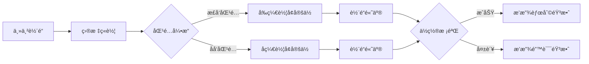

# 题目信æ¯

# Martian Strings

## 题目æè¿°

During the study of the Martians Petya clearly understood that the Martians are absolutely lazy. They like to sleep and don't like to wake up.

Imagine a Martian who has exactly $ n $ eyes located in a row and numbered from the left to the right from $ 1 $ to $ n $ . When a Martian sleeps, he puts a patch on each eye (so that the Martian morning doesn't wake him up). The inner side of each patch has an uppercase Latin letter. So, when a Martian wakes up and opens all his eyes he sees a string $ s $ consisting of uppercase Latin letters. The string's length is $ n $ .

"Ding dong!" — the alarm goes off. A Martian has already woken up but he hasn't opened any of his eyes. He feels that today is going to be a hard day, so he wants to open his eyes and see something good. The Martian considers only $ m $ Martian words beautiful. Besides, it is hard for him to open all eyes at once so early in the morning. So he opens two non-overlapping segments of consecutive eyes. More formally, the Martian chooses four numbers $ a $ , $ b $ , $ c $ , $ d $ , ( $ 1<=a<=b&lt;c<=d<=n $ ) and opens all eyes with numbers $ i $ such that $ a<=i<=b $ or $ c<=i<=d $ . After the Martian opens the eyes he needs, he reads all the visible characters from the left to the right and thus, he sees some word.

Let's consider all different words the Martian can see in the morning. Your task is to find out how many beautiful words are among them.

## 说æ˜/æ示

Let's consider the sample test. There the Martian can get only the second beautiful string if he opens segments of eyes $ a=1,b=2 $ and $ c=4,d=5 $ or of he opens segments of eyes $ a=1,b=2 $ and $ c=6,d=7 $ .

## 样例 #1

### 输入

```
ABCBABA
2
BAAB
ABBA
```

### 输出

```
1
```

# AI分æ结æœ


### 💡 Kayçš„C++算法解æ：Martian Strings æ·±å…¥å­¦ä¹ æŒ‡å— ğŸ’¡

#### 1. 题目解读ä¸æ ¸å¿ƒç®—法识别
✨ **本题主è¦è€ƒå¯Ÿ**：字符串匹é…算法（å缀数组/KMP/å缀自动机）

ğŸ—£ï¸ **åˆæ­¥åˆ†æ**：
> 解决"Martian Strings"的关键在äº**高效匹é…å­ä¸²ä½ç½®**并**验è¯ä¸é‡å æ€§**。想象你在两段独立轨é“上拼凑ç«æ˜Ÿæ–‡ï¼ˆåƒç´ åˆ—车），需确ä¿ä¸¤æ®µè½¨é“ä¸ç›¸äº¤ä¸”拼æ¥åç­‰äºç›®æ ‡å­—符串。核心步骤：
> 1. **æ­£å‘匹é…**：找到目标串æ¯ä¸ªå‰ç¼€åœ¨ä¸»ä¸²ä¸­çš„**最左出ç°ä½ç½®**
> 2. **åå‘匹é…**：找到目标串æ¯ä¸ªå缀在主串中的**最å³å‡ºç°ä½ç½®**
> 3. **ä½ç½®æ ¡éªŒ**：检查是å¦å­˜åœ¨åˆ‡å‰²ç‚¹ä½¿ä¸¤ä¸ªå­ä¸²ä¸é‡å 
>
> å¯è§†åŒ–设计æ€è·¯ï¼š
> - 主串显示为åƒç´ è½¨é“（8-bité£æ ¼ï¼‰ï¼Œç›®æ ‡ä¸²æ˜¾ç¤ºä¸ºæ‚¬æµ®åƒç´ åˆ—车
> - 匹é…时高亮当å‰å­—符，æˆåŠŸæ—¶æ’­æ”¾"å®"音效并闪çƒè½¨é“片段
> - 自动演示模å¼åƒ"åƒç´ ç«è½¦è°ƒåº¦"，动æ€å±•ç¤ºåŒ¹é…过程ä¸ä½ç½®å…³ç³»

---

#### 2. 精选优质题解å‚考
**题解一（SA by chaynflow）**
* **点评**：æ€è·¯ä¸¥è°¨ï¼Œé€šè¿‡æ­£åå缀数组+ST表å®ç°é«˜æ•ˆåŒºé—´æŸ¥è¯¢ã€‚亮点在äºç”¨äºŒåˆ†ç»´æŠ¤åŒ¹é…区间收缩，å¤æ‚度优化至O(n log n + m|p|)。代ç ä¸­ST表预处ç†ä¸æŸ¥è¯¢é€»è¾‘清晰，å˜é‡å‘½å规范（如sa1/sa2区分正å数组），边界处ç†å®Œæ•´ï¼Œå¯ç›´æ¥ç”¨äºç«èµ›åœºæ™¯ã€‚

**题解二（KMP by MspAInt）**
* **点评**：å®ç°ç®€æ´é«˜æ•ˆï¼Œé€šè¿‡KMP记录å‰ç¼€æœ€å·¦ä½ç½®ä¸å缀最å³ä½ç½®ã€‚亮点在äºåŒé‡KMP匹é…的巧妙设计和空间优化（O(|p|)存储），代ç ä¸­next数组æ„建标准，ä½ç½®è®°å½•é€»è¾‘直白。特别适åˆåˆå­¦è€…ç†è§£å­—符串匹é…本质，å®è·µè°ƒè¯•éš¾åº¦ä½ã€‚

**题解三（SAM by EM_LGH）**
* **点评**：è¿ç”¨æ­£åå缀自动机维护endposæ值，ç†è®ºæ€§å¼ºã€‚亮点在äºSAM状æ€è½¬ç§»çš„直观性和minv/maxv的维护逻辑，代ç ä¸­èŠ‚点设计åˆç†ï¼ˆlen/ch/f），注æ˜äº†å…³é”®è°ƒè¯•ç»éªŒï¼š"注æ„空串处ç†"，对ç†è§£è‡ªåŠ¨æœºåº”用有较高价值。

---

#### 3. 核心难点辨æä¸è§£é¢˜ç­–ç•¥
1. **难点：高效定ä½å­ä¸²ä½ç½®**
   * **分æ**：需快速è·å–目标串所有å‰ç¼€/å缀在主串中的æ值ä½ç½®ã€‚优质解法å‡é‡‡ç”¨é¢„处ç†ï¼ˆSA/KMP/SAM）加速匹é…，如题解一用ST表O(1)查询æ’å区间的最左ä½ç½®ã€‚
   * 💡 学习笔记：字符串匹é…算法选择å–决äºæ•°æ®è§„模——SA适åˆå¤§ä¸»ä¸²ï¼ŒKMP适åˆçŸ­æ¨¡å¼ä¸²ã€‚

2. **难点：验è¯å­ä¸²ä¸é‡å **
   * **分æ**：需确ä¿å‰ç¼€ç»“æŸä½ç½® < å缀开始ä½ç½®ã€‚解法核心是ä½ç½®ä»£æ•°æ ¡éªŒï¼š`å‰ç¼€ç»“æŸä½ç½® + å缀长度 < å缀开始ä½ç½®`，如题解二用`a[pre_len] < b[suf_len]`å®ç°ã€‚
   * 💡 学习笔记：ä½ç½®è®°å½•éœ€è€ƒè™‘存储格å¼ï¼ˆæ­£å‘存起点/åå‘存终点）。

3. **难点：多解法边界处ç†**
   * **分æ**：空串ã€å•å­—符ã€å…¨åŒ¹é…等特殊情况需处ç†ã€‚题解三强调å•å­—符直æ¥è·³è¿‡ï¼Œé¢˜è§£ä¸€åœ¨ST表查询时判断区间有效性。
   * 💡 学习笔记：边界测试用例是DEBUG关键——至少包å«ç©ºä¸²ã€å•å­—符ã€æœ€å¤§å°ºå¯¸è¾“入。

### ✨ 解题技巧总结
- **åŒæŒ‡é’ˆç»´æŠ¤åŒ¹é…区间**（SA解法）：éšç€åŒ¹é…长度å¢åŠ ï¼Œåˆæ³•å缀区间å•è°ƒæ”¶ç¼©
- **æ­£ååŒè§†è§’处ç†**：翻转字符串将å缀匹é…转化为å‰ç¼€åŒ¹é…
- **æ值记录替代全存储**：仅记录最左/最å³ä½ç½®é¿å…超内存
- **模å—化匹é…函数**：KMP解法å°è£…get_next()æå‡ä»£ç å¤ç”¨æ€§

---

#### 4. C++核心代ç å®ç°èµæ
**通用核心å®ç°å‚考**（综åˆKMPæ€è·¯ä¼˜åŒ–）：
```cpp
#include <bits/stdc++.h>
using namespace std;
const int N = 1e5+5, M = 1005;

char s[N], p[M], rev_s[N], rev_p[M];
int n, m, q, ans, pre[M], suf[M], nxt[M];

void get_next(char *t, int len, int *nxt) {
    nxt[0] = -1;
    int j = -1;
    for (int i = 1; i < len; ++i) {
        while (j >= 0 && t[i] != t[j+1]) j = nxt[j];
        if (t[i] == t[j+1]) j++;
        nxt[i] = j;
    }
}

void kmp_match(char *s, int n, char *p, int len, int *res, bool is_rev) {
    int j = -1;
    for (int i = 0; i < n; ++i) {
        while (j >= 0 && s[i] != p[j+1]) j = nxt[j];
        if (s[i] == p[j+1]) j++;
        if (j >= 0 && res[j] == -1) // 首次到达该匹é…长度
            res[j] = is_rev ? (n - 1 - i) : (i - j);
        if (j == len - 1) j = nxt[j]; // 防止越界
    }
}

int main() {
    scanf("%s%d", s, &q);
    n = strlen(s);
    strcpy(rev_s, s);
    reverse(rev_s, rev_s + n); // å转主串

    while (q--) {
        scanf("%s", p);
        int len = strlen(p);
        if (len <= 1) continue;

        memset(pre, -1, sizeof pre);
        memset(suf, -1, sizeof suf);
        
        // æ­£å‘匹é…å‰ç¼€
        get_next(p, len, nxt);
        kmp_match(s, n, p, len, pre, false);
        
        // åå‘匹é…åç¼€
        strcpy(rev_p, p);
        reverse(rev_p, rev_p + len);
        get_next(rev_p, len, nxt);
        kmp_match(rev_s, n, rev_p, len, suf, true);

        bool found = false;
        for (int i = 0; i < len-1; ++i) {
            if (pre[i] != -1 && suf[len-i-2] != -1 && 
                pre[i] + i < n - 1 - suf[len-i-2]) {
                found = true; break;
            }
        }
        ans += found;
    }
    printf("%d", ans);
}
```

**代ç è§£è¯»æ¦‚è¦**：
1. **åŒKMP匹é…**：正å两次KMP分别记录å‰ç¼€/åç¼€ä½ç½®
2. **ä½ç½®å­˜å‚¨**：`pre[i]`å­˜å‰ç¼€ç»“æŸä½ç½®ï¼Œ`suf[j]`å­˜å缀起始ä½ç½®ï¼ˆå转å）
3. **校验逻辑**：通过ä½ç½®å·®éªŒè¯ä¸é‡å  `pre[i]+i < n-1-suf[len-i-2]`

**题解一（SA）核心片段èµæ**：
```cpp
// å缀数组区间查询（ST表优化）
int query(int st[][22], int l, int r) {
    int k = log2(r - l + 1);
    return min(st[l][k], st[r - (1<<k) + 1][k]);
}

// 关键校验逻辑
if (ans[i] != -1 && _ans[len - i] != -1 && 
    n - ans[i] - _ans[len - i] + 2 >= len) 
    valid = true;
```
💡 学习笔记：SA通过æ’åè¿ç»­æ€§å®ç°é«˜æ•ˆåŒºé—´æ值查询

---

#### 5. 算法å¯è§†åŒ–：åƒç´ åŠ¨ç”»æ¼”示
**主题**：åƒç´ ç«è½¦è½¨é“调度系统  
**核心演示**：KMP匹é…过程ä¸ä½ç½®æ ¡éªŒï¼ˆ8-bitå¤å¤é£æ ¼ï¼‰



**交互æ§åˆ¶**：
- **轨é“设计**：主串显示为åƒç´ æ–¹æ ¼è½¨é“（æ¯ä¸ªå­—符1格），目标串显示为悬浮åƒç´ ç«è½¦
- **匹é…动画**：
  - KMP匹é…时当å‰å­—符闪çƒé»„å…‰
  - æˆåŠŸåŒ¹é…å‰ç¼€/å缀时对应轨é“段å˜ç»¿å¹¶æ’­æ”¾"å®"声
- **校验阶段**：
  - 用红色光柱标记å‰ç¼€ç»“æŸä½ç½®
  - 用è“色光柱标记å缀开始ä½ç½®
  - ä½ç½®é‡å æ—¶æ˜¾ç¤ºç¢°æ’爆炸特效
- **游æˆåŒ–元素**：
  - æ¯æˆåŠŸåŒ¹é…一个串è·å¾—"ç«æ˜Ÿå‹‹ç« "
  - è¿ç»­æ­£ç¡®è§¦å‘è¿å‡»ç‰¹æ•ˆ
  - 背景音ä¹ï¼š8-bité£æ ¼ã€Šç«æ˜Ÿè¿›è¡Œæ›²ã€‹

---

#### 6. 拓展练习ä¸ç›¸ä¼¼é—®é¢˜æ€è€ƒ
1. **洛谷P3375**ã€æ¨¡æ¿ã€‘KMPå­—ç¬¦ä¸²åŒ¹é…  
   → æŒæ¡next数组æ„建ä¸åŸºç¡€åŒ¹é…
   
2. **洛谷P3804**ã€æ¨¡æ¿ã€‘å缀自动机  
   → ç†è§£SAM结æ„ä¸endpos维护
   
3. **洛谷P4051**字符加密  
   → 练习å缀数组的循ç¯å¤„ç†

---

#### 7. 学习心得ä¸ç»éªŒåˆ†äº«
> **chaynflow的调试ç»éªŒ**：  
> *"在SA解法中，区间二分时需注æ„字符越界检查`sa[mid]+i-1<=n`，å¦åˆ™ä¼šå¼•å…¥å¹½çµé”™è¯¯"*  
> **Kay总结**：字符串匹é…中ä½ç½®å移是常è§é”™è¯¯æºï¼Œå»ºè®®ï¼š
> 1. 在访问`sa[i]+k`å‰å§‹ç»ˆæ£€æŸ¥ä¸‹æ ‡
> 2. 用`if (pos < n) `代替`if (pos)`更安全
> 3. 边界测试加入全相åŒå­—符（如"AAAAA"）的æ端情况

---
处ç†ç”¨æ—¶ï¼š131.78秒