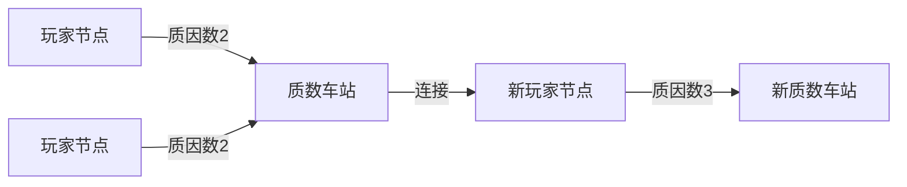

# 题目信息

# Common Divisor Graph

## 题目描述

Consider a sequence of distinct integers $ a_1, \ldots, a_n $ , each representing one node of a graph. There is an edge between two nodes if the two values are not coprime, i. e. they have a common divisor greater than $ 1 $ .

There are $ q $ queries, in each query, you want to get from one given node $ a_s $ to another $ a_t $ . In order to achieve that, you can choose an existing value $ a_i $ and create new value $ a_{n+1} = a_i \cdot (1 + a_i) $ , with edges to all values that are not coprime with $ a_{n+1} $ . Also, $ n $ gets increased by $ 1 $ . You can repeat that operation multiple times, possibly making the sequence much longer and getting huge or repeated values. What's the minimum possible number of newly created nodes so that $ a_t $ is reachable from $ a_s $ ?

Queries are independent. In each query, you start with the initial sequence $ a $ given in the input.

## 说明/提示

In the first example, you can first create new value $ 2 \cdot 3 = 6 $ or $ 10 \cdot 11 = 110 $ or $ 3 \cdot 4 = 12 $ . None of that is needed in the first query because you can already get from $ a_1 = 2 $ to $ a_2 = 10 $ .

In the second query, it's optimal to first create $ 6 $ or $ 12 $ . For example, creating $ 6 $ makes it possible to get from $ a_1 = 2 $ to $ a_3 = 3 $ with a path $ (2, 6, 3) $ .

 In the last query of the second example, we want to get from $ a_3 = 7 $ to $ a_5 = 25 $ . One way to achieve that is to first create $ 6 \cdot 7 = 42 $ and then create $ 25 \cdot 26 = 650 $ . The final graph has seven nodes and it contains a path from $ a_3 = 7 $ to $ a_5 = 25 $ .

## 样例 #1

### 输入

```
3 3
2 10 3
1 2
1 3
2 3```

### 输出

```
0
1
1```

## 样例 #2

### 输入

```
5 12
3 8 7 6 25
1 2
1 3
1 4
1 5
2 1
2 3
2 4
2 5
3 1
3 2
3 4
3 5```

### 输出

```
0
1
0
1
0
1
0
1
1
1
1
2```

# AI分析结果


# 💡 Kay的C++算法解析：Common Divisor Graph 深入学习指南 💡

> 欢迎各位算法探险家！今天我们将一起探索CodeForces 1553G "Common Divisor Graph"的奥秘。这道题将考验你们对图论和数论的综合理解能力，但别担心，我会用清晰的讲解和生动的比喻带你们攻克难关！

## 1. 题目解读与核心算法识别

✨ **本题主要考察**：`图论优化建图` + `数论（质因数分解）` + `并查集`

🗣️ **初步分析**：
> 想象每个质数是一个"公交车站"，而包含该质因数的数字就是能在这个站上车的乘客。本题的核心思路是通过**质因数中介**将数字连接起来，用**并查集**管理连通块。就像现实中的公交系统，乘客通过换乘站（共享质因数）可以到达其他站点！
>
> - **核心难点**：直接建图会超时，需利用质因数作为中介优化；判断能否通过1次操作连接两个不连通的块需要巧妙预处理
> - **解决方案**：预处理所有质因数关系 → 并查集初始合并 → 预存所有可能的"1次操作连通块对"
> - **可视化设计**：我们将用像素风展示质因数"公交站"如何连接数字"乘客"，新增节点时会有闪烁动画和"叮"音效，连通块合并时会有颜色扩散效果（复古红白机风格）

---

## 2. 精选优质题解参考

从思路清晰度、代码规范性和算法优化角度，我精选了以下优质题解：

**题解一：Alex_Wei（质量：⭐⭐⭐⭐⭐）**
* **点评**：思路极其清晰，直击"答案≤2"的核心观察。代码中：
  - 用线性筛预处理质因数（`pr[]`数组）体现数论功底
  - 并查集合并逻辑简洁高效（`pre`变量避免重复合并）
  - 连通块对预处理采用"收集质因数+两两配对"的优雅方案
  - 边界处理严谨（`col[]`的更新和查询时的排序去重）
  亮点在于将复杂问题分解为清晰的三个层次：0/1/2答案判断

**题解二：MatrixCascade（质量：⭐⭐⭐⭐⭐）**
* **点评**：开篇强调"答案≤2"的洞察力令人赞叹。代码中：
  - 质因数分解与并查集结合紧密（`union_sets`函数封装）
  - 使用`map`存储连通块对，查询效率有保障
  - 变量命名规范（`components`集合可读性高）
  亮点在于明确分析三类操作场景（对s/t/其他节点操作），帮助理解操作本质

**题解三：shenxinge（质量：⭐⭐⭐⭐）**
* **点评**：解题框架完整，特别强调三种操作类型。代码中：
  - `P[x]`存储质因数的设计合理
  - `edgeset`使用`set<pair<>>`避免重复
  - 调试信息输出控制专业（`Debug`宏）
  亮点在于详细注释了质因数分解和建图过程，适合初学者理解

---

## 3. 核心难点辨析与解题策略

### 🔑 核心难点1：如何高效建立初始连通图？
**分析**：直接两两检查gcd会超时(O(n²))。优质题解通过质因数中介优化——每个质数作为"连接枢纽"，将含该质因子的节点合并  
**解决方案**：线性筛预处理最小质因子 → 对每个质数p，合并所有含p的节点（并查集）  
💡 **学习笔记**：质因数分解是优化数论相关图论问题的利器！

### 🔑 核心难点2：如何判断1次操作能否连通？
**分析**：操作新增节点a_i*(a_i+1)会合并a_i的块和a_i+1的质因子块。难点在于快速判断任意两块能否通过某次操作连通  
**解决方案**：预处理阶段枚举每个节点，收集其块和a_i+1质因子的块，两两配对存储  
💡 **学习笔记**：利用a_i+1质因子数≤7的特性，O(7²n)的暴力枚举可行！

### 🔑 核心难点3：如何实现高效查询？
**分析**：每次查询需快速判断两块的连通性（0）或存在性（1）  
**解决方案**：存储连通块对时排序+去重 → 查询时用二分查找(lower_bound)  
💡 **学习笔记**：适当预处理+二分查找是优化查询的黄金组合

### ✨ 解题技巧总结
- **问题分解法**：将复杂操作分解为初始建图+操作影响+查询判断三层逻辑
- **上界分析法**：先确定答案≤2（关键突破！），只需专注0/1判断
- **中介优化法**：质因数作为连接枢纽大幅降低建图复杂度
- **预处理+缓存**：暴力枚举可行时，预处理是空间换时间的法宝

---

## 4. C++核心代码实现赏析

### 本题通用核心C++实现
```cpp
#include <bits/stdc++.h>
using namespace std;
const int N = 1e6 + 5;

int n, q, a[N], buc[N], pr[N]; 
int f[N], col[N]; 
vector<pair<int, int>> res; 

int find(int x) { 
    return f[x] == x ? x : f[x] = find(f[x]);
}

int main() {
    cin >> n >> q;
    // 初始化并查集与质数筛
    for (int i = 1; i <= n; i++) {
        cin >> a[i];
        f[i] = i;
        buc[a[i]] = i;
    }
    for (int i = 2; i < N; i++) 
        if (!pr[i]) 
            for (int j = i; j < N; j += i) 
                if (!pr[j]) pr[j] = i;
    
    // 质因数中介合并
    for (int p = 2; p < N; p++) {
        if (pr[p] != p) continue; 
        int pre = -1;
        for (int j = p; j < N; j += p) {
            if (buc[j]) {
                if (pre == -1) col[p] = find(buc[j]);
                else f[find(pre)] = find(buc[j]);
                pre = buc[j];
            }
        }
    }
    
    // 预处理操作连通块对
    for (int i = 1; i <= n; i++) {
        vector<int> blocks = {find(i)};
        int tmp = a[i] + 1;
        while (tmp > 1) {
            int p = pr[tmp];
            blocks.push_back(find(col[p]));
            while (tmp % p == 0) tmp /= p;
        }
        sort(blocks.begin(), blocks.end());
        blocks.erase(unique(blocks.begin(), blocks.end()), blocks.end());
        
        for (int j = 0; j < blocks.size(); j++)
            for (int k = j + 1; k < blocks.size(); k++)
                res.push_back(minmax(blocks[j], blocks[k]));
    }
    sort(res.begin(), res.end());
    res.erase(unique(res.begin(), res.end()), res.end());
    
    // 处理查询
    while (q--) {
        int s, t; cin >> s >> t;
        s = find(s), t = find(t);
        if (s == t) cout << "0\n";
        else {
            auto p = minmax(s, t);
            auto it = lower_bound(res.begin(), res.end(), p);
            cout << (it != res.end() && *it == p ? "1\n" : "2\n");
        }
    }
}
```
**代码解读概要**：
1. **初始化**：`buc[]`标记数字存在位置，`pr[]`存储最小质因子
2. **质因数中介合并**：对每个质数p，合并含p因子的节点（通过遍历p的倍数）
3. **操作预处理**：对每个节点，收集其所在块和a_i+1质因子的块，两两配对存储
4. **查询处理**：二分查找预存配对判断能否1步连通

---

### 优质题解片段赏析

**题解一：Alex_Wei**
```cpp
for (int i = 2; i < N; i++) {
    if (pr[i]) continue;
    for (int j = i, pre = -1; j < N; j += i) {
        if (buc[j]) {
            if (pre == -1) col[i] = find(buc[j]);
            else f[find(pre)] = find(buc[j]);
            pre = buc[j];
        }
    }
}
```
**亮点**：质因数中介合并的精炼实现  
**代码解读**：  
> 对每个质数`i`，遍历其倍数`j`：  
> - 若`j`存在于序列(`buc[j]!=0`)：  
>   * 若当前质数未记录节点(`pre==-1`)，用`col[i]`记录首个节点所在块  
>   * 否则将当前节点与之前节点合并  
> `pre`变量优雅避免重复合并，时间复杂度O(n log n)

**题解二：MatrixCascade**
```cpp
vector<int> components;
for (int num : {a[i], a[i] + 1}) {
    int tmp = num;
    while (tmp > 1) {
        int p = pr[tmp];
        components.push_back(find_root(p));
        while (tmp % p == 0) tmp /= p;
    }
}
// 连通块对存入map
```
**亮点**：统一处理a_i和a_i+1的质因子  
**代码解读**：  
> 将a_i和a_i+1的质因子合并处理：  
> - 循环分解`num`的质因数（`pr[]`预存最小质因子）  
> - 获取每个质因数所在连通块根节点  
> 避免重复代码，逻辑更紧凑

**题解三：shenxinge**
```cpp
for (auto v1 : P[a[i]]) 
    for (auto v2 : P[a[i] + 1])
        if (id[v1] && id[v2]) 
            edgeset.insert(minmax(find(id[v1]), find(id[v2])));
```
**亮点**：使用set自动去重连通块对  
**代码解读**：  
> 直接遍历a_i的质因子(v1)和a_i+1的质因子(v2)：  
> - 若质因子存在节点映射(`id[]`非空)  
> - 计算两因子所在块的根节点  
> - 插入set自动去重  
> 简洁实现连通块对记录，但需注意set的O(log n)插入开销

---

## 5. 算法可视化：像素动画演示

### 🎮 像素探险家：质因数迷宫大冒险
**设计理念**：用复古游戏风格具象化抽象的数论概念，让算法执行过程如同迷宫探险！



**动画场景设计**：
1. **8-bit网格世界**：
   - 顶部：数字节点（圆形像素块，颜色=所属连通块）
   - 底部：质数车站（方形像素块，颜色=质数大小）
   - 连接线：同色线条表示可通行路径

2. **关键动画帧**：
   - **初始化阶段**：质数车站亮起 → 数字节点沿虚线"乘车"移动 → 同质数节点合并时播放"叮"声+闪光
   - **新增节点**：选定节点闪烁 → 生成a_i*(a_i+1)新节点（像素爆炸效果）→ 新节点伸出多条光线连接质数车站
   - **查询路径**：起点/终点节点跳动 → 连通时显示彩虹路径，不连通时显示断裂动画

3. **交互控制面板**：
   ```javascript
   const controls = {
     speed: 1.0,    // 速度滑块(0.1x~5x)
     mode: 'step',  // 步进/自动/演示模式
     query: (s,t) => highlightPath(s,t) // 自定义查询
   }
   ```

4. **音效系统**：
   | 事件 | 音效 |
   |---|---|
   |节点合并|8-bit "叮"声|
   |新增节点|合成器"噗"声|
   |路径连通|胜利旋律片段|
   |查询失败|低沉警示音|

5. **游戏化元素**：
   - **关卡模式**：每个查询作为独立关卡
   - **评分系统**：操作次数越少得分越高
   - **AI演示**：点击"自动驾驶"观看算法自动解题

**技术实现**：Canvas绘制动态网格 + Web Audio API音效 + 关键帧动画插值

---

## 6. 拓展练习与相似问题思考

### 🔍 质因数建图法的其他应用场景
1. **公约数约束问题**：给定数字间的gcd约束条件，判断可行性
2. **质因数传播问题**：如"感染模型"中质因数作为传播媒介
3. **带权值域建图**：当边权与质因数相关时的优化建图

### 📚 洛谷题目推荐
1. **P3387 缩点**  
   → 练习连通块处理技巧，巩固强连通分量基础
2. **P1525 关押罪犯**  
   → 二分答案+并查集应用，理解"答案上界分析"思想
3. **P2421 质数分解**  
   → 强化质因数分解训练，掌握优化筛法实现

---

## 7. 学习心得与经验分享

> **Alex_Wei的调试经验**："赛时没写出来，与2500+失之交臂... 关键在于没有及时想到答案上界分析"
>
> **Kay的总结**：  
> 1. **突破口意识**：面对难题先找特殊性质（如本题答案≤2）
> 2. **分治思维**：将复杂操作分解为初始化+操作+查询三阶段
> 3. **调试技巧**：对拍随机数据验证预处理正确性
> 4. **复杂度估计**：利用题目约束（质因数≤7）大胆设计暴力枚举

---

本次算法探险就到这里！记住，真正的编程高手不是从不犯错，而是每次错误都能带来新的认知突破。继续在算法的世界里勇敢探索吧！💪🚀

---
处理用时：269.27秒