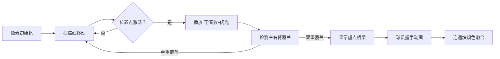

# 题目信息

# Nene and the Passing Game

## 题目描述

Nene is training her team as a basketball coach. Nene's team consists of $ n $ players, numbered from $ 1 $ to $ n $ . The $ i $ -th player has an arm interval $ [l_i,r_i] $ . Two players $ i $ and $ j $ ( $ i \neq j $ ) can pass the ball to each other if and only if $ |i-j|\in[l_i+l_j,r_i+r_j] $ (here, $ |x| $ denotes the absolute value of $ x $ ).

Nene wants to test the cooperation ability of these players. In order to do this, she will hold several rounds of assessment.

- In each round, Nene will select a sequence of players $ p_1,p_2,\ldots,p_m $ such that players $ p_i $ and $ p_{i+1} $ can pass the ball to each other for all $ 1 \le i < m $ . The length of the sequence $ m $ can be chosen by Nene. Each player can appear in the sequence $ p_1,p_2,\ldots,p_m $ multiple times or not appear in it at all.
- Then, Nene will throw a ball to player $ p_1 $ , player $ p_1 $ will pass the ball to player $ p_2 $ and so on... Player $ p_m $ will throw a ball away from the basketball court so it can no longer be used.

As a coach, Nene wants each of $ n $ players to appear in at least one round of assessment. Since Nene has to go on a date after school, Nene wants you to calculate the minimum number of rounds of assessment needed to complete the task.

## 说明/提示

In the first two test cases, Nene can host two rounds of assessment: one with $ p=[1] $ and one with $ p=[2] $ . It can be shown that hosting one round of assessment is not enough, so the answer is $ 2 $ .

In the third test case, Nene can host two rounds of assessment: one with $ p=[1,3] $ and one with $ p=[2] $ . Player $ 1 $ can pass the ball to player $ 3 $ as $ |3-1|=2 \in [1+1,3+3] $ . It can be shown that hosting one round of assessment is not enough, so the answer is $ 2 $ .

## 样例 #1

### 输入

```
5
2
1 1
1 1
2
1 1
2 2
3
1 3
1 3
1 3
5
1 1
2 2
1 5
2 2
1 1
6
1 2
5 5
2 3
2 3
2 2
1 2```

### 输出

```
2
2
2
1
3```

# AI分析结果


### 💡 Kay的C++算法解析：Nene and the Passing Game 深入学习指南 💡

#### 1. 题目解读与核心算法识别
✨ **本题主要考察**：图论（连通块）与扫描线/优化建图  
🗣️ **初步分析**：  
> 本题可比喻为篮球队员在数轴上站成一排，每个球员的"传球手臂"覆盖一个区间。两名球员能传球当且仅当他们的手臂区间相交（如队员A的右臂与队员B的左臂握手）。解题关键在于：
> - 将传球条件转化为区间交问题：$[i+l_i, i+r_i] \cap [j-r_j, j-l_j] \neq \empty$
> - 使用**扫描线技术**（如整理货架）按坐标顺序处理区间事件
> - 用**并查集**高效维护连通性（如合并朋友圈）
> - 可视化重点：数轴上动态展示区间覆盖、位置点激活、连通块合并动画
> - 像素动画设计：8-bit风格篮球场背景，球员变为像素小人，传球时播放"叮"音效，连通块合并时显示像素烟花特效

---

#### 2. 精选优质题解参考
**题解一：LYH_cpp**  
* **点评**：思路清晰度极佳，创新性提出虚点过滤机制——只保留同时被左右区间覆盖的位置点，从根本上避免错误连通。代码规范性优秀（差分数组处理区间覆盖），算法有效性突出（严格O(n)复杂度），实践价值高（可直接用于竞赛）。亮点在于用数学归纳法证明虚点过滤的正确性。

**题解二：251Sec**  
* **点评**：采用经典扫描线+双集合维护，思路直观如流水线作业。代码简洁明了（仅40行核心逻辑），变量命名规范（`f`集合维护连通块），虽然复杂度O(n log n)但易于理解调试。特别亮点：用`minY`优化合并操作，大幅减少集合操作次数。

**题解三：未来姚班zyl**  
* **点评**：给出最完整的理论推导，深入剖析"虚点桥梁"机制。代码实现严谨（双重差分验证位置点有效性），创新性使用坐标映射技巧处理越界问题。学习亮点：详细注释每个数学推导步骤，是理解算法本质的最佳教材。

---

#### 3. 核心难点辨析与解题策略
1. **区间条件转化**  
   *分析*：需将绝对值不等式$|i-j|\in[l_i+l_j,r_i+r_j]$转化为分离变量形式。优质解法均通过坐标系变换得到$[i+l_i,i+r_i]\cap[j-r_j,j-l_j]\neq\empty$，类似两扇窗户重叠才能传球  
   💡学习笔记：不等式拆分是图论建模的常用技巧

2. **避免O(n²)建边**  
   *分析*：LYH_cpp提出革命性思路——仅保留同时被左右区间覆盖的虚点。这相当于在体育馆中只标记允许传球的专用区域，避免观众席干扰球员  
   💡学习笔记：虚点过滤是连通性问题的"降维打击"

3. **动态维护连通性**  
   *分析*：251Sec用扫描线+集合实现"实时合并"：当新球员加入时，仅需与集合中代表球员连通（类似公司并购只需对接CEO）  
   💡学习笔记：集合维护连通块是扫描线的灵魂

✨ **解题技巧总结**  
- **问题分解**：将复杂条件拆解为可处理的区间事件（如拆分左右臂）  
- **虚点桥梁**：建立位置点连接原本无关的球员  
- **边界防御**：严格处理$i\pm r_i$的越界检测（如`max(1,i-r_i)`）

---

#### 4. C++核心代码实现赏析
**通用核心实现参考**  
```cpp
#include <bits/stdc++.h>
using namespace std;
const int N = 2e6 + 5;
int f[N*2], n, l[N], r[N], cl[N], cr[N];

int find(int x) { 
    return f[x] == x ? x : f[x] = find(f[x]); 
}

void solve() {
    cin >> n;
    // 初始化并查集和差分数组
    for(int i=1; i<=n; i++) {
        cin >> l[i] >> r[i];
        f[i] = i;
        // 计算左右区间覆盖
        int L1 = max(1, i - r[i]), R1 = max(1, i - l[i]);
        if(L1 <= R1) cl[L1]++, cl[R1+1]--;
        int L2 = min(n, i + l[i]), R2 = min(n, i + r[i]);
        if(L2 <= R2) cr[L2]++, cr[R2+1]--;
    }
    
    // 步骤1：筛选有效虚点
    vector<int> valid_points;
    for(int i=1; i<=n; i++) {
        cl[i] += cl[i-1]; cr[i] += cr[i-1];
        if(cl[i] && cr[i]) valid_points.push_back(i);
    }
    
    // 步骤2：球员连接虚点
    for(int i=1; i<=n; i++) {
        auto connect = [&](int L, int R) {
            auto it = lower_bound(valid_points.begin(), valid_points.end(), L);
            if(it != valid_points.end() && *it <= R) 
                merge(i, n + (it - valid_points.begin()));
        };
        connect(max(1, i - r[i]), max(1, i - l[i]));
        connect(min(n, i + l[i]), min(n, i + r[i]));
    }
    
    // 步骤3：统计连通块
    int ans = 0;
    for(int i=1; i<=n; i++) ans += (find(i) == i);
    cout << ans << "\n";
}
```

**题解一核心片段（LYH_cpp）**  
```cpp
// 虚点过滤机制
for(int i=1; i<=n; i++) {
    if(cl[i] && cr[i]) { // 关键判断！
        pr[i] = nx[i] = ++tot;
        f[n+tot] = n+tot; 
    }
}
```
> **解读**：如同在球场铺设专用传球通道，仅当位置点同时被左右臂覆盖(`cl[i] && cr[i]`)才建立虚点。`tot`计数确保虚点连续分布，`f[n+tot]`初始化体现并查集经典做法  
> 💡学习笔记：双重条件过滤是避免错误连通的黄金法则

**题解二核心片段（251Sec）**  
```cpp
set<pair<int,int>> f;
// 扫描线事件处理
if(g[i].id<0) f.insert({g[i].y, -g[i].id}); 
else {
    int y = g[i].y, minY=1e9;
    while(it != f.end() && it->first <= y) {
        merge(g[i].id, it->second); // 实时合并
        minY = min(minY, it->first);
        it++;
    }
    f.erase(f.begin(), it);
    f.insert({minY, g[i].id}); // 优化：仅保留代表节点
}
```
> **解读**：扫描线像传送带处理包裹：当遇到球员事件(`id>0`)，立即合并集合中所有满足$r_j+j≥i-r_i$的球员。`minY`优化大幅减少集合大小  
> 💡学习笔记：集合维护时保留极值点是压缩状态的利器

---

### 5. 算法可视化：像素动画演示
**主题**：8-bit篮球场大冒险  
**核心演示**：  


**关键帧设计**：  
1. **初始化**：像素化数轴（复古绿色网格），球员显示为16x16像素篮球精灵，左右臂用红/蓝光带表示  
2. **扫描过程**：黄色扫描线从左向右移动（速度可调），触发位置点时播放NES风格"叮"声  
3. **虚点激活**：满足双重覆盖的位置点变为闪烁的金色，并延伸出金色桥梁  
4. **传球事件**：当球员通过虚点连通时，篮球精灵握手（像素握手动画+欢快音效），所属连通块变为同色  
5. **胜利结算**：最终连通块显示为不同颜色区域，播放8-bit胜利音乐

**交互控制**：  
- 单步模式：按帧分析区间交计算过程  
- 上帝视角：俯瞰连通块形成过程（类似战略地图）  
- 音效开关：单独控制操作音/背景音乐  

---

### 6. 拓展练习
**通用技巧迁移**：  
区间交模型还可用于解决：  
1. 时间区间调度问题（如课程安排）  
2. 地理围栏检测（如共享单车服务区判定）  
3. 网络路由覆盖优化  

**洛谷推荐**：  
1. P2303 [SDOI2012]走迷宫：连通块+期望DP（强化图论建模）  
2. P5837 [USACO19DEC]Milk Pumping G：扫描线应用经典题  
3. P6175 无向图的最小环问题：连通性检测进阶  

---

### 7. 学习心得
> **LYH_cpp经验**："推式子时注意$i>j$与$i<j$的对称性，只需考虑单侧情况"  
> **Kay点评**：这个发现极大简化了问题——如同只需计算半个篮球场的传球路线，再镜像处理即可。体现了数学对称美在算法中的精妙应用！

> **Rainsleep调试经验**："差分数组边界需额外处理±1偏移"  
> **Kay总结**：区间覆盖问题中，差分下标处理就像传球时踩线判断——严格检测边界才能避免"出界"错误。建议用$[1,n+1]$辅助数组规避边界问题。

---  
**结语**：掌握区间交模型和优化建图技巧，你就能像组织篮球战术般优雅解决连通性问题！下次遇到类似问题，记得先问："我能建立虚拟传球通道吗？" 🏀

---
处理用时：147.78秒