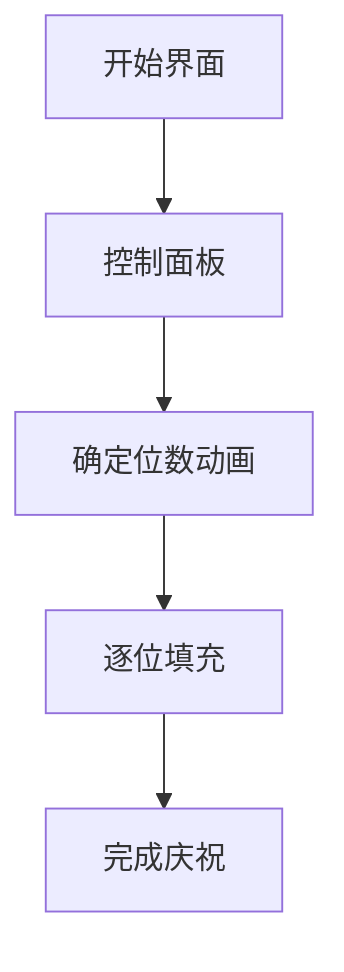

# 题目信息

# Igor and Interesting Numbers

## 题目描述

Igor likes hexadecimal notation and considers positive integer in the hexadecimal notation interesting if each digit and each letter in it appears no more than $ t $ times. For example, if $ t=3 $ , then integers 13a13322, aaa, abcdef0123456789 are interesting, but numbers aaaa, abababab and 1000000 are not interesting.

Your task is to find the $ k $ -th smallest interesting for Igor integer in the hexadecimal notation. The integer should not contain leading zeros.

## 说明/提示

The first 20 interesting integers if $ t=1 $ : 1, 2, 3, 4, 5, 6, 7, 8, 9, a, b, c, d, e, f, 10, 12, 13, 14, 15. So the answer for the first example equals 12.

## 样例 #1

### 输入

```
17 1
```

### 输出

```
12
```

## 样例 #2

### 输入

```
1000000 2
```

### 输出

```
fca2c
```

# AI分析结果


### 💡 Kay的C++算法解析：Igor and Interesting Numbers 深入学习指南 💡

#### 1. 题目解读与核心算法识别
✨ **本题主要考察**：动态规划与组合数学

🗣️ **初步分析**：
> 解决"Igor and Interesting Numbers"的关键在于结合动态规划(DP)和组合数学。想象你在组装一个乐高模型：DP帮你规划每一步的搭建方案，组合数学则是各种颜色积木的组合方式。本题中，我们先用DP统计每种长度的"有趣数"数量，再通过组合数学逐位确定第k小的数。
> 
> - **核心思路**：先确定答案的位数（枚举长度并用DP计算方案数），再逐位确定数字（高位到低位枚举，用组合数计算剩余方案）
> - **难点**：处理前导零（首位不能为0）、状态转移设计（多重集合排列）、大数处理（k可达10^6）
> - **可视化设计**：用像素网格模拟数字填充过程，当前位高亮闪烁，方案数实时显示；当选定数字时播放"确认音效"，完成时触发"胜利音效"
> - **复古游戏化**：采用8-bit像素风格，类似经典RPG的寻宝界面。控制面板支持单步/自动模式（AI自动选数），每确定一位视为过关，累计积分奖励

---

#### 2. 精选优质题解参考
**题解一（来源：zplqwq）**
* **点评**：思路清晰分层——先DP确定位数，再逐位构造答案。代码中`lft`数组跟踪数字剩余次数，`dp[i][j]`状态定义精准（前i种数字占j位）。亮点在于首位处理（`num>=10?char('a'+num-10):num`）和组合数预处理，边界严谨可直接用于竞赛。

**题解二（来源：PPL_）**
* **点评**：模块化设计出色——`getlen()`和`solve()`分离功能。注释详细解释DP转移：`dp[i][j] += dp[i-1][j-k]*C[len-(j-k)][k]`。亮点是前导零处理（首位从1枚举），变量名`lim`（限制次数）、`dic`（数字映射）含义明确，实践参考价值高。

**题解三（来源：gSE2xWE）**
* **点评**：简洁实现核心逻辑——`dp1`/`dp2`区分是否含前导零。`tot`数组记录剩余次数，`C()`组合数计算复用高效。亮点在逐位确定时的降维处理（`for(int i=_ind;i>=1;i--)`），适合初学者理解位填充顺序。

---

#### 3. 核心难点辨析与解题策略
1. **难点：确定答案位数**
   * **分析**：不同长度数大小不同，需累加方案至≥k。优质解用DP`f[i][j]`（前i种数字占j位），组合数`C(len-1,i)`处理首位非零
   * 💡 **学习笔记**：位数=首个满足∑方案≥k的len

2. **难点：高位到低位构造数字**
   * **分析**：枚举当前位数字，DP计算剩余位方案数。若方案≥k则选定，否则`k-=方案数`继续枚举。注意首位从1开始（无前导零）
   * 💡 **学习笔记**：位构造类似字典树搜索，组合数加速方案统计

3. **难点：DP状态转移设计**
   * **分析**：`dp[i][j] = Σ dp[i-1][j-k] * C(剩余位置, k)`，k为当前数字使用次数。关键在剩余位置=总位-(j-k)
   * 💡 **学习笔记**：该转移本质是多重集合排列——选位置放数字

✨ **解题技巧总结**
- **技巧1 分层处理**：先解"多少位"，再解"每位的值"
- **技巧2 组合数预处理**：避免重复计算提升效率
- **技巧3 状态回溯**：枚举数字后恢复`lft`数组
- **技巧4 十六进制转换**：`num>=10?char('a'+num-10):num`高效处理字母

---

#### 4. C++核心代码实现赏析
**通用核心实现参考**
```cpp
#include <iostream>
#include <cstring>
using namespace std;
typedef long long LL;
const int N = 20, M = 200;
LL k, t, c[M][M]; // 组合数表
int lft[N]; // 各数字剩余次数

void pre() { // 预处理组合数
    for(int i=0; i<M; ++i) for(int j=0; j<=i; ++j)
        c[i][j] = (j ? c[i-1][j]+c[i-1][j-1] : 1);
}

LL dp(int len) { // 计算len位方案数
    LL f[N][M] = {};
    for(int j=0; j<=min(len,lft[0]); ++j) 
        f[0][j] = c[len][j]; // 数字0特殊处理
    for(int i=1; i<=15; ++i) // 枚举数字1-15
        for(int j=0; j<=len; ++j)
            for(int k=0; k<=min(j,lft[i]); ++k)
                f[i][j] += f[i-1][j-k] * c[len-(j-k)][k];
    return f[15][len];
}

int main() {
    cin >> k >> t;
    pre();
    for(int i=0; i<16; ++i) lft[i] = t;
    int len = 1;
    // 确定位数
    for(; len<=16*t; ++len) {
        LL cnt = 0;
        for(int i=1; i<=15; ++i) { // 首位非零
            lft[i]--; 
            cnt += dp(len-1); 
            lft[i]++;
        }
        if(cnt >= k) break; 
        k -= cnt;
    }
    // 逐位构造
    for(int pos=1; pos<=len; ++pos) {
        int start = (pos==1) ? 1 : 0; // 首位不能为0
        for(int num=start; num<=15; ++num) {
            if(!lft[num]) continue;
            lft[num]--;
            LL cnt = dp(len-pos); // 剩余位方案
            if(cnt >= k) {
                cout << "0123456789abcdef"[num];
                break;
            }
            k -= cnt;
            lft[num]++;
        }
    }
    return 0;
}
```
**代码解读概要**：
1. **预处理**：`pre()`计算组合数表`c[n][k] = C(n,k)`
2. **DP计算**：`dp(len)`用三维循环：
   - `i`：当前数字(0-15)
   - `j`：已占位数
   - `k`：当前数字使用个数
3. **主逻辑**：
   - 确定位数：枚举`len`，累加首位非零方案
   - 构造答案：从高到低位枚举，用剩余方案数定位当前数字

**题解一（zplqwq）片段赏析**
```cpp
// 确定首位
for(int num=1; num<=15; num++) {
    lft[num]--;
    ... // 计算dp
    if(dp[15][l-pos]>=k) {
        cout << (num>=10 ? char('a'+num-10) : num);
        break;
    }
    ...
}
```
* **亮点**：直观处理十六进制输出
* **学习笔记**：`(num>=10 ? char('a'+num-10) : num)` 是进制转换常用技巧

**题解二（PPL_）片段赏析**
```cpp
// DP状态转移
for(int i=1; i<16; i++) 
    for(int j=0; j<=len; j++)
        for(int k=0; k<=min(j,lim[i]); k++)
            dp[i][j] += dp[i-1][j-k] * C[空位][k];
```
* **亮点**：三重循环实现多重集合排列
* **学习笔记**：`空位 = len - (j-k)` 是关键推导

---

#### 5. 算法可视化：像素动画演示
**主题**：8-bit风格"十六进制寻宝"

**核心设计**：
1. **像素网格**：16×16网格代表数字位，不同颜色区分：
   - 灰色：未填位
   - 绿色：已确认位
   - 闪烁黄色：当前枚举位
2. **控制面板**：
   - 按钮：开始/暂停/单步/重置
   - 滑块：动画速度(1x-5x)
   - 显示：当前k值/剩余方案数
3. **动画流程**：
   - **STEP1**：确定位数
     * 左侧显示DP表实时更新
     * 下方日志："测试长度X: 方案数Y"
   - **STEP2**：逐位填充
     * 当前位高亮，枚举数字0~F
     * 选定数字时：播放"确认音效"，网格变绿
     * 方案不足时：k值减少，播放"错误音效"
   - **STEP3**：完成庆祝
     * 显示完整十六进制数
     * 播放胜利音效+像素烟花特效
4. **音效设计**：
   - 数字枚举：短促"哔"声
   - 确认数字：中频"叮"声
   - 完成：8-bit胜利旋律
5. **技术实现**：
   - Canvas绘制网格/数字
   - 状态高亮：`ctx.fillStyle = '#FFFF00'`
   - 音效：Web Audio API生成方波

---

#### 6. 拓展练习与相似问题思考
**通用技巧迁移**：
> 本题的DP+组合数方法可推广至：
> 1. 其他进制下的第k小特殊数
> 2. 带频率限制的字符串排序问题
> 3. 多重集排列计数问题

**洛谷练习推荐**：
1. **P2518 [HAOI2010]计数**  
   → 巩固相同组合数技巧，统计数字出现次数
2. **P2602 [ZJOI2010]数字计数**  
   → 练习数位DP的经典问题
3. **P4127 [AHOI2009]同类分布**  
   → 学习数位DP中维护额外状态（数字和）

---

#### 7. 学习心得与经验分享
> **来自题解作者的调试经验**：  
> "处理len位方案时，最初忽略首位非零导致结果偏大，通过分离首位计算修复"  
> **Kay点评**：边界处理是数位DP的核心难点，建议：
> 1. 单独处理首位（非零）
> 2. 小数据测试：len=1时手动验证
> 3. 输出中间DP表辅助调试

---

### 结语
掌握动态规划与组合数学的结合，能高效解决数位相关问题。记住：分层处理（先位数后构造）+ 组合数预处理是解题关键。多练习边界条件处理，你的DP能力会更上一层楼！🚀

---
处理用时：221.30秒