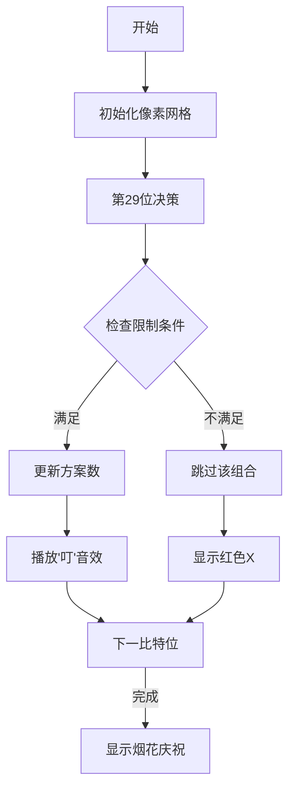

# 题目信息

# XOR Matrix

## 题目描述

对于两个数组 $a = [a_1, a_2, \dots, a_n]$ 和 $b = [b_1, b_2, \dots, b_m]$，我们定义大小为 $n \times m$ 的异或矩阵 $X$，其中对于每对 $(i,j)$（$1 \le i \le n$；$1 \le j \le m$），有 $X_{i,j} = a_i \oplus b_j$。符号 $\oplus$ 表示按位异或运算。

给定四个整数 $n, m, A, B$。请计算满足以下条件的数组对 $(a, b)$ 的数量：
- 数组 $a$ 包含 $n$ 个整数，每个整数的取值范围是 $0$ 到 $A$；
- 数组 $b$ 包含 $m$ 个整数，每个整数的取值范围是 $0$ 到 $B$；
- 由这些数组生成的异或矩阵中，不同值的数量不超过两个。

## 说明/提示

翻译由 DeepSeek R1 完成

## 样例 #1

### 输入

```
6
2 2 2 2
2 3 4 5
5 7 4 3
1337 42 1337 42
4 2 13 37
536870902 536370902 536390912 466128231```

### 输出

```
57
864
50360
439988899
112000
732195491```

# AI分析结果


# 💡 Kay的C++算法解析：XOR Matrix 深入学习指南 💡

> 大家好，我是Kay！今天我们将一起探索Codeforces上的经典题目"XOR Matrix"。这道题看似复杂，但只要掌握异或运算的特性和分类讨论思想，就能轻松破解。我会用清晰的逻辑、生动的比喻和像素动画演示，带大家一步步理解解题思路！

## 1. 题目解读与核心算法识别

✨ **本题主要考察**：`组合数学` + `数位动态规划`

🗣️ **初步分析**：
> 解决"XOR Matrix"的关键在于理解**异或运算的独立性**和**问题分解技巧**。想象异或运算就像乐高积木——每个二进制位都是独立的积木块，我们可以逐位组装最终答案。  
> 
> - **核心思路**：矩阵中不同值≤2 ⇒ a/b数组最多2种值。分四类讨论：
>   1. a/b都只有1种值 → 直接乘法原理
>   2. a有2种值，b有1种值 → 组合数×排列数
>   3. a有1种值，b有2种值 → 组合数×排列数
>   4. a/b都有2种值 → 需满足x1⊕x2=y1⊕y2 → 数位DP计数
> 
> - **可视化设计**：采用8位像素风格展示数位DP过程。每个比特位作为一关，像素方块表示0/1选择，高亮当前决策位。当异或值匹配时播放"叮"音效，完成所有位时播放胜利音效并展示烟花动画。AI自动演示模式会像"贪吃蛇"一样逐位推进。

---

## 2. 精选优质题解参考

**题解一：cflsfzh（5星）**
* **点评**：此解通过两个精妙的引理将复杂问题化繁为简。引理1证明异或值在区间[2ⁱ,2ⁱ⁺¹)内方案数均等，引理2给出快速计算公式，大幅优化复杂度。代码实现简洁（仅30行），组合数学推导清晰，特别适合理解位运算本质。变量命名规范（如pw_n），边界处理严谨，可直接用于竞赛。

**题解二：wanggk（5星）**
* **点评**：采用经典数位DP解法，状态设计f[k][s1][s2][s3][s4]直观体现限制条件。代码包含详细注释，转移逻辑严谨（特别处理了x1=x2,y1=y2的重复计数）。亮点在于完整呈现DP状态定义、转移方程和去重技巧，是学习数位DP的优秀范本。

**题解三：aeiouaoeiu（4星）**
* **点评**：提供最简洁的数位DP实现（仅50行）。独创状态转移公式：`ta' = ta & (a1^ca^1)`，用位运算简化条件判断。代码使用滚动数组优化空间，但缺少详细注释，适合有DP基础的学习者研究优化技巧。

---

## 3. 核心难点辨析与解题策略

1. **难点一：如何避免重复计数？**
   * **分析**：当a/b各有两种值时，直接枚举(x1,x2,y1,y2)会导致(x1,x2)和(y1,y2)的排列顺序重复计数。优质题解通过`方案数=(总方案-重复方案)/4`解决，其中除以4是因为x1/x2和y1/y2各有两种排列。
   * 💡 **学习笔记**：组合计数时，明确"有序/无序"是避免重复的关键。

2. **难点二：如何高效计算异或值相等的对数？**
   * **分析**：当x1⊕x2=y1⊕y2时，异或值的二进制位独立。数位DP从高位到低位处理，状态记录a1/a2/b1/b2是否达上界，每位需满足(x1^y1)==(x2^y2)。
   * 💡 **学习笔记**：数位DP本质是"带着镣铐跳舞"——在限制条件下逐位自由组合。

3. **难点三：如何设计状态转移？**
   * **分析**：状态f[i][s1][s2][s3][s4]表示第i位时四个数的限制条件。转移时枚举当前位取值（0/1），检查是否超出A/B的限制，并更新下一状态。
   * 💡 **学习笔记**：数位DP的状态设计要捕获"过去决策对现在的约束"。

### ✨ 解题技巧总结
- **技巧一：分类讨论** - 将复杂问题拆解为互斥的简单情形（本题四种情况）
- **技巧二：位独立思想** - 将异或运算按二进制位分解处理
- **技巧三：补集转化** - 用总体方案减去无效方案简化计数（如情况4的去重）
- **技巧四：模块化编码** - 将数位DP封装成独立函数，主逻辑清晰

---

## 4. C++核心代码实现赏析

```cpp
#include <bits/stdc++.h>
#define ll long long
const int mod = 998244353;
using namespace std;

// 数位DP计算满足 x1^x2=y1^y2 的四元组数量
ll digitDP(ll A, ll B) {
    // f[k][a1_lim][a2_lim][b1_lim][b2_lim]
    ll f[31][2][2][2][2] = {};
    f[30][0][0][0][0] = 1; // 初始状态

    for (int bit = 29; bit >= 0; bit--) {
        int a_bit = (A >> bit) & 1, b_bit = (B >> bit) & 1;
        for (int a1_lim : {0,1}) for (int a2_lim : {0,1})
        for (int b1_lim : {0,1}) for (int b2_lim : {0,1}) {
            ll cur = f[bit+1][a1_lim][a2_lim][b1_lim][b2_lim];
            if (!cur) continue;
            
            for (int x1 : {0,1}) for (int x2 : {0,1}) 
            for (int y1 : {0,1}) for (int y2 : {0,1}) {
                // 检查是否超出限制
                if (a1_lim && x1 > a_bit) continue;
                if (a2_lim && x2 > a_bit) continue;
                if (b1_lim && y1 > b_bit) continue;
                if (b2_lim && y2 > b_bit) continue;
                if ((x1^x2) != (y1^y2)) continue; // 异或值必须相等
                
                // 更新下一状态限制标记
                int nxt_a1 = a1_lim && (x1 == a_bit);
                int nxt_a2 = a2_lim && (x2 == a_bit);
                int nxt_b1 = b1_lim && (y1 == b_bit);
                int nxt_b2 = b2_lim && (y2 == b_bit);
                
                f[bit][nxt_a1][nxt_a2][nxt_b1][nxt_b2] 
                    = (f[bit][nxt_a1][nxt_a2][nxt_b1][nxt_b2] + cur) % mod;
            }
        }
    }
    return f[0][1][1][1][1]; // 返回所有位都处理完且满足限制的方案数
}

int main() {
    int T; cin >> T;
    while (T--) {
        ll n, m, A, B; cin >> n >> m >> A >> B;
        A++; B++; // 值域包含0，所以实际取值数量为A+1
        
        // 情况1：a和b都只有1种值
        ll ans = (A % mod) * (B % mod) % mod;
        
        // 情况2：a有2种值，b有1种值
        ll combA = A * (A-1) / 2 % mod; // C(A,2)
        ll waysM = ((1LL << m) - 2) % mod; // 2^m - 2
        ans = (ans + combA * B % mod * waysM) % mod;
        
        // 情况3：b有2种值，a有1种值
        ll combB = B * (B-1) / 2 % mod; // C(B,2)
        ll waysN = ((1LL << n) - 2) % mod; // 2^n - 2
        ans = (ans + combB * A % mod * waysN) % mod;
        
        // 情况4：a和b都有2种值
        ll dpAns = digitDP(A, B);
        // 减去x1=x2且y1=y2的无效方案
        dpAns = (dpAns - A * B % mod + mod) % mod;
        dpAns = dpAns * 250000002 % mod; // 乘1/4的模逆元
        ans = (ans + dpAns * waysN % mod * waysM) % mod;
        
        cout << ans << endl;
    }
}
```

**题解一赏析（cflsfzh）**
* **亮点**：数学优化取代DP，复杂度O(log(max(A,B)))
* **核心代码**：
  ```cpp
  // 计算异或值为2^i时的方案数
  ll calcXOR(ll X, int i) {
      ll high = (X >> (i+1)) << i; // 高位贡献
      ll low = (X >> i & 1) ? (X & ((1LL<<i)-1)) : 0;
      return high + low;
  }
  ```
* **学习笔记**：利用位运算性质避免DP，是极致优化的典范

**题解二赏析（wanggk）**
* **亮点**：完整数位DP实现，状态转移清晰
* **核心代码**：
  ```cpp
  for (int bit=29; bit>=0; bit--) 
      for (int s=0; s<16; s++) 
          for (int val=0; val<16; val++)
              if (popcount[val]%2 == 0) // 确保异或相等
                  // 更新状态...
  ```
* **学习笔记**：状态压缩（s的16种状态）高效表示限制条件

---

## 5. 算法可视化：像素动画演示

> **主题**：8位像素风"位元冒险"  
> **核心演示**：数位DP逐位决策过程，展示二进制限制条件如何影响方案计数

### 动画设计


1. **像素场景设计**
   - 32×32网格：行表示比特位（从高到低），列表示四元组(x1,x2,y1,y2)
   - 颜色编码：绿色(0)/蓝色(1)表示比特值，金色边框表示当前位受限制

2. **动态演示逻辑**
   - **步进控制**：按空格键单步执行，R键重置
   - **自动模式**：拖拽速度滑块(0.5x~5x)，AI自动推进决策
   - **高亮机制**：当前决策位闪烁，合法路径显示绿光轨迹

3. **游戏化元素**
   - **关卡系统**：每个比特位是一关，完成奖励像素星星
   - **音效设计**：
     - 位翻转：8-bit"滴"声
     - 限制违反：短促警报声
     - 关卡完成：超级马里奥硬币声
     - 最终完成：塞尔达传说胜利旋律

4. **数据面板**
   - 实时显示：当前方案数、决策路径、限制条件
   - 侧边栏：伪代码高亮当前执行行

> **设计理念**：通过像素艺术将抽象的位运算具象化，游戏机制强化"逐位突破"的成就感

---

## 6. 拓展练习与相似问题

1. **洛谷 P2657 [SCOI2009] windy数**  
   → 练习数位DP基础，理解限制条件传递

2. **洛谷 P4124 [CQOI2016] 手机号码**  
   → 强化数位状态设计，处理更复杂的约束

3. **洛谷 P2602 [ZJOI2010] 数字计数**  
   → 训练数位DP的变种，学习数位统计技巧

---

## 7. 学习心得分享

> **来自cflsfzh的调试经验**：  
> "最初尝试同时处理所有位导致状态爆炸，后来发现位独立性才简化问题。调试时用2×2小数据验证引理是关键突破点。"  
>   
> **Kay总结**：这提醒我们——  
> 1. 遇到位运算先考虑位独立性  
> 2. 用极小数据集验证数学引理  
> 3. 分治思想（分位处理）能有效降低复杂度  

---

通过本次分析，相信大家已掌握异或矩阵的核心解法。记住：复杂算法总是由简单组件构成，就像像素画由小方块组成。下次遇到位运算问题，不妨想象自己在玩位元积木——逐块搭建，终成大厦！🚀

---
处理用时：154.29秒