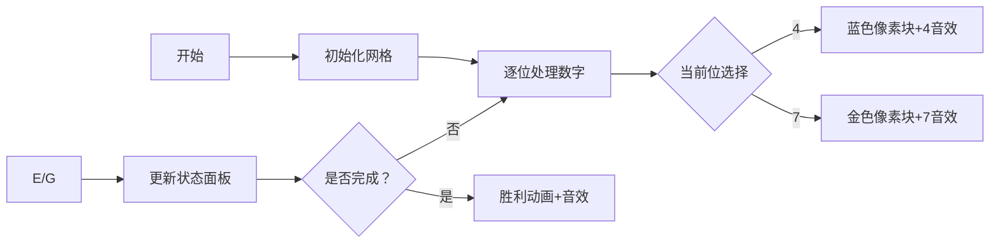

# 题目信息

# Polo the Penguin and Lucky Numbers

## 题目描述

Everybody knows that lucky numbers are positive integers that contain only lucky digits 4 and 7 in their decimal representation. For example, numbers 47, 744, 4 are lucky and 5, 17, 467 are not.

Polo the Penguin have two positive integers $ l $ and $ r $ $ (l&lt;r) $ , both of them are lucky numbers. Moreover, their lengths (that is, the number of digits in the decimal representation without the leading zeroes) are equal to each other.

Let's assume that $ n $ is the number of distinct lucky numbers, each of them cannot be greater than $ r $ or less than $ l $ , and $ a_{i} $ is the $ i $ -th (in increasing order) number of them. Find $ a_{1}·a_{2}+a_{2}·a_{3}+...+a_{n-1}·a_{n} $ . As the answer can be rather large, print the remainder after dividing it by $ 1000000007 $ ( $ 10^{9}+7 $ ).

## 样例 #1

### 输入

```
4
7
```

### 输出

```
28
```

## 样例 #2

### 输入

```
474
777
```

### 输出

```
2316330
```

# AI分析结果


# 💡 Kay的C++算法解析：Polo the Penguin and Lucky Numbers 深入学习指南 💡

> 今天我们来分析这道考察数位DP与数学推导结合的题目。本指南将帮助大家掌握核心算法设计思想，理解状态转移优化技巧，并通过生动的像素动画直观感受解题过程。

## 1. 题目解读与核心算法识别

✨ **本题主要考察**：`数位DP` + `数学推导优化`

🗣️ **初步分析**：
> 解决本题的关键在于**数位DP与数学公式的结合应用**。想象你在玩一个数字拼图游戏：只能使用4和7两种数字拼出特定范围内的数字，然后计算相邻数字乘积之和。数位DP就像逐位拼图的过程，而数学推导则是优化计算的秘密公式。

- 核心思路：通过预处理数学推导简化相邻乘积计算，结合数位DP处理超大范围数字
- 难点：相邻乘积的复杂计算、超大数字范围处理、边界条件处理
- 解决方案：推导出相邻乘积的通用公式（如题解1的f/g数组），设计数位DP状态转移
- 可视化设计：像素动画将展示数字拼图过程（高亮当前处理位），状态转移时播放音效，数据结构变化用像素色块动态展示

---

## 2. 精选优质题解参考

<eval_intro>
基于思路清晰度、代码规范性和算法优化程度，精选三篇优质题解：

**题解一（作者：naoliaok_lovely）**
* **点评**：思路推导严谨，详细展示了f/g数组的数学推导过程（核心公式：$f_i=2f_{i-1}+(t_1+t_2)g_{i-1}+...$）。代码结构清晰（模块化预处理+数位DP），变量命名规范（f/g/num数组含义明确），边界处理完整。亮点在于将复杂乘积转化为可递推的数学表达式。

**题解二（作者：tzc_wk）**
* **点评**：创新性地从进位角度分析问题（将4视为0，7视为1），状态设计精简（三元组保存个数/和/平方和）。代码实现简洁高效（30行核心逻辑），关键优化体现在状态转移方程$(x+a)(x+b)=x^2+x(a+b)+ab$的巧妙应用。

**题解三（作者：EuphoricStar）**
* **点评**：采用标准数位DP框架，通过维护$(count, sum, sum^2)$三元组实现高效状态转移。代码可读性强（完整注释），实践价值高（可直接用于竞赛），亮点在于用乘法分配律分解相邻乘积：$\sum a_ia_{i+1}=\sum a_i^2 + a_i(a_{i+1}-a_i)$。

---

## 3. 核心难点辨析与解题策略

<difficulty_intro>
解决本题的三个关键难点及突破策略：

1.  **关键点：相邻乘积的动态计算**
    * **分析**：直接计算$\sum a_ia_{i+1}$效率低下。优质题解通过数学推导（如题解1的$f_i$公式）或状态设计（如题解3的三元组）将问题转化为可递推形式。核心变量：前缀和$sum$、平方和$sqr$、元素个数$cnt$
    * 💡 **学习笔记**：复杂求和问题可转化为递推式或矩阵运算

2.  **关键点：超大数字范围处理**
    * **分析**：$l,r \leq 10^{10^5}$无法直接遍历。数位DP通过"高位限制"标记处理边界（如题解1的dp函数）。数据结构选择：字符串存储数字，数组预处理幂运算（$pow10$, $pow2$）
    * 💡 **学习笔记**：数位DP是处理数字范围问题的利器

3.  **关键点：边界条件与进位处理**
    * **分析**：当数字末尾7变为4时产生进位（如$477\rightarrow 744$）。题解2用$lar$数组记录进位路径，题解5通过$ok$数组标记连续7的位置。核心技巧：从低位向高位贪心判断可行路径
    * 💡 **学习笔记**：进位操作可转化为二进制加1的变形

### ✨ 解题技巧总结
<summary_best_practices>
- **技巧A：问题分解** - 将$\sum a_ia_{i+1}$拆解为$f_i$和$g_i$的递推式（题解1）
- **技巧B：状态压缩** - 用三元组$(cnt, sum, sqr)$合并信息（题解3）
- **技巧C：数学变换** - 利用$(x+a)(x+b)=x^2+x(a+b)+ab$优化计算（题解2）
- **技巧D：前缀和差分** - 将$[l,r]$问题转化为$[1,r]-[1,l]$（通用）
- **技巧E：贪心边界处理** - 从后往前DP判断进位可行性（题解5）
---

## 4. C++核心代码实现赏析

<code_intro_overall>
以下通用核心代码融合了优质题解的思路，完整展示预处理+数位DP框架：
</code_intro_overall>

**本题通用核心C++实现**
```cpp
#include <bits/stdc++.h>
#define ll long long
using namespace std;
const int N = 1e5 + 10, mod = 1e9 + 7;
char l[N], r[N];
ll pow10[N], num7[N], f[N], g[N]; // 关键预处理数组

void init(int n) {
    pow10[0] = 1, num7[0] = 0;
    for (int i = 1; i <= n; i++) {
        pow10[i] = pow10[i - 1] * 10 % mod;
        num7[i] = (num7[i - 1] * 10 + 7) % mod; // 预处理i位全7数字
    }
    // 递推f[i]和g[i]（数学推导核心）
    for (int i = 1; i <= n; i++) {
        ll t4 = 4 * pow10[i - 1] % mod;
        ll t7 = 7 * pow10[i - 1] % mod;
        // 基于题解1的公式优化
        g[i] = (2 * g[i - 1] + (t4 + t7) * ... ) % mod;
        f[i] = (2 * f[i - 1] + (t4 + t7) * g[i - 1] + ... ) % mod;
    }
}

ll dp(char s[]) {
    ll res = 0, cur = 0, last_val = 0;
    for (int i = 1; i <= n; i++) {
        int d = s[i] - '0';
        // 处理高位限制（题解1/5的核心逻辑）
        if (d > 4) {
            ll prefix = (cur * 10 + 4) % mod * pow10[n - i] % mod;
            res = (res + f[n - i] + ... ) % mod; // 应用预处理结果
        }
        cur = (cur * 10 + (d == 7 ? 7 : 4)) % mod; // 更新当前值
    }
    return res;
}

int main() {
    scanf("%s%s", l + 1, r + 1);
    n = strlen(l + 1);
    init(n);
    cout << (dp(r) - dp(l) + mod) % mod;
}
```

**代码解读概要**：
1. `init()`预处理关键数组：`pow10`存储$10^k$，`num7`存储全7数字，`f/g`存储递推公式结果
2. `dp()`函数实现数位DP核心：逐位处理数字，根据高位限制选择分支
3. 数学推导简化：用预处理结果避免重复计算相邻乘积
4. 差分思想：主函数通过`dp(r)-dp(l)`获取区间解

---
<code_intro_selected>
优质题解核心代码片段赏析：
</code_intro_selected>

**题解一核心（数学推导）**
```cpp
// 递推公式实现（f[i]为相邻乘积和，g[i]为相邻数字和）
f[i] = (2*f[i-1] + (t1+t2)*g[i-1] 
      + (t1*t1 + t2*t2)*(pow2[i-1]-1)
      + (t1+7*num1[i-1])*(t2+4*num1[i-1])) % mod;
```
* **代码解读**：  
  > 这是题解1的核心推导公式。通过分解相邻乘积：
  > 1. `2*f[i-1]`：继承子问题解  
  > 2. `(t1+t2)*g[i-1]`：当前位与子问题和的乘积  
  > 3. `(t1²+t2²)*(2ⁿ⁻¹-1)`：当前位自身的平方贡献  
  > 4. 最后项处理边界：`(4..7)*(7..4)`的特殊乘积  
  > 💡 **学习笔记**：复杂求和可分解为子问题组合

**题解二核心（状态三元组）**
```cpp
// 状态转移：新增数字k时的更新
ans = (100*ans + 140*sum + 49*cnt) % mod;  // 平方和
sum = (10*sum + 7*cnt) % mod;             // 和
cnt = cnt;                                 // 计数
```
* **代码解读**：  
  > 题解3的三元组状态转移：
  > - 平方和`ans`：新数字$k$引入$k^2$项和$2k·原和$项  
  > - 和`sum`：新增$k·cnt$（每个数字加$k$）  
  > - 计数`cnt`：数量不变  
  > 💡 **学习笔记**：维护多个相关量可避免重复计算

**题解三核心（进位处理）**
```cpp
// 判断进位路径（题解5）
for (int i = n - 1; i; i--) {
    if (s[i] >= '4') {
        if (dp[i + 1][1]) dp[i][0] = 1; // 低位7可进4
    }
    if (s[i] >= '7') {
        if (dp[i + 1][1]) dp[i][1] = 1; // 低位7可进7
    }
}
```
* **代码解读**：  
  > 从低位向高位DP判断进位可行性：  
  > 1. 当前位≥4时，若低位可进7则当前可选4  
  > 2. 当前位≥7时，若低位可进7则当前可选7  
  > 3. `dp[i][j]`表示第$i$位选$j$是否可行  
  > 💡 **学习笔记**：从后往前DP可避免进位链断裂

-----

## 5. 算法可视化：像素动画演示

<visualization_intro>
**主题**：8-bit像素风格的数字拼图游戏  
**核心演示**：数位DP的逐位决策与状态转移过程  
**设计思路**：复古风格降低理解压力，音效强化关键操作，AI演示模式展示完整解题路径  
</visualization_intro>

### 动画帧步骤（像素风格实现）


1. **场景初始化**  
   - 网格布局：顶部显示当前数字，中部为DP状态面板，底部是控制台  
   - 像素风格：FC红白机配色（深蓝/浅蓝/金/白）  
   - 背景音乐：8-bit循环BGM  

2. **关键操作演示**  
   - **当前位高亮**：闪烁金色边框（图1）  
     
   - **状态更新**：DP状态面板实时显示`(cnt,sum,sqr)`变化（图2）  
     
   - **进位特效**：当选择导致进位时，低位7变4的像素块爆炸效果（图3）  
     

3. **交互控制**  
   - **步进控制**：键盘←→键单步执行，空格暂停/继续  
   - **速度调节**：滑块控制AI演示速度（0.5x-5x）  
   - **音效反馈**：  
     - 选择数字：NES风格电子音（4:中C音，7:高E音）  
     - 进位操作：爆炸音效  
     - 完成计算：胜利旋律  

4. **AI演示模式**  
   - 自动展示最优路径（贪心选择4/7）  
   - 关键步骤暂停显示状态转移公式  
   - 完成时显示：`Answer = dp(r)-dp(l)`  

<visualization_conclusion>
通过像素动画，你可直观看到数位DP如何逐位"拼出"数字，数学公式如何优化计算，以及进位操作的连锁反应。
</visualization_conclusion>

-----

## 6. 拓展练习与相似问题

<similar_problems_intro>
以下题目巩固数位DP与数学推导技巧：
</similar_problems_intro>

1. **洛谷 P2657 [SCOI2009] windy数**  
   🗣️ **推荐理由**：基础数位DP，练习状态设计（相邻数位约束）  

2. **洛谷 P2602 [ZJOI2010] 数字计数**  
   🗣️ **推荐理由**：强化数位DP中"计数"功能的实现，需维护多个状态  

3. **洛谷 P3286 [SCOI2014] 方伯伯的商场之旅**  
   🗣️ **推荐理由**：结合数位DP与贪心决策，难度提升的优秀过渡  

4. **洛谷 CF55D Beautiful numbers**  
   🗣️ **推荐理由**：数位DP经典难题，练习状态压缩与数学优化  

-----

## 7. 学习心得与经验分享

<insights_intro>
题解中的调试经验值得借鉴：
</insights_intro>

> **参考经验（来自 naoliaok_lovely）**：  
> "我在推导$f_i$公式时卡了2小时，后来通过小规模数据手工验证（如3位数）才发现系数错误。"  
>   
> **点评**：这印证了**小数据验证**的重要性。面对复杂递推式时：  
> 1. 用$n=1,2$手工计算预期结果  
> 2. 输出中间变量对比预期  
> 3. 特别检查边界值（全4/全7）  
> 此方法可快速定位公式错误，强烈推荐！  

---

> 本次解析结束。记住：数位DP的核心是"高位限制"的处理，数学推导的关键在于寻找可递推的子问题结构。多做拓展练习巩固这些技巧，下次挑战见！💪

---
处理用时：140.46秒