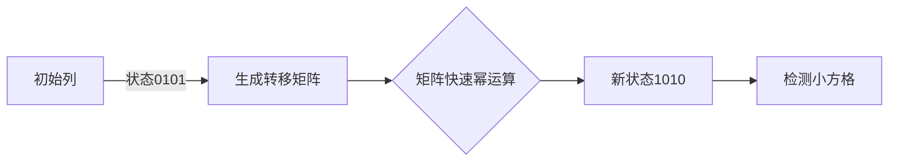

# 题目信息

# Stairs and Lines

## 题目描述

You are given a figure on a grid representing stairs consisting of 7 steps. The width of the stair on height $ i $ is $ w_{i} $ squares. Formally, the figure is created by consecutively joining rectangles of size $ w_{i}×i $ so that the $ w_{i} $ sides lie on one straight line. Thus, for example, if all $ w_{i}=1 $ , the figure will look like that (different colors represent different rectangles):

 And if $ w={5,1,0,3,0,0,1} $ , then it looks like that:

 Find the number of ways to color some borders of the figure's inner squares so that no square had all four borders colored. The borders of the squares lying on the border of the figure should be considered painted. The ways that differ with the figure's rotation should be considered distinct.

## 说明/提示

All the possible ways of painting the third sample are given below:

 

## 样例 #1

### 输入

```
0 1 0 0 0 0 0
```

### 输出

```
1
```

## 样例 #2

### 输入

```
0 2 0 0 0 0 0
```

### 输出

```
7
```

## 样例 #3

### 输入

```
1 1 1 0 0 0 0
```

### 输出

```
9
```

## 样例 #4

### 输入

```
5 1 0 3 0 0 1
```

### 输出

```
411199181
```

# AI分析结果


### 💡 Kay的C++算法解析：Stairs and Lines 深入学习指南 💡

**引言**  
今天我们一起分析CF498E "Stairs and Lines"——一道结合状态压缩和矩阵优化的经典动态规划题。本指南将帮助你理解如何用二进制状态描述复杂涂色问题，并通过矩阵加速处理大规模数据。

---

### 1. 题目解读与核心算法识别  
✨ **本题主要考察**：`状态压缩动态规划` + `矩阵快速幂优化`  

🗣️ **初步分析**  
> 想象你有一排高度不同的乐高阶梯（1~7层），每层有不同宽度。你需要给阶梯的网格边上色：外边缘必须上色，且不能有任何1×1小方格四边全被涂色。  
> **核心思想**：将每列涂色状态压缩为二进制数（如`0101`表示涂第1、3条竖线），通过动态规划逐列转移状态。由于宽度可能达$10^5$，用矩阵快速幂加速转移过程，如同用"密码破解器"快速计算亿万个组合。  
> **关键难点**：  
> - 状态合法性检查：需保证每个小方格至少有一条边未涂色  
> - 高度变化时状态扩展（高位补0）  
> **可视化设计**：采用8位像素风格，用红/绿方块表示涂色/未涂色状态，当检测非法方格时闪烁红光并播放"错误音效"。矩阵快速幂部分用多列画面快速切换表现批量处理。

---

### 2. 精选优质题解参考  
**题解一（warzone）**  
* **点评**：  
  思路最清晰的典范！将状态转移抽象为矩阵乘法，并优雅处理高度变化：  
  - **思路**：用`dp[i][s]`表示第i列状态s的方案数，通过预处理转移矩阵$A$，用$dp_i = A^{w} \times dp_{i-1}$ 完成跳跃式计算  
  - **代码亮点**：模板化矩阵类、位运算高效检查状态合法性（`(L|R|k|(k<<1))==全1`）  
  - **实践价值**：直接可用于竞赛，边界处理严谨（高度增加时自动补0）

**题解二（PragmaGCC）**  
* **点评**：  
  最简洁的实现！独创性提出"四边或运算"校验法：  
  - **思路**：对每个小方格，若四条边的状态`或运算≠全1`则非法  
  - **代码亮点**：三重循环枚举状态（仅15行核心逻辑），矩阵乘法用`ull`暂存防溢出  
  - **优化技巧**：状态转移矩阵复用，减少重复计算

**题解三（CDFLS_mao_zx）**  
* **点评**：  
  最佳性能优化方案！动态调整矩阵尺寸：  
  - **思路**：高度$i$的矩阵尺寸仅为$2^i$（而非固定128），显著降低计算量  
  - **代码亮点**：通过`mat.sz`动态控制矩阵大小，高位状态自动清零  
  - **调试技巧**：作者强调画图模拟转移过程，对理解位运算帮助极大

---

### 3. 核心难点辨析与解题策略  
1. **状态压缩与合法性校验**  
   * **分析**：需将每列竖线状态映射为二进制数（如高度3→3位二进制），并确保：  
     - 外边缘强制涂色（状态值低位对应边缘需为0）  
     - 任意相邻列+横线组合不形成全涂色方格  
   * 💡 **学习笔记**：位运算`(j|k|横线)`检查是核心技巧，建议纸上模拟二进制操作

2. **高度变化的衔接处理**  
   * **分析**：当阶梯从高度3升到4时，旧状态需高位补0（如`101`→`0101`），转移矩阵需重新构造  
   * 💡 **学习笔记**：通过`1<<new_height`自动扩展状态，旧状态高位清零

3. **矩阵加速的实现**  
   * **分析**：将$O(n)$的DP转移转化为$O(log n)$的矩阵幂运算，关键在：  
     - 预处理同一高度所有状态的转移关系  
     - 用快速幂分解$w_i=2^{k_1}+2^{k_2}+...$  
   * 💡 **学习笔记**：矩阵乘法本质是状态路径的"跳跃式组合"

✨ **解题技巧总结**  
- **问题分解**：将阶梯按列切片，专注相邻列的状态转移  
- **位运算加速**：用`|`检查方格，`<<`实现状态扩展  
- **矩阵化思维**：将转移系数视作矩阵，重复过程用幂运算优化  
- **边界测试**：特别注意$w_i=0$或高度变化时的状态初始化

---

### 4. C++核心代码实现赏析  
**本题通用核心实现**  
```cpp
const int mod = 1e9+7;
struct Matrix {
    vector<vector<int>> data;
    Matrix operator*(Matrix &b) { // 矩阵乘法
        Matrix res(size, b[0].size());
        for(int i=0; i<size; ++i) 
            for(int k=0; k<b.size; ++k) 
                for(int j=0; j<b[0].size; ++j)
                    res[i][j] = (res[i][j] + 1LL*data[i][k]*b[k][j])%mod;
        return res;
    }
};
Matrix qpow(Matrix base, int exp) { // 快速幂
    Matrix res(identity_matrix);
    while(exp) {
        if(exp&1) res = res * base;
        base = base * base;
        exp >>= 1;
    }
    return res;
}
```

**题解一片段赏析（矩阵构造）**  
```cpp
// 构建高度h的转移矩阵
for(int L=0; L<(1<<h); ++L)      // 前一列状态
for(int R=0; R<(1<<h); ++R)      // 当前列状态
for(int hor=0; hor<(1<<(h-1)); ++hor) { // 横线状态
    int edges = (hor << 1) | 1;  // 上下横线组合
    if((L|R|edges|(edges>>1)) == (1<<h)-1) // 关键检查！
        trans[R][L]++;           // 合法转移计数
}
```
> **代码解读**：  
> 1. `hor`用$h-1$位二进制表示横线（每条横线影响两个方格）  
> 2. `edges = (hor<<1)|1` 生成形如`0101`的上下边界组合  
> 3. 四部分按位或`(L|R|edges|(edges>>1))`必须等于`111...1`（至少有一条未涂色）  
> 💡 **学习笔记**：此检查可理解为"每个方格至少一条边漏涂"

**题解二片段赏析（状态校验）**  
```cpp
// 检查单个方格是否合法
bool is_valid(int left, int right, int top, int bottom) {
    return (left | right | top | bottom) != 0xF; // 四位不全1
}
```
> **代码解读**：  
> 用4位二进制表示方格四边，`0xF`即15（二进制1111）代表全涂色  
> 💡 **学习笔记**：将复杂条件转化为简洁的位运算，是状压DP的精华

---

### 5. 算法可视化：像素动画演示  
**主题**："像素密码锁破解记"（复古解谜游戏风格）  

**核心演示流程**：  


**动画实现细节**：  
1. **像素网格**：  
   - 红色方块：已涂色边  
   - 绿色方块：未涂色边  
   - 非法方格：闪烁红光 + 播放低音警报  

2. **状态转移演示**：  
   - 每列显示二进制状态（如`0101`）  
   - 横线用水平像素条表示，点击可切换涂色状态  
   - 矩阵乘法时，右侧列像素块根据左侧列"解码生成"  

3. **交互控制**：  
   - 步进/暂停：观察每位运算过程  
   - 速度滑块：调整矩阵幂运算速度  
   - "AI模式"：自动演示最优涂色路径  

4. **游戏化设计**：  
   - 每成功转移一列得10分  
   - 连续合法转移触发Combo音效  
   - 通关条件：达到终点且无非法方格  

**技术实现**：  
- 用Canvas绘制网格，每个方格绑定状态值  
- 音效触发：Web Audio API播放8-bit音效  
- 状态更新：`requestAnimationFrame`驱动  

---

### 6. 拓展练习与相似问题  
**通用技巧迁移**：  
状态压缩+矩阵优化适用于：  
1. 网格路径问题（如受限棋盘移动）  
2. 相邻约束的排列计数（如禁止相同颜色相邻）  
3. 周期性操作的快速计算（如重复操作$10^9$次）  

**洛谷推荐**：  
1. [P1896 互不侵犯](https://www.luogu.com.cn/problem/P1896)  
   → 巩固棋盘状压DP  
2. [P2100 食物链](https://www.luogu.com.cn/problem/P2100)  
   → 练习状态设计与转移矩阵构造  
3. [P5057 简单题](https://www.luogu.com.cn/problem/P5057)  
   → 掌握位运算优化技巧  

---

### 7. 学习心得与经验分享  
> **warzone的调试经验**：  
> "最初在状态转移设计时卡了很久，后来通过画网格图标注二进制状态，才发现横线状态编码错误"  
>  
> **Kay点评**：  
> 位运算极易因编码顺序出错，务必：  
> 1. 用`cout << bitset<4>(state)`输出调试  
> 2. 对高度变化时的补零操作写单元测试  
> 3. 小规模数据手工验证（如w=[1,1]）  

---

**结语**  
通过本指南，相信你已经掌握状态压缩的核心思维和矩阵优化的魔法力量！记住：用二进制分解复杂约束，用矩阵跳跃重复过程，这就是高效算法的魅力。下次遇到大规模网格问题，不妨试试这把"双状态密钥"！💪

---
处理用时：128.83秒