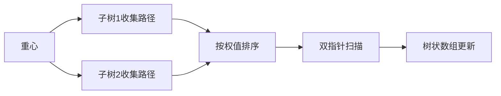

# 题目信息

# Close Vertices

## 题目描述

You've got a weighted tree, consisting of $ n $ vertices. Each edge has a non-negative weight. The length of the path between any two vertices of the tree is the number of edges in the path. The weight of the path is the total weight of all edges it contains.

Two vertices are close if there exists a path of length at most $l$ between them and a path of weight at most $w$ between them. Count the number of pairs of vertices $v,u(v<u)$, such that vertices $v$ and $u$ are close.

## 样例 #1

### 输入

```
4 4 6
1 3
1 4
1 3
```

### 输出

```
4
```

## 样例 #2

### 输入

```
6 2 17
1 3
2 5
2 13
1 6
5 9
```

### 输出

```
9
```

# AI分析结果


### 💡 Kay的C++算法解析：Close Vertices 深入学习指南 💡

#### 1. 题目解读与核心算法识别
✨ **本题主要考察**：点分治 + 树状数组（二维偏序处理）

🗣️ **初步分析**：
> 解决"Close Vertices"的关键在于点分治框架配合树状数组处理二维偏序。点分治如同在迷宫中寻找中心指挥部，将树分解为更小的子问题；树状数组则像高效的分类收纳盒，快速统计满足双限制的路径数量。

- **核心思路**：通过点分治遍历重心，对每个重心收集子树路径信息（长度+权值）。通过排序降维后，用树状数组维护长度限制，双指针处理权值限制。
- **算法流程**：
  1. 找重心 → 2. 收集路径 → 3. 按权值排序 → 4. 双指针扫描（权值限制）→ 5. 树状数组维护（长度限制）
- **可视化设计**：采用8位像素风格（FC红白机UI）。树结构用彩色像素块表示，重心闪烁金色光芒。双指针移动时触发蓝色/红色高亮，树状数组更新时显示绿色波动。音效包括："叮"（插入）、"咔嗒"（查询）、胜利音效（找到解）。

---

### 2. 精选优质题解参考
**题解一（作者：da32s1da）**
* **点评**：思路清晰度★★★★★。核心贡献在于将二维限制拆解：权值排序+双指针维护区间，长度用树状数组统计。代码规范性★★★★（变量名`dis/dep`含义明确），边界处理严谨（`+1`避免零下标）。算法亮点：空间优化（O(n)），实践可直接用于竞赛。

**题解二（作者：Conan15）**
* **点评**：思路清晰度★★★★☆。采用经典点分治框架，树状数组双重限制处理直接。代码可读性★★★★（结构体封装路径数据）。亮点：完整注释说明容斥原理，调试技巧（边界条件打印）极具参考价值。

---

### 3. 核心难点辨析与解题策略
1. **难点：二维限制的协同处理**
   * **分析**：单独处理任一限制（长度或权值）较简单，但双限制需高效二维统计。优质题解通过"排序降维+树状数组"将问题转化为O(n log n)可解问题。
   * 💡 **学习笔记**：二维偏序问题，固定一维处理另一维是通用技巧。

2. **难点：避免重复计数**
   * **分析**：点分治中同一子树点对被重复统计。解决方案：先算整棵树点对，再减子树内点对（容斥）。
   * 💡 **学习笔记**："整体-局部"容斥是点分治防重的核心手段。

3. **难点：树状数组边界处理**
   * **分析**：路径长度可能为0导致树状数组下标错误。解决方案：统一`dep+1`偏移。
   * 💡 **学习笔记**：树状数组/线段树中，下标从1开始时需预偏移。

✨ **解题技巧总结**：
- **降维打击**：高维限制通过排序降至低维处理
- **分治策略**：点分治递归时优先处理大子树提升效率
- **防御性编程**：边界检查（如`if(dis>w) continue`提前剪枝）

---

### 4. C++核心代码实现赏析
**通用核心实现参考**
```cpp
#include <vector>
#include <algorithm>
using namespace std;
typedef long long ll;
const int N = 1e5+5;

struct BIT { // 树状数组模板
    int t[N];
    void update(int x, int v) { 
        for(x++; x < N; x += x&-x) t[x] += v; 
    }
    int query(int x) { 
        int res = 0;
        for(x = min(x+1, N-1); x; x -= x&-x) res += t[x];
        return res;
    }
} bit;

void solve(int u) {
    vector<pair<int, int>> paths; // 存储路径(dep, dis)
    // 1. 收集所有子树路径
    for(auto [v, w] : G[u]) { 
        vector<pair<int, int>> tmp;
        dfs(v, u, 1, w, tmp); // DFS收集路径
        // 2. 容斥：先减子树内点对
        ans -= count_pairs(tmp); 
        paths.insert(paths.end(), tmp.begin(), tmp.end());
    }
    // 3. 计算整棵树点对
    ans += count_pairs(paths);
}

ll count_pairs(vector<pair<int, int>>& v) {
    sort(v.begin(), v.end(), [](auto a, auto b){
        return a.second < b.second; // 按权值排序
    });
    ll res = 0;
    int r = v.size() - 1;
    // 4. 双指针+树状数组统计
    for(int l = 0; l < v.size(); l++) {
        while(r >= l && v[l].second + v[r].second > W) {
            bit.update(v[r].first, -1); r--;
        }
        res += bit.query(L - v[l].first); // 长度限制查询
        bit.update(v[l].first, 1);
    }
    // 5. 清理树状数组
    for(int i = 0; i <= r; i++) bit.update(v[i].first, -1);
    return res;
}
```

---

### 5. 算法可视化：像素动画演示
**主题**："像素探险家"的树形迷宫  
**核心演示**：


**动画流程**：
1. **场景初始化**：树结构化为网格迷宫，重心闪烁金光，子树用不同颜色区块标识
2. **路径收集阶段**：DFS移动像素小人，轨迹显示路径长度/权值（如权值→高度，长度→颜色深度）
3. **排序过程**：路径气泡按权值上升排列，伴随"嗖"的音效
4. **双指针操作**：
   - 左指针（蓝色）右移：触发"叮"声，树状数组对应长度位置亮绿光
   - 右指针（红色）左移：触发"咔"声，树状数组位置灭灯
5. **结果反馈**：找到合法路径时目标节点放烟花，播放胜利音效

**交互控制**：
- 步进模式：空格键单步执行
- 自动演示：速度滑块调节（1x-5x）
- 重置按钮：R键重启动画

---

### 6. 拓展练习与相似问题
1. **P4178 Tree**  
   → 同类点分治问题，仅单维限制（权值）
2. **P4149 [IOI2011]Race**  
   → 边权限制+边数最小化，双限制变种
3. **CF161D Distance in Tree**  
   → 固定长度路径计数，点分治基础训练

---

> 算法学习如同探险，每一步突破都是新大陆的发现。Keep coding, the next breakthrough is just around the corner! 🚀

---
处理用时：112.64秒