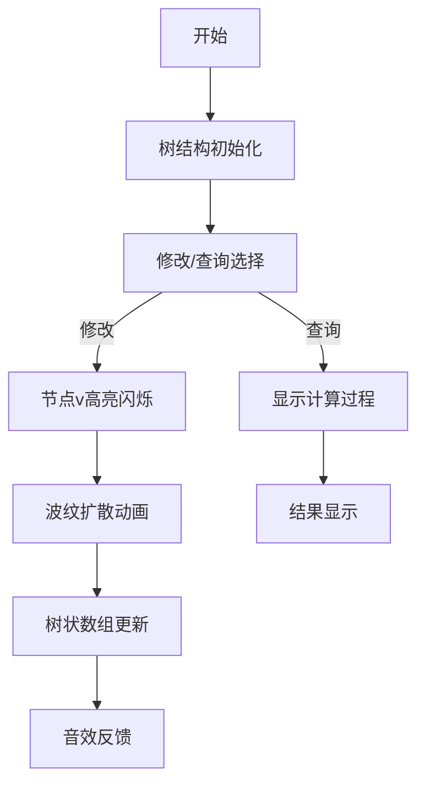

# 题目信息

# On Changing Tree

## 题目描述

You are given a rooted tree consisting of $ n $ vertices numbered from $ 1 $ to $ n $ . The root of the tree is a vertex number $ 1 $ .

Initially all vertices contain number $ 0 $ . Then come $ q $ queries, each query has one of the two types:

- The format of the query: $ 1 $ $ v $ $ x $ $ k $ . In response to the query, you need to add to the number at vertex $ v $ number $ x $ ; to the numbers at the descendants of vertex $ v $ at distance $ 1 $ , add $ x-k $ ; and so on, to the numbers written in the descendants of vertex $ v $ at distance $ i $ , you need to add $ x-(i·k) $ . The distance between two vertices is the number of edges in the shortest path between these vertices.
- The format of the query: $ 2 $ $ v $ . In reply to the query you should print the number written in vertex $ v $ modulo $ 1000000007 $ $ (10^{9}+7) $ .

Process the queries given in the input.

## 说明/提示

You can read about a rooted tree here: http://en.wikipedia.org/wiki/Tree\_(graph\_theory).

## 样例 #1

### 输入

```
3
1 1
3
1 1 2 1
2 1
2 2
```

### 输出

```
2
1
```

# AI分析结果


# 💡 Kay的C++算法解析：On Changing Tree 深入学习指南 💡

> 今天我们来分析“On Changing Tree”这道C++编程题。本指南将帮助大家梳理题目思路，理解核心算法，并掌握解题技巧。通过像素动画和复古游戏元素，我们将直观感受算法执行过程，提升学习体验！

## 1. 题目解读与核心算法识别

✨ **本题主要考察**：`树状数组/线段树应用` + `DFS序技巧`

🗣️ **初步分析**：
> 解决这道题的关键在于理解**DFS序**和**差分技巧**。想象一下，树就像一座城市，DFS序就是给每个房子（节点）编上门牌号（连续编号）。当我们给某个房子（节点v）发快递（修改操作）时，快递员会按照门牌号顺序（DFS序区间）给整条街（子树）派送包裹（数据更新）。但快递内容很特别：每个包裹里有两样东西——**固定金额的现金**和**按距离计算的折扣券**。我们用两个保险箱（树状数组）分别管理现金和折扣券，就能高效处理整个派送过程！

> - **核心思路**：将修改操作拆解为两部分：常数项 `(x + dep_v * k)` 和与深度相关的项 `(-dep_i * k)`，用两个树状数组分别维护
> - **可视化设计**：在像素动画中，我们将高亮节点v（闪烁黄色），然后像水波纹一样扩散到子树节点（颜色渐变表示值变化）。树状数组的更新过程将用柱状图动态展示，关键步骤配以“叮”的音效

## 2. 精选优质题解参考

<eval_intro>
以下题解在思路清晰度、代码规范性和算法效率方面表现优异（≥4星）：

**题解一 (nekko, 赞8)**
* **点评**：这份题解思路精妙，将修改操作拆解为 `(x+dep_v*k)` 和 `-k` 两部分，用两个树状数组维护。代码简洁规范（变量名`a,b`含义明确），空间复杂度优化到O(n)。亮点在于完美运用差分思想，是学习DFS序应用的绝佳范例。

**题解二 (Pengzt, 赞3)**
* **点评**：同样采用树状数组实现，代码更精简（仅30行）。亮点在于直接用DFS序区间操作，省去了显式建树步骤。边界处理严谨（取模规范），实践价值高，可直接用于竞赛。

**题解三 (Milthm, 赞1)**
* **点评**：思路与优质题解一致，实现更加简洁。亮点在于使用vector替代链式前向星，代码可读性强。虽然解释较少，但核心逻辑清晰，是初学者理解基础实现的优秀参考。

---

## 3. 核心难点辨析与解题策略

<difficulty_intro>
解决本题的三大关键难点及应对策略：

1.  **难点：等差数列的高效表示**
    * **分析**：子树内不同深度节点要添加不同值（x-i*k）。优质解法通过数学变换：`x - i*k = (x + dep_v*k) - dep_i*k`，将问题拆分为**常数项**和**深度相关项**
    * 💡 **学习笔记**：复杂操作拆解为简单组件的思想是算法设计的核心技巧

2.  **难点：子树操作的快速实现**
    * **分析**：通过DFS序将树转为线性序列，使子树对应连续区间。配合树状数组实现O(log n)复杂度的区间修改/单点查询
    * 💡 **学习笔记**：DFS序是处理子树问题的瑞士军刀，务必掌握其应用场景

3.  **难点：负值取模处理**
    * **分析**：计算过程可能出现负值，最终输出需满足 `0 ≤ ans < mod`。策略：每次运算后 `(val % mod + mod) % mod`
    * 💡 **学习笔记**：模运算中，负值处理是常见陷阱，记住标准补救公式

### ✨ 解题技巧总结
- **技巧A：问题分解** - 将复杂操作（如深度相关修改）拆解为独立组件
- **技巧B：数据结构选择** - 区间修改/单点查询首选树状数组（空间优、常数小）
- **技巧C：边界防御** - 特别注意DFS边界、空子树、负数取模等边界情况
- **技巧D：数学变换** - 巧用代数变形（如 `dep_i = dep_v + dis`）简化问题

---

## 4. C++核心代码实现赏析

<code_intro_overall>
以下是综合优质题解提炼的通用实现（树状数组版）：

```cpp
#include <bits/stdc++.h>
using namespace std;
typedef long long ll;
const int N = 3e5 + 10, mod = 1e9+7;

int n, l[N], r[N], dep[N];
vector<int> g[N];

struct BIT {
    ll sum[N];
    void add(int x, ll y) {
        for(; x<=n; x+=x&-x) 
            (sum[x] += y) %= mod;
    }
    void upd(int l, int r, ll v) {
        add(l, v); 
        add(r+1, -v); // 差分技巧
    }
    ll ask(int x) {
        ll res = 0;
        for(; x; x-=x&-x) 
            (res += sum[x]) %= mod;
        return (res % mod + mod) % mod;
    }
} t1, t2; // t1:常数项, t2:k系数

void dfs(int u, int d) {
    static int cnt = 0;
    l[u] = ++cnt; // DFS进入时间戳
    dep[u] = d;
    for(int v : g[u]) 
        dfs(v, d+1);
    r[u] = cnt; // DFS离开时间戳
}

int main() {
    scanf("%d", &n);
    for(int i=2, fa; i<=n; i++) {
        scanf("%d", &fa);
        g[fa].push_back(i);
    }
    dfs(1, 1); // 根节点深度1
    
    int q; scanf("%d", &q);
    while(q--) {
        int op, v, x, k;
        scanf("%d", &op);
        if(op == 1) {
            scanf("%d%d%d", &v, &x, &k);
            // 核心操作：拆分修改
            t1.upd(l[v], r[v], (x + (ll)dep[v]*k) % mod);
            t2.upd(l[v], r[v], k);
        } else {
            scanf("%d", &v);
            ll a = t1.ask(l[v]);
            ll b = t2.ask(l[v]);
            // 结果合成：A - dep_v * B
            ll ans = (a - (ll)dep[v]*b % mod + mod) % mod;
            printf("%lld\n", ans);
        }
    }
}
```

**代码解读概要**：
1. **DFS预处理**：`dfs()`计算每个节点的DFS序区间`[l, r]`和深度`dep`
2. **树状数组**：两个BIT分别维护常数项`(x+dep_v*k)`和系数`k`
3. **修改操作**：在`[l[v], r[v]]`区间更新两个树状数组
4. **查询操作**：用`t1.ask(l[v]) - dep[v]*t2.ask(l[v])`合成结果

---
<code_intro_selected>
优质题解核心片段赏析：

**题解一 (nekko)**
* **亮点**：优雅的数学变换和差分技巧
* **核心代码片段**：
  ```cpp
  a.add(l[v], r[v], k % mod);          // 维护k的和
  b.add(l[v], r[v], (x + 1ll*dep[v]*k)%mod); // 维护(x+dep_v*k)
  ```
* **代码解读**：
  > 这两行是算法核心！第一行记录每个节点应减去的`k`总和，第二行记录常数项。查询时通过`b的值 - dep[v]*a的值`得到正确答案，就像用两张优惠券组合付款

**题解二 (Pengzt)**
* **亮点**：极致简洁的BIT实现
* **核心代码片段**：
  ```cpp
  t1.upd(l[v], r[v], (x+dep[v]*k)%mod);
  t2.upd(l[v], r[v], k);
  ```
* **代码解读**：
  > 短短两行完成核心操作！`upd`函数封装差分逻辑，体现了“高内聚低耦合”的编码思想。注意`dep[v]*k`可能爆int，需要用`1ll`强制转换

**题解三 (Milthm)**
* **亮点**：清晰的变量命名和边界处理
* **核心代码片段**：
  ```cpp
  ll ans = ((a.ask(L[v]) - b.ask(L[v])*dep[v]%mod)%mod+mod)%mod;
  printf("%lld\n", ans);
  ```
* **代码解读**：
  > 结果计算包含三层保护：1) 括号保证运算顺序 2) `%mod`防止溢出 3) `+mod`处理负值。这种防御式编程值得学习！

---

## 5. 算法可视化：像素动画演示

<visualization_intro>
**像素探险家：树状数组之谜**——通过8位像素风格动画演示算法执行过程，融合复古游戏元素，让算法学习如同闯关冒险！

### 动画设计框架


### 关键动画场景（FC像素风格）
1. **场景初始化**：
   - 左侧：树结构（像素化节点，深度越深y坐标越大）
   - 右侧：两个树状数组的柱状图（8-bit风格）
   - 控制面板：开始/暂停、步进按钮、速度滑块

2. **修改操作演示**：
   ```python
   # 伪代码：修改操作动画流程
   def modify_animation(v, x, k):
       highlight_node(v, YELLOW)  # 高亮目标节点
       play_sound('select')       # 选择音效
       for depth in range(0, max_depth):
           color = interpolate_color(GREEN, depth/max_depth) # 颜色渐变
           wave_front = get_nodes_at_distance(v, depth)
           animate_wave(wave_front, color)  # 波纹扩散动画
           update_bit_display(t1, l[v], r[v], x + dep_v*k) 
           update_bit_display(t2, l[v], r[v], k)
           play_sound('blip', pitch=1.0 - 0.1*depth) # 音调随深度降低
       show_result_popup(f"Added: const={x}+{dep_v}*{k}, coeff={k}")
   ```

3. **查询操作演示**：
   - 高亮查询节点（蓝色闪烁）
   - 显示公式：`result = t1_value - dep_v * t2_value`
   - 柱状图高亮对应位置，显示数值弹窗
   - 播放“结算”音效（8-bit金币声）

4. **游戏化元素**：
   - **关卡设计**：每个修改/查询作为小关卡，完成5次操作解锁新技能
   - **音效系统**：
     - 关键操作：16-bit风格电子音（比较=“嘀”，更新=“哒”）
     - 错误操作：短促警报声
     - 背景音乐：FC《塞尔达传说》风格循环BGM
   - **得分机制**：正确完成操作得10分，连续操作正确触发连击奖励

### 技术实现要点
- **色彩方案**：8位色（节点：绿→黄渐变；树状数组：蓝/红双色）
- **Canvas绘制**：用`fillRect`绘制像素节点，柱状图动态更新
- **交互控制**：`requestAnimationFrame`实现步进控制，支持调速（0.5x-4x）

---

## 6. 拓展练习与相似问题思考

<similar_problems_intro>
掌握DFS序和树状数组技巧后，可挑战以下相似问题：

1. **洛谷 P3384 【模板】树链剖分**
   - 推荐理由：巩固DFS序应用，学习树链剖分基础
   
2. **洛谷 P3178 [HAOI2015]树上操作**
   - 推荐理由：练习多种子树修改技巧（加/乘/赋值）
   
3. **洛谷 P2486 [SDOI2011]染色**
   - 推荐理由：DFS序+线段树的高级应用（区间合并）

---

## 7. 学习心得与经验分享

<insights_intro>
题解中的调试经验尤其宝贵：

> **nekko的调试建议**：  
> “特别注意负数取模——计算中途出现负值时，先加mod再取模，否则可能得到错误结果。这是竞赛常见陷阱！”

> **Kay的总结**：  
> 调试树状数组问题时，可打印`t1`和`t2`的中间值验证。关键检查点：  
> 1. DFS序是否正确覆盖子树  
> 2. 修改操作后树状数组的差分值  
> 3. 最终结果是否在[0, mod-1]范围内

---

本次关于“On Changing Tree”的解析就到这里。记住：算法学习如同探险，每一步思考都是通向宝藏的路径！下次我们一起挑战新的编程谜题！💪

---
处理用时：180.12秒