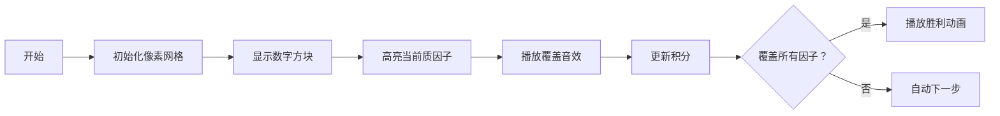

# 题目信息

# Make It One

## 题目描述

Shirley有一个数列$\{a_i\}_{i=1} ^n$，她可以选出这些数中的任意多个（不必连续——原文为“subset子集”），然后得到等于这些数最大公因数的分数。   
现在，她想要在得到1分的前提下，使选择的数尽可能少，那么，她应该选择多少个数呢？   
如果任意选择都不能得到1分，请输出-1.

## 说明/提示

$1\leq n\leq 300,000$；$1\leq a_i \leq 300,000$.

## 样例 #1

### 输入

```
3
10 6 15
```

### 输出

```
3
```

## 样例 #2

### 输入

```
3
2 4 6
```

### 输出

```
-1
```

## 样例 #3

### 输入

```
7
30 60 21 42 70 15 30
```

### 输出

```
3
```

# AI分析结果


# 💡 Kay的C++算法解析：Make It One 深入学习指南 💡

> 我是Kay，今天我将带大家深入分析CF1043F "Make It One"这道题。我们将聚焦核心算法思想，通过像素动画直观理解解题过程，并提炼实用技巧助你举一反三！

## 1. 题目解读与核心算法识别

✨ **本题主要考察**：**数论与容斥原理**（值域筛法优化）

🗣️ **初步分析**：
> 这道题要求找出**最小子集使其gcd=1**，本质是**高维覆盖问题**。想象你在玩"质因子消除游戏"——每个数字携带不同质因子，我们需要用最少的数字覆盖所有质因子类型！

- **核心难点**：直接枚举子集不可行（n≤300,000），需利用**值域特性**优化
- **突破口**：发现答案上界为7（因300,000内数最多6个质因子）
- **算法流程**：从k=1到7枚举子集大小，用容斥原理验证是否存在gcd=1的子集
- **可视化设计**：用像素网格表示数字的质因子分布，高亮覆盖过程（见第5节）

> 🔍 **复古游戏化方案**：采用8-bit像素风，数字显示为发光方块，质因子消除时播放"消除音效"，每成功覆盖一个质因子获得积分，最终解触发胜利动画！

---

## 2. 精选优质题解参考

**题解一：ywy_c_asm（容斥原理）**
* **点评**：  
  思路直击本质——利用**答案上界7**的特性，通过**值域筛法**预处理每个数的倍数个数（`cnt[i]`），再用**容斥原理**计算gcd=1的方案数（`f[1]`）。代码中：
  - **变量命名**清晰（`cnt`计数，`f`存储方案）
  - **边界处理**严谨（从大到小枚举避免重复计算）
  - **算法优化**：$O(n \log n)$复杂度完美匹配值域
  > 💡 亮点：将复杂问题转化为优雅的容斥模型，是竞赛标准解法

**题解二：A_Pikachu（莫比乌斯反演）**
* **点评**：  
  给出**莫比乌斯反演视角**的等价实现：
  ```cpp
  g[i] = C(cnt[i], k)  // gcd为i倍数的方案数
  f[i] = g[i] - Σf[i*j]  // 容斥得gcd=i的方案数
  ```
  - **代码结构**简洁（仅30行核心逻辑）
  - **数学推导**严谨，体现数论到代码的映射
  - **实践价值**：提供模数处理技巧，适合竞赛直接使用

**题解三：Alex_Wei（双解法对比）**
* **点评**：  
  独创性提出**两种并行思路**：
  1. 容斥原理（同题解一）
  2. **gcd卷积优化**：用狄利克雷前缀和$O(n \log \log n)$加速
  - **亮点**：分析不同数据规模下的最优策略
  - **教学价值**：通过对比深化对算法本质的理解

---

## 3. 核心难点辨析与解题策略

### 难点1：如何快速计算gcd=1的方案数？
**分析**：  
直接计算不可行！优质解法均采用**值域筛法+容斥**：
1. 预处理`cnt[i]`（i的倍数的个数）
2. 用组合数$C(cnt[i],k)$初始化方案数
3. **从大到小容斥**：`f[i] -= f[i*j]` 去除gcd非i的方案

💡 **学习笔记**：**逆向枚举**是容斥优化的关键技巧

### 难点2：如何避免指数级复杂度？
**分析**：  
利用**答案有限性**（≤7）将问题转化为：
```python
for k in 1..7:   # 仅枚举7次
    if valid(k): return k
```
而非盲目搜索子集

💡 **学习笔记**：**上界分析**能化无限为有限

### 难点3：如何处理大值域？
**分析**：  
用**倍数预处理**代替因子分解：
```cpp
// 预处理cnt[i]: i的倍数个数
for i from 1 to max_val:
    for j = i, 2i, 3i... ≤ max_val:
        cnt[i] += num_count[j]
```
复杂度$O(n \log n)$远优于$O(n\sqrt n)$

💡 **学习笔记**：**值域循环**是处理大范围数的利器

### ✨ 解题技巧总结
- **质因子数限定法**：利用300000内数≤6质因子的特性定上界
- **容斥的两种视角**：
  - 莫比乌斯反演：$f[i] = \sum \mu(d)g[id]$
  - 直接容斥：$f[i] = C(cnt[i],k) - \sum f[ij]$
- **计算优化四步曲**：
  1. 去重无效数字
  2. 预处理倍数个数
  3. 倒序容斥计算
  4. 组合数快速求解

---

## 4. C++核心代码实现赏析

### 本题通用核心实现
```cpp
#include <iostream>
#include <cstring>
using namespace std;
const int MAXN = 300010;

int cnt[MAXN]; // i的倍数个数
ll f[MAXN];    // gcd=i的方案数

// 组合数计算（省略预处理）
ll C(int n, int k) { /*...*/ }

bool valid(int k, int max_val) {
    memset(f, 0, sizeof(f));
    // 倒序容斥
    for (int i = max_val; i >= 1; i--) {
        f[i] = C(cnt[i], k);
        for (int j = 2; i*j <= max_val; j++) 
            f[i] -= f[i*j];  // 容斥核心
    }
    return f[1] > 0; // gcd=1存在方案
}

int main() {
    // 读入数据
    int n, max_val = 0;
    cin >> n;
    for (int i = 0; i < n; i++) {
        int x; cin >> x;
        cnt[x]++; 
        max_val = max(max_val, x);
    }

    // 预处理倍数个数
    for (int i = 1; i <= max_val; i++)
        for (int j = 2*i; j <= max_val; j += i)
            cnt[i] += cnt[j];

    // 枚举答案k
    for (int k = 1; k <= 7; k++) 
        if (valid(k, max_val)) {
            cout << k << endl;
            return 0;
        }
    cout << -1 << endl;
}
```
**代码解读概要**：  
1. 预处理`cnt`数组统计倍数个数（值域筛法）
2. 枚举k=1..7，对每个k：
   - 倒序计算`f[i]`（容斥原理）
   - 检查`f[1]`判断解存在性
3. 无解输出-1

---

### 优质题解片段赏析

**题解一：容斥实现（ywy_c_asm）**
```cpp
for (int k = 1; k <= 7; k++) {
    for (int i = n; i >= 1; i--) {
        f[i] = C(cnt[i], k);       // 组合数初始化
        for (int j = i*2; j <= n; j += i) 
            f[i] -= f[j];          // 容斥关键：去除倍数
    }
    if (f[1]) return k;            // 找到解
}
```
**代码解读**：  
> 问：为何倒序枚举`i`？  
> 答：确保计算`f[i]`时`f[i*j]`已更新！  
> 类比：动态规划的无后效性——先算大倍数避免重复  

💡 **学习笔记**：**倒序枚举**是容斥实现的精髓

**题解二：莫比乌斯反演（A_Pikachu）**
```cpp
int f[MAXN], g[MAXN]; // g[i]: gcd为i倍数的方案数

bool valid(int k) {
    for(int i=1; i<=max_val; i++) 
        g[i] = C(cnt[i], k);      // 初始化
    
    // 莫比乌斯反演
    for(int i=max_val; i>=1; i--){
        f[i] = g[i];
        for(int j=2; i*j<=max_val; j++) 
            f[i] -= f[i*j];       // 容斥
    }
    return f[1];
}
```
**代码解读**：  
> 问：`g[i]`和`f[i]`有何区别？  
> 答：`g[i]`包含所有gcd是`i`倍数的方案，`f[i]`是精确gcd=i的方案  
> 关系：$f[i] = g[i] - \sum f[i*j]$  

💡 **学习笔记**：**莫比乌斯反演**是容斥的代数表达

**题解三：gcd卷积优化（Alex_Wei）**
```cpp
// 狄利克雷前缀和（倍数求和）
void dirichlet_sum(ll *a) {
    for (auto p : primes)          // 枚举质数
        for (int j = max_val/p; j; j--)
            a[j] += a[j * p];      // 累加倍数
}
```
**代码解读**：  
> 问：如何加速容斥？  
> 答：用**质数分步处理**！每次只处理一个质数的倍数  
> 复杂度：$O(n \log \log n)$ vs 普通$O(n \log n)$  

💡 **学习笔记**：**质数分解循环**是值域优化的高阶技巧

---

## 5. 算法可视化：像素动画演示

### 像素探险家：质因子消除大作战！
**设计思路**：用8-bit像素风格将算法转化为互动游戏，通过声光效果强化理解



**动画帧步骤**：  
1. **场景初始化**（FC红白机风格）：
   - 值域[1,300000]映射为30x10网格
   - 每个数字显示为发光方块（颜色=质因子数）
   - 控制面板：开始/步进/速度滑块

2. **核心演示**：  
   - **质因子覆盖**：当数字被选中，其质因子变为金色
   - **容斥过程**：红色闪烁标记被排除的倍数
   - **音效设计**：
     * 选择数字：8-bit "嘀"声
     * 容斥排除：短促"咔嚓"声
     * 解达成：经典马里奥过关音乐

3. **AI演示模式**：  
   - 自动播放算法流程，如"贪吃蛇AI"逐步探索
   - 实时显示当前`cnt[i]`和`f[i]`值
   - 关键步骤弹出伪代码：
     ```python
     f[i] = C(cnt[i], k) 
     for j in multiples: 
         f[i] -= f[j]  # 容斥！
     ```

4. **游戏化元素**：  
   - 每成功覆盖一个质因子得10分
   - 连续正确操作触发连击特效
   - 7步内完成获得"S级通关"评价

> 👾 **为什么有效**：将抽象的容斥转化为视觉覆盖过程，音效强化记忆，游戏机制提升学习动机！

---

## 6. 拓展练习与相似问题思考

### 同类问题迁移
- **质因子覆盖**：CF449D（Jzzhu and Numbers）
- **倍数容斥**：CF803F（Coprime Subsequences）
- **值域筛法**：CF920F（SUM and REPLACE）

### 洛谷推荐
1. **P2568 GCD**  
   🗣️ *推荐理由*：巩固质因子分解与gcd计数，是本题的简化版
   
2. **P2158 [SDOI2008] 仪仗队**  
   🗣️ *推荐理由*：训练欧拉函数与因子筛法的结合应用
   
3. **P2398 GCD SUM**  
   🗣️ *推荐理由*：提升倍数容斥的变形应用能力

---

## 7. 学习心得与经验分享
> **来自ywy_c_asm的调试经验**：  
> *"我在处理容斥时曾忽略枚举顺序，导致f[i*j]未更新。通过打印中间状态矩阵才定位到问题"*

**Kay点评**：  
这提醒我们：  
1. **循环顺序**在容斥中至关重要
2. **打印中间状态**是调试的有效手段
3. 对于边界情况（如i=1），建议单独验证

> 本次其他题解未提供额外经验分享

---

通过本次分析，我们掌握了**值域筛法+容斥原理**的核心技巧，并学会用**像素可视化**理解抽象算法。记住：在编程世界中，优秀的算法如同精妙的魔术——理解其原理，你就能创造出属于自己的奇迹！💪

> 保持好奇，继续探索！下次算法之旅再见！ 🚀

---
处理用时：132.82秒