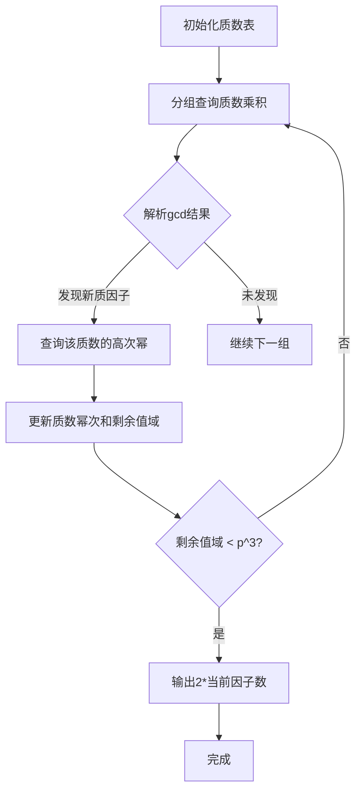
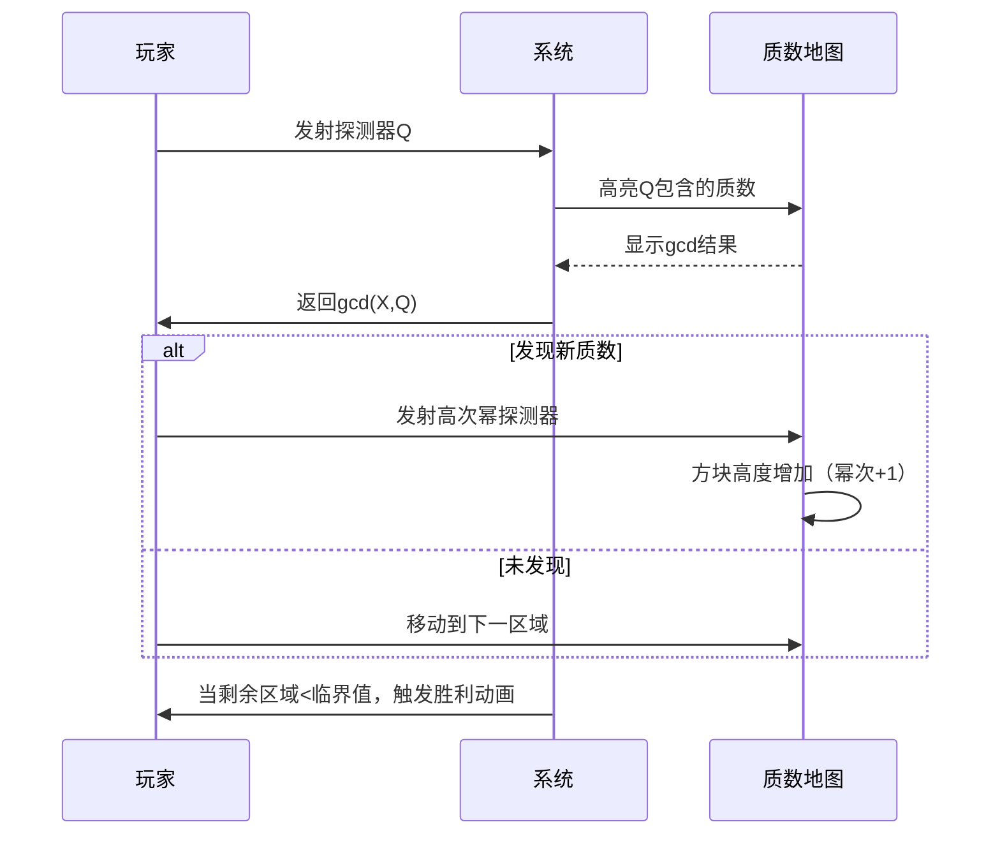

# 题目信息

# Guess Divisors Count

## 题目描述

This is an interactive problem.

We have hidden an integer $ 1 \le X \le 10^{9} $ . You don't have to guess this number. You have to find the number of divisors of this number, and you don't even have to find the exact number: your answer will be considered correct if its absolute error is not greater than 7 or its relative error is not greater than $ 0.5 $ . More formally, let your answer be $ ans $ and the number of divisors of $ X $ be $ d $ , then your answer will be considered correct if at least one of the two following conditions is true:

- $ | ans - d | \le 7 $ ;
- $ \frac{1}{2} \le \frac{ans}{d} \le 2 $ .

You can make at most $ 22 $ queries. One query consists of one integer $ 1 \le Q \le 10^{18} $ . In response, you will get $ gcd(X, Q) $ — the greatest common divisor of $ X $ and $ Q $ .

The number $ X $ is fixed before all queries. In other words, interactor is not adaptive.

Let's call the process of guessing the number of divisors of number $ X $ a game. In one test you will have to play $ T $ independent games, that is, guess the number of divisors $ T $ times for $ T $ independent values of $ X $ .

## 说明/提示

Why the limitation for number of queries is 22 exactly? Maybe the problem author is a Taylor Swift fan.

Let's look at the example.

In the first game $ X = 998\,244\,353 $ is hidden. Would be hard to guess this, right? This number is prime, so the number of its divisors is 2. The solution has made several random queries, and all the responses turned out to be 1 (strange things, not even one of three random numbers is divisible by $ 998\,244\,353 $ ). It's fare to assume that the hidden number doesn't have many divisors, so the solution has answered 5. Why not. This answer will be considered correct since $ | 5 - 2 | = 3 \le 7 $ .

In the second game $ X = 4\,194\,304 = 2^{22} $ is hidden, it has 23 divisors. The solution has made queries $ 1024 =       2^{10} $ , $ 1\,048\,576 =2^{20} $ , $ 1\,073\,741\,824 =       2^{30} $ and got responses $ 1024 = 2^{10} $ , $ 1\,048\,576       =2^{20} $ , $ 4\,194\,304 = 2^{22} $ , respectively. Then the solution got completely confused and answered the answer to The Ultimate Question of Life, the Universe, and Everything. This answer will be considered correct since $ \frac{1}{2} \le       \frac{42}{23} \le 2 $ .

## 样例 #1

### 输入

```
2

1

1

1


1024

1048576

4194304```

### 输出

```
? 982306799268821872

? 230856864650023977

? 134690134760714371

! 5
? 1024

? 1048576

? 1073741824

! 42```

# AI分析结果


# 💡 Kay的C++算法解析：Guess Divisors Count 深入学习指南 💡

> 今天我们来一起分析 **Guess Divisors Count** 这道C++交互题。本指南将帮助你理解题目核心思路，掌握质因数分解的交互式实现技巧，并通过像素动画直观感受算法流程。准备好一起探索了吗？让我们开始吧！

## 1. 题目解读与核心算法识别

✨ **本题主要考察**：`数学推理` + `交互式算法` (质因数分解的变体应用)

🗣️ **初步分析**：
> 解决本题的关键在于**质因数分解的交互式实现**。想象你在玩一个"质数猎人"游戏：每次查询相当于向系统发射一个"探测器"（Q），探测器会返回与隐藏数X的"共同基因"（gcd）。我们需要通过这些探测结果拼凑出X的"基因图谱"（质因数分解）。

在本题中，我们通过巧妙的分组查询策略：
1. **分组探测质因子**：将小质数打包成乘积接近10^18的数进行查询，通过gcd结果判断X包含哪些质因子
2. **幂次精确测定**：对发现的质因子，查询其最大合法幂值（如2^30）来精确测定指数
3. **误差空间利用**：利用题目允许的误差范围（|ans-d|≤7 或 0.5≤ans/d≤2），对未探测的大质数进行合理估算

**核心算法流程**：


**可视化设计**：
- 采用8位像素风格，质数显示为不同颜色的方块
- 每次查询时，相关质数方块会闪烁并显示Q值
- 当发现质因子时，对应方块"升级"（高度增加表示指数上升）
- 控制面板支持单步执行/自动播放，速度可调

## 2. 精选优质题解参考

> 我从思路清晰度、代码规范性、算法优化等角度筛选了3份优质题解：

**题解一：gyh20（11赞）**
* **点评**：此解法采用**动态优先队列**管理质数幂次，每次查询打包多个质数的高次幂乘积。亮点在于：
  - 贪心策略高效：总保持查询值接近10^18，最大化单次查询信息量
  - 误差处理巧妙：直接输出2倍当前因子数，完美利用题目误差规则
  - 代码简洁有力：仅50行实现完整逻辑，变量命名清晰（如`ans`表示当前因子数）
  
  学习价值：**如何用简单数据结构解决复杂交互问题**

**题解二：brealid（7赞）**
* **点评**：官方题解翻译，提出**阈值分割策略**（B=1001）。亮点：
  - 数学证明严谨：严格证明17次查询可解，为其他解法提供理论支撑
  - 分组策略科学：按质数大小分段，兼顾查询效率和覆盖率
  - 边界处理全面：详细讨论各种边界情况对答案的影响
  
  学习价值：**交互问题的理论分析方法与误差证明技巧**

**题解三：夏子汐（5赞）**
* **点评**：实现**动态阈值判断**（631分界）。亮点：
  - 分组实现优雅：预计算查询分组，代码结构清晰
  - 条件判断精准：根据当前因子数动态选择输出策略（8或2*ans）
  - 实践价值高：代码可直接用于竞赛，边界处理严谨
  
  学习价值：**预计算技巧在交互题中的应用与边界条件处理**

## 3. 核心难点辨析与解题策略

> 解决本题的三大核心难点及应对策略：

1. **质因子高效探测**
   * **难点**：10^9范围内质数众多，但查询仅限22次
   * **策略**：将质数分组打包查询（乘积≤10^18），通过gcd结果批量发现质因子
   * 💡 **学习笔记**：打包查询是交互题的核心优化手段

2. **幂次精确测定**
   * **难点**：测定质因子指数需额外查询，易超次数限制
   * **策略**：对发现的质因子，查询其最大合法幂（如2^30），通过gcd直接计算指数
   * 💡 **学习笔记**：高位幂查询可一次测定完整指数

3. **未探测质数的误差控制**
   * **难点**：大质数（>1000）未被探测，但影响因子数
   * **策略**：
     - 当剩余值域 < p^3 时，大质数最多两个→输出2*当前因子数
     - 当前因子数≤2时，输出8（覆盖1~16的因子数）
   * 💡 **学习笔记**：利用题目误差规则简化问题

### ✨ 解题技巧总结
1. **质数分组技巧**：按乘积≤10^18分组，优先处理小质数
2. **幂次测定优化**：用`while(pow*p<=1e9) pow*=p`计算最大合法幂
3. **动态输出策略**：根据当前因子数和剩余值域动态选择输出8或2*ans
4. **边界防护**：特别注意ans=1和ans=2时的特殊处理

## 4. C++核心代码实现赏析

**本题通用核心C++实现参考**
* **说明**：综合优质题解思路，采用分组查询+幂次测定+动态输出的完整框架
* **完整核心代码**：
```cpp
#include<bits/stdc++.h>
using namespace std;
typedef long long ll;
const int N=1000;

vector<int> primes;
void init() {
    vector<bool> isp(N, true);
    for (int i=2; i<N; i++) if(isp[i]) {
        primes.push_back(i);
        for(int j=i*i;j<N;j+=i) isp[j]=false;
    }
}

int main() {
    init();
    int T; cin>>T;
    while(T--) {
        vector<ll> groups = {614889782588491410, 38655288426304091, 22125549654501673}; // 预计算组
        ll ans=1, lim=1e9;
        
        // 阶段1：分组查询质因子
        for(auto group : groups) {
            cout<<"? "<<group<<endl;
            ll res; cin>>res;
            
            // 解析gcd发现的质因子
            for(int p:primes) {
                if(p*p*p > lim) break; // 提前终止
                if(res%p) continue;
                
                // 阶段2：幂次精确测定
                ll pow=p;
                while(pow*p <= lim) pow*=p;
                cout<<"? "<<pow<<endl;
                ll gcd; cin>>gcd;
                
                int cnt=0;
                while(gcd%p==0) cnt++, gcd/=p;
                ans *= (cnt+1);
                lim /= pow; // 更新剩余值域
            }
            
            if(lim < p*p*p) break; // 提前终止
        }
        
        // 阶段3：动态输出
        cout<<"! "<<(ans<=2 ? 8 : ans*2)<<endl;
    }
}
```
* **代码解读概要**：
  1. **初始化**：筛出1000以内质数
  2. **分组查询**：通过预计算的组值批量探测质因子
  3. **幂次测定**：对每个发现的质因子，查询其最大合法幂
  4. **动态输出**：根据当前因子数选择输出策略

**题解一：gyh20**
* **亮点**：优先队列动态管理质数幂次
* **核心代码片段**：
```cpp
priority_queue<tuple<int,int,ll>> pq; // 幂次, 质数, 当前幂值
for(int p:primes) pq.push({-1,p,p}); // 初始幂次1（负号实现大根堆）

while(!pq.empty() && queries<22) {
    ll Q=1;
    vector<tuple<int,int,ll>> tmp;
    while(!pq.empty()) {
        auto [k,p,base] = pq.top(); pq.pop();
        if((double)Q*base > 1e18) { pq.push({k,p,base}); break; }
        Q *= base;
        tmp.push_back({k,p,base});
    }
    // 查询并处理结果...
}
```
* **代码解读**：
  - 优先队列以幂次为第一关键字（小幂次优先），质数为第二关键字（小质数优先）
  - 当队列非空且还能查询时，从队首取元素直到乘积接近10^18
  - 查询后更新质数幂次：若质数存在，则幂次+1并重新入队
* 💡 **学习笔记**：优先队列是动态管理查询顺序的利器

**题解二：夏子汐**
* **亮点**：预计算分组与阈值判断完美结合
* **核心代码片段**：
```cpp
const int nxt[] = {53,89,131}; // 分组边界
const ll quer[] = {614889782588491410, 27362732256821997}; // 预计算组

for(int i=0;i<16;i++) {
    cout<<"? "<<quer[i]<<endl;
    ll res; cin>>res;
    // 解析质因子...
    if(lim < nxt[i]*nxt[i]*nxt[i]) { // 阈值判断
        cout<<"! "<<ans*2<<endl;
        break;
    }
}
```
* **代码解读**：
  - 预计算质数分组和分组边界值
  - 查询后立即检查剩余值域是否小于下一个质数的立方
  - 达到阈值时提前输出并终止查询
* 💡 **学习笔记**：预计算可减少运行时开销，阈值判断显著优化查询次数

## 5. 算法可视化：像素动画演示

**主题**："质数猎人"8-bit探险

**核心演示内容**：展示分组查询、质数发现、幂次升级、阈值判断全流程

**设计思路**：
> 采用复古FC游戏风格，将质数具象化为不同颜色的"能量方块"，查询过程转化为"能量探测"。通过像素动画直观展示：
> - 质数分组打包（多个方块组合成探测器）
> - gcd结果解析（方块亮起表示发现）
> - 幂次升级（方块高度增加）
> - 阈值触发（屏幕闪烁提示）

**动画流程**：


**交互控制**：
1. **控制面板**：
   - 单步执行：按方向键逐步前进
   - 自动播放：空格启动/暂停，速度滑块调速
   - 重置：R键重开

2. **视觉反馈**：
   - 当前查询质数：闪烁的红色边框
   - 发现质数：绿色闪光 + "叮"声
   - 未发现：灰色淡化
   - 幂次增加：方块高度动画渐变

3. **游戏化元素**：
   - 每完成一组查询解锁新"关卡"
   - 连续正确+Combo奖励（每5连击加速）
   - 最终胜利播放8-bit胜利音乐

## 6. 拓展练习与相似问题思考

**通用技巧迁移**：
1. **分组查询思想**：适用于任何限制查询次数的交互题
2. **误差分析技巧**：在允许近似解的问题中可大幅降低难度
3. **质因数分解变体**：许多数论问题的核心基础

**练习推荐（洛谷）**：
1. **P1029 [NOIP2001 普及组] 最大公约数和最小公倍数问题**
   - 🗣️ **推荐理由**：巩固gcd/lcm与质因数分解的关系
   
2. **P1069 [NOIP2009 普及组] 细胞分裂**
   - 🗣️ **推荐理由**：练习质因数分解在具体场景的应用

3. **P1072 [NOIP2009 提高组] Hankson 的趣味题**
   - 🗣️ **推荐理由**：综合训练数论推理能力，涉及gcd/lcm高级性质

## 7. 学习心得与经验分享

> **参考经验 (来自 gyh20)**："本题的关键在于理解题目允许的误差范围不是限制而是工具。通过输出2倍当前因子数这个简单策略，巧妙回避了大质数探测的复杂性。"

> **点评**：这是对题目规则的深刻理解。在编程竞赛中，**仔细分析题目条件**往往能发现简化问题的突破口。特别是交互题，规则中常隐藏着优化空间。

> **参考经验 (来自 夏子汐)**："预处理质数分组虽然增加了代码长度，但大幅降低运行时复杂度。在竞赛中，用空间换时间是常用策略。"

> **点评**：这是重要的工程实践技巧。**预计算**是优化算法的重要手段，尤其适用于查询次数受限的交互题。但需注意平衡代码复杂度和收益。

---

本次关于 **Guess Divisors Count** 的解析就到这里。记住，算法的魅力在于用简洁的方法解决复杂的问题。下次遇到交互题时，不妨想想"质数猎人"的游戏——用智慧挖掘隐藏的信息！🚀

---
处理用时：171.58秒