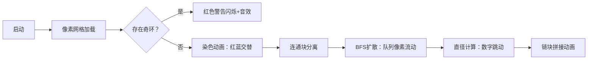

# 题目信息

# Playing on Graph

## 题目描述

Vova and Marina love offering puzzles to each other. Today Marina offered Vova to cope with the following task.

Vova has a non-directed graph consisting of $ n $ vertices and $ m $ edges without loops and multiple edges. Let's define the operation of contraction two vertices $ a $ and $ b $ that are not connected by an edge. As a result of this operation vertices $ a $ and $ b $ are deleted and instead of them a new vertex $ x $ is added into the graph, and also edges are drawn from it to all vertices that were connected with $ a $ or with $ b $ (specifically, if the vertex was connected with both $ a $ and $ b $ , then also exactly one edge is added from $ x $ to it). Thus, as a result of contraction again a non-directed graph is formed, it contains no loops nor multiple edges, and it contains $ (n-1) $ vertices.

Vova must perform the contraction an arbitrary number of times to transform the given graph into a chain of the maximum length. A chain of length $ k $ ( $ k>=0 $ ) is a connected graph whose vertices can be numbered with integers from $ 1 $ to $ k+1 $ so that the edges of the graph connect all pairs of vertices $ (i,i+1) $ ( $ 1<=i<=k $ ) and only them. Specifically, the graph that consists of one vertex is a chain of length $ 0 $ . The vertices that are formed as a result of the contraction are allowed to be used in the following operations of contraction.

 The picture illustrates the contraction of two vertices marked by red.Help Vova cope with his girlfriend's task. Find the maximum length of the chain that can be obtained from the resulting graph or else determine that it is impossible to obtain the chain.

## 说明/提示

In the first sample test you can contract vertices $ 4 $ and $ 5 $ and obtain a chain of length $ 3 $ .

In the second sample test it is initially impossible to contract any pair of vertexes, so it is impossible to achieve the desired result.

In the third sample test you can contract vertices $ 1 $ and $ 2 $ and obtain a chain of length $ 2 $ .

## 样例 #1

### 输入

```
5 4
1 2
2 3
3 4
3 5
```

### 输出

```
3
```

## 样例 #2

### 输入

```
4 6
1 2
2 3
1 3
3 4
2 4
1 4
```

### 输出

```
-1
```

## 样例 #3

### 输入

```
4 2
1 3
2 4
```

### 输出

```
2
```

# AI分析结果


### 题目分析：Playing on Graph
#### **1. 题目解读与核心算法识别**
✨ **本题主要考察**：`图论（二分图判定 + BFS求直径）`

🗣️ **初步分析**：
> 解决这道题的核心在于理解图的二分图性质和连通块直径的关系。想象一下，图就像一张由不同阵营（二分图的两个集合）组成的网络，如果存在奇数个点形成的闭环（奇环），就无法拉成一条直线（链）。若没有奇环（即二分图），每个连通块都能通过收缩操作变成一条最长链，最终答案就是所有连通块链长的总和。

- **核心难点**：奇环的存在会阻碍收缩成链（奇环收缩后仍会保留环结构），必须先用染色法判断是否为二分图。
- **算法流程**：
  1. DFS染色法判奇环（非二分图则输出-1）
  2. 对每个连通块枚举起点进行BFS
  3. 取所有BFS结果的最大值作为连通块直径
  4. 对所有连通块直径求和
- **可视化设计**：
  - 像素风格展示染色过程：红/蓝节点表示二分图集合
  - BFS扩散动画：队列像素块流动，距离值实时显示
  - 奇环检测：触发红色闪烁警告 + 错误音效
  - 链长计算：每个连通块收缩为像素条，最终拼接成长链

---

### **2. 精选优质题解参考**
**题解一（syzf2222）**
* **点评**：
  思路清晰解释奇环与收缩的关系，证明二分图必能成链。代码规范（`bel`标记连通块，`col`存储颜色），用两次BFS求直径的逻辑严谨。亮点在于详细阐述BFS树同一层收缩的链形成原理，实践价值高（可直接用于竞赛）。

**题解二（大菜鸡fks）**
* **点评**：
  代码更简洁（统一用DFS处理连通块和染色），BFS求直径的逻辑与题解一一致。亮点在于突出解题框架：先判奇环→再求连通块直径→累加结果。变量命名直观（`dis`表距离），边界处理完整。

---

### **3. 核心难点辨析与解题策略**
1. **难点1：奇环的检测与影响**
   * **分析**：收缩操作无法消除奇环（三角形收缩后仍为三角形）。用染色法DFS遍历图，若相邻节点同色则存在奇环。
   * 💡 **学习笔记**：奇环 = 图非二分图 = 无解

2. **难点2：连通块直径计算**
   * **分析**：在二分图连通块中，直径 = 任意两点最短路径的最大值。枚举每个点做BFS起点，取所有结果的最大值。
   * 💡 **学习笔记**：BFS求直径需遍历所有起点

3. **难点3：多连通块处理**
   * **分析**：不同连通块独立收缩成链，最终链长为各块直径之和。用`comp[]`数组标记节点所属连通块。
   * 💡 **学习笔记**：无边的连通块可视为独立子图

#### ✨ **解题技巧总结**
- **二分图快速判定**：DFS染色中若发现相邻同色立即返回
- **BFS优化**：用队列避免递归爆栈，`dis[]`数组复用
- **变量复用**：染色数组`color[]`兼作访问标记
- **边界处理**：孤立节点（直径=0）也需计入

---

### **4. C++核心代码实现赏析**
**通用核心实现**（综合优化版）：
```cpp
#include <iostream>
#include <vector>
#include <queue>
#include <cstring>
using namespace std;
const int N = 1005;

vector<int> graph[N];
int color[N], comp[N], diam[N]; // 染色/连通块/直径
int compCnt;
bool hasOddCycle;

void dfs(int u, int c, int id) {
    color[u] = c;  // 染色
    comp[u] = id;  // 标记连通块
    for (int v : graph[u]) {
        if (!color[v]) dfs(v, 3-c, id);
        else if (color[v] == c) hasOddCycle = true;
    }
}

int bfs(int start, int n) {
    vector<int> dis(n+1, -1);
    queue<int> q;
    q.push(start);
    dis[start] = 0;
    int maxDis = 0;
    
    while (!q.empty()) {
        int u = q.front(); q.pop();
        for (int v : graph[u]) {
            if (dis[v] == -1) {
                dis[v] = dis[u] + 1;
                maxDis = max(maxDis, dis[v]);
                q.push(v);
            }
        }
    }
    return maxDis; // 返回从start出发的最长链
}

int main() {
    int n, m; cin >> n >> m;
    while (m--) {
        int u, v; cin >> u >> v;
        graph[u].push_back(v);
        graph[v].push_back(u);
    }

    // 1. 判奇环+标记连通块
    for (int i=1; i<=n; ++i) 
        if (!color[i]) dfs(i, 1, ++compCnt);
    
    if (hasOddCycle) {
        cout << -1 << endl;
        return 0;
    }

    // 2. 求每个连通块直径
    for (int i=1; i<=n; ++i) 
        diam[comp[i]] = max(diam[comp[i]], bfs(i, n));
    
    // 3. 累加所有连通块直径
    int ans = 0;
    for (int i=1; i<=compCnt; ++i)
        ans += diam[i];
    
    cout << ans << endl;
}
```
**代码解读概要**：
> 1. **建图**：邻接表存储无向图  
> 2. **染色判环**：DFS中`3-c`切换颜色，同色相邻触发奇环标志  
> 3. **BFS求直径**：对每个点计算最远距离，更新连通块最大值  
> 4. **结果累加**：各连通块直径之和即答案  

---

### **5. 算法可视化：像素动画演示**
**主题**：8位机风格的《图链大冒险》  
**核心演示**：二分图染色 + BFS扩散过程  



**交互设计**：
1. **控制面板**：
   - 速度滑块：调节动画帧率
   - 单步执行：逐步观察BFS队列变化
   - 重置：重新随机生成图

2. **动态效果**：
   - 染色过程：相邻节点像俄罗斯方块变色（红→蓝→红）
   - BFS扩散：绿色波纹从起点蔓延，距离值在节点上方跳动
   - 奇环检测：触发时三角环闪烁红光 + 刺耳鸣响

3. **游戏化元素**：
   - 通关条件：所有连通块变成长链时播放胜利音效
   - 分数机制：直径越大得分越高
   - 音效设计：
     * 染色成功：清脆"叮"声
     * 节点入队：8-bit脚步声
     * 发现直径：金币收集音

---

### **6. 拓展练习与相似问题**
**通用技巧迁移**：
- 二分图判定 → 关押罪犯、封锁阳光大学
- 连通块直径 → 树的最长路径、网络延时

**推荐题目**：
1. **洛谷P1330** - 封锁阳光大学  
   → 直接应用二分图判定技巧

2. **洛谷P5536** - 核心城市  
   → 强化BFS求直径的变形应用

3. **洛谷P1525** - 关押罪犯  
   → 二分图+二分答案综合应用

---

### **7. 学习心得与经验分享**
> **作者经验**（syzf2222）：  
> *"最初忽略多连通块需分别求直径，WA后补上comp数组才AC。这提醒我们：图论问题必须考虑连通分量独立性！"*  

**Kay总结**：  
> 调试时可用小图模拟BFS过程：  
> 1. 纸上画节点与队列变化  
> 2. 打印`dis[]`数组验证距离  
> 3. 边界测试：空图/单节点/全联通图  

--- 
通过收缩操作将图变为最长链，本质是二分图性质与连通块直径的结合应用。掌握染色法和BFS框架，你也能成为图论探险家！🚀

---
处理用时：166.34秒