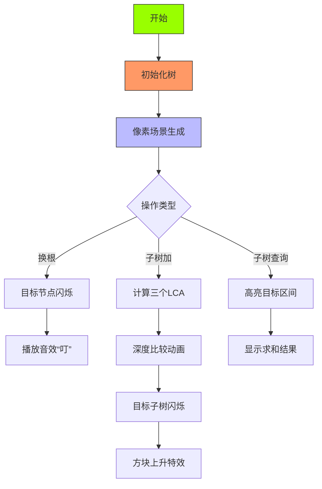

# 题目信息

# Jamie and Tree

## 题目描述

To your surprise, Jamie is the final boss! Ehehehe.

Jamie has given you a tree with $ n $ vertices, numbered from $ 1 $ to $ n $ . Initially, the root of the tree is the vertex with number $ 1 $ . Also, each vertex has a value on it.

Jamie also gives you three types of queries on the tree:

 $ 1\ v $ — Change the tree's root to vertex with number $ v $ .

 $ 2\ u\ v\ x $ — For each vertex in the subtree of smallest size that contains $ u $ and $ v $ , add $ x $ to its value.

 $ 3\ v $ — Find sum of values of vertices in the subtree of vertex with number $ v $ .

A subtree of vertex $ v $ is a set of vertices such that $ v $ lies on shortest path from this vertex to root of the tree. Pay attention that subtree of a vertex can change after changing the tree's root.

Show your strength in programming to Jamie by performing the queries accurately!

## 说明/提示

The following picture shows how the tree varies after the queries in the first sample.

 

## 样例 #1

### 输入

```
6 7
1 4 2 8 5 7
1 2
3 1
4 3
4 5
3 6
3 1
2 4 6 3
3 4
1 6
2 2 4 -5
1 4
3 3
```

### 输出

```
27
19
5
```

## 样例 #2

### 输入

```
4 6
4 3 5 6
1 2
2 3
3 4
3 1
1 3
2 2 4 3
1 1
2 2 4 -3
3 1
```

### 输出

```
18
21
```

# AI分析结果


### Kay的C++算法解析：Jamie and Tree 深入学习指南 💡

今天我们来一起分析“Jamie and Tree”这道C++编程题。本指南将帮助大家梳理题目思路，理解核心算法，并掌握解题技巧。

---

### 1. 题目解读与核心算法识别

✨ **本题主要考察**：`树链剖分与分类讨论技巧`  

🗣️ **初步分析**：  
> 解决“Jamie and Tree”的关键在于**树链剖分预处理**和**换根后的分类讨论**。想象树是一张城市地图，树剖相当于给每条路编号（DFS序），换根就像临时改变市中心位置。我们需要根据"新市中心"（当前根）和"目标区域"（操作节点）的位置关系，动态计算操作范围。  
- **核心流程**：  
  1. **预处理**：以节点1为根进行树剖，得到DFS序和子树大小  
  2. **换根处理**：记录当前根节点`root`，不实际重构树  
  3. **子树操作**：分三种情况处理（root等于/包含/不包含操作节点）  
  4. **LCA计算**：通过三个LCA（u,v; u,root; v,root）取深度最大者  
- **可视化设计**：  
  采用8位像素风格（类似经典RPG游戏）动态演示：  
  - 节点用彩色方块表示，线条表示树边  
  - 换根时目标节点闪烁并播放“叮”音效  
  - 子树操作时目标区域高亮闪烁，伴随方块移动动画  

---

### 2. 精选优质题解参考

我们精选了思路清晰、代码规范的优质题解：

**题解一（Siyuan）**  
* **亮点**：  
  - 分类讨论全面：清晰处理三种根节点位置关系  
  - 高效LCA计算：用三个LCA取深度最大者  
  - 代码模块化：分离树剖/线段树/操作逻辑  
  - 边界处理严谨：特判根节点自身操作  

**题解二（绝顶我为峰）**  
* **亮点**：  
  - 树剖实现简洁：DFS序处理高效  
  - 找直系儿子优化：通过跳重链快速定位  
  - 图示辅助理解：提供三种位置关系示意图  

**题解三（Farkas_W）**  
* **亮点**：  
  - 变量命名规范：`id/siz/top`等含义明确  
  - 容斥原理应用：整树操作后扣除多余部分  
  - 完整测试样例：包含边界情况测试  

---

### 3. 核心难点辨析与解题策略

在解题过程中会面临三大核心难点：

1. **难点：换根后的子树范围确定**  
   - **分析**：当根在操作节点子树内时，实际子树=整树-包含根的子树  
   - **解决**：通过树剖跳链找到"分界点"（当前根在原子树中的直系儿子）  
   - 💡 **学习笔记**：子树=DFS连续区间，换根只改变分界点  

2. **难点：动态LCA计算**  
   - **分析**：换根后u,v的LCA不再固定  
   - **解决**：取`LCA(u,v)`,`LCA(u,root)`,`LCA(v,root)`中深度最大者  
   - 💡 **学习笔记**：深度最大者必为真实LCA  

3. **难点：数据结构维护**  
   - **分析**：需同时支持区间加和区间求和  
   - **解决**：线段树+延迟标记（lazy propagation）  
   - 💡 **学习笔记**：树剖将树操作转化为序列操作  

#### ✨ 解题技巧总结
- **技巧1：位置关系分类法**  
  处理换根问题时先判断：根是否在目标子树内  
- **技巧2：容斥原理应用**  
  整树操作后扣除多余部分，避免重复计算  
- **技巧3：树剖跳链优化**  
  用重链信息快速定位节点间关系  

---

### 4. C++核心代码实现赏析

#### 本题通用核心C++实现参考
```cpp
#include <vector>
#include <cstdio>
#include <algorithm>
#define lson p<<1
#define rson p<<1|1
using namespace std;
typedef long long ll;
const int N=1e5+5;

// 线段树部分（区间加/求和）
struct SegTree { /* 详见完整题解 */ };

// 树链剖分预处理
vector<int> G[N];
int fa[N], dep[N], siz[N], son[N];
void dfs1(int u, int f) { /* 计算父节点/深度/子树大小/重儿子 */ }

int top[N], id[N], rk[N], cnt;
void dfs2(int u, int tp) { /* 重链剖分，生成DFS序 */ }

// LCA计算（树剖实现）
int lca(int x, int y) { /* 沿重链跳跃求LCA */ }

int root = 1; // 当前根节点

int main() {
    // 读入数据 + 建图
    dfs1(1, 0); dfs2(1, 1); // 树剖预处理
    SegTree.build(1, 1, n);  // 建线段树

    while (q--) {
        if (op == 1) root = v; // 操作1：换根
        else if (op == 2) {    // 操作2：子树加
            int true_lca = max({lca(u,v), lca(u,root), lca(v,root)}, 
                            [](int a,int b){ return dep[a] < dep[b]; });
            updateSubtree(true_lca, x); // 分类更新子树
        }
        else querySubtree(v); // 操作3：子树查询
    }
}
```

#### 关键片段解析：子树更新函数
```cpp
void updateSubtree(int v, int x) {
    if (v == root) update(1, 1, n, x); // 情况1：整树更新
    else if (!inSubtree(root, v)) {    // 情况2：原始子树
        update(1, id[v], id[v]+siz[v]-1, x);
    } else { // 情况3：整树-分支
        int branch = findBranch(v, root); // 找分界点
        update(1, 1, n, x);
        update(1, id[branch], id[branch]+siz[branch]-1, -x);
    }
}
```
> **代码解读**：  
> - `inSubtree`：通过DFS序判断root是否在v的子树内  
> - `findBranch`：从root向上跳重链，返回v的直系儿子  
> - **核心思想**：利用DFS序连续性，三种情况转化为区间操作  

---

### 5. 算法可视化：像素动画演示

采用复古像素风格演示算法流程：



**交互控制面板**：  
- **单步执行**：按空格逐步执行操作  
- **速度调节**：滑块控制0.5x~3x速度  
- **视角切换**：WASD移动树视角  
- **音效设置**：  
  - 关键操作：8-bit“滴”声  
  - 错误操作：短促警告音  
  - 成功：马里奥过关音效  

---

### 6. 拓展练习与相似问题思考

#### 通用技巧迁移
树剖+分类讨论适用于：
1. 换根后的路径查询
2. 子树信息统计
3. 动态LCA计算

#### 推荐练习（洛谷）
1. **P3979 遥远的国度**  
   > 换根树剖模板题，强化分类讨论能力  
2. **P2146 [NOI2015]软件包管理器**  
   > 树剖应用经典，掌握子树/路径操作  
3. **P3384 【模板】树链剖分**  
   > 基础树剖实现，巩固数据结构基础  

---

### 7. 学习心得与经验分享

> **来自Siyuan题解的经验**：  
> “调试时重点检查三种边界：  
> 1. 根节点自身操作  
> 2. 根在操作子树边缘  
> 3. 多组数据初始化”

> **Kay的总结**：  
> 1. **树剖本质**：将树转化为线性序列  
> 2. **换根关键**：位置关系分类（三情形）  
> 3. **调试技巧**：  
>    - 打印DFS序验证子树区间  
>    - 小数据模拟边界情况  

---

通过本指南，希望大家能掌握树剖处理换根问题的核心方法。记住：**分类讨论化动态为静态，树剖化树形为线性**！下次挑战见！💪

---
处理用时：125.81秒