# 题目信息

# Balanced Problem

## 题目描述

There is an array $ a $ consisting of $ n $ integers. Initially, all elements of $ a $ are equal to $ 0 $ .

Kevin can perform several operations on the array. Each operation is one of the following two types:

- Prefix addition — Kevin first selects an index $ x $ ( $ 1\le x\le n $ ), and then for each $ 1\le j\le x $ , increases $ a_j $ by $ 1 $ ;
- Suffix addition — Kevin first selects an index $ x $ ( $ 1\le x\le n $ ), and then for each $ x\le j\le n $ , increases $ a_j $ by $ 1 $ .

In the country of KDOI, people think that the integer $ v $ is balanced. Thus, Iris gives Kevin an array $ c $ consisting of $ n $ integers and defines the beauty of the array $ a $ as follows:

- Initially, set $ b=0 $ ;
- For each $ 1\le i\le n $ , if $ a_i=v $ , add $ c_i $ to $ b $ ;
- The beauty of $ a $ is the final value of $ b $ .

Kevin wants to maximize the beauty of $ a $ after all the operations. However, he had already performed $ m $ operations when he was sleepy. Now, he can perform an arbitrary number (possibly zero) of new operations.

You have to help Kevin find the maximum possible beauty if he optimally performs the new operations.

However, to make sure that you are not just rolling the dice, Kevin gives you an integer $ V $ , and you need to solve the problem for each $ 1\le v\le V $ .

## 说明/提示

In the first test case, the array $ a $ changes as follows for the initial operations: $ [0, 0, 0] \xrightarrow{\mathtt{L}\ 3} [1, 1, 1] \xrightarrow{\mathtt{R}\ 3} [1, 1, 2] \xrightarrow{\mathtt{L}\ 1} [2, 1, 2] $ .

- For $ v=1 $ , it is optimal to not perform any new operations, and the beauty is $ b=c_2=2 $ ;
- For $ v=2 $ , it is optimal to perform a prefix addition operation on index $ 2 $ . After that, $ a $ becomes $ [3,2,2] $ , and the beauty is $ b=c_2+c_3=6 $ .

In the second test case, for both $ v=1 $ and $ v=2 $ , it is optimal to not perform any new operations.

## 样例 #1

### 输入

```
5
3 3 2
1 2 4
L 3
R 3
L 1
3 3 2
5 1 4
L 3
R 3
L 1
5 4 5
1 1 1 1 1
L 3
R 2
L 5
L 4
10 12 9
10 9 8 7 6 5 4 3 2 1
L 2
L 4
R 4
R 4
L 6
R 8
L 3
L 2
R 1
R 10
L 8
L 1
1 1 4
1000000000
L 1```

### 输出

```
2 6
1 9
0 1 3 5 5
0 0 0 6 25 32 35 44 51
1000000000 1000000000 1000000000 1000000000```

# AI分析结果


### 💡 Kay的C++算法解析：Balanced Problem 深入学习指南 💡

<introduction>
今天我们一起分析"Balanced Problem"这道C++编程题。题目要求通过前缀/后缀加操作最大化数组中特定值v的出现贡献。本指南将帮助大家掌握动态规划优化技巧和树状数组的高级应用。
</introduction>

---

## 1. 题目解读与核心算法识别

✨ **本题主要考察**：`动态规划优化`与`树状数组应用`

🗣️ **初步分析**：
> 这道题的核心挑战在于高效处理序列操作后的状态优化。想象你在玩像素积木游戏：初始全是灰色积木（值为0），每次操作可以选择左侧或右侧添加彩色层（前缀/后缀加）。目标是让特定颜色的积木（值v）最多，且每个彩色积木有不同分数（c[i]）。

- **关键思路**：通过合并相同值元素（压缩状态空间）和树状数组优化DP转移，将复杂度从O(n²)降到O(V²logV)
- **可视化设计**：我们将用像素积木塔展示DP过程：每个积木块高度代表a[i]值，颜色变化展示状态转移，树状数组用二进制像素灯表示（亮灯位表示被更新的索引）
- **游戏化交互**：控制面板支持单步执行DP转移，树状数组更新时播放"叮"音效，完成最优解时播放胜利音效

---

## 2. 精选优质题解参考

**题解一：Fesdrer（评分4.5★）**
* **点评**：思路最清晰完整，将问题拆解为状态压缩+双树状数组优化。代码中：
  - 状态定义：`f[i][j]`表示处理前i个元素，最小提升高度j时的最大价值
  - 创新点：用两个树状数组分别处理a[i]≥a[k]和a[i]<a[k]的转移
  - 实践价值：边界处理严谨（`-INF`初始化），可直接用于竞赛
  - 亮点：合并相同值元素减少状态数，复杂度O(V²logV)最优

**题解二：raincity（评分4★）**
* **点评**：从差分角度切入，论证了操作次数的关键不等式：
  ∑|a[i+1]-a[i]| ≤ a[1]+a[n]
  代码实现双树状数组与题解一异曲同工，但变量命名`bit1/bit2`可读性稍弱

**题解三：_lmh_（评分4★）**
* **点评**：创新状态设计`f(a_i,k)`直接关联目标值，但解释较简略。亮点是用单树状数组维护"斜线"方向的后缀最大值

---

## 3. 核心难点辨析与解题策略

1.  **状态空间压缩**
    * **分析**：原始序列含大量冗余（相邻相同值），直接DP会超时。优质解法先合并相同值元素，将序列长从O(n)降至O(V)
    * 💡 **学习笔记**：值域连续时优先考虑状态压缩

2.  **DP状态设计**
    * **分析**：核心矛盾是如何表示"将元素提升到v"的成本。Fesdrer的方案：
      ```math
      f(i,j) = c_i + max{
        max_{a_k>a_i} f(k,j), 
        max_{a_k≤a_i} f(k,j-(a_i-a_k))
      }
      ```
    * 💡 **学习笔记**：DP状态应直接关联"操作成本"和"目标值"

3.  **树状数组优化**
    * **分析**：转移需要区间查询最值，用树状数组：
      - 树状数组1：维护a[i]≥a[k]的转移（固定j维度）
      - 树状数组2：维护j-a[i]维度（偏移量优化）
    * 💡 **学习笔记**：多维DP优先考虑树状数组/线段树优化

### ✨ 解题技巧总结
- **状态压缩**：合并相同值元素，减少DP维度
- **偏移量技巧**：用`j-a[i]+v`处理负索引（raincity解法）
- **双树优化**：分离不同转移条件提升效率
- **滚动更新**：及时清空树状数组避免状态污染

---

## 4. C++核心代码实现赏析

**通用核心实现参考**
```cpp
#include <bits/stdc++.h>
using namespace std;
const int V = 2005;
const long long INF = 1e18;

// 树状数组模板
struct BIT {
    vector<ll> tree;
    BIT(int n) : tree(n + 1, -INF) {}
    void update(int p, ll v) {
        for (; p < tree.size(); p += p & -p)
            tree[p] = max(tree[p], v);
    }
    ll query(int p) {
        ll r = -INF;
        for (; p; p -= p & -p)
            r = max(r, tree[p]);
        return r;
    }
};

int main() {
    // 1. 读入数据并压缩状态
    // 2. 初始化双树状数组
    BIT t1(V+1), t2(V+1); 
    // 3. DP转移
    for (int i = 1; i <= n; i++) {
        for (int j = 0; j <= v; j++) {
            ll case1 = t1.query(V - a[i]); // a[k] >= a[i]
            ll case2 = t2.query(a[i]);      // a[k] < a[i]
            f[i][j] = c[i] + max(case1, case2);
        }
        // 更新树状数组...
    }
    // 4. 输出答案...
}
```

**题解一核心片段**
```cpp
// 状态转移核心
auto get = [&](int x, int y) {
    f[x][y] = val[x] + max(
        ask(0, y, V - a[x]),   // a[k] >= a[i]
        ask(1, y - a[x], a[x]) // a[k] < a[i]
    );
};
```
**代码解读**：
> 这段代码实现了DP状态转移的核心逻辑：
> 1. `ask(0,y,V-a[x])`：在第一个树状数组查询a[k]≥a[i]时的最优解
> 2. `ask(1,y-a[x],a[x])`：在第二个树状数组查询a[k]<a[i]时的最优解
> 3. `val[x]`：当前元素的c值
> 4. 通过max合并两种转移路径，得到新状态值

**题解二创新点**
```cpp
bit2::upd(j - a[i] + v, a[i], f); // 偏移量优化
```
**学习笔记**：通过`j-a[i]+v`将负索引映射到正区间，巧妙避免越界问题

---

## 5. 算法可视化：像素动画演示

* **主题**：像素积木塔建造大师
* **核心演示**：DP状态转移与树状数组更新过程

**动画设计**：

```mermaid
graph LR
    A[初始化] --> B[压缩状态]
    B --> C[DP状态转移]
    C --> D[树状数组更新]
    D --> E[结果输出]
```


**交互演示**：
1. **像素网格**：8-bit风格显示数组，不同颜色代表值
   - 红色：当前处理元素
   - 绿色：已合并的相同值元素
2. **树状数组可视化**：右侧显示两个树状数组
   - 二进制位用像素灯表示（亮=1，灭=0）
   - 更新时播放"叮"声，对应灯闪烁
3. **单步控制**：
   - 按`Next`：展示下一状态转移
   - 高亮显示被查询的树状数组区域
4. **通关效果**：找到最优解时，积木塔放烟花

**关键帧示例**：
```
帧1: [█ █ █] (初始全0)
帧2: [🟥🟩🟦] (合并后状态)
帧3: 树状数组位[0101]亮起 → 显示查询结果
帧4: 新状态[🟧🟩🟦] (值更新)
```

---

## 6. 拓展练习与相似问题思考

**技巧迁移场景**：
1. 带权区间覆盖问题（如广告牌投放）
2. 操作次数约束的最优化问题
3. 元素聚合统计问题（如频次约束的TOP-K）

**洛谷推荐**：
1. **P1886 滑动窗口** 
   - 理由：树状数组/线段树优化DP的入门题
2. **P2285 打鼹鼠**
   - 理由：坐标DP+树状数组优化，类似状态压缩
3. **P1439 最长公共子序列**
   - 理由：转化问题思路与本题目异曲同工

---

## 7. 学习心得与经验分享

> **Fesdrer的经验**："相邻相同值元素合并是降低复杂度的关键，这让我意识到问题约束的隐含条件往往能指引优化方向"

**Kay总结**：在优化类问题中，识别并利用数据特性（如值域范围、连续相同值）常能突破复杂度瓶颈。多尝试从问题约束反推可行解空间！

---

<conclusion>
本次分析揭示了动态规划与树状数组的精妙配合。记住：状态压缩是利器，树状数组是优化多维DP的瑞士军刀。多在实践中尝试这种组合技巧！下次我们继续探索算法世界，加油！🚀
</conclusion>

---
处理用时：106.95秒