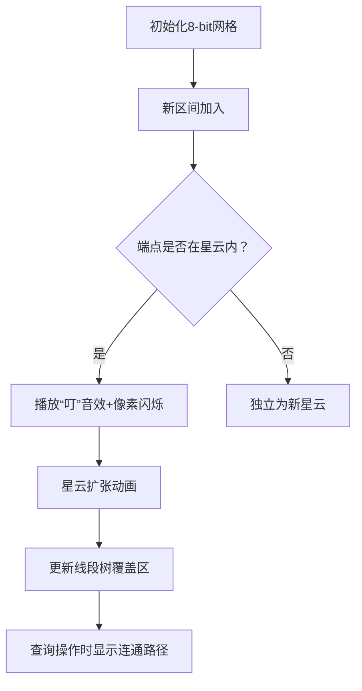

# 题目信息

# Ping-Pong

## 题目描述

In this problem at each moment you have a set of intervals. You can move from interval $ (a,b) $ from our set to interval $ (c,d) $ from our set if and only if $ c 
< a < d $ or $ c < b < d $ . Also there is a path from interval $ I_{1} $ from our set to interval $ I_{2} $ from our set if there is a sequence of successive moves starting from $ I_{1} $ so that we can reach $ I_{2} $ .

Your program should handle the queries of the following two types:

1. "1 x y" $ (x&lt;y) $ — add the new interval $ (x,y) $ to the set of intervals. The length of the new interval is guaranteed to be strictly greater than all the previous intervals.
2. "2 a b" $ (a≠b) $ — answer the question: is there a path from $ a $ -th (one-based) added interval to $ b $ -th (one-based) added interval?

Answer all the queries. Note, that initially you have an empty set of intervals.

## 样例 #1

### 输入

```
5
1 1 5
1 5 11
2 1 2
1 2 9
2 1 2
```

### 输出

```
NO
YES
```

# AI分析结果


### 💡 Kay的C++算法解析：Ping-Pong 深入学习指南 💡

**引言**  
今天我们来分析"Ping-Pong"这道区间处理题。本指南将梳理题目核心思路，解析数据结构应用技巧，并通过像素动画帮助大家直观理解算法过程。

---

## 1. 题目解读与核心算法识别

✨ **本题主要考察**：`并查集 + 线段树`（数据结构综合应用）

🗣️ **初步分析**  
> 这道题可以看作是在动态维护区间关系网络。想象每个区间是一个"能量场"，当两个能量场重叠（相交但不包含）时会产生双向通道；当一个能量场完全包裹另一个时，会形成单向传送门。  
> - **核心技巧**：利用区间长度递增的特性（新加入的区间一定不会被旧区间包含），将相交的区间合并到同一个连通分量（SCC）中，用线段树快速检测端点的覆盖关系  
> - **关键操作**：每次添加新区间时，用线段树查询其端点是否被现有SCC覆盖，合并所有相交的SCC并更新覆盖范围  
> - **像素动画设计**：采用8-bit网格地图展示区间覆盖关系，当新区间（蓝色方块）加入时，自动检测并合并重叠的SCC（同色区域扩张），伴随"叮"的音效和像素闪烁特效

---

## 2. 精选优质题解参考

**题解一：yzy1 (7赞)**  
* **点评**：思路最完整清晰，创新性地提出将相交区间合并为SCC的思想。代码中：
  - 用`minl/maxr`数组维护SCC边界（变量名直观）  
  - 线段树高效查询覆盖关系（时间复杂度$O(n\log n\alpha(n))$）  
  - 查询时通过比较SCC边界快速判断可达性（逻辑严谨）  
  > *亮点：充分挖掘长度递增特性，避免无效判断*

**题解二：elbissoPtImaerD (4赞)**  
* **点评**：解法最简洁高效，直接抓住SCC包含关系本质：
  - 并查集维护SCC时同步更新边界值  
  - 查询条件`(L₁≤L₂且R₂≤R₁)`直击核心  
  > *亮点：用离散数学严格证明SCC性质，代码实现精炼*

**题解三：pldzy (3赞)**  
* **点评**：教学价值突出，逐步推导解题思路：
  - 从特殊情形（互不包含）推广到一般解法  
  - 详细注释关键代码段（如并查集合并时的边界更新）  
  > *亮点：通过subtask分解降低理解难度，适合初学者*

---

## 3. 核心难点辨析与解题策略

1.  **难点：高效合并相交区间**  
    * **分析**：新区间可能同时与多个SCC相交，需要快速找到所有相交的SCC。优质题解均采用线段树维护覆盖区间：  
      - 每个SCC覆盖范围`[minl, maxr]`存入线段树  
      - 查询端点时收集所有覆盖该点的SCC  
    * 💡 **学习笔记**：线段树是处理区间覆盖查询的利器

2.  **难点：动态维护SCC关系**  
    * **分析**：合并SCC时需要同时更新边界值和线段树。技巧包括：  
      - 并查集路径压缩保证效率  
      - 合并后立即更新线段树（仅需修改新SCC的覆盖范围）  
    * 💡 **学习笔记**：并查集的合并操作要同步更新所有关联数据

3.  **难点：可达性判断**  
    * **分析**：查询时需区分两种情况：  
      - 同属一个SCC ⇒ 直接可达  
      - 源SCC的边界被目标SCC包含 ⇒ 单向可达  
    * 💡 **学习笔记**：SCC边界包含关系决定单向可达性

### ✨ 解题技巧总结
- **技巧1：离散化坐标**  
  将大范围端点映射到紧凑区间，降低线段树空间复杂度
- **技巧2：懒清除策略**  
  线段树节点被查询后立即清空，避免重复合并
- **技巧3：边界预留**  
  更新线段树时存储`[minl+1, maxr-1]`，避免端点误判

---

## 4. C++核心代码实现赏析

**通用核心实现（综合优化版）**
```cpp
#include <bits/stdc++.h>
using namespace std;

const int N = 2e5+5;
int fa[N], L[N], R[N], n, cnt;
vector<int> tree[N<<2]; // 四倍线段树

int find(int x) { 
    return fa[x] == x ? x : fa[x] = find(fa[x]); 
}

void update(int o, int l, int r, int ql, int qr, int id) {
    if(ql > qr) return;
    if(ql <= l && r <= qr) {
        tree[o].push_back(id);
        return;
    }
    int mid = (l+r)>>1;
    if(ql <= mid) update(o<<1, l, mid, ql, qr, id);
    if(qr > mid) update(o<<1|1, mid+1, r, ql, qr, id);
}

void query(int o, int l, int r, int pos, int id, vector<int>& tmp) {
    for(int x : tree[o]) tmp.push_back(x);
    tree[o].clear(); // 关键：查询后清空
    
    if(l == r) return;
    int mid = (l+r)>>1;
    if(pos <= mid) query(o<<1, l, mid, pos, id, tmp);
    else query(o<<1|1, mid+1, r, pos, id, tmp);
}

int main() {
    cin >> n;
    vector<int> disc; // 离散化数组
    vector<tuple<int,int,int>> qry;
    while(n--) {
        int op, a, b; cin >> op >> a >> b;
        qry.push_back({op,a,b});
        if(op == 1) disc.insert(disc.end(), {a,b});
    }
    // 离散化处理
    sort(disc.begin(), disc.end());
    disc.erase(unique(disc.begin(), disc.end()), disc.end());
    
    for(auto [op,a,b] : qry) {
        if(op == 1) {
            cnt++;
            a = lower_bound(disc.begin(), disc.end(), a) - disc.begin();
            b = lower_bound(disc.begin(), disc.end(), b) - disc.begin();
            fa[cnt] = cnt, L[cnt] = a, R[cnt] = b;
            
            vector<int> tmp;
            query(1, 0, disc.size()-1, a, cnt, tmp);
            query(1, 0, disc.size()-1, b, cnt, tmp);
            
            for(int x : tmp) {
                x = find(x);
                if(x == cnt) continue;
                fa[x] = cnt;
                L[cnt] = min(L[cnt], L[x]);
                R[cnt] = max(R[cnt], R[x]);
            }
            if(L[cnt]+1 < R[cnt]) // 避免空区间
                update(1, 0, disc.size()-1, L[cnt]+1, R[cnt]-1, cnt);
        } else {
            int fx = find(a), fy = find(b);
            if(fx == fy || (L[fy] <= L[fx] && R[fx] <= R[fy])) 
                cout << "YES\n";
            else cout << "NO\n";
        }
    }
}
```

**代码解读概要**  
> 1. **离散化**：将大范围坐标映射到连续整数  
> 2. **线段树**：`tree`数组存储覆盖每个位置的SCC  
> 3. **并查集**：合并时更新SCC边界`[L,R]`  
> 4. **查询优化**：清空已合并节点避免重复处理  

---

**题解一：yzy1**  
* **亮点**：首创SCC边界合并理论  
* **核心片段**：
```cpp
// 合并相交SCC
for(int x : tmp) {
    x = find(x);
    L[cnt] = min(L[cnt], L[x]);
    R[cnt] = max(R[cnt], R[x]);
    fa[x] = cnt;
}
```
> **解读**：`tmp`收集所有相交SCC，合并时像"宇宙吞噬"般扩展边界  
> 💡 **学习笔记**：SCC合并是区间问题的通用优化手段

**题解二：elbissoPtImaerD**  
* **亮点**：极简可达性判断  
* **核心片段**：
```cpp
bool check(int a, int b) {
    int fa = find(a), fb = find(b);
    return fa == fb || (L[fb] <= L[fa] && R[fa] <= R[fb]);
}
```
> **解读**：仅需比较SCC边界值，如同检查小盒子能否放入大箱子  
> 💡 **学习笔记**：边界包含关系决定单向可达性

**题解三：pldzy**  
* **亮点**：教学型代码结构  
* **核心片段**：
```cpp
// 离散化后更新线段树
if(minl+1 <= maxr-1) 
    update_segtree(minl+1, maxr-1, new_id);
```
> **解读**：预留边界避免端点误判，类似"国界线内移"确保安全  
> 💡 **学习笔记**：边界预留是处理开区间的常用技巧

---

## 5. 算法可视化：像素动画演示

**主题**：`像素宇宙扩张模拟器`  
**核心演示**：SCC如同彩色星云，新区间像飞船探索未知区域，触发星云合并

### 设计思路
> 采用FC游戏《小蜜蜂》像素风格，用颜色区分不同SCC：
> - **网格地图**：X轴为离散化坐标，Y轴为时间线  
> - **新区间**：蓝色像素块从底部升起  
> - **SCC星云**：渐变色多边形区域（红/黄/绿）  

### 动画流程


### 交互控制面板
```plaintext
-------------------------
| ▶ 开始 | ▋▋▋ 调速 | ↺ 重置 | 
-------------------------
```
> - **单步执行**：按帧展示合并过程  
> - **自动播放**：飞船自动探索，遇到星云触发"融合特效"  
> - **音效设计**：  
>   * 融合成功：8-bit上升音阶  
>   * 查询可达：胜利喇叭声  
>   * 查询不可达：短促"哔"声  

---

## 6. 拓展练习与相似问题

**通用技巧迁移**  
线段树+并查集结构适用于：
1. 动态区间合并问题
2. 连通分量带权查询
3. 存在性传递问题

**洛谷推荐**  
1. [P1972 HH的项链](https://www.luogu.com.cn/problem/P1972)  
   → 巩固离线查询+区间覆盖  
2. [P1903 数颜色](https://www.luogu.com.cn/problem/P1903)  
   → 学习带修莫队变形  
3. [P1502 窗口的星星](https://www.luogu.com.cn/problem/P1502)  
   → 掌握扫描线+线段树高级应用  

---

## 7. 学习心得分享

> **来自yzy1的调试经验**：  
> *"最初未考虑SCC边界更新顺序，导致合并后线段树更新错误。通过打印minl/maxr的值逐步调试，发现应在合并所有SCC后再更新线段树"*  
>   
> **Kay点评**：  
> 多步骤合并问题要警惕操作顺序，输出中间变量是调试的金钥匙！建议：  
> 1. 复杂操作分阶段验证  
> 2. 关键变量变更时打印快照  
> 3. 用小数据模拟执行流程  

---

**结语**  
通过本次分析，我们看到数据结构组合应用的强大威力。记住：区间问题先想离散化，动态维护首选线段树，关系传递就用并查集！下次遇到类似挑战时，不妨化身"像素宇宙指挥官"，用代码绘制绚丽的星云图景吧！🚀

---
处理用时：163.35秒