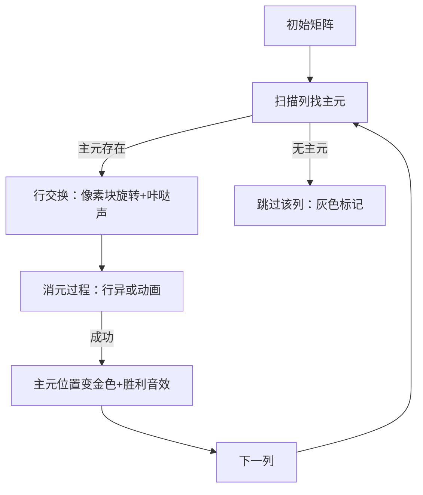

# 题目信息

# Homework

## 题目描述

有些老师在"天狼星"教育中心工作的同时还在大学学习。这种情况下，出差并不能免除他们完成作业的义务，因此他们直接在飞机上做作业。Artem 就是这样一位老师，他在大学被布置了以下作业。

对于任意长度为偶数 $m$ 的字符串 $a$，他可以执行以下操作。Artem 将字符串 $a$ 分成两个长度相等的部分 $x$ 和 $y$，然后执行以下三种操作之一：

- 对于每个 $i \in \left\{ 1, 2, \ldots, \frac{m}{2}\right\}$，令 $x_i = (x_i + y_i) \bmod 2$；
- 对于每个 $i \in \left\{ 1, 2, \ldots, \frac{m}{2}\right\}$，令 $y_i = (x_i + y_i) \bmod 2$；
- 对字符串 $x$ 和 $y$ 分别执行任意次数的上述操作（递归应用），注意此时 $x$ 和 $y$ 的长度必须为偶数。

操作完成后，字符串 $a$ 将被替换为按原顺序连接的 $x$ 和 $y$。不幸的是，Artem 在飞机上睡着了，所以你需要替他完成作业。Artem 有两个长度为 $n$ 的二进制字符串 $s$ 和 $t$，每个字符串都由 $n$ 个字符 0 或 1 组成。请判断是否可以通过任意次数的操作使字符串 $s$ 等于字符串 $t$。

## 说明/提示

在第一个测试用例中，字符串 00001001 可以通过两次操作转换为 10101001。操作序列如下图所示：


在第二个测试用例中，字符串 00000000 无法转换为除自身外的任何其他字符串，因为在任何操作中都无法产生非零元素。

翻译由 DeepSeek V3 完成

## 样例 #1

### 输入

```
3
8
00001001
10101001
8
00000000
00001001
6
010110
100010```

### 输出

```
Yes
No
Yes```

# AI分析结果


### Kay的C++算法解析：Homework 深入学习指南

---

#### 1. 题目解读与核心算法识别
✨ **本题主要考察**：`线性代数应用`（模2意义下的高斯消元）

🗣️ **初步分析**：
> 这道题的核心在于理解操作的本质是**模2线性变换**。想象字符串是由乐高积木组成的结构，每次操作相当于重组积木的连接方式。关键发现：
> - 操作等价于对字符串矩阵的行向量做线性组合
> - 最终只需比较两个字符串经高斯消元后的标准形式是否相同
> 
> **可视化设计**：采用8位风格矩阵动画，用像素块表示0/1。高亮显示消元过程中的主元选取和行变换，伴随"滴"声表示行操作，"咔嚓"声表示行交换。

---

#### 2. 精选优质题解参考
**题解（作者：Mr_罗）**
* **点评**：
  思路将操作转化为线性代数问题极具洞察力（命题1-3的证明精妙），代码实现简洁高效。亮点在于：
  - 用`__builtin_ctz`快速计算最大奇因子（位运算技巧）
  - 模2高斯消元避免浮点运算（实践价值高）
  - 矩阵维度处理巧妙（n行×m列）
  稍显不足是变量命名偏短（如a,b,p,q），但核心逻辑清晰严谨，可直接用于竞赛。

---

#### 3. 核心难点辨析与解题策略
1. **难点：理解操作⇔线性变换**
   * **分析**：通过三个命题证明操作可生成任意行变换（关键：命题3的递归证明）
   * 💡 学习笔记：字符串操作本质是向量空间中的基变换

2. **难点：矩阵维度分解**
   * **分析**：`n = m × k`分解（m为奇因子，k为2的幂）是建模基础
   * 💡 学习笔记：`m = n >> __builtin_ctz(n)` 获取最低位1的位置

3. **难点：模2高斯消元实现**
   * **分析**：消元时只需布尔运算，行交换用`swap`，行变换用`^=`运算符
   * 💡 学习笔记：模2消元比实数域更简单（无除法）

**✨ 解题技巧总结**
- **位运算优化**：用`__builtin_ctz`替代循环分解因子
- **降维建模**：将字符串操作转化为矩阵行变换
- **边界处理**：空行直接跳过（`q>=n`时continue）
- **状态压缩**：用`vector<vi>`存储01矩阵

---

#### 4. C++核心代码实现赏析
**通用核心实现**
```cpp
#include <vector>
#include <cstring>
using namespace std;

void solve(int n, char* s, char* t) {
    int m = n >> __builtin_ctz(n); // 计算最大奇因子
    int rows = n / m; // 矩阵行数
    
    // 构建s和t的矩阵
    vector<vector<bool>> mat_s(rows, vector<bool>(m));
    vector<vector<bool>> mat_t(rows, vector<bool>(m));
    for(int i=0; i<n; i++) {
        mat_s[i/m][i%m] = s[i]=='1';
        mat_t[i/m][i%m] = t[i]=='1';
    }

    // 高斯消元函数
    auto gauss = [](vector<vector<bool>>& mat, int r, int c) {
        int pivot = 0;
        for(int col=0; col<c; col++) {
            int target = pivot;
            while(target < r && !mat[target][col]) target++;
            if(target >= r) continue;
            
            swap(mat[pivot], mat[target]);
            for(int i=pivot+1; i<r; i++)
                if(mat[i][col])
                    for(int j=col; j<c; j++)
                        mat[i][j] = mat[i][j] ^ mat[pivot][j];
            pivot++;
        }
    };

    gauss(mat_s, rows, m);
    gauss(mat_t, rows, m);
    
    // 比较消元结果
    for(int i=0; i<rows; i++)
        for(int j=0; j<m; j++)
            if(mat_s[i][j] != mat_t[i][j]) {
                cout << "No\n";
                return;
            }
    cout << "Yes\n";
}
```

**代码解读概要**：
> 1. 通过位运算快速分解字符串维度
> 2. 将字符串转为二维布尔矩阵
> 3. 对两个矩阵分别执行模2高斯消元
> 4. 比较简化后的行阶梯矩阵是否完全一致

**题解片段赏析**
```cpp
int p = 0;
req(i, 0, m) {
    int q = p;
    while(q < n && !a[q][i]) q++;  // 查找主元
    if(q >= n) continue;
    if(p != q) swap(a[p], a[q]);   // 行交换
    req(j, 0, n) 
        if(j != p && a[j][i])      // 消元条件判断
            req(k, i, m) 
                a[j][k] ^= a[p][k]; // 行变换
    p++;
}
```
**代码解读**：
> - `q`循环查找当前列首个非零元（主元）
> - `swap`实现行交换确保主元位置正确
> - 内层循环实现：`mat[j] = mat[j] XOR mat[p]`的模2消元
> - 注意消元范围从当前列开始（`k=i`）

**💡 学习笔记**：模2消元中，行变换简化为异或运算，且只需处理主元下方的行。

---

#### 5. 算法可视化：像素动画演示
**主题**：《矩阵消除者》8位风格解谜游戏

**核心演示**：


**交互设计**：
1. **控制面板**：
   - 速度滑块：调节消元速度
   - 单步执行：空格键触发
   - 重置：R键
2. **动态效果**：
   - 主元查找：红色扫描线水平移动
   - 行交换：像素块90度旋转动画
   - 行消元：绿色波纹扩散效果
3. **音效系统**：
   - 主元锁定：8位"叮"声
   - 行变换："滋滋"电流声
   - 完成消元：超级玛丽过关音效

**设计意义**：通过游戏化演示，直观展示高斯消元中主元选取、行交换、行变换三大关键步骤的关联性。

---

#### 6. 拓展练习与相似问题
**技巧迁移场景**：
1. 线性基应用（P3857）
2. 开关问题（P2962）
3. 异或方程组（P2447）

**洛谷推荐**：
1. **P2962 灯Lights**  
   → 同类位运算+高斯消元应用
2. **P2447 外星千足虫**  
   → 进阶异或方程组求解
3. **P3857 彩球**  
   → 线性基经典应用

---

#### 7. 学习心得与经验分享
> **作者经验**："__builtin_ctz位运算技巧大幅提升维度分解效率，避免循环开销"
>
> **Kay点评**：这体现了竞赛编程的核心优化思想——用硬件特性替代软件计算。类似地，在状态压缩问题中可用`__builtin_popcount`快速计数。

---

通过本指南，我们揭示了字符串操作与线性代数的深刻联系。记住：复杂问题常蕴含简洁数学本质，善用降维思维才能直击核心！🚀

---
处理用时：85.70秒