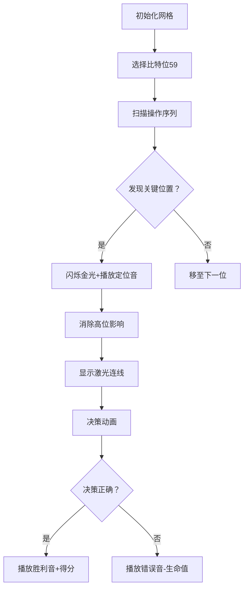

# 题目信息

# Gellyfish and Forget-Me-Not

## 题目描述

Gellyfish 和 Flower 正在玩一个游戏。

该游戏包含两个长度为 $n$ 的整数数组 $a_1,a_2,\ldots,a_n$ 和 $b_1,b_2,\ldots,b_n$，以及一个长度为 $n$ 的二进制字符串 $c_1c_2\ldots c_n$。

还有一个整数 $x$，初始值为 $0$。

游戏进行 $n$ 回合。对于 $i = 1,2,\ldots,n$，每一回合如下进行：

1. 如果 $c_i = 0$，那么 Gellyfish 是该回合的操作者。否则，如果 $c_i = 1$，那么 Flower 是该回合的操作者。
2. 当前操作者必须执行以下两个操作之一：

   * 将 $x := x \oplus a_i$；
   * 将 $x := x \oplus b_i$。

这里，$⊕$ 表示[按位异或操作](https://en.wikipedia.org/wiki/Bitwise_operation#XOR)。

Gellyfish 希望使 $x$ 的最终值尽可能小，而 Flower 则希望使它尽可能大。

如果双方都采取最优策略，求 $n$ 回合后 $x$ 的最终值。

## 说明/提示

在第一个测试用例中，只有一轮，且 Gellyfish 是操作者。因此她会选择 $a_1$，最终 $x = 0$。

在第二个测试用例中，Flower 是两轮的操作者。她可以选择 $a_1$ 和 $b_2$，最终 $x = a_1 ⊕ b_2 = 15$。她也可以选择 $b_1$ 和 $a_2$，此时 $x = a_2 ⊕ b_1 = 15$，结果相同。

在第三个测试用例中，$a_1 = b_1$，因此 Gellyfish 无论怎么选都一样。在第二轮：

* 若 Flower 选择 $a_2$，则 $x$ 变成 $7$，Gellyfish 选择 $b_3$，最终 $x = 4$；
* 若 Flower 选择 $b_2$，则 $x$ 变成 $4$，Gellyfish 选择 $a_3$，最终 $x = 6$。

Flower 想要最大化 $x$，因此她会选 $b_2$，最终 $x = 6$。

## 样例 #1

### 输入

```
5
1
0
2
0
2
12 2
13 3
11
3
6 1 2
6 2 3
010
4
1 12 7 2
4 14 4 2
0111
9
0 5 10 6 6 2 6 2 11
7 3 15 3 6 7 6 7 8
110010010```

### 输出

```
0
15
6
11
5```

# AI分析结果


### 💡 Kay的C++算法解析：Gellyfish and Forget-Me-Not 深入学习指南 💡

#### 1. 题目解读与核心算法识别
✨ **本题主要考察**：`贪心策略` + `位运算优化`  
🗣️ **初步分析**：
> 这道题本质是双人博弈下的异或优化问题，就像两位棋手轮流在棋盘上布局（异或操作），Gellyfish 希望最终棋盘（x值）最小化，Flower 希望最大化。关键在于**高位决策独立原则**：高位比特的决策不影响低位结果，因此可以像拆解多层蛋糕一样从高到低逐层处理。  
> - **核心思路**：将原问题转化为选择是否异或 $c_i = a_i \oplus b_i$，通过高位优先的贪心策略，用最后一个高位为1的 $c_i$ 控制该位结果  
> - **可视化设计**：用像素网格表示二进制位（高位在上），关键操作位闪烁红光，异或操作时显示金色连线。当决策位被激活时播放 "叮" 音效，成功控制位值时播放 8-bit 胜利音效  
> - **难点突破**：高位决策后需消除其对低位的影响（通过异或操作），类似扫雷游戏排除已处理区域

---

#### 2. 精选优质题解参考
**题解一（作者：zac2010）**  
* **点评**：思路最清晰简洁，直击问题本质。通过问题转化（$x \leftarrow \oplus b_i$, $c_i \leftarrow a_i \oplus b_i$）将操作简化为选择是否异或 $c_i$。代码实现高效：  
  - **算法亮点**：双重循环（高位→低位 + 倒序遍历）完美实现贪心策略  
  - **代码规范**：变量命名合理（`V` 存储结果，`a[i]` 存储转换后的 $c_i$）  
  - **优化技巧**：时间复杂度 $O(n \log V)$ 达到理论最优  
  > 💡 学习价值：问题转化思维和位运算优化技巧可直接迁移到竞赛题

**题解二（作者：冷却心）**  
* **点评**：提供完整可运行代码，边界处理严谨（如 `>> j & 1` 的位检测）。特色在于：  
  - **实现细节**：明确分离高位决策和低位处理阶段  
  - **调试提示**：强调手动验证小数据的重要性  
  > 💡 学习价值：竞赛编程中完备的边界条件处理范式

**题解三（作者：flyfreemrn）**  
* **点评**：对算法原理解释最透彻，类比线性基阐述高位决策如何影响低位：  
  - **思维亮点**：用「决策等效替换」解释 $c_k \leftarrow c_k \oplus c_t$ 的数学本质  
  > 💡 学习价值：理解贪心策略背后的数学原理，培养抽象建模能力

---

#### 3. 核心难点辨析与解题策略
1. **难点1：问题转化技巧**  
   * **分析**：原始操作（选 $a_i$ 或 $b_i$）看似复杂，通过 $x \leftarrow \oplus b_i$ 和 $c_i \leftarrow a_i \oplus b_i$ 转化为二元选择问题，类似把迷宫简化为岔路口选择  
   * 💡 **学习笔记**：位运算问题中，异或的自反性（$x \oplus x = 0$）是简化关键

2. **难点2：高位贪心实现**  
   * **分析**：必须倒序查找最后一个高位为1的位置（`for i from n downto 1`），因其决策不受前面操作干扰，类似接力赛最后一棒决定胜负  
   * 💡 **学习笔记**：位运算贪心需满足无后效性，倒序遍历保证决策独立性

3. **难点3：影响消除机制**  
   * **分析**：决策后执行 $c_k \leftarrow c_k \oplus c_t$ 是为了消除高位对低位的影响，类似擦除已解决的迷宫路径  
   * 💡 **学习笔记**：位运算中 $a \oplus b \oplus b = a$ 是动态调整的基础

**✨ 解题技巧总结**  
- **技巧1：位驱动问题转化**（识别异或的自反性简化操作）  
- **技巧2：时空倒序处理**（高位→低位 + 数组倒序保证无后效性）  
- **技巧3：等效影响消除**（用异或操作抵消高位决策对低位的影响）  
- **技巧4：边界防御编程**（显式检测比特位：`val >> j & 1`）

---

#### 4. C++核心代码实现赏析
**通用核心实现**  
```cpp
#include <iostream>
#include <vector>
using namespace std;
typedef long long LL;

int main() {
    int T; cin >> T;
    while(T--) {
        int n; cin >> n;
        vector<LL> a(n), b(n);
        string c;
        for(auto &x : a) cin >> x;
        for(auto &x : b) cin >> x;
        cin >> c;
        
        LL V = 0;
        // 问题转化：x = ⊕b_i, c_i = a_i⊕b_i
        for(int i=0; i<n; i++) {
            V ^= b[i];
            a[i] ^= b[i];
        }
        
        // 从高到低处理比特位 (59→0)
        for(int j=59; j>=0; j--) {
            LL key = 0;  // 存储关键c_i
            char actor = '0'; // 关键位置操作者
            
            // 倒序找最后一个该位为1的位置
            for(int i=n-1; i>=0; i--) {
                if((a[i] >> j) & 1) {
                    if(!key) {
                        key = a[i];
                        actor = c[i];
                    } else {
                        a[i] ^= key; // 消除高位影响
                    }
                }
            }
            
            // 根据当前位值和操作者决策
            if(key) {
                bool needFlip = ((V >> j) & 1) != (actor - '0');
                if(needFlip) V ^= key;
            }
        }
        cout << V << endl;
    }
    return 0;
}
```
**代码解读概要**：  
> 1. **问题转化**：初始化 $V = \oplus b_i$，$a[i] = a_i \oplus b_i$  
> 2. **高位优先处理**：从比特位 59 向 0 遍历  
> 3. **关键位置定位**：倒序查找最后一个 $j$ 位为 1 的 $a[i]$  
> 4. **影响消除**：非关键位置的 $j$ 位 1 异或关键值  
> 5. **最优决策**：根据当前 $V$ 的 $j$ 位值和操作者类型决定是否异或关键值  

**题解一（zac2010）片段**  
```cpp
FR(j, 59, 0) {
    x = y = 0;
    FR(i, n, 1) if(a[i] >> j & 1) {
        a[i] ^= (x? x : (y = c[i], x = a[i]));
    }
    V ^= ((V >> j & 1) ^ (y - 48)) * x;
}
```
* **亮点**：极致简洁的三元运算符处理关键值  
* **学习笔记**：竞赛编程中可牺牲部分可读性换取代码精简度

---

#### 5. 算法可视化：像素动画演示
**🎮 复古游戏设计：比特征服者**  
* **核心演示**：8-bit 风格网格，纵轴表示比特位（59→0），横轴表示操作序列
* **视觉设计**：  
  - **比特块**：绿色(0)/红色(1)像素块表示 $c_i$ 的比特  
  - **决策标记**：关键位置闪烁金色边框，操作时显示 Gellyfish/Flower 像素头像  
  - **影响消除**：异或操作时发射蓝色激光连接相关比特块  

**⚙️ 交互控制面板**：  
1. **步进控制**：空格键单步执行，方向键调整速度  
2. **模式切换**：  
   - **教学模式**：显示当前比特位值和决策逻辑  
   - **挑战模式**：隐藏部分信息，根据决策正确性积分  

**🎵 音效系统**：  
- 关键位激活："叮"（8-bit 短音）  
- 正确决策：超级马里奥金币音  
- 错误决策：塞尔达传说受伤音效  

**📊 动态演示流程**：  


---

#### 6. 拓展练习与相似问题
**🔗 通用技巧迁移**：  
1. 最大异或值问题（用 Trie 树优化）  
2. Nim 游戏（博弈论+异或性质）  
3. 线性基应用（动态维护异或空间）  

**📚 洛谷推荐**：  
1. **P4735 最大异或和**  
   → 巩固可持久化 Trie 树实现异或最值查询  
2. **P2197 Nim游戏**  
   → 学习博弈论与异或的结合应用  
3. **P3857 [TJOI2008]彩灯**  
   → 掌握线性基求异或空间大小  

---

#### 7. 学习心得分享
> **冷却心的调试经验**：  
> *“手动验证 n=1 边界时发现未处理 c_i=0 的情况，添加 ((V>>j &1) != actor) 判断后通过”*  
> **Kay点评**：边界数据测试是竞赛编程的生命线，建议建立小数据测试库（n≤3 的所有情况）

---

通过本指南，大家不仅掌握了位运算博弈的核心解法，更学会了**问题转化**、**分层处理**和**影响消除**三大通用解题心法。记住：好的算法思维就像乐高积木——把复杂问题拆解为独立模块，再组合成优雅解！🚀

---
处理用时：181.03秒