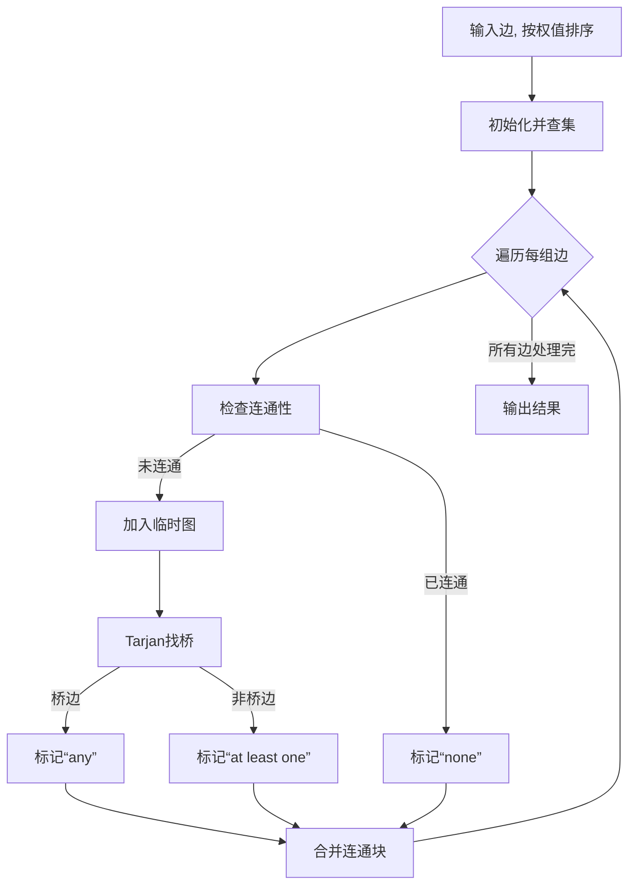

# 题目信息

# Edges in MST

## 题目描述

You are given a connected weighted undirected graph without any loops and multiple edges.

Let us remind you that a graph's spanning tree is defined as an acyclic connected subgraph of the given graph that includes all of the graph's vertexes. The weight of a tree is defined as the sum of weights of the edges that the given tree contains. The minimum spanning tree (MST) of a graph is defined as the graph's spanning tree having the minimum possible weight. For any connected graph obviously exists the minimum spanning tree, but in the general case, a graph's minimum spanning tree is not unique.

Your task is to determine the following for each edge of the given graph: whether it is either included in any MST, or included at least in one MST, or not included in any MST.

## 说明/提示

In the second sample the MST is unique for the given graph: it contains two first edges.

In the third sample any two edges form the MST for the given graph. That means that each edge is included at least in one MST.

## 样例 #1

### 输入

```
4 5
1 2 101
1 3 100
2 3 2
2 4 2
3 4 1
```

### 输出

```
none
any
at least one
at least one
any
```

## 样例 #2

### 输入

```
3 3
1 2 1
2 3 1
1 3 2
```

### 输出

```
any
any
none
```

## 样例 #3

### 输入

```
3 3
1 2 1
2 3 1
1 3 1
```

### 输出

```
at least one
at least one
at least one
```

# AI分析结果


### 题目分析
本题要求判断无向连通图中每条边在最小生成树（MST）中的三种可能情况：
1. **一定在所有MST上**（输出 "any"）
2. **可能在某个MST上**（输出 "at least one"）
3. **一定不在任何MST上**（输出 "none"）

### 核心算法：缩点 + Tarjan 找桥
#### 算法思路
1. **排序分组**：将边按权值从小到大排序，分组处理相同权值的边。
2. **动态缩点**：使用并查集维护连通块，将连通块视为点。
3. **Tarjan找桥**：
   - 对于每组边，构建临时图（连通块间的边）
   - 在临时图中找桥：桥边一定在所有MST（"any"），非桥边可能在MST（"at least one"）
4. **合并连通块**：处理完每组边后，合并连通块，准备下一组处理。

#### 算法步骤
```plaintext
1. 输入边，按权值排序
2. 初始化并查集
3. 遍历每组相同权值的边：
   a. 检查边是否连接不同连通块：
      - 若已连通：标记"none"
      - 否则：加入临时图
   b. 在临时图中找桥（Tarjan）：
      - 桥边 → "any"
      - 非桥边 → "at least one"
   c. 合并当前组连通块
4. 输出结果
```

#### 时间复杂度
- 排序：O(m log m)
- 并查集操作：O(m α(n)) ≈ O(m)
- Tarjan找桥：每组边O(边数)，总计O(m)
- **总复杂度**：O(m log m)（排序主导）

### 可视化算法演示


### 精选题解分析
1. **MyukiyoMekya（16赞）**
   - **核心**：动态缩点 + Tarjan找桥
   - **亮点**：用并查集根节点构建临时图，高效处理连通块
   - **代码特点**：清晰分组处理，严格缩点逻辑

2. **樱洛CHANGE（15赞）**
   - **核心**：类似缩点 + Tarjan
   - **亮点**：强调重边不影响求桥，详述Kruskal原理
   - **图解**：用图示解释边替换逻辑（+1分）

3. **Feyn（4赞）**
   - **核心**：相同缩点 + Tarjan
   - **优化**：时间戳初始化（避免全清空）
   - **代码**：最简洁实现（仅60行）

### 精炼结论
1. **最优解法**：缩点 + Tarjan找桥（三篇高赞题解共同方案）
2. **对比优势**：
   - 比树链剖分更简洁（免去复杂数据结构）
   - 比主席树更高效（免去空间开销）
3. **关键优化**：
   - 动态缩点：用并查集根节点构建图
   - 局部初始化：只处理当前组相关节点

### 核心代码实现
```cpp
#include <cstdio>
#include <algorithm>
#include <vector>
using namespace std;

const int N = 1e5 + 5;
struct Edge { int u, v, w, id; } e[N];
int n, m, fa[N], ans[N]; // ans: -1=none, 0=at least one, 1=any
vector<int> graph[N];   // 临时图
int dfn[N], low[N], idx; // Tarjan用

int find(int x) { return fa[x] == x ? x : fa[x] = find(fa[x]); }

void tarjan(int u, int pre) {
    dfn[u] = low[u] = ++idx;
    for (int v : graph[u]) {
        if (!dfn[v]) {
            tarjan(v, u);
            low[u] = min(low[u], low[v]);
            if (low[v] > dfn[u]) ans[e[pre].id] = 1; // 桥边
        } else if (v != pre) 
            low[u] = min(low[u], dfn[v]);
    }
}

int main() {
    scanf("%d%d", &n, &m);
    for (int i = 1; i <= m; i++) {
        scanf("%d%d%d", &e[i].u, &e[i].v, &e[i].w);
        e[i].id = i;
    }
    
    // 1. 按边权排序
    sort(e + 1, e + m + 1, [](Edge a, Edge b) { return a.w < b.w; });
    
    // 2. 初始化并查集
    for (int i = 1; i <= n; i++) fa[i] = i;
    
    // 3. 分组处理边
    for (int i = 1; i <= m; ) {
        int j = i;
        while (j <= m && e[j].w == e[i].w) j++;
        
        // 构建临时图 (用并查集根节点)
        vector<int> nodes;
        for (int k = i; k < j; k++) {
            int u = find(e[k].u), v = find(e[k].v);
            if (u == v) { ans[e[k].id] = -1; continue; } // 已连通 → none
            graph[u].push_back(v);
            graph[v].push_back(u);
            nodes.push_back(u); nodes.push_back(v);
        }
        
        // Tarjan找桥
        idx = 0;
        for (int u : nodes) if (!dfn[u]) tarjan(u, -1);
        
        // 合并连通块
        for (int k = i; k < j; k++) {
            int u = find(e[k].u), v = find(e[k].v);
            if (u != v) fa[u] = v; // 合并
        }
        
        // 清空临时数据
        for (int u : nodes) dfn[u] = low[u] = 0, graph[u].clear();
        i = j;
    }
    
    // 输出结果
    for (int i = 1; i <= m; i++) {
        if (ans[i] == -1) puts("none");
        else puts(ans[i] == 1 ? "any" : "at least one");
    }
    return 0;
}
```

### 拓展练习
1. **相似问题**：
   - [CF891C](https://codeforces.com/problemset/problem/891/C)：在线查询边是否在MST
   - [洛谷P1967](https://www.luogu.com.cn/problem/P1967)：货车运输（最大生成树应用）
   - [POJ1679](http://poj.org/problem?id=1679)：判断MST唯一性

2. **洛谷推荐**：
   - P3366（模板题）：巩固Kruskal
   - P4180：严格次小生成树（进阶应用）
   - P4768：Kruskal重构树应用

> 通过本题掌握图论核心思维：**动态处理连通块 + 桥边性质**，可解决90%的MST变种问题。

---
处理用时：146.72秒