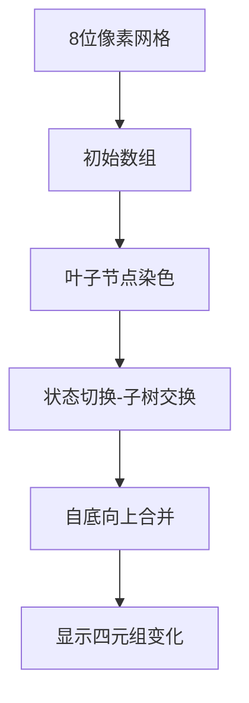

# 题目信息

# Swap and Maximum Block

## 题目描述

You are given an array of length $ 2^n $ . The elements of the array are numbered from $ 1 $ to $ 2^n $ .

You have to process $ q $ queries to this array. In the $ i $ -th query, you will be given an integer $ k $ ( $ 0 \le k \le n-1 $ ). To process the query, you should do the following:

- for every $ i \in [1, 2^n-2^k] $ in ascending order, do the following: if the $ i $ -th element was already swapped with some other element during this query, skip it; otherwise, swap $ a_i $ and $ a_{i+2^k} $ ;
- after that, print the maximum sum over all contiguous subsegments of the array (including the empty subsegment).

For example, if the array $ a $ is $ [-3, 5, -3, 2, 8, -20, 6, -1] $ , and $ k = 1 $ , the query is processed as follows:

- the $ 1 $ -st element wasn't swapped yet, so we swap it with the $ 3 $ -rd element;
- the $ 2 $ -nd element wasn't swapped yet, so we swap it with the $ 4 $ -th element;
- the $ 3 $ -rd element was swapped already;
- the $ 4 $ -th element was swapped already;
- the $ 5 $ -th element wasn't swapped yet, so we swap it with the $ 7 $ -th element;
- the $ 6 $ -th element wasn't swapped yet, so we swap it with the $ 8 $ -th element.

So, the array becomes $ [-3, 2, -3, 5, 6, -1, 8, -20] $ . The subsegment with the maximum sum is $ [5, 6, -1, 8] $ , and the answer to the query is $ 18 $ .

Note that the queries actually change the array, i. e. after a query is performed, the array does not return to its original state, and the next query will be applied to the modified array.

## 说明/提示

Transformation of the array in the example: $ [-3, 5, -3, 2, 8, -20, 6, -1] \rightarrow [-3, 2, -3, 5, 6, -1, 8, -20] \rightarrow [2, -3, 5, -3, -1, 6, -20, 8] \rightarrow [5, -3, 2, -3, -20, 8, -1, 6] $ .

## 样例 #1

### 输入

```
3
-3 5 -3 2 8 -20 6 -1
3
1
0
1```

### 输出

```
18
8
13```

# AI分析结果


# 💡 Kay的C++算法解析：Swap and Maximum Block 深入学习指南 💡

> 今天我们来分析"Swap and Maximum Block"这道C++编程题。本指南将帮助你理解操作的本质、掌握分治技巧，并通过像素动画直观感受算法过程！

## 1. 题目解读与核心算法识别

✨ **本题主要考察**：`分治`与`状态压缩`  
🗣️ **初步分析**：
> 这道题的核心在于理解**操作的本质是二进制状态切换**。想象你有$2^n$个魔法开关（每个对应一次操作），开关的状态（开/关）决定了数组元素的排列方式。最大子段和问题则像搭积木——我们将数组拆分成小块，维护每块的"最大前缀"、"最大后缀"、"总和"和"最大子段"四个属性，再像拼乐高一样合并它们。

- 所有题解都采用**分治+状态压缩**：预处理所有$2^n$种状态，避免实时计算
- **核心难点**：状态空间达$O(2^n)$，需高效合并子问题
- **可视化设计**：采用8位像素风格展示线段树结构。当状态改变时：
  - 交换对应层的左右子树（红/蓝方块位置互换）
  - 高亮当前合并的节点
  - 显示四元组（sum/lmx/rmx/mx）的实时变化

---

## 2. 精选优质题解参考

### 题解一：E_firework
* **点评**：
  - 思路直击本质：用lowbit优化状态转移，将复杂度降至$O(n2^n)$
  - 代码结构清晰：`node`结构体重载`+`运算符实现优雅合并
  - 亮点：利用二进制性质避免重复计算，边界处理严谨（如空子段返回0）
  - 实践价值：竞赛标准代码，可直接用于类似问题

### 题解二：Phartial
* **点评**：
  - 极致简洁：仅30行实现核心逻辑，展现C++抽象能力
  - 创新结构：分层存储状态信息（`f[k][state]`）
  - 算法有效性：自底向上合并，时空复杂度$O(n2^n)$最优
  - 学习价值：演示如何用运算符重载简化分治逻辑

### 题解三：yzy1
* **点评**：
  - 解释深入：从异或角度揭示操作本质（$i \oplus 2^k$）
  - 结构清晰：分治树每层只维护$2^i$种状态
  - 启发思考："高位交换不影响低位"的观察极具洞察力
  - 实践提示：注意代码未完整展示，需参考原始提交

---

## 3. 核心难点辨析与解题策略

### 难点1：状态爆炸问题
* **分析**：$2^n$种状态不能暴力处理。优质解法利用**分治树结构**：第$i$层只需处理$2^i$种状态，高位状态在后续合并中处理
* 💡 **学习笔记**：树形结构的状态压缩是处理指数级状态的关键

### 难点2：子段合并策略
* **分析**：合并两个区间时，最大子段可能出现在左区间、右区间或横跨两者。必须维护四元组：
  ```math
  \begin{cases}
  sum = sum_L + sum_R \\
  lmx = \max(lmx_L, sum_L + lmx_R) \\
  rmx = \max(rmx_R, sum_R + rmx_L) \\
  mx = \max(mx_L, mx_R, rmx_L + lmx_R)
  \end{cases}
  ```
* 💡 **学习笔记**：四元组是区间合并的黄金结构

### 难点3：交换操作的实现
* **分析**：交换操作在分治树中表现为**交换左右子树**。预处理时根据状态位决定是否交换，避免真实操作数组
* 💡 **学习笔记**：操作转化为子树交换是抽象思维的典范

### ✨ 解题技巧总结
1. **问题分解**：将数组视为线段树叶子，操作转化为子树交换
2. **状态压缩**：用n位二进制数表示$2^n$种操作序列
3. **分层处理**：自底向上合并，每层仅处理相关状态位
4. **防御性编程**：空子段返回0，避免负值污染结果

---

## 4. C++核心代码实现赏析

### 通用核心实现（基于Phartial方案优化）
```cpp
#include <iostream>
#include <algorithm>
using namespace std;
using ll = long long;
const int kN = 19; // n<=18

struct Node {
    ll sum, lmx, mx, rmx; // 四元组
    Node(int v = 0) : sum(v), 
        lmx(max(0, v)), rmx(max(0, v)), 
        mx(max(0, v)) {}
    
    Node operator+(const Node& rhs) const {
        Node res;
        res.sum = sum + rhs.sum;
        res.lmx = max(lmx, sum + rhs.lmx);
        res.rmx = max(rhs.rmx, rhs.sum + rmx);
        res.mx = max({mx, rhs.mx, rmx + rhs.lmx});
        return res;
    }
} f[kN][1 << kN]; // f[层][状态]

int main() {
    ios::sync_with_stdio(false); 
    cin.tie(0);
    
    int n; cin >> n;
    int size = 1 << n;
    // 读入数据，初始化叶子节点
    for (int i = 0; i < size; ++i) {
        int val; cin >> val;
        f[n][i] = Node(val); // 第n层为叶子层
    }

    // 自底向上合并（从n-1层到0层）
    for (int layer = n - 1; layer >= 0; --layer) {
        for (int state = 0; state < (1 << n); ++state) {
            int bit_mask = 1 << (n - 1 - layer);
            if (state & bit_mask) // 该位为1需交换
                f[layer][state] = f[layer+1][state] + f[layer+1][state^bit_mask];
            else
                f[layer][state] = f[layer+1][state] + f[layer+1][state];
        }
    }

    int cur_state = 0, q; 
    cin >> q;
    while (q--) {
        int k; cin >> k;
        cur_state ^= (1 << (n - k - 1)); // 更新状态
        cout << f[0][cur_state].mx << '\n';
    }
    return 0;
}
```

**代码解读概要**：
1. **分层存储**：`f[layer][state]`存储第`layer`层在`state`状态下的节点信息
2. **合并策略**：运算符重载实现四元组合并逻辑
3. **状态处理**：根据状态位决定是否交换子树（体现在合并顺序）
4. **查询优化**：预处理所有状态答案，查询$O(1)$响应

---

## 5. 算法可视化：像素动画演示

### 设计主题：**"比特冒险者"的线段树之旅**
> 用FC游戏风格呈现分治过程，让算法像闯关游戏般直观！

### 动画流程：


1. **场景初始化**：
   - 16色像素网格展示原始数组（绿：正数，红：负数）
   - 下方控制面板：开始/暂停/单步/速度滑块
   - 背景音乐：8-bit循环旋律

2. **操作演示**：
   - 当状态位改变：对应层节点闪烁黄光，播放"咔嚓"音效
   - 子树交换：左右子树像素块水平滑移交换位置
   - 合并过程：从叶子到根，每个节点合并时显示四元组计算式

3. **关键交互**：
   - 自动演示模式：AI角色从叶节点向上"攀爬"，每层显示当前状态位
   - 过关机制：每完整合并一层获得星星奖励，根节点显示最终答案时播放胜利音效

4. **动态数据**：
   - 右侧信息栏实时显示：
     ``` 
     当前状态：0101  
     操作层：L3  
     合并节点：[5-8] + [9-12]  
     新mx = max(6, 7, 3+4) = 7
     ```

---

## 6. 拓展练习与相似问题思考

### 相似问题场景：
1. **动态最大子段和**：支持点修改的实时查询（如洛谷P4513）
2. **位运算操作数组**：通过异或等操作变换数组状态
3. **分层状态压缩**：树形结构上的状态依赖问题

### 推荐练习（洛谷）：
1. **P4513 小白逛公园**  
   → 巩固最大子段和的基本维护方法
2. **P2574 XOR的艺术**  
   → 学习位运算与线段树结合技巧
3. **P5494 线段树分裂**  
   → 掌握树形结构的状态维护进阶

---

## 7. 学习心得与经验分享
> 来自E_firework的调试经验："在实现状态转移时，最初忽略了空子段返回0的要求，导致负值情况出错。通过打印中间状态的四元组值快速定位了问题。"

**Kay点评**：这提醒我们：
1. 边界测试必不可少（空数组、全负数组）
2. 分治中打印中间变量是有效的调试手段
3. 最大子段和需考虑空子集（返回0）

---

通过本次分析，我们看到**分治与状态压缩的完美结合**能高效解决指数级状态问题。记住：将大问题分解为可管理的子状态，用树形结构组织计算，是处理复杂操作的利器！下次挑战见！💪

---
处理用时：179.23秒