# 题目信息

# Legen...

## 题目描述

Barney was hanging out with Nora for a while and now he thinks he may have feelings for her. Barney wants to send her a cheesy text message and wants to make her as happy as possible.

 Initially, happiness level of Nora is $ 0 $ . Nora loves some pickup lines like "I'm falling for you" and stuff. Totally, she knows $ n $ pickup lines, each consisting only of lowercase English letters, also some of them may be equal (in writing, but different in pronouncing or meaning though). Every time Nora sees $ i $ -th pickup line as a consecutive subsequence of Barney's text message her happiness level increases by $ a_{i} $ . These substrings may overlap, for example, Nora will see the pickup line aa twice and the pickup line ab once in text message aaab.

Due to texting app limits, Barney's text may have up to $ l $ characters.

Barney asked you to help him make Nora as much happy as possible, it's gonna be legen...

## 说明/提示

An optimal answer for the first sample case is hearth containing each pickup line exactly once.

An optimal answer for the second sample case is artart.

## 样例 #1

### 输入

```
3 6
3 2 1
heart
earth
art
```

### 输出

```
6
```

## 样例 #2

### 输入

```
3 6
3 2 8
heart
earth
art
```

### 输出

```
16
```

# AI分析结果


# 💡 Kay的C++算法解析：Legen... 深入学习指南 💡

> 大家好，我是Kay！今天我们来解析一道有趣的字符串构造题目——**Legen...**。这道题要求我们构造一个长度不超过L的字符串，最大化特定"pickup lines"的权值和。题目看似简单，但L的最大值可达10¹⁴，需要巧妙的算法优化。让我们一起探索高效解法！

## 1. 题目解读与核心算法识别

✨ **本题主要考察**：`AC自动机 + 矩阵快速幂优化`

🗣️ **初步分析**：
> 想象AC自动机是一个**像素冒险地图**，每个节点代表一个匹配状态。我们要在地图上走L步（每步添加一个字符），最大化收集的"金币"（权值）。难点在于L极大，直接模拟会超时。

- **核心思路**：  
  1. 用AC自动机存储所有模式串
  2. 通过fail指针传递权值（后缀包含关系）
  3. 将状态转移转化为矩阵乘法
  4. 用矩阵快速幂处理大L

- **可视化设计**：  
  复古像素风格展示AC自动机地图，角色每走一步（添加字符）触发：
  - 节点高亮（当前状态）
  - 金币收集动画（权值增加）
  - 路径绘制（转移过程）
  - 8-bit音效（步进声/金币声/胜利音乐）

## 2. 精选优质题解参考

> 从多篇题解中精选3份最佳实现，助你快速掌握核心技巧

**题解一：Hoks (思路清晰度⭐⭐⭐⭐⭐)**
* **核心思路**：
  - 完整AC自动机实现，fail构建时累加权值
  - 优雅的矩阵封装（广义矩阵乘法）
  - 清晰的状态转移设计
* **亮点**：  
  `val[u] += val[fail[u]]`权值传递逻辑直白，矩阵乘法`max-plus`语义明确

**题解二：crashed (代码规范性⭐⭐⭐⭐⭐)**
* **核心思路**：
  - 模块化矩阵类封装
  - 详细注释关键步骤
  - 类比Floyd算法解释状态转移
* **亮点**：  
  `res[i][j] = max(res[i][j], A[i][k]+B[k][j])` 的Floyd式解读

**题解三：SDqwq (实现简洁性⭐⭐⭐⭐)**
* **核心思路**：
  - 最简AC自动机实现
  - 精简矩阵乘法内核
  - 无冗余代码结构
* **亮点**：  
  仅120行完整实现，聚焦核心逻辑

## 3. 核心难点辨析与解题策略

### 难点1：AC自动机权值传递

```mermaid
graph LR
    A[节点] --> B[fail节点]
    B --> C[根节点]
    style A fill:#f9f,stroke:#333
    style B fill:#bbf,stroke:#333
```

> **分析**：每个节点的权值需包含所有后缀模式串的权值。优质题解在构建fail指针时通过`val[u] += val[fail[u]]`实现递归累加  
> 💡 **学习笔记**：fail树上的权值传递是AC自动机解题的关键预处理

### 难点2：状态转移矩阵设计
```mermaid
flowchart LR
    DP[i] -- 字符c --> DP[j]
    j[新状态] --> k[+val[j]]
```
> **分析**：矩阵元素`mat[i][j]`表示从状态i经**一个字符**转移到j的权值增量。转移方程：  
> `f[i+1][j] = max(f[i][k] + val[j])`  
> 💡 **学习笔记**：状态转移矩阵是图邻接矩阵的权值加强版

### 难点3：广义矩阵乘法
```
传统矩阵乘法：
   C[i][j] = Σ(A[i][k] * B[k][j])
本题矩阵乘法：
   C[i][j] = max(A[i][k] + B[k][j])
```
> **分析**：将`+`视为`*`，`max`视为`+`，保持结合律。快速幂复杂度O(n³logL)  
> 💡 **学习笔记**：广义矩阵乘法是优化线性递推的利器

### ✨ 解题技巧总结
1. **问题分解**：字符串构造→AC自动机状态转移→矩阵优化
2. **权值预计算**：fail指针构建时完成权值传递
3. **矩阵封装**：实现`operator*`重载便于快速幂
4. **边界处理**：初始状态`f[0][0]=0`，其余设为-∞

## 4. C++核心代码实现赏析

### 通用核心实现（综合优质题解）
```cpp
#include <bits/stdc++.h>
#define int long long
using namespace std;
const int N = 210;
const int S = 26;
const long long INF = 1e18;

int trie[N][S], fail[N], val[N], cnt;

void insert(string s, int v) {
    int p = 0;
    for (char c : s) {
        int idx = c - 'a';
        if (!trie[p][idx]) trie[p][idx] = ++cnt;
        p = trie[p][idx];
    }
    val[p] += v;
}

void build() {
    queue<int> q;
    for (int i = 0; i < S; i++)
        if (trie[0][i]) q.push(trie[0][i]);
    
    while (!q.empty()) {
        int u = q.front(); q.pop();
        val[u] += val[fail[u]];  // 关键！权值传递
        for (int i = 0; i < S; i++) {
            if (trie[u][i]) {
                fail[trie[u][i]] = trie[fail[u]][i];
                q.push(trie[u][i]);
            } else {
                trie[u][i] = trie[fail[u]][i];
            }
        }
    }
}

struct Matrix {
    vector<vector<long long>> mat;
    int n, m;
    
    Matrix(int n, int m) : n(n), m(m) {
        mat.assign(n, vector<long long>(m, -INF));
    }
    
    Matrix operator*(const Matrix& other) {
        Matrix res(n, other.m);
        for (int i = 0; i < n; i++)
            for (int k = 0; k < m; k++)
                if (mat[i][k] != -INF) 
                    for (int j = 0; j < other.m; j++)
                        res.mat[i][j] = max(res.mat[i][j], mat[i][k] + other.mat[k][j]);
        return res;
    }
};

Matrix qpow(Matrix base, int p) {
    Matrix res = base;
    while (p) {
        if (p & 1) res = res * base;
        base = base * base;
        p >>= 1;
    }
    return res;
}

signed main() {
    int n, L; cin >> n >> L;
    vector<int> weights(n);
    for (int i = 0; i < n; i++) cin >> weights[i];
    
    for (int i = 0; i < n; i++) {
        string s; cin >> s;
        insert(s, weights[i]);
    }
    build();
    
    Matrix trans(cnt+1, cnt+1);
    for (int i = 0; i <= cnt; i++)
        for (int c = 0; c < S; c++)
            trans.mat[i][trie[i][c]] = val[trie[i][c]];
    
    Matrix init(1, cnt+1);
    init.mat[0][0] = 0;
    
    Matrix res = init * qpow(trans, L);
    long long ans = *max_element(res.mat[0].begin(), res.mat[0].end());
    cout << ans << endl;
}
```

### 代码解读概要
1. **AC自动机构建**：
   - `insert()`插入模式串并记录结束节点权值
   - `build()`通过BFS构建fail指针，关键行`val[u] += val[fail[u]]`实现权值传递

2. **矩阵设计**：
   - `Matrix`类封装广义矩阵乘法
   - `operator*`实现`max-plus`语义

3. **快速幂优化**：
   - `qpow()`在O(n³logL)时间内完成L步转移

4. **初始状态**：
   - 初始向量`init`仅`[0][0]=0`，表示0长度时在起始状态

### 优质题解片段赏析

**Hoks的权值传递实现**
```cpp
void build() {
    // ...
    while (!q.empty()) {
        int u = q.front(); q.pop();
        val[u] += val[fail[u]];  // 精华所在！
        // ...
    }
}
```
> **学习笔记**：在BFS过程中实时累加fail指针指向节点的权值，确保每个节点包含所有后缀权值

**crashed的矩阵乘法**
```cpp
Matrix operator*(const Matrix &x, const Matrix &y) {
    Matrix res;
    for (int k = 0; k <= tot; k++)
        for (int i = 0; i <= tot; i++)
            for (int j = 0; j <= tot; j++)
                res[i][j] = max(res[i][j], x[i][k] + y[k][j]);
    return res;
}
```
> **学习笔记**：经典三重循环实现，类比Floyd算法求最长路径

**SDqwq的状态初始化**
```cpp
Matrix init_ans() {
    ans.n = 0; ans.m = tot;
    ans.a[0][0] = 0; // 唯一起始状态
}
```
> **学习笔记**：精炼的初始状态设定，避免多余状态干扰

## 5. 算法可视化：像素动画演示

> 让我们通过像素动画直观理解算法执行！设计思路：复古RPG地图探索

### 动画演示方案

```mermaid
graph LR
    A[开始] --> B[AC自动机地图]
    B --> C[角色移动]
    C --> D[权值收集]
    D --> E[矩阵运算]
```


1. **场景设计**：
   - 8-bit像素风格AC自动机地图
   - 节点：不同颜色表示权值大小（金色=高权值）
   - 边：26条彩色路径（对应26个字母）

2. **关键动画帧**：
   ```plaintext
   帧1: [起点] 角色在节点0
   帧2: [选择字符] 弹出26字母选择菜单
   帧3: [移动] 沿选定边移动到新节点
   帧4: [权值增加] 显示"+X"金币特效
   帧5: [矩阵更新] 右侧显示矩阵状态变化
   ```

3. **交互控制**：
   - 单步执行：空格键触发单步转移
   - 自动播放：AI演示L步过程（速度可调）
   - 路径回溯：红色标记最优路径

4. **音效设计**：
   - 移动：8-bit脚步声（不同音高对应字符）
   - 权值增加：金币收集声
   - 错误：短促警告音
   - 完成：16-bit胜利音乐

5. **技术实现**：
   - Canvas绘制AC自动机拓扑图
   - 关键变量实时显示：当前状态/步数/总权值
   - 矩阵运算过程分步高亮

## 6. 拓展练习与相似问题思考

### 通用技巧迁移
1. **多模式串匹配**：病毒特征码检测
2. **大步长转移优化**：图论中长路径问题
3. **广义矩阵乘法**：优化最值类DP问题

### 推荐练习（洛谷）
1. **P3041 [USACO12JAN]Video Game G**  
   🗣️ *同类AC自动机+DP问题，巩固状态转移设计*

2. **P4052 [JSOI2007]文本生成器**  
   🗣️ *模式串计数问题，训练矩阵快速幂应用*

3. **P3311 [SDOI2014]数数**  
   🗣️ *AC自动机+数位DP，提升综合应用能力*

## 7. 学习心得与经验分享

> 来自题解作者的宝贵经验：

**Hoks的调试心得**  
*"在构建fail指针时，忘记累加fail链的权值导致WA。这让我意识到AC自动机中权值传递的重要性"*

**Kay的总结**  
调试AC自动机时注意：
1. 完成insert后立即构建fail树
2. 验证叶子节点权值是否包含所有后缀
3. 小数据手工验证权值传递

---

> 本次解析就到这里！记住：**AC自动机是字符串处理的瑞士军刀，矩阵快速幂是优化大转移的利器**。多练习相似题目，你也能成为字符串处理大师！下次见！🚀

---
处理用时：203.57秒