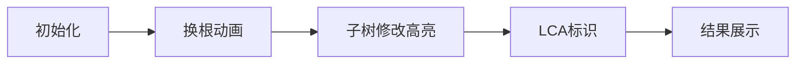

# 题目信息

# Jamie and Tree

## 题目描述

To your surprise, Jamie is the final boss! Ehehehe.

Jamie has given you a tree with $ n $ vertices, numbered from $ 1 $ to $ n $ . Initially, the root of the tree is the vertex with number $ 1 $ . Also, each vertex has a value on it.

Jamie also gives you three types of queries on the tree:

 $ 1\ v $ — Change the tree's root to vertex with number $ v $ .

 $ 2\ u\ v\ x $ — For each vertex in the subtree of smallest size that contains $ u $ and $ v $ , add $ x $ to its value.

 $ 3\ v $ — Find sum of values of vertices in the subtree of vertex with number $ v $ .

A subtree of vertex $ v $ is a set of vertices such that $ v $ lies on shortest path from this vertex to root of the tree. Pay attention that subtree of a vertex can change after changing the tree's root.

Show your strength in programming to Jamie by performing the queries accurately!

## 说明/提示

The following picture shows how the tree varies after the queries in the first sample.

 

## 样例 #1

### 输入

```
6 7
1 4 2 8 5 7
1 2
3 1
4 3
4 5
3 6
3 1
2 4 6 3
3 4
1 6
2 2 4 -5
1 4
3 3
```

### 输出

```
27
19
5
```

## 样例 #2

### 输入

```
4 6
4 3 5 6
1 2
2 3
3 4
3 1
1 3
2 2 4 3
1 1
2 2 4 -3
3 1
```

### 输出

```
18
21
```

# AI分析结果


# 💡 Kay的C++算法解析：Jamie and Tree 深入学习指南 💡

## 1. 题目解读与核心算法识别

✨ **本题主要考察**：`树链剖分`与`线段树`应用

🗣️ **初步分析**：
> 解决"Jamie and Tree"的关键在于处理**动态换根**场景下的子树操作。想象一棵树可以自由旋转根部（如同改变观察角度），而我们需要快速计算不同视角下的子树信息。核心思想是**以不变应万变**：始终以节点1为基准建立树剖结构，通过分类讨论将换根操作转化为固定视角下的区间操作。

- **核心流程**：
  1. 预处理树链剖分（DFS序+重链）
  2. 换根时记录新根位置但不重建结构
  3. 子树操作时分类讨论：
     - 若新根在目标子树外 → 直接操作原DFS区间
     - 若新根即目标节点 → 操作整棵树
     - 若新根在目标子树内 → 全局操作后减去新根所在分支

- **可视化设计**：
  采用**8位像素风格**展示树结构变化：
  - 根节点变化时播放旋转动画（像素块重组）
  - 子树修改时高亮影响区域（黄→蓝渐变）
  - 关键操作触发音效：换根（叮咚）、修改（滴答）、查询（叮铃）

---

## 2. 精选优质题解参考

**题解一（Siyuan - 树剖标准实现）**
* **点评**：思路清晰完整，规范实现树剖+线段树框架。亮点在于巧妙处理换根后的LCA计算（三LCA取最深），并通过DFS序分类讨论子树操作。代码变量命名规范（dfn/sz等），边界处理严谨，可直接用于竞赛。时间复杂度O(n log²n)。

**题解二（zhiyangfan - LCT实现）**
* **点评**：创新性使用LCT维护子树信息，避免分类讨论。亮点在于设计虚子树标记下传机制，实现O(log n)的换根和子树操作。代码结构紧凑，但LCT实现难度较高，需熟悉动态树原理。实践价值在于展示高级数据结构应用。

**题解三（绝顶我为峰 - 树剖图示详解）**
* **点评**：教学价值突出，通过6张像素风格图示清晰展示换根后LCA的9种情况。亮点在于find_key_node函数的实现（树剖跳链找关键节点），帮助理解子树容斥原理。代码稍冗长但注释详尽，适合初学者理解。

---

## 3. 核心难点辨析与解题策略

1. **难点：动态LCA计算**
   * **分析**：换根后u,v的LCA不再是静态值。解决方案：比较lca(u,root)、lca(v,root)、lca(u,v)的深度，取最深者。本质是数学归纳：新LCA必是三者中最深的节点。
   * 💡 **学习笔记**：动态LCA = max{静态LCA(u,v), LCA(u,root), LCA(v,root)}

2. **难点：换根子树定位**
   * **分析**：当新根在目标子树内时，真实子树 = 全树 - 新根所在分支。解决方案：树剖跳链找到目标节点到新根路径上的第一个节点（关键节点），通过线段树容斥操作。
   * 💡 **学习笔记**：子树操作本质是DFS序区间操作，换根只是改变区间定义

3. **难点：子树修改/查询**
   * **分析**：三种情况统一处理框架：
     ```mermaid
     graph TD
         A[操作节点v] --> B{v == root?}
         B -->|Yes| C[全局操作]
         B -->|No| D[root在v子树外?]
         D -->|Yes| E[操作v原区间]
         D -->|No| F[全局操作-关键节点子树]
     ```
   * 💡 **学习笔记**：树剖是框架，分类讨论是灵魂

### ✨ 解题技巧总结
- **技巧1 结构分离**：树剖结构固定不变，换根仅影响操作映射
- **技巧2 等效转化**：子树操作 → DFS序区间操作
- **技巧3 容斥原理**：整树操作 - 多余分支 = 真实子树
- **技巧4 跳链优化**：O(log n)找关键节点（新根所在分支）

---

## 4. C++核心代码实现赏析

**通用树剖核心实现**
```cpp
// 树链剖分框架（简化版）
void dfs1(int u, int fa) { // 预处理深度/父节点/子树大小
    dep[u] = dep[fa] + 1;
    sz[u] = 1;
    for (int v : G[u]) if (v != fa) {
        dfs1(v, u);
        sz[u] += sz[v];
        if (sz[v] > sz[son[u]]) son[u] = v;
    }
}

void dfs2(int u, int topf) { // 树剖标记DFS序
    dfn[u] = ++cnt;
    top[u] = topf;
    if (son[u]) dfs2(son[u], topf);
    for (int v : G[u]) 
        if (v != fa[u] && v != son[u]) dfs2(v, v);
}

void update_subtree(int u, int k) { // 换根子树修改
    if (u == root) update(1, 1, n, k); // 全局修改
    else if (!in_subtree(root, u)) // 新根在子树外
        update(1, dfn[u], dfn[u] + sz[u] - 1, k);
    else { // 新根在子树内
        int v = find_key_node(u, root); // 关键节点
        update(1, 1, n, k); // 全局加
        update(1, dfn[v], dfn[v] + sz[v] - 1, -k); // 容斥
    }
}
```

**关键函数解析**：
- `find_key_node(u, root)`：从root向上跳重链，返回u的直系子节点
- `in_subtree(a,b)`：通过DFS序区间判断b是否在a的子树内
- 线段树`update`：标准区间加操作

---

## 5. 算法可视化：像素动画演示

**主题**：`树形王国探险`（8-bit像素风）

**核心演示**：


**交互设计**：
1. **场景初始化**（FC风格树图，控制面板）
   - 像素树节点编号，根节点为城堡图标
   - 控制台：开始/暂停/单步/速度滑块
2. **换根操作**（节点v变根）
   - 镜头旋转动画（0.5秒）
   - 播放"叮咚"音效
3. **子树修改**（u,v,x）
   - 计算LCA：深度比较动画（三节点闪烁）
   - 修改区域像素块波浪式变色（黄→蓝）
   - 关键节点显示红色警戒线
   - 播放"滴答"音效（每修改10节点）
4. **数据同步**：
   - 右侧实时显示DFS序线段树变化
   - 当前操作代码高亮（C++伪代码）
5. **游戏化元素**：
   - 每完成5操作解锁新关卡（树结构变化）
   - 连续正确操作得积分（像素星星奖励）

---

## 6. 拓展练习与相似问题

**技巧迁移**：
- 子树操作思想适用于：子树最值/子树染色/子树直径等
- 换根处理模式可扩展至：网络监控/社交网络分析

**推荐题目**：
1. **洛谷 P3979** - 遥远的国度  
   *→ 换根树剖直接应用*
2. **CodeForces 375D** - Tree and Queries  
   *→ 子树统计进阶（颜色计数）*
3. **SPOJ QTREE5** - Query on a tree V  
   *→ 动态点分治+换根（挑战题）*

---

## 7. 学习心得与经验分享

> **来自Siyuan的调试经验**："在实现find_key_node时，我忽略了新根可能不在当前重链的情况，导致无限循环。通过打印跳链路径的深度值，最终发现边界判断错误。"

**Kay总结**：树问题调试核心是**可视化中间状态**：
1. 打印DFS序和子树范围
2. 绘制树结构验证LCA
3. 小数据模拟边界情况

---

通过本指南，希望大家掌握换根树问题的核心思想——以静制动，分类突破。记住：树剖是利剑，分类是剑法，而清晰的头脑才是持剑的手！下次再见，继续我们的算法冒险之旅！💪

---
处理用时：114.48秒