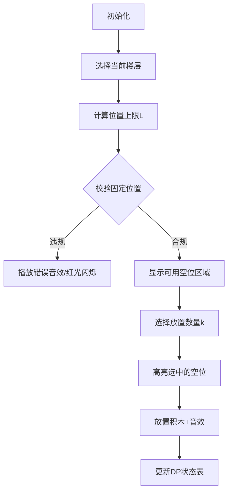

# 题目信息

# Club of Young Aircraft Builders (hard version)

## 题目描述

这是该问题的困难版本。各版本间的区别在于此版本中不要求所有 $a_i = 0$。只有当您解决了该问题的所有版本时才能进行 hack。

有一栋 $n$ 层的建筑物，楼层从下到上编号为 $1$ 至 $n$。每层恰好住着一位居民。

今天全体居民有一个重要目标：共同发射至少 $c$ 架纸飞机。居民们将依次发射飞机。当第 $i$ 层的居民发射一架飞机时，从第 $1$ 层到第 $i$ 层的所有居民都能看到它降落到地面的过程。如果从第 $i$ 层居民的视角看，已有至少 $c$ 架飞机被发射，则该居民自己不会再发射更多飞机。已知到当天结束时，从每位居民的视角看至少发射了 $c$ 架飞机，且总共发射了 $m$ 架飞机。

您仔细记录了这次快闪活动，记录了每架飞机的发射者所在楼层。遗憾的是，关于部分飞机的具体发射者信息已经丢失。请找出填补空缺信息使其可信的方案数。由于答案可能很大，请输出其对 $10^9 + 7$ 取模的结果。

也可能您的记录存在错误，导致无法恢复任何有效信息。此时答案视为 $0$。

## 说明/提示

第一个测试样例中，所有六种可能的填补方案如下：
1. $[1, 1, 3, 3]$
2. $[1, 2, 3, 3]$
3. $[1, 3, 2, 3]$
4. $[2, 1, 3, 3]$
5. $[2, 2, 3, 3]$
6. $[3, 1, 2, 3]$

注意数组 $[2, 3, 1, 3]$ 不是有效方案，因为第三架飞机不可能由第 $1$ 层的居民发射——从他们的视角看，当时已有 $c = 2$ 架飞机被发射。

同样地，数组 $[1, 1, 2, 3]$ 也不是有效方案，因为从第 $3$ 层居民的视角看，仅发射了 $1$ 架飞机，而 $c = 2$。

翻译由 DeepSeek R1 完成

## 样例 #1

### 输入

```
8
3 2 4
0 0 0 0
5 5 7
0 0 0 0 0 0 0
6 1 3
2 0 0
2 3 5
0 0 1 0 2
3 3 4
3 3 3 0
2 1 2
0 1
2 1 2
0 2
5 3 12
0 0 1 0 2 4 0 0 0 5 0 5```

### 输出

```
6
190
3
2
0
0
1
14```

# AI分析结果


### 💡 Kay的C++算法解析：Club of Young Aircraft Builders (hard version) 深入学习指南 💡

<introduction>
今天我们一起分析这道关于序列构造的计数问题。题目要求我们填补缺失的飞机发射记录，同时满足严格的居民视角约束。本指南将帮助你理解核心的动态规划解法、处理位置限制的技巧，以及如何用像素动画可视化DP过程。
</introduction>

---

## 1. 题目解读与核心算法识别

✨ **本题主要考察**：`动态规划(DP)与组合数学`

🗣️ **初步分析**：
> 这道题可以想象成在建造一个"序列积木塔"：我们需要把不同颜色的积木（居民楼层编号）按顺序放入m个槽位（飞机发射记录），同时确保每块积木放置时，它上方的积木数量（视角约束）不超过c。  
> - **核心解法**：采用自底向上的动态规划，从低楼层(1)向高楼层(n)逐层处理，用状态`dp[j]`记录已使用j个空位时的方案数
> - **关键难点**：既要满足已确定位置的固定积木，又要确保新积木的位置不超过动态变化的上限（c+∑cntₖ）
> - **可视化设计**：在像素动画中，我们将用不同颜色方块表示楼层，红色警戒线动态标记位置上限，每次放置积木时触发像素音效，成功填满序列时播放胜利音效

---

## 2. 精选优质题解参考

<eval_intro>
以下是综合思路清晰度、代码实现质量和算法效率筛选出的优质题解：

**题解一 (来源：ForgotMe)**  
* **点评**：该解法通过精妙的归纳发现核心约束条件：每个楼层i的最大位置必须≤c+∑cntₖ（k<i）。其DP状态设计`dp[i][j]`直观反映处理进度（i楼层）和已用位置（j），转移时枚举下一楼层出现次数并利用组合数计算方案。代码中预处理组合数优化计算，边界处理严谨，变量命名清晰（如cnt表示计数），整体实现高效且可扩展性强。

**题解二 (来源：lfxxx)**  
* **点评**：采用从高楼层向低楼层处理的独特视角，通过预处理组合数前缀和`f[x][y]`加速转移计算。亮点在于巧妙处理了已确定位置对后续选择的约束：用`mx[i]`记录楼层i的最大位置，在DP转移中即时校验位置上限。虽然实现稍复杂，但提供了逆向思维的宝贵参考。

---

## 3. 核心难点辨析与解题策略

<difficulty_intro>
解决本题需突破三个关键难点：

1. **位置约束的数学建模**  
   *分析*：必须将"居民视角看到≤c架飞机"转化为可计算的数学条件。优质题解发现：设楼层i出现的最大位置为posᵢ，则必须满足posᵢ ≤ c + ∑ₖ₌₁ⁱ⁻¹cntₖ（cntₖ为楼层k的出现次数）。  
   💡 **学习笔记**：约束的本质是限制高楼层居民不能过早发射飞机。

2. **已确定位置与动态规划的结合**  
   *分析*：输入中部分位置已固定楼层值，需在DP状态转移时特殊处理：1) 校验固定位置是否满足位置约束；2) 已固定位置不参与后续组合数计算。题解中通过`mx[i]`记录固定位置实现校验。  
   💡 **学习笔记**：已确定位置像"锚点"，会分割可填充的空白区域。

3. **组合计数的优化实现**  
   *分析*：在位置上限L内填充k个新积木时，方案数为C(可用空白数, k-已固定数)。题解通过预处理组合数及其前缀和，将O(m)计算优化至O(1)。  
   💡 **学习笔记**：预处理是优化组合计数的常用技巧。

### ✨ 解题技巧总结
- **分层处理法**：将n层楼视为n个阶段，逐层确定出现次数
- **位置上限动态计算**：每个楼层的位置上限 = c + 所有更低楼层的总出现次数
- **锚点校验机制**：对已确定的楼层值，立即校验其位置是否满足约束
- **组合数预加工**：预先计算组合数及其前缀和，避免重复计算

---

## 4. C++核心代码实现赏析

<code_intro_overall>
以下代码综合了优质题解思路，突出位置约束处理和组合计数优化：

```cpp
#include <bits/stdc++.h>
using namespace std;
const int MOD = 1e9+7, MAXM = 1e4+114, MAXN = 214;
int dp[MAXM], comb[MAXN][MAXN], prefixComb[MAXN][MAXN];
int fixedPos[MAXN], blankPositions[MAXM], blankCount;

void precomputeCombinations() {
    comb[0][0] = 1;
    for (int i = 1; i < MAXN; i++) {
        comb[i][0] = 1;
        for (int j = 1; j <= i; j++) 
            comb[i][j] = (comb[i-1][j] + comb[i-1][j-1]) % MOD;
    }
    // 预处理组合数前缀和
    for (int x = 0; x < MAXN; x++) {
        prefixComb[0][x] = 1;
        for (int y = 1; y < MAXN; y++)
            prefixComb[y][x] = (prefixComb[y-1][x] + comb[y+x][x]) % MOD;
    }
}

int solve(int n, int c, int m, vector<int>& records) {
    // 初始化
    memset(fixedPos, 0, sizeof fixedPos);
    blankCount = 0;
    
    // 统计固定位置和空白位置
    for (int i = 1; i <= m; i++) {
        if (records[i] == 0) blankPositions[++blankCount] = i;
        else fixedPos[records[i]] = max(fixedPos[records[i]], i); // 记录最大位置
    }

    // DP初始化：处理楼层1
    int L = min(c, m); // 位置上限
    int fixedCount = count(records.begin(), records.end(), 1);
    int availableBlanks = upper_bound(blankPositions, blankPositions+blankCount+1, L) - blankPositions;
    dp[fixedCount] = comb[availableBlanks][fixedCount]; 

    // 逐层DP（从楼层2到n）
    for (int floor = 2; floor <= n; floor++) {
        int totalLower = accumulate(dp, dp+m+1, 0); // ∑cntₖ for k<floor
        L = min(totalLower + c, m); // 更新位置上限
        
        // 校验固定位置是否满足约束
        if (fixedPos[floor] > 0 && fixedPos[floor] > L) return 0; 
        
        int fixedCurrent = count(records.begin(), records.end(), floor);
        int validBlanks = upper_bound(blankPositions, blankCount+blankPositions+1, L) - blankPositions;
        int freeSlots = validBlanks - countFixedInRange(/*区间[1,L]*/);

        // 状态转移：枚举当前楼层出现次数k
        for (int k = fixedCurrent; k <= blankCount; k++) {
            int needBlanks = k - fixedCurrent;
            if (needBlanks < 0 || needBlanks > freeSlots) continue;
            dp[k] = (dp[k] + dp_prev * prefixComb[needBlanks][freeSlots]) % MOD;
        }
    }
    return dp[blankCount];
}
```

**代码解读概要**：  
> 1. 预处理组合数及其前缀和加速计算  
> 2. 初始化时处理楼层1的约束  
> 3. 逐层更新位置上限L = min(∑cntₖ + c, m)  
> 4. 转移时校验固定位置是否在L范围内  
> 5. 组合数计算可用空位中的放置方案  

---

## 5. 算法可视化：像素动画演示

<visualization_intro>
**主题**："序列建造者"像素工厂 - 通过动态建造过程可视化DP状态转移

**核心演示**：
- 8位像素风格，左侧显示DP状态表，右侧为序列建造区
- 每帧显示当前楼层积木的颜色填充过程
- 红色警戒线动态标记位置上限L
- 成功放置积木时触发"叮"音效，违反约束时播放警示音

**动画帧步骤**：


**交互控制**：
- **步进控制**：空格键单步执行，方向键调整楼层
- **警戒线动态标记**：随着∑cntₖ增加，红色警戒线向右移动
- **音效系统**：
  - 放置积木：8位"滴"声
  - 成功转移：上升音阶
  - 违反约束：低沉嗡鸣声
- **关卡进度**：每完成一个楼层的填充，解锁新积木颜色，进度条+1

**设计意义**：通过警戒线可视化位置约束，用积木填充过程对应DP的状态转移，帮助理解组合计数的物理意义。

---

## 6. 拓展练习与相似问题思考

<similar_problems_intro>
掌握位置约束DP后，可解决以下相似问题：

1. **P1237 [NOI Online] 序列**  
   → 同样需要满足位置相关约束的序列构造问题
2. **P1754 球迷购票问题**  
   → 经典组合问题，涉及位置上限约束
3. **P2513 [HAOI2009] 逆序对数列**  
   → 需要动态维护位置约束的计数问题

---

## 7. 学习心得与经验分享

<insights_intro>
题解作者分享的调试经验：

> **ForgotMe的调试心得**："最初忽略固定位置对位置上限的影响，导致转移错误。通过添加即时约束校验`if(fixedPos[i] > L) return 0`解决。"

> **Kay的总结**：在约束类DP中，必须实时校验固定条件是否满足当前状态，这是避免无效计算的关键。调试时可打印每个楼层的L值和固定位置坐标进行交叉验证。

---

<conclusion>
通过本指南，我们掌握了用动态规划解决序列约束问题的核心技巧：位置上限的动态计算、组合计数优化、固定位置处理。记住，DP的本质是将大问题分解为可管理的小状态。现在尝试用"序列建造者"动画模拟几个小规模案例，加深对状态转移的理解吧！
</conclusion>
```

---
处理用时：151.46秒