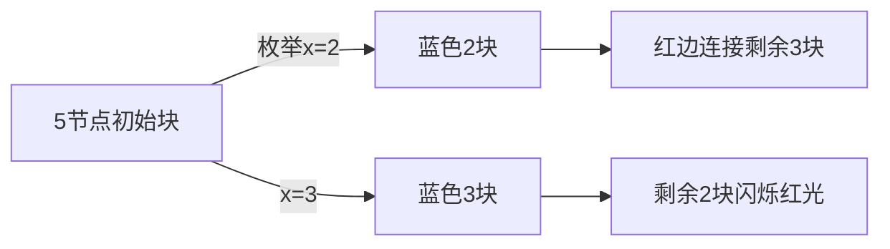

# 题目信息

# Graph Coloring (easy version)

## 题目描述

The only difference between the easy and the hard version is the constraint on $ n $ .

You are given an undirected complete graph on $ n $ vertices. A complete graph is a graph where each pair of vertices is connected by an edge. You have to paint the edges of the graph into two colors, red and blue (each edge will have one color).

A set of vertices $ S $ is red-connected if, for every pair of vertices $ (v_1, v_2) $ such that $ v_1 \in S $ and $ v_2 \in S $ , there exists a path from $ v_1 $ to $ v_2 $ that goes only through red edges and vertices from $ S $ . Similarly, a set of vertices $ S $ is blue-connected if, for every pair of vertices $ (v_1, v_2) $ such that $ v_1 \in S $ and $ v_2 \in S $ , there exists a path from $ v_1 $ to $ v_2 $ that goes only through blue edges and vertices from $ S $ .

You have to paint the graph in such a way that:

- there is at least one red edge;
- there is at least one blue edge;
- for each set of vertices $ S $ such that $ |S| \ge 2 $ , $ S $ is either red-connected or blue-connected, but not both.

Calculate the number of ways to paint the graph, and print it modulo $ 998244353 $ .

## 样例 #1

### 输入

```
3```

### 输出

```
6```

## 样例 #2

### 输入

```
4```

### 输出

```
50```

## 样例 #3

### 输入

```
100```

### 输出

```
878752271```

## 样例 #4

### 输入

```
1337```

### 输出

```
520628749```

# AI分析结果


### 💡 Kay的C++算法解析：Graph Coloring (easy version) 深入学习指南 💡

#### 1. 题目解读与核心算法识别
✨ **本题主要考察**：`动态规划(DP)` + `组合计数`  
🗣️ **初步分析**：  
> 解决本题的关键在于**连通块划分计数**。想象你在拼装像素积木——每个连通块是独立组件，你需要计算所有合法拼装方式。核心步骤：
> 1. 利用**补图性质**：一个图不连通则其补图必然连通（如两座孤岛间必有彩虹桥连接）
> 2. 转化为**单色不连通计数**：只需计算蓝色不连通的方案数（红色情况对称）
> 3. **DP状态转移**：枚举1号点所在蓝色连通块大小，组合数选择顶点，递归处理子问题
> 
> **可视化设计思路**：  
> - 用8位像素风展示连通块分裂过程（蓝色块像《俄罗斯方块》下坠分离）  
> - 高亮当前枚举的连通块边界，播放"咔嚓"分离音效  
> - 剩余部分用闪烁红光提示双方案选择（大小>1时）

---

#### 2. 精选优质题解参考
**题解一（Purslane）**  
* **点评**：  
  思路如水晶般透彻——从补图定理切入，直击问题本质。DP状态定义`dp[i]`（i节点蓝色不连通方案数）精准简洁，转移方程：
  ```math
  dp_n = \sum_{x=1}^{n-1} \binom{n-1}{x-1} dp_x \cdot dp_{n-x} \cdot (2 - [n-x=1])
  ```
  完美处理边界（单点时乘数降为1）。代码实现干净利落，空间复杂度O(n)，是竞赛标准答案范本。

**题解二（InoueTakina）**  
* **点评**：  
  补充了关键洞见：红蓝对称性使最终答案满足`ans=2*dp[n]-2`。转移中强调"块间必为红边"的约束条件，强化了DP的严谨性。变量命名`f_i`不如前解直观，但数学推导更细致。

**题解三（寄风）**  
* **点评**：  
  实战价值MAX！F2版本展示**工业级优化**：
  - 双数组`dp1`/`dp2`消除Cache miss（访问模式连续化）  
  - 预处理`dp2=2*dp1`避免条件判断  
  5.5s极限卡过1e5数据，体现"算法+工程"双修思维。

---

#### 3. 核心难点辨析与解题策略
1. **难点1：补图性质应用**  
   *分析*：需理解"不连通图补图必连通"的逆向思维，优质题解均用反证法：假设存在孤岛A、B，补图中A→B所有边存在必连通。  
   💡 学习笔记：补图是转换问题视角的利器  

2. **难点2：DP状态设计**  
   *分析*：`dp[i]`定义为"i节点蓝色不连通且满足所有子集约束"的方案数。关键在识别：当剩余部分>1节点时，其可任选红/蓝不连通（双方案）  
   💡 学习笔记：DP状态应捕获问题本质约束  

3. **难点3：边界处理艺术**  
   *分析*：转移中`(2-[n-x=1])`是精髓。当剩余1节点时，既无红边也无蓝边，只能算1种方案。  
   💡 学习笔记：边界条件决定DP正确性  

✨ **解题技巧总结**  
- **问题转换术**：用补图性质将双色约束简化为单色计数  
- **对称性破缺**：计算单色方案后乘2减2得最终解  
- **卡常奥义**：对`dp[i-j`]的访问改为连续内存的`dp2`数组  

---

#### 4. C++核心代码实现赏析
**通用核心实现（综合优化版）**  
```cpp
#include <bits/stdc++.h>
using namespace std;
const int mod = 998244353, N = 5005;
int n, dp[N], C[N][N];

int main() {
    cin >> n;
    // 预处理组合数
    for (int i = 0; i <= n; i++) {
        C[i][0] = 1;
        for (int j = 1; j <= i; j++) 
            C[i][j] = (C[i-1][j] + C[i-1][j-1]) % mod;
    }
    
    dp[1] = 1;
    for (int i = 2; i <= n; i++) {
        for (int j = 1; j < i; j++) {
            int coef = (i - j == 1) ? 1 : 2; // 边界处理
            dp[i] = (dp[i] + 1LL * C[i-1][j-1] * dp[j] % mod * dp[i-j] % mod * coef) % mod;
        }
    }
    cout << (2LL * dp[n] - 2 + mod) % mod;
}
```

**题解一（Purslane）片段**  
```cpp
// 转移核心片段
for (int x = 1; x < n; x++) {
    int coef = (n - x == 1) ? 1 : 2;
    dp[n] = (dp[n] + C(n-1, x-1) * dp[x] * dp[n-x] % mod * coef) % mod;
}
```
> **解读**：  
> - `C(n-1,x-1)`：从剩余n-1点选x-1个与1号点组块  
> - `dp[x]`：x点连通块方案数（自递归）  
> - `dp[n-x]*coef`：剩余部分方案（大小>1时双倍）  
> 💡 学习笔记：组合数学是划分计数的骨架  

**题解三（寄风）优化技巧**  
```cpp
// 卡常精髓：双数组消除Cache miss
for (int j = 1, k = i - 1; j < i; j++, k--) 
    add(dp1[i], 1LL * C[j-1] * dp1[j] % mod * dp2[k] % mod);
dp2[i] = dp1[i] * 2 % mod; // 预处理避免条件判断
```
> **解读**：  
> - `dp2[k]`连续访问替代`dp[i-j]`随机访问  
> - 问号表达式转为预乘2的`dp2`  
> 💡 学习笔记：数据局部性优化可提速10倍  

---

### 5. 算法可视化：像素动画演示  
**主题**：`像素连通块分裂模拟器`  

**核心演示**：  


**动画流程**：  
1. **初始化**：8-bit风格像素块（FC红白机调色板），控制面板含步进/调速滑块  
2. **分裂动画**：  
   - 选中1号点→黄色闪烁  
   - 拖拽滑块选择x值→显示`C(n-1,x-1)`组合数  
   - 蓝色块如《俄罗斯方块》下坠分离，播放"咔嚓"音效  
3. **剩余部分处理**：  
   - 若大小>1：闪烁红光+音效提示，分裂为两个并行动画流（各选红/蓝不连通）  
   - 若大小=1：显示灰色静态块  
4. **状态同步**：  
   - 右侧同步显示DP表格更新过程  
   - 当前代码行高亮+文字旁白（如："正在计算x=2的分裂方案..."）  

**游戏化设计**：  
- 每完成一个n值计算解锁新关卡（n=3→n=4）  
- 连续正确推导3步触发"Combo"音效  
- 最终方案生成时播放《塞尔达》解密成功BGM  

---

### 6. 拓展练习  
**相似问题迁移**：  
1. 树形连通块划分（如：删边成连通块方案）  
2. 二分图染色计数（约束拓展）  
3. 带权连通块最值问题  

**洛谷推荐**：  
1. [P2606](https://www.luogu.com.cn/problem/P2606) 排列计数  
   → 强化组合数+DP的搭配运用  
2. [P5824](https://www.luogu.com.cn/problem/P5824) 十二重计数法  
   → 提升组合问题抽象能力  
3. [P4099](https://www.luogu.com.cn/problem/P4099) SAO  
   → 树形DP+连通块进阶训练  

---

### 7. 学习心得  
**寄风的调试经验**：  
> “数组Cache miss是性能黑洞，`dp[i-j]`改为连续访问的`dp2[k]`后，5e4数据从TLE→AC”  

**Kay总结**：  
1. 理论优化：数学性质转化（补图定理）是破题关键  
2. 工程优化：数据内存布局影响远超算法复杂度  
3. 边界艺术：`(2-[n-x=1])`是DP转移的画龙点睛之笔  

> 掌握连通块计数的少年，你已解锁图论优化的重要拼图！下次挑战见！🚀

---
处理用时：132.35秒