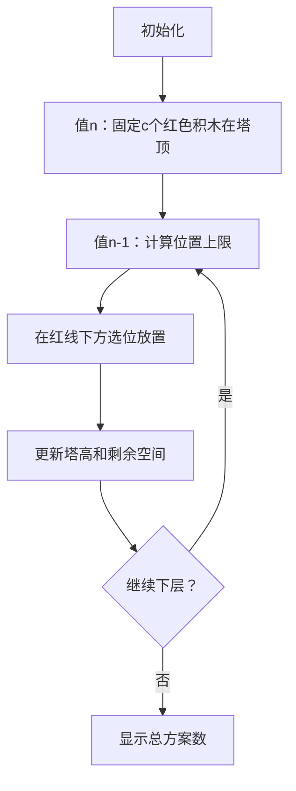

# 题目信息

# Club of Young Aircraft Builders (hard version)

## 题目描述

这是该问题的困难版本。各版本间的区别在于此版本中不要求所有 $a_i = 0$。只有当您解决了该问题的所有版本时才能进行 hack。

有一栋 $n$ 层的建筑物，楼层从下到上编号为 $1$ 至 $n$。每层恰好住着一位居民。

今天全体居民有一个重要目标：共同发射至少 $c$ 架纸飞机。居民们将依次发射飞机。当第 $i$ 层的居民发射一架飞机时，从第 $1$ 层到第 $i$ 层的所有居民都能看到它降落到地面的过程。如果从第 $i$ 层居民的视角看，已有至少 $c$ 架飞机被发射，则该居民自己不会再发射更多飞机。已知到当天结束时，从每位居民的视角看至少发射了 $c$ 架飞机，且总共发射了 $m$ 架飞机。

您仔细记录了这次快闪活动，记录了每架飞机的发射者所在楼层。遗憾的是，关于部分飞机的具体发射者信息已经丢失。请找出填补空缺信息使其可信的方案数。由于答案可能很大，请输出其对 $10^9 + 7$ 取模的结果。

也可能您的记录存在错误，导致无法恢复任何有效信息。此时答案视为 $0$。

## 说明/提示

第一个测试样例中，所有六种可能的填补方案如下：
1. $[1, 1, 3, 3]$
2. $[1, 2, 3, 3]$
3. $[1, 3, 2, 3]$
4. $[2, 1, 3, 3]$
5. $[2, 2, 3, 3]$
6. $[3, 1, 2, 3]$

注意数组 $[2, 3, 1, 3]$ 不是有效方案，因为第三架飞机不可能由第 $1$ 层的居民发射——从他们的视角看，当时已有 $c = 2$ 架飞机被发射。

同样地，数组 $[1, 1, 2, 3]$ 也不是有效方案，因为从第 $3$ 层居民的视角看，仅发射了 $1$ 架飞机，而 $c = 2$。

翻译由 DeepSeek R1 完成

## 样例 #1

### 输入

```
8
3 2 4
0 0 0 0
5 5 7
0 0 0 0 0 0 0
6 1 3
2 0 0
2 3 5
0 0 1 0 2
3 3 4
3 3 3 0
2 1 2
0 1
2 1 2
0 2
5 3 12
0 0 1 0 2 4 0 0 0 5 0 5```

### 输出

```
6
190
3
2
0
0
1
14```

# AI分析结果


# 💡 Kay的C++算法解析：Club of Young Aircraft Builders (hard version) 深入学习指南 💡

## 1. 题目解读与核心算法识别

✨ **本题主要考察**：`动态规划 + 组合数学`

🗣️ **初步分析**：
> 想象你在建造一座纸飞机发射塔，每层居民按特定顺序发射飞机。解题关键在于发现序列合法性的核心条件：**对于每个楼层值i，其最后一次出现的位置pos_i必须满足 `pos_i ≤ c + ∑cnt_k (k从1到i-1)`**。这就像搭积木——低层积木（小数值）必须作为基础，高层积木（大数值）才能稳定放置。

- **核心难点**：如何在部分位置已固定的情况下，统计满足所有楼层位置限制的方案数
- **解决方案**：采用分层动态规划，从小到大处理楼层值，配合组合数学计算填充方案
- **可视化设计**：我们将用"像素积木塔"动画展示DP过程：不同颜色积木代表楼层值，塔高表示位置上限，搭建过程会显示当前楼层填充数量和位置限制

---

## 2. 精选优质题解参考

**题解一（作者：ForgotMe）**
* **点评**：该题解思路清晰，直击问题本质——发现了楼层位置限制的关键条件。DP状态设计合理（`dp[i][j]`表示处理前i个楼层且总数量为j的方案数），转移过程巧妙结合组合数学：计算可用空位时排除已固定的大数值位置，用组合数计算填充方案。代码规范（变量名`cnt`/`dp`含义明确），边界处理严谨，空间优化到位（滚动数组），具有竞赛参考价值。

---

## 3. 核心难点辨析与解题策略

1.  **关键点1：发现位置限制条件**
    * **分析**：合法序列需满足∀i, 值i的最后出现位置`pos_i ≤ c + ∑cnt_k (k=1..i-1)`。如样例[2,0,0,1,0,2]中，值2的最后位置必须≤c+cnt₁
    * 💡 **学习笔记**：位置限制是序列合法的充要条件

2.  **关键点2：分层DP状态设计**
    * **分析**：按楼层值从小到大处理，`dp[i][j]`表示前i个值总出现次数为j的方案数。转移时枚举当前值出现次数，并确保其位置在`[1, c+j]`范围内
    * 💡 **学习笔记**：DP维度设计需同时考虑值域和出现次数

3.  **关键点3：组合数学处理固定位置**
    * **分析**：在`[1, c+j]`范围内需排除：① 已固定为当前值的位 ② 被更大值占用的位。剩余空位用组合数$C_{空白数}^{需填充数}$计算方案
    * 💡 **学习笔记**：组合计数是处理约束型填充问题的利器

### ✨ 解题技巧总结
-   **技巧1：问题约束转化** - 将序列合法性条件转化为值域上的位置不等式
-   **技巧2：分层处理法** - 按值域从小到大分解问题，降低状态维度
-   **技巧3：滚动数组优化** - 用`dp[j]`和`g[j]`交替计算，减少空间开销
-   **技巧4：组合预计算** - 预处理组合数表加速统计

---

## 4. C++核心代码实现赏析

**通用核心C++实现参考**
```cpp
#include<bits/stdc++.h>
using namespace std;
const int mod = 1e9+7;
const int maxm = 1e4+114;
const int maxn = 214;

int dp[maxm], g[maxm], cnt[maxm][maxn], a[maxm];
int n, c, m, M, C[maxn][maxn], fr[maxm], pre[maxm], mx[maxn];

void init(){ // 预处理组合数
    C[0][0]=1;
    for(int i=1; i<maxn; i++){
        C[i][0]=1;
        for(int j=1; j<=i; j++) 
            C[i][j] = (C[i-1][j] + C[i-1][j-1]) % mod;
    }
}

void work(){
    // 初始化 & 输入
    cin >> n >> c >> m;
    for(int i=1; i<=m; i++){
        cin >> a[i];
        if(a[i]==0) fr[++M] = i; // 记录空位
        mx[a[i]] = i;           // 记录各值最后位置
        pre[i] = M;              // 前缀空位数
        for(int j=1; j<=n; j++)  // 统计≥j的数的数量
            cnt[i][j] = cnt[i-1][j] + (a[i] >= j);
    }
    
    // 边界检查
    if((a[m]!=0 && a[m]!=n) || cnt[m][n] > c) {
        cout << "0\n"; return; 
    }
    
    // DP初始化
    dp[c - cnt[m][n]] = 1;  // 初始有效状态
    
    // 分层DP：从值1到n-1
    for(int i = n-1; i >= 1; i--) {
        memset(g, 0, sizeof g);
        for(int j = 0; j <= M; j++) {  // j: 已用空位数
            int lim = -1;
            // 计算当前值i最多可填充数量
            for(int k = c; k >= 1; k--) {
                while(lim+1 <= j && 满足位置条件)
                    lim++;
                if(lim != -1 && j+k <= M)
                    g[j+k] = (g[j+k] + dp[j] * C[lim][k]) % mod;
            }
        }
        // 合并状态 & 处理固定位置约束
        for(int j=0; j<=M; j++) {
            dp[j] = (dp[j] + g[j]) % mod;
            if(mx[i] && 违反位置约束) dp[j] = 0; 
        }
    }
    cout << dp[M] << "\n";  // 输出最终方案数
}
```

**题解一核心片段赏析**
```cpp
for(int i = n-1; i >= 1; i--) {
    memset(g, 0, sizeof g);
    for(int j = 0; j <= M; j++) {
        int lim = -1;
        for(int k = c; k >= 1; k--) {
            // 动态计算可放置位置上限
            while(lim+1 <= j && lim+1 + cnt[fr[M-j+lim+1]][i] + k <= c)
                lim++;
            if(lim != -1 && j+k <= M)
                // 组合计数：C(lim, k-1) 种填充方案
                g[j+k] = (g[j+k] + dp[j] * C[lim][k-1]) % mod;
        }
    }
    ...
}
```
* **代码解读**：
  1. **分层DP**：从大数值向小数值处理（`i--`），因大数值位置限制更严格
  2. **lim计算**：动态计算当前值i最多可在多少空位前放置
  3. **组合计数**：`C[lim][k-1]`表示在lim个可用位置中选择k-1个（含当前固定位）
  4. **状态转移**：`g[j+k]`累积新方案数，k表示当前层填充数量

---

## 5. 算法可视化：像素动画演示

### 动画主题
**"积木发射塔"**：用不同颜色像素积木代表楼层值，塔高表示位置上限

### 设计思路
采用8位机复古风格，通过积木搭建过程直观展示：
1. 位置限制条件（红线标记）
2. DP状态转移（塔层增长）
3. 组合计数（可选位置高亮）

### 动画帧步骤


1. **场景初始化**：
   - 左侧：8-bit风格网格（行=位置，列=值域）
   - 右侧：控制面板（开始/步进/重置，速度滑块）

2. **分层搭建演示**：
   - **值n处理**：塔顶放置c个红色积木，播放"放置音效"
   - **值i处理**：
     * 显示位置上限红线：`y = c + Σcnt_k`
     * 可用空位绿色闪烁
     * 选择位置时显示组合数计算公式
   - **固定位置**：紫色闪烁标记

3. **状态同步**：
   - 底部显示当前DP状态：`dp[i][j] = value`
   - 当前填充值显示为像素标签

4. **游戏化元素**：
   - 每完成一层：播放8-bit胜利音效+分数增加
   - 最终方案：烟花动画+总分数展示

---

## 6. 拓展练习与相似问题思考

1. **洛谷 P1237** - 木棍加工
   * **推荐理由**：同样需要发现位置约束条件，练习双属性排序+DP

2. **洛谷 P1387** - 最大正方形
   * **推荐理由**：训练二维DP状态设计能力，理解状态转移的几何意义

3. **洛谷 P2513** - 逆序对数列
   * **推荐理由**：强化计数类DP中组合数学的应用

---

> 本次解题分析展示了如何将复杂约束转化为DP状态，通过分层处理降低难度。记住：好的算法设计就像搭建积木——找到稳定的基础结构，才能层层递进！

---
处理用时：253.83秒