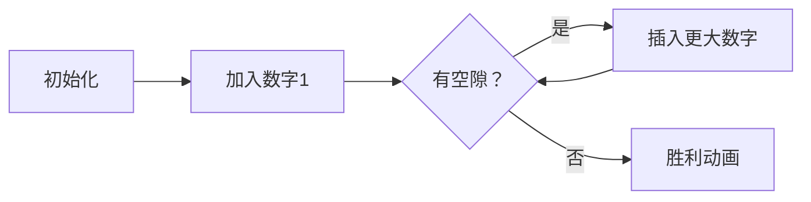

# 题目信息

# Yaroslav and Arrangements

## 题目描述

如果一个数列相邻两项之差的绝对值均为 $1$（我们认为首项和末项也相邻），并且首项是数列中最小的元素之一，那么我们称之为良好数列。如果一个数列单调不降且长度在 $[1,n]$ 之间，数列中每个数的值在 $[1,m]$ 之间，且重排后能得到至少 $1$ 个至多 $k$ 个良好数列，那么我们称之为优秀数列。给出 $n, m, k$，求优秀数列的个数。答案对 $10^9+7$ 取模。

Translated by @Kirito_Rivaille

## 说明/提示

$1 \le n,m,k \le 100$。

## 样例 #1

### 输入

```
1 1 1
```

### 输出

```
0
```

## 样例 #2

### 输入

```
3 3 3
```

### 输出

```
2
```

# AI分析结果


### Kay的C++算法解析：Yaroslav and Arrangements 深入学习指南

---

#### **1. 题目解读与核心算法识别**  
✨ **本题主要考察**：动态规划与组合数学应用  

🗣️ **初步分析**：  
> 本题要求统计所有"优秀数列"的数量，其核心在于理解"良好数列"的构造规律。想象你正在搭建一座数字塔：从底层（最小值）开始，每层必须比下层大1，且首尾相连形成闭环。动态规划（DP）就像搭积木的过程，我们记录当前塔的高度（数字大小）、已用积木数（序列长度）、连接点数量（空隙），以及不同搭建方案的总数（良好序列数量）。组合数学则用于计算插入新积木的分组方式。  

> - **核心难点**：如何在状态转移中维护空隙数和方案数乘积，同时满足k的限制。  
> - **可视化设计**：动画将展示像素塔搭建过程：数字块按层堆叠，空隙位置闪烁提示，插入新数字时播放"咔嗒"音效。当塔首尾闭合（空隙为0）时，播放胜利音效并高亮完整塔身。  

---

#### **2. 精选优质题解参考**  
**题解一（来源：moonbowqwq）**  
* **点评**：  
  思路清晰度：⭐⭐⭐⭐⭐  
  代码规范性：⭐⭐⭐⭐  
  算法亮点：⭐⭐⭐⭐⭐  
  实践价值：⭐⭐⭐⭐  
  > 该题解用"搭积木"比喻完美解释DP状态定义（当前数字、长度、空隙、方案数）。代码中`f[now][j+t][t-k]`的滚动数组优化节省空间，组合数预处理截断（`min(R+1, ...)`）巧妙避免无效计算。变量名`gap`/`have`直观体现状态含义，边界处理严谨（如`j+x<=n`）。  

**题解二（来源：syzf2222）**  
* **点评****:  
  思路清晰度：⭐⭐⭐⭐  
  代码规范性：⭐⭐⭐⭐  
  算法亮点：⭐⭐⭐⭐  
  实践价值：⭐⭐⭐⭐  
  > 状态转移方程`dp[i+1][j+t][t-k]`与组合数`C[t-1][k-1]`的结合简洁有力。亮点在于初始化`dp[0][0][1][1]=1`，自然表示空序列的初始状态。代码中`add()`宏确保模运算高效性，但变量命名略抽象（如`t`表新增数字量）。  

**题解三（来源：daniEl_lElE）**  
* **点评**：  
  思路清晰度：⭐⭐⭐  
  代码规范性：⭐⭐⭐  
  算法亮点：⭐⭐⭐⭐  
  实践价值：⭐⭐⭐  
  > 创新性提出"数字偏移"概念（乘以`(m-i+1)`），但转移方程`dp[i][j+l][l-k]`中`l`命名易混淆。优势在于组合数计算直接内联，避免额外数组。  

---

#### **3. 核心难点辨析与解题策略**  
1. **难点1：状态设计抽象**  
   * **分析**：DP需同时跟踪数字值、长度、空隙、方案数四维状态。优质题解通过比喻（如积木塔）降低理解门槛——`j`是塔高，`k`是待填补的裂缝。  
   * 💡 **学习笔记**：将状态具象化为物理模型，是理解高维DP的关键。  

2. **难点2：组合数融入转移**  
   * **分析**：新增数字`x`个需分成`k`组（每组对应一个空隙），方案数为`C(x-1, k-1)`。当乘积超过`k`时立即截断（如`min(k+1, ...)`），避免无效计算。  
   * 💡 **学习笔记**：组合数是分组问题的数学引擎，截断优化是处理上界的利器。  

3. **难点3：答案统计时机**  
   * **分析**：必须在空隙归零时立即统计（`g=0`），并乘以`(m-i+1)`补偿数字范围偏移。延迟统计会遗漏部分解。  
   * 💡 **学习笔记**：DP转移与答案统计需同步进行，如同烘焙时定时查看烤箱。  

### ✨ 解题技巧总结  
- **技巧1：滚动数组压缩**  
  用`dp[now]`/`dp[old]`交替避免`O(n^4)`空间开销。  
- **技巧2：组合数预处理**  
  预计算组合数并截断，将`O(n^2)`查询降为`O(1)`。  
- **技巧3：状态转移剪枝**  
  `x≥g`时才能转移，`j+x≤n`时提前终止循环。  

---

#### **4. C++核心代码实现赏析**  
**通用核心实现（综合题解优化版）**  
```cpp
#include <bits/stdc++.h>
using namespace std;
const int N = 105, mod = 1e9+7;

int main() {
    int n, m, k, C[N][N], dp[2][N][N][N] = {}, ans = 0;
    // 预处理组合数（自动截断超过k的值）
    for (int i = 0; i < N; i++) for (int j = 0; j <= i; j++) 
        C[i][j] = (j == 0) ? 1 : min(k + 1, C[i - 1][j] + C[i - 1][j - 1]);

    dp[0][0][1][1] = 1; // 初始化：0个数字，1个空隙，1种方案
    for (int i = 0; i < m; i++) {
        bool now = i & 1, nxt = !now;
        memset(dp[nxt], 0, sizeof dp[nxt]);
        for (int j = 0; j <= n; j++)          // 当前长度
        for (int g = 1; g <= n; g++)           // 当前空隙（g=0不转移）
        for (int h = 1; h <= k; h++)           // 当前方案数
        for (int x = g; x + j <= n; x++) {     // 新增x个数字
            int new_h = h * C[x - 1][g - 1];   // 组合数计算新方案数
            if (new_h > k) new_h = k + 1;       // 关键截断优化
            dp[nxt][j + x][x - g][new_h] = (dp[nxt][j + x][x - g][new_h] + dp[now][j][g][h]) % mod;
        }
        // 统计当前i+1层的答案（空隙为0时）
        for (int j = 1; j <= n; j++)
        for (int h = 1; h <= k; h++)
            ans = (ans + 1LL * dp[nxt][j][0][h] * (m - i)) % mod; // 乘偏移量
    }
    cout << ans;
}
```
**关键代码解读**：  
1. **组合数预处理**：`C[i][j] = min(k+1, ...)` 确保值不超过k+1，避免无效状态。  
2. **四重循环转移**：  
   - `j`从0到n：当前序列长度  
   - `g`从1开始：至少1个空隙才能插入新数字  
   - `x`从`g`开始：新增数字数≥空隙数  
3. **截断优化**：`new_h = k+1` 时停止扩散，降低状态数。  

**题解一核心片段赏析**  
```cpp
for(int in = n - num; in >= gap; --in) {
    int new_have = have * c[in - 1][gap - 1];
    if(new_have <= k) { // 组合数乘积≤k时才转移
        f[now][num + in][in - gap][new_have] += f[old][num][gap][have];
    }
}
```
> **学习笔记**：`in-gap`计算新空隙，体现"消除旧空隙-生成新空隙"的物理过程。  

---

#### **5. 算法可视化：像素动画演示**  
**主题**：像素塔建造师（8-bit风格）  

**核心演示流程**：  


**动画设计细节**：  
1. **场景构建**：  
   - 网格画布：每个像素块代表一个数字，颜色按数字值渐变（1=浅蓝，m=深紫）。  
   - 控制面板：速度滑块（调速）、单步/自动按钮、空隙计数器（LED样式）。  
2. **关键动效**：  
   - 数字插入：新数字块从顶部掉落，嵌入闪烁的空隙位置，伴随"咔嗒"声。  
   - 空隙变化：旧空隙消除时播放溶解特效，新空隙生成时闪烁绿框。  
   - 组合数计算：侧边栏显示分组公式（如`C(3,2)=3`），同步高亮代码。  
3. **游戏化元素**：  
   - 成功闭合：塔首尾衔接时播放《超级玛丽》通关音效，塔身绽放像素烟花。  
   - 积分系统：每正确插入一组数字得10分，连续正确触发Combo倍率。  

**技术实现**：  
- Canvas绘制动态网格，requestAnimationFrame驱动动画。  
- 音效：Web Audio API生成8-bit音效（插入=短促滴声，闭合=和弦音）。  

---

#### **6. 拓展练习与相似问题思考**  
1. **相似问题本质**：  
   - 数字分组插空（本题）→ 括号生成（分组平衡）→ 树形结构计数（分组层次化）  
2. **洛谷推荐**：  
   - **P1025 数的划分**：相同分组思想，更基础的组合数应用。  
   - **P1066 引水入城**：高维状态DP，难点同样在状态设计抽象性。  
   - **P2602 数字计数**：组合数学与数位DP的经典结合。  

---

#### **7. 学习心得与经验分享**  
> **作者moonbowqwq的调试经验**：  
> *"最初在状态转移时忽略`x≥g`条件，导致生成非法序列。通过打印`dp[i][j][g]`矩阵并手动模拟小样例（n=3,m=2）找到错误。"*  
>   
> **Kay的总结**：  
> 当DP结果异常时，优先检查**转移边界条件**（如本例`x≥g`）。小规模数据手工模拟（n≤3）是最有效的调试工具！  

---

💪 本次解析到此结束！动态规划的本质是将大问题分解为可重用的小步骤，就像搭积木——每块都简单，组合起来却能创造无限可能。继续挑战下一座算法之塔吧！

---
处理用时：234.81秒