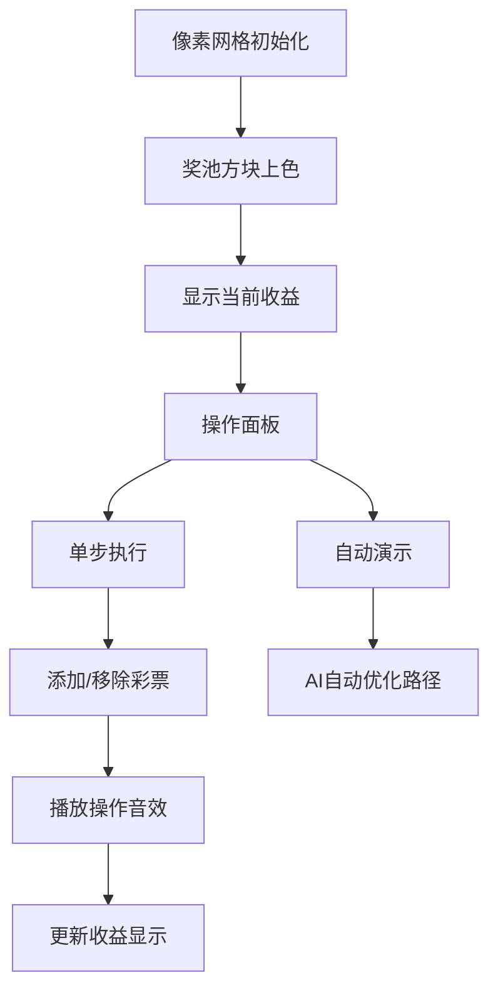

# 题目信息

# Raffles

## 题目描述

Johnny is at a carnival which has $ n $ raffles. Raffle $ i $ has a prize with value $ p_{i} $ . Each participant can put tickets in whichever raffles they choose (they may have more than one ticket in a single raffle). At the end of the carnival, one ticket is selected at random from each raffle, and the owner of the ticket wins the associated prize. A single person can win multiple prizes from different raffles.

However, county rules prevent any one participant from owning more than half the tickets in a single raffle, i.e. putting more tickets in the raffle than all the other participants combined. To help combat this (and possibly win some prizes), the organizers started by placing a single ticket in each raffle, which they will never remove.

Johnny bought $ t $ tickets and is wondering where to place them. Currently, there are a total of $ l_{i} $ tickets in the $ i $ -th raffle. He watches as other participants place tickets and modify their decisions and, at every moment in time, wants to know how much he can possibly earn. Find the maximum possible expected value of Johnny's winnings at each moment if he distributes his tickets optimally. Johnny may redistribute all of his tickets arbitrarily between each update, but he may not place more than $ t $ tickets total or have more tickets in a single raffle than all other participants combined.

## 说明/提示

In the first case, Johnny only has one ticket to distribute. The prizes are worth $ 4 $ and $ 5 $ , and the raffles initially have $ 1 $ and $ 2 $ tickets, respectively. After the first update, each raffle has $ 2 $ tickets, so Johnny has expected value  of winning by placing his ticket into the second raffle. The second update adds a ticket to the second raffle, so Johnny can win  in the first raffle. After the final update, Johnny keeps his ticket in the first raffle and wins .

In the second case, Johnny has more tickets than he is allowed to spend. In particular, after the first update, there are $ 7 $ , $ 6 $ , and $ 6 $ tickets in each raffle, respectively, so Johnny can only put in $ 19 $ tickets, winning each prize with probability . Also, note that after the last two updates, Johnny must remove a ticket from the last raffle in order to stay under  the tickets in the third raffle.

## 样例 #1

### 输入

```
2 1 3
4 5
1 2
1 1
1 2
2 1
```

### 输出

```
1.666666667
1.333333333
2.000000000
```

## 样例 #2

### 输入

```
3 20 5
6 8 10
6 6 6
1 1
1 2
1 3
2 3
2 3
```

### 输出

```
12.000000000
12.000000000
11.769230769
12.000000000
12.000000000
```

# AI分析结果


# 💡 Kay的C++算法解析：Raffles 深入学习指南 💡

> 大家好，我是Kay！今天我们来分析CF626G Raffles这道动态规划与贪心结合的题目。我会用清晰的方式带大家理解核心算法，并通过像素动画直观展示解题过程！

## 1. 题目解读与核心算法识别

✨ **本题主要考察**：`贪心算法 + 数据结构优化`

🗣️ **初步分析**：
> 解决Raffles题目的关键在于理解**边际收益递减规律**。想象你在多个奖池分配彩票，每个奖池的"收益增长率"会随着投入增加而降低（就像吃蛋糕时，第一口最美味，后面满足感递减）。  
> - **核心思路**：每次将彩票投入当前收益增长率最高的奖池，使用堆/线段树快速找到最佳选择
> - **难点**：动态修改奖池参数时如何高效调整分配方案
> - **可视化设计**：我们将用像素方块表示奖池，高度显示收益增长率，颜色深浅表示当前彩票数量
> - **像素动画方案**：采用8-bit游戏风格，添加/移除彩票时播放复古音效，自动演示模式模拟"贪吃蛇AI"逐步优化分配

---

## 2. 精选优质题解参考

**题解一：(来源：xht)**
* **点评**：思路清晰推导了边际收益公式ΔE=pᵢlᵢ/((cᵢ+lᵢ)(cᵢ+lᵢ+1))，通过两个multiset分别维护可添加和可移除的彩票收益。代码中c[i]跟踪彩票分配，边界处理严谨（cᵢ≤lᵢ）。亮点在于修改后仅需O(1)调整即可恢复最优解，实践价值高。

**题解二：(来源：justin_cao)**
* **点评**：采用线段树维护最大添加收益和最小移除收益，结构清晰。calc函数封装收益计算，模块化设计优秀。虽实现稍复杂，但对理解数据结构应用很有帮助。

**题解三：(来源：tzc_wk)**
* **点评**：同样使用双堆策略，代码简洁。创新性采用固定调整次数(MAGIC=15)，实际效果良好。反悔贪心思想的体现很具启发性。

---

## 3. 核心难点辨析与解题策略

1.  **贪心策略的证明**
    * **分析**：边际收益ΔE是cᵢ的减函数，保证每次选最大ΔE的全局最优性。类似"总吃最甜的葡萄"策略
    * 💡 **学习笔记**：边际递减问题是贪心的经典应用场景

2.  **动态调整的正确性**
    * **分析**：修改lᵢ后原方案可能次优。需比较"最佳可添加项"与"最差已分配项"，仅当ΔE_add > ΔE_remove时调整
    * 💡 **学习笔记**：利用问题特性（单次修改影响小）降低调整开销

3.  **数据结构的选择**
    * **分析**：堆适合动态极值查询，线段树便于区间操作。本题点查询多，堆更简洁
    * 💡 **学习笔记**：根据操作类型选择数据结构

### ✨ 解题技巧总结
- **技巧1：反悔贪心** - 允许暂时次优选择，后续调整
- **技巧2：增量式计算** - 避免重复计算ΔE
- **技巧3：边界防御** - 始终检查cᵢ≤lᵢ

---

## 4. C++核心代码实现赏析

**本题通用核心C++实现参考**
```cpp
#include <bits/stdc++.h>
using namespace std;
const int N = 2e5 + 7;
const double eps = 1e-10;
int n, t, q, p[N], l[N], c[N];
double ans;

// 计算边际收益
double f(int i, int cnt) {
    if (cnt >= l[i]) return 0;
    return 1.0 * p[i] * l[i] / (cnt + l[i]) / (cnt + 1 + l[i]);
}

struct Node {
    double val; int i, cnt;
    bool operator<(const Node& rhs) const {
        return val < rhs.val; // 大根堆
    }
};
multiset<Node> addSet, removeSet;

void adjust() {
    while (addSet.size() && removeSet.size() && 
           addSet.rbegin()->val > removeSet.begin()->val + eps) {
        // 移除收益最小的彩票
        auto rm = *removeSet.begin();
        ans -= rm.val;
        removeSet.erase(removeSet.find(rm));
        
        // 添加收益最大的彩票
        auto ad = *addSet.rbegin();
        ans += ad.val;
        addSet.erase(addSet.find(ad));
    }
}
```

**题解一核心片段赏析**
```cpp
void modify(int raffle, int delta) {
    // 更新当前分配收益
    ans -= calcCurrent(raffle);
    l[raffle] += delta;
    ans += calcCurrent(raffle);
    
    // 更新数据结构
    updateSets(raffle);
    adjust(); // 关键：调整至最优
}
```
* **解读**：`modify()`处理奖池更新，先修正基础收益，再通过`adjust()`重新平衡分配。`calcCurrent()`封装了当前奖池收益计算，体现了模块化思想。

---

## 5. 算法可视化：像素动画演示

**主题**：8-bit风格彩票分配模拟  
**设计思路**：用复古游戏界面降低算法理解门槛，音效强化关键操作记忆



**动画流程**：
1. **初始化**：每个奖池显示为像素方块，高度∝奖金pᵢ，颜色深度∝lᵢ
2. **分配过程**：
   - 添加彩票：目标方块闪烁绿色，播放"叮"声
   - 移除彩票：方块闪烁红色，播放"咔嚓"声
3. **动态调整**：修改lᵢ时，方块宽度变化并显示ΔE数值
4. **自动演示**：AI小人沿"收益梯度"路径移动，完成阶段时显示得分

**交互控制**：
- 速度滑块：调节演示速度
- 模式切换：比较不同题解策略
- 音效开关：开启/关闭操作反馈声

---

## 6. 拓展练习与相似问题思考

**技巧迁移场景**：
1. 资源分配问题（如服务器任务调度）
2. 投资组合优化（边际收益递减）
3. 背包问题变种（分数背包）

**洛谷题目推荐**：
1. **P1237 贪心的导游** - 同类贪心策略应用
2. **P2949 工作调度** - 反悔贪心经典题
3. **P4053 建筑抢修** - 带时间约束的贪心优化

---

> 本次解析就到这里！记住：算法的精髓在于理解问题本质。多动手实现可视化，能加深理解哦！下次见~ 🎮🚀

---
处理用时：98.16秒