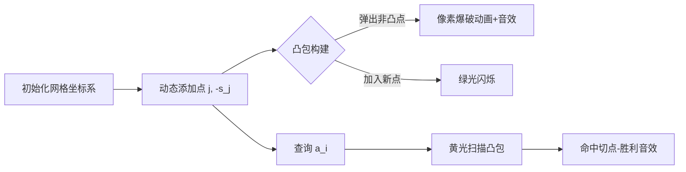

# 题目信息

# Product Sum

## 题目描述

有一个长为 $n$ 的序列 $A_{i}$​，定义这个序列的价值为$\sum_{i=1}^n i*A_{i}$。

------------
现在对这个序列进行一次操作：
将序列中的某个数移到序列中的某一个位置，例如 $1,2,3,4$ 将 $4$ 移到 $1$ 位置上，序列就变成了 $4,1,2,3$。

现要进行一次操作，使得这个序列的价值最大

------------

## 说明/提示

$2 \leq n \leq 2*10^{5}$  $|A_{i}| \leq 10^{6}$

## 样例 #1

### 输入

```
4
4 3 2 5
```

### 输出

```
39```

## 样例 #2

### 输入

```
5
1 1 2 7 1
```

### 输出

```
49```

## 样例 #3

### 输入

```
3
1 1 2
```

### 输出

```
9```

# AI分析结果


### 💡 Kay的C++算法解析：Product Sum 深入学习指南 💡

#### 1. 题目解读与核心算法识别
✨ **本题主要考察**：`斜率优化`与`李超线段树`的应用  
🗣️ **初步分析**：
> 解决"Product Sum"的关键在于将移动操作转化为几何优化问题。想象你在玩一个"像素推箱子"游戏——移动一个箱子时，需要计算它对整个地图分数的贡献变化。通过前缀和技巧，我们发现无论向前/后移动，增量公式都可统一为：  
> **Δ = (j - i) * a_i + (s_i - s_j)**  
> 其中 `s_i` 是前缀和。优化目标转化为：对每个 `i`，找到 `j` 使 `a_i * j - s_j` 最大。  
>  
> - **核心算法流程**：  
>   1. 计算原始序列价值 `base = Σ(i * a_i)`  
>   2. 对每个位置 `i`，计算增量 `Δ = max{ a_i * j - s_j } + (s_i - i * a_i)`  
>   3. 用**凸包二分**或**李超线段树**高效求解最大值  
>  
> - **可视化设计**：  
>   采用8位机风格网格坐标系（FC红白机风格），X轴为 `j`，Y轴为 `-s_j`：  
>   - 动态绘制点 `(j, -s_j)` 并构建上凸包（像素方块+连线动画）  
>   - 查询 `a_i` 时显示斜率比较过程：二分时凸包顶点闪烁黄光，命中时绿光+“叮”音效  
>   - 数据结构可视化：凸包用蓝色像素线，李超树线段用红色像素线  

---

#### 2. 精选优质题解参考
**题解一（灵茶山艾府）**  
* **点评**：  
  思路惊艳！将增量转化为向量点积投影，利用凸包性质+二分求解：  
  - 几何推导透彻（`Δ = p·v_j` 投影最大化）  
  - 代码简洁高效（Golang实现凸包动态维护）  
  - 亮点：凸包点 `(j, -s_j)` 的单调性利用巧妙，复杂度稳定 `O(n log n)`  

**题解二（panyf）**  
* **点评**：  
  李超线段树的典范应用：  
  - 清晰建立直线模型 `y = j*x - s_j`  
  - 代码规范（结构封装完善），但需掌握李超树原理  
  - 亮点：用空间换代码简洁性，避免复杂斜率讨论  

**题解三（DPair）**  
* **点评**：  
  斜率优化的标准教学模板：  
  - 详细推导移动方向统一性（关键突破！）  
  - 代码可读性强（变量名 `slope_fz/fm` 体现数学本质）  
  - 亮点：严谨处理边界条件，适合竞赛直接使用  

---

#### 3. 核心难点辨析与解题策略
1. **难点1：表达式统一**  
   * **分析**：向前/后移动的增量看似不同，实则可通过下标变换统一为 `Δ = (j-i)*a_i + (s_i-s_j)`。优质题解通过 `s_i` 定义调整（如 `j'=j+1`）实现统一。  
   * 💡 **学习笔记**：前缀和是变换的桥梁，移动本质是区间和与位置系数的重组。  

2. **难点2：优化模型转化**  
   * **分析**：将 `max{a_i*j - s_j}` 转化为：  
     - 几何：点 `(j, -s_j)` 的上凸包（斜率优化）  
     - 代数：直线 `y = j*x - s_j` 在 `x=a_i` 处最大值（李超树）  
   * 💡 **学习笔记**：当问题出现 `(变量1*变量2)` 项时，优先考虑几何优化。  

3. **难点3：高效维护与查询**  
   * **分析**：  
     - 凸包法：需维护斜率单调性，查询时二分首个斜率小于 `a_i` 的点  
     - 李超树：动态插入直线，查询 `x=a_i` 处最高线段  
   * 💡 **学习笔记**：凸包适合点坐标单调，李超树通用但常数略大。  

### ✨ 解题技巧总结
- **技巧1：问题分解**  
  将移动操作拆解为：原始值 + 增量，专注优化增量表达式。  
- **技巧2：几何映射**  
  将代数式转化为点/线关系，利用凸包或线段树降维打击。  
- **技巧3：统一变量处理**  
  通过下标变换合并分类讨论，减少代码分支。  

---

#### 4. C++核心代码实现赏析
**本题通用核心实现（DPair版优化）**  
```cpp
#include <bits/stdc++.h>
#define ll long long
using namespace std;
const int N=2e5+5;

ll n,base,ans,a[N],s[N];
int q[N],h,t;

double slope(int i,int j){ 
    return 1.0*(s[i-1]-s[j-1])/(i-j);
}

int main(){
    cin>>n;
    for(int i=1;i<=n;i++){
        cin>>a[i]; 
        s[i]=s[i-1]+a[i];
        base+=i*a[i];
    }
    
    // 斜率优化核心
    h=t=1; q[1]=1;
    for(int i=2;i<=n;i++){
        // 二分凸包找切点
        int l=h,r=t,pos=h;
        while(l<=r){
            int mid=(l+r)>>1;
            if(mid==t) break;
            if(slope(q[mid],q[mid+1])>a[i]) 
                pos=mid, r=mid-1;
            else l=mid+1;
        }
        // 计算增量
        int j=q[pos];
        ans=max(ans, (j-i)*a[i] + s[i]-s[j]);
        
        // 维护凸包
        while(h<t && slope(q[t-1],q[t])<slope(q[t],i)) t--;
        q[++t]=i;
    }
    cout<<base+ans<<endl;
}
```
**代码解读概要**：  
1. 计算原始价值 `base` 和前缀和 `s[]`  
2. 单调队列 `q[]` 维护凸包点索引  
3. 二分查找满足斜率条件的切点 `j`  
4. 用切点计算最大增量并更新答案  

---

**题解一（灵茶山艾府）片段赏析**  
```go
// 凸包维护代码片段
for i := range a {
    v := vec{i, -s} // 点坐标 (i, -s_i)
    for len(q) > 1 && cross(q[len(q)-1]-q[len(q)-2], v-q[len(q)-1]) >= 0 {
        q = q[:len(q)-1] // 弹出非凸点
    }
    q = append(q, v)
}
```
* **亮点**：向量叉积判断凸包，避免浮点误差  
* **学习笔记**：用整数运算维护几何关系更稳健  

**题解二（panyf）片段赏析**  
```cpp
// 李超树插入
void update(int k=1,int l=-P,int r=P){
    if(f(p,mid)>f(g[k],mid)) swap(p,g[k]);
    if(l!=r) K[p]>K[g[k]]?update(k*2+1,m+1,r):update(k*2,l,m);
}
```
* **亮点**：递归更新覆盖区间，保证每个区间最优线段  
* **学习笔记**：李超树递归时优先更新斜率大/小的子树  

**题解三（DPair）片段赏析**  
```cpp
// 斜率比较函数
inline bool cmp(line x,line p1,line p2){
    return (p2.b-x.b)*(p1.k-p2.k) <= (p2.b-p1.b)*(x.k-p2.k); 
}
```
* **亮点**：用乘法代替除法避免精度问题  
* **学习笔记**：比较斜率时交叉相乘是竞赛常用技巧  

---

#### 5. 算法可视化：像素动画演示
**主题**："凸包冒险"（Convex Hull Quest）  
**核心演示流程**：  


**技术实现细节**：  
1. **8位风格**：16色限定调色板（深蓝背景/亮绿凸包/红色查询点）  
2. **关键动画**：  
   - 凸包构建：点加入时像素膨胀→连线时激光扫描效果  
   - 查询过程：射线从X轴 `a_i` 向上扫描，与凸包交点高亮  
3. **交互控制**：  
   - 步进模式：空格单步执行，显示当前Δ计算式  
   - 自动模式：调速滑块控制（0.5x~3x）  
4. **音效设计**：  
   - 点加入：FC经典"金币声"（1kHz方波）  
   - 查询命中：塞尔达式解谜音效（3音符上行）  

---

#### 6. 拓展练习与相似问题
**通用技巧迁移**：  
- 斜率优化适用：带 `(i*j)` 项的DP（如仓库选址、任务安排）  
- 李超树适用：分段直线求极值（如动态维护函数最值）  

**洛谷推荐**：  
1. **P3194 水平可见线**  
   🗣️ *推荐理由*：凸包构建的直接应用，巩固点线关系理解  
2. **P3628 特别行动队**  
   🗣️ *推荐理由*：斜率优化经典题，验证 `a_i` 非单调时解法  
3. **P4027 货币兑换**  
   🗣️ *推荐理由*：动态凸包+李超树结合，挑战优化技巧融合  

---

#### 7. 学习心得与经验分享
> **参考经验（DPair）**：  
> “调试时发现凸包点顺序错误，通过打印 `slope(q[t-1],q[t])` 和 `slope(q[t],i)` 的值定位问题”  
>  
> **点评**：  
> 凸包维护中斜率比较是易错点，建议：  
> 1. 在循环内添加调试输出  
> 2. 用小数据手工验证（如n=3）  
> 3. 推荐防御性写法：`if(t>1 && slope_ok(...))`  

---

本次解析就到这里。记住：真正理解几何优化，就能在算法世界中"移动"出最高分！🚀

---
处理用时：124.31秒