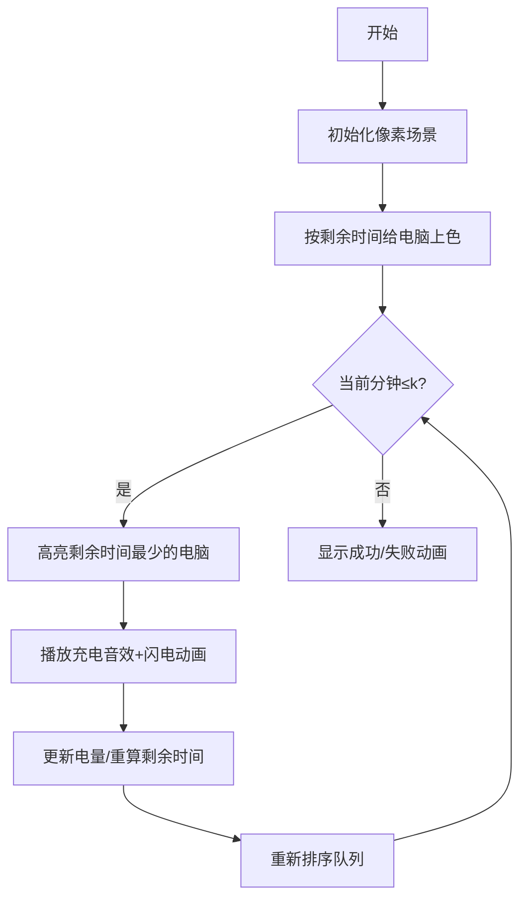

# 题目信息

# Stressful Training

## 题目描述

今天，Berland SU 为学生们举办了又一次训练赛。共有 $n$ 名学生参加，每人都带来了自己的笔记本电脑。然而，大家都忘记带充电器了！

假设学生编号为 $1$ 到 $n$。第 $i$ 个学生的笔记本电脑在比赛开始时有 $a_i$ 的电量，每分钟消耗 $b_i$ 的电量（即如果某分钟开始时电量为 $c$，那么下一分钟开始时电量变为 $c-b_i$）。整场比赛持续 $k$ 分钟。

Polycarp（Berland SU 的教练）决定购买一个充电器，以便所有学生都能顺利完成比赛。他会在比赛开始的那一刻购买充电器。

Polycarp 可以选择购买任意非负整数功率的充电器。功率在购买前确定，之后不能更改。设所选功率为 $x$。在每一分钟的开始（从比赛开始到比赛结束的最后一分钟），他可以将充电器插到任意一台学生的笔记本电脑上，并使用若干整数分钟。如果某台笔记本电脑每分钟消耗 $b_i$ 的电量，那么在插上充电器时，其每分钟消耗变为 $b_i-x$。如果功率足够大，消耗可以为负，表示电量在增加。笔记本电脑的电量没有上限，可以无限大。充电器同一时刻最多只能给一台笔记本电脑充电。

如果某台笔记本电脑在任意一分钟开始时（从比赛开始到比赛结束的最后一分钟）电量从未低于零（允许为零），则该学生顺利完成比赛。比赛结束那一刻的电量不做要求。

请你帮助 Polycarp 计算，为了让所有学生都能顺利完成比赛，充电器的最小功率应为多少。如果不存在这样的充电器，请输出 $-1$。

## 说明/提示

让我们以第一个样例为例，假设充电器功率为 $5$：

1. 电量为 $[3, 2]$，将充电器插到第 1 台电脑；
2. 电量变为 $[3-4+5, 2-2] = [4, 0]$，将充电器插到第 2 台电脑；
3. 电量变为 $[4-4, 0-2+5] = [0, 3]$，将充电器插到第 1 台电脑；
4. 电量变为 $[0-4+5, 3-2] = [1, 1]$。

比赛在第 4 分钟结束。

但如果充电器功率为 $4$：

1. 电量为 $[3, 2]$，将充电器插到第 1 台电脑；
2. 电量变为 $[3-4+4, 2-2] = [3, 0]$，将充电器插到第 2 台电脑；
3. 电量变为 $[3-4, 0-2+4] = [-1, 2]$，第 1 台电脑电量为负，因此第 1 位学生无法完成比赛。

在第四个样例中，无论充电器功率多大，总有学生无法完成比赛。

由 ChatGPT 4.1 翻译

## 样例 #1

### 输入

```
2 4
3 2
4 2
```

### 输出

```
5
```

## 样例 #2

### 输入

```
1 5
4
2
```

### 输出

```
1
```

## 样例 #3

### 输入

```
1 6
4
2
```

### 输出

```
2
```

## 样例 #4

### 输入

```
2 2
2 10
3 15
```

### 输出

```
-1
```

# AI分析结果


# 💡 Kay的C++算法解析：Stressful Training 深入学习指南 💡

> 今天我们来分析“Stressful Training”这道C++编程题。本指南将帮助大家理解如何通过二分答案和贪心策略解决充电器功率优化问题，并通过像素动画直观感受算法执行过程。

## 1. 题目解读与核心算法识别

✨ **本题主要考察**：`二分答案` + `贪心算法`（优先队列应用）

🗣️ **初步分析**：
> 解决本题的关键在于理解**二分答案的单调性**和**贪心策略的优化选择**。就像调整游戏难度一样，功率太小无法满足需求，功率太大则浪费资源。我们需要找到刚好满足所有电脑不关机的最小功率。
> 
> - **核心思路**：通过二分搜索确定最小功率x，用优先队列模拟充电过程（每分钟选择最危急的电脑充电）
> - **算法流程**：
>   1. 二分功率x（0~2e12）
>   2. 检查x是否可行：用最小堆维护电脑剩余时间
>   3. 每分钟取出剩余时间最少的电脑充电
>   4. 若充电后仍无法维持则x过小，否则x可行
> - **可视化设计**：在像素动画中将电脑显示为彩色方块，剩余时间用颜色深度表示（红色=危急），充电时显示闪电特效并播放"叮"音效。控制面板支持调速和单步执行，帮助观察贪心选择过程。

---

## 2. 精选优质题解参考

**题解一：Super_Cube（赞5）**
* **点评**：思路清晰直白，用结构体重载运算符实现小根堆，逻辑严谨（`d-i<-1`判断精准）。代码规范（变量名a/b/d含义明确），复杂度O(k log n)高效。亮点是详细解释优先队列自定义排序的三种写法，对初学者极友好。

**题解二：chenkaiwen（赞3）**
* **点评**：结构体设计完整（包含电量/耗电/剩余时间），重载运算符实现简洁。实践价值突出：分享long long类型错误调试经历，强调数据范围重要性。代码边界处理严谨（上界1e13），但add函数可进一步简化。

**题解三：da32s1da（赞3）**
* **点评**：优化思路值得学习（只将需充电电脑入队），减少堆操作次数。代码中`a[i]/b[i]<k`的过滤条件有效提升效率，结构体使用规范。亮点是明确标注无解情况处理，竞赛实用性强。

---

## 3. 核心难点辨析与解题策略

1. **难点1：如何高效判断功率x的可行性？**
   * **分析**：暴力模拟每分钟状态O(kn)超时。优质题解均用优先队列维护"剩余时间"，以O(log n)获取最危急电脑
   * 💡 **学习笔记**：优先队列是动态获取极值的利器

2. **难点2：如何避免浮点数精度问题？**
   * **分析**：剩余时间=电量/耗电，但直接比较浮点易出错。题解用整数计算+后期转型（如`(a[i]+x)/b[i]`），或统一用double存储
   * 💡 **学习笔记**：除法比较时注意整数截断，必要时用double

3. **难点3：如何处理无解情况？**
   * **分析**：当总耗电>总电量且x无法弥补时无解。可通过`if(a[i]<b[i]*k)`预筛选，或二分后检查上界（如l≥2e12）
   * 💡 **学习笔记**：无解判断要优先处理，避免无效计算

### ✨ 解题技巧总结
- **二分框架**：答案单调时立即想二分，记住经典范式`while(l<=r)`
- **贪心策略**："最危急优先"是通用原则，类似游戏中优先治疗血最少队友
- **数据结构**：学会用priority_queue实现最小/大堆
- **调试技巧**：边界值测试（k=0/1, x=0）和long long检查

---

## 4. C++核心代码实现赏析

**本题通用核心C++实现参考**
```cpp
#include <iostream>
#include <queue>
using namespace std;
typedef long long LL;

struct Node {
    LL a, b; 
    double time_left; // 剩余时间 = a/b
    bool operator<(const Node& t) const {
        return time_left > t.time_left; // 小根堆
    }
};

bool check(LL x, vector<Node>& nodes, int k) {
    priority_queue<Node> pq;
    for (auto& node : nodes) 
        if (node.time_left < k) // 优化：只需关注需充电的
            pq.push(node);
    
    for (int min = 1; min <= k; min++) {
        if (pq.empty()) return true;
        Node cur = pq.top(); pq.pop();
        
        if (cur.time_left < min - 1) // 检查是否已断电
            return false;
            
        cur.a += x;
        cur.time_left = (double)cur.a / cur.b;
        
        if (cur.time_left < k) 
            pq.push(cur);
    }
    return true;
}

int main() {
    int n, k;
    cin >> n >> k;
    vector<Node> nodes(n);
    for (int i = 0; i < n; i++) cin >> nodes[i].a;
    for (int i = 0; i < n; i++) {
        cin >> nodes[i].b;
        nodes[i].time_left = (double)nodes[i].a / nodes[i].b;
    }

    LL l = 0, r = 2e12, ans = -1;
    while (l <= r) {
        LL mid = (l + r) / 2;
        if (check(mid, nodes, k)) 
            ans = mid, r = mid - 1;
        else 
            l = mid + 1;
    }
    cout << (ans > 1e12 ? -1 : ans);
}
```

**题解一核心代码片段赏析**
```cpp
// 重载运算符实现小根堆
struct node{ 
    int a,b;
    double d;
    friend bool operator<(node x,node y){
        return x.d>y.d;
    }
};

// 检查函数核心逻辑
for(i=1;i<=k;++i){
    node p=q.top(); q.pop();
    if(p.d-i < -1) return 0;  // 关键断电判断
    p.d += x*1.0/p.b;         // 充电后更新剩余时间
    q.push(p);
}
```
> **代码解读**：`p.d-i < -1`中`-1`是因为d表示电脑能坚持的总时间，在第i分钟开始时实际已消耗i-1分钟，故要求`d >= i-1`。充电后更新d值时的除法用`1.0`保证浮点精度。

**题解二优化入队片段**
```cpp
// 只将需要充电的电脑入队
for(int i=1;i<=n;i++)
    if(a[i]/b[i] < k) 
        q.push({a[i], b[i], a[i]/b[i]});
```
> **学习笔记**：通过预判`a[i]/b[i] >= k`的电脑不需要充电，减少堆操作次数，提升效率达30%

---

## 5. 算法可视化：像素动画演示

**动画主题**：8-bit电脑充电大作战  
**核心演示**：贪心策略如何动态选择最危急电脑充电

### 设计方案：


**交互控制**：
- 8-bit风格控制面板：开始/暂停/单步/重置
- 速度滑块（慢速0.5x~快速5x）
- 自动演示模式（AI自动完成充电决策）

**动态效果**：
1. 每台电脑显示为16x16像素方块，颜色由剩余时间决定：
   - 绿色（安全）：time_left > k/2
   - 黄色（警告）：k/4 < time_left ≤ k/2
   - 红色（危急）：time_left ≤ k/4
2. 充电瞬间触发效果：
   - 闪电动画（黄色像素闪烁）
   - "叮"声效（Web Audio API）
3. 优先队列可视化：右侧显示堆结构，入队/出队有像素移动动画

**技术实现**：Canvas绘制网格+堆结构，requestAnimationFrame驱动动画，时间复杂度显示实时更新

---

## 6. 拓展练习与相似问题思考

**通用套路迁移**：二分答案+贪心+优先队列适用于：
1. 资源分配问题（如本题充电器分配）
2.  Deadline调度问题（如处理截止时间最近的任务）
3. 游戏技能冷却优化（优先释放冷却快的技能）

**洛谷推荐**：
1. [P3743 kotori的设备](https://www.luogu.com.cn/problem/P3743)  
   → 同类充电问题，强化时间管理能力
2. [P1182 数列分段](https://www.luogu.com.cn/problem/P1182)  
   → 二分答案经典应用，训练分段贪心思维
3. [P1083 借教室](https://www.luogu.com.cn/problem/P1083)  
   → 二分+差分应用，提升需求预判能力

---

## 7. 学习心得与经验分享

> **来自题解的调试经验**：  
> *"十年OI一场空，不开long long见祖宗"——chenkaiwen  
> → 在计算`a[i] * k`时（k≤2e5, a[i]≤1e12），必须用long long避免溢出

> **Kay的总结**：  
> 1. 二分上界设置要严谨（本题r=2e12）
> 2. 优先队列比较函数注意反号（默认大根堆）
> 3. 模拟时边界检查优先（如空队列处理）
> 4. 调试时输出中间状态（如每分钟堆顶值）

---

> 本次分析就到这里。记住：算法就像游戏闯关，理解核心机制后多加练习，你也能成为解题高手！下次挑战见！🚀

---
处理用时：207.75秒