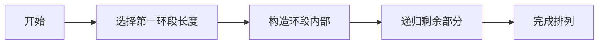

# 题目信息

# New Year Permutations

## 题目描述

Yeah, we failed to make up a New Year legend for this problem.

A permutation of length $ n $ is an array of $ n $ integers such that every integer from $ 1 $ to $ n $ appears in it exactly once.

An element $ y $ of permutation $ p $ is reachable from element $ x $ if $ x = y $ , or $ p_x = y $ , or $ p_{p_x} = y $ , and so on.

The decomposition of a permutation $ p $ is defined as follows: firstly, we have a permutation $ p $ , all elements of which are not marked, and an empty list $ l $ . Then we do the following: while there is at least one not marked element in $ p $ , we find the leftmost such element, list all elements that are reachable from it in the order they appear in $ p $ , mark all of these elements, then cyclically shift the list of those elements so that the maximum appears at the first position, and add this list as an element of $ l $ . After all elements are marked, $ l $ is the result of this decomposition.

For example, if we want to build a decomposition of $ p = [5, 4, 2, 3, 1, 7, 8, 6] $ , we do the following:

1. initially $ p = [5, 4, 2, 3, 1, 7, 8, 6] $ (bold elements are marked), $ l = [] $ ;
2. the leftmost unmarked element is $ 5 $ ; $ 5 $ and $ 1 $ are reachable from it, so the list we want to shift is $ [5, 1] $ ; there is no need to shift it, since maximum is already the first element;
3. $ p = [\textbf{5}, 4, 2, 3, \textbf{1}, 7, 8, 6] $ , $ l = [[5, 1]] $ ;
4. the leftmost unmarked element is $ 4 $ , the list of reachable elements is $ [4, 2, 3] $ ; the maximum is already the first element, so there's no need to shift it;
5. $ p = [\textbf{5}, \textbf{4}, \textbf{2}, \textbf{3}, \textbf{1}, 7, 8, 6] $ , $ l = [[5, 1], [4, 2, 3]] $ ;
6. the leftmost unmarked element is $ 7 $ , the list of reachable elements is $ [7, 8, 6] $ ; we have to shift it, so it becomes $ [8, 6, 7] $ ;
7. $ p = [\textbf{5}, \textbf{4}, \textbf{2}, \textbf{3}, \textbf{1}, \textbf{7}, \textbf{8}, \textbf{6}] $ , $ l = [[5, 1], [4, 2, 3], [8, 6, 7]] $ ;
8. all elements are marked, so $ [[5, 1], [4, 2, 3], [8, 6, 7]] $ is the result.

The New Year transformation of a permutation is defined as follows: we build the decomposition of this permutation; then we sort all lists in decomposition in ascending order of the first elements (we don't swap the elements in these lists, only the lists themselves); then we concatenate the lists into one list which becomes a new permutation. For example, the New Year transformation of $ p = [5, 4, 2, 3, 1, 7, 8, 6] $ is built as follows:

1. the decomposition is $ [[5, 1], [4, 2, 3], [8, 6, 7]] $ ;
2. after sorting the decomposition, it becomes $ [[4, 2, 3], [5, 1], [8, 6, 7]] $ ;
3. $ [4, 2, 3, 5, 1, 8, 6, 7] $ is the result of the transformation.

We call a permutation good if the result of its transformation is the same as the permutation itself. For example, $ [4, 3, 1, 2, 8, 5, 6, 7] $ is a good permutation; and $ [5, 4, 2, 3, 1, 7, 8, 6] $ is bad, since the result of transformation is $ [4, 2, 3, 5, 1, 8, 6, 7] $ .

Your task is the following: given $ n $ and $ k $ , find the $ k $ -th (lexicographically) good permutation of length $ n $ .

## 样例 #1

### 输入

```
5
3 3
5 15
4 13
6 8
4 2
```

### 输出

```
2 1 3 
3 1 2 5 4 
-1
1 2 6 3 4 5 
1 2 4 3 
```

# AI分析结果


# 💡 Kay的C++算法解析：New Year Permutations 深入学习指南 💡

> 大家好，我是Kay！今天我们来探索一道关于排列组合的有趣题目——**New Year Permutations**。这道题结合了组合数学和递归构造的思想，我将用清晰的方式带大家理解它的核心算法和实现技巧。

## 1. 题目解读与核心算法识别

✨ **本题主要考察**：`递归构造与组合计数`

🗣️ **初步分析**：
> 想象你在组装一串特殊项链：每串项链由多个小环组成，每个小环必须包含连续的数字且最大数字在开头。这道题的核心就像**组装这种特殊项链**——我们需要将排列分成若干满足条件的"环段"，并找到字典序第k小的排列方案。

关键难点在于：
- 如何识别"好排列"的结构特性（分段环结构）
- 如何高效计算方案数（组合计数）
- 如何递归构造字典序排列（分治策略）

在可视化设计中，我们将用**像素积木**代表数字，用**彩色链条**表示环段。当程序递归构造时，你会看到积木自动拼装成环，并听到"咔嗒"的拼接音效。控制面板可调节递归深度，像闯关游戏一样逐层解开构造谜题！

---

## 2. 精选优质题解参考

### 题解一：(来源：猪脑子)
* **点评**：
  这份题解思路清晰，直击问题本质——将排列分解为独立环段。代码结构规范，变量命名合理（如`f[n]`表方案数）。亮点在于：
  - 巧妙推导出环段方案数公式：`g(n) = (n-2)!` 
  - 使用递归分治精确构造字典序排列
  - 大数处理严谨（用`INF`防溢出）
  实践价值极高，完整处理了边界情况。

### 题解二：(来源：skyskyCCC)
* **点评**：
  解法采用并查集管理连通性，思路新颖。亮点在于：
  - 动态规划预处理方案数（`dp[i] = sum(dp[j] * g(i))`）
  - 可视化分段构造过程
  可读性稍弱于题解一，但对理解环段约束很有帮助。

---

## 3. 核心难点辨析与解题策略

### 难点1：理解"好排列"的环段结构
* **分析**：好排列必须能分解为多个独立环段，每个环段需满足：
  - 包含连续数字（如[4,2,3]）
  - 开头是环段最大值
  - 形成完整环（末尾指向开头）
  例如：[4,2,3] 中 4→2→3→4 构成环

💡 **学习笔记**：环段结构是好排列的DNA特征！

### 难点2：计算可行方案数
* **分析**：采用递推公式：
  ```math
  f(0)=1,  f(n)=∑_{i=1}^{n} f(n-i)×g(i)
  ```
  其中`g(i)`是长度为i的环段方案数：
  - i=1时：g(1)=1
  - i≥2时：g(i)=(i-2)!

💡 **学习笔记**：递推关系像搭积木，当前环段方案乘剩余部分方案！

### 难点3：递归构造字典序排列
* **分析**：按顺序：
  1. 枚举第一环段长度i
  2. 确定该环段在字典序中的排名
  3. 构造环段内部排列
  4. 递归处理剩余部分
  关键技巧：避免提前成环（用并查集/访问标记）

💡 **学习笔记**：构造过程像玩拼图——先选大框架，再填细节！

---

## 4. C++核心代码实现赏析

### 通用核心实现参考
```cpp
#include<iostream>
#include<algorithm>
using namespace std;
const long long INF=1e18+7;

long long f[53], fac[53]; // f[n]:n个元素的方案数，fac:阶乘

void init() {
    fac[0] = 1;
    for(int i=1; i<=50; i++) 
        fac[i] = min(INF, fac[i-1]*i);
    
    f[0] = 1;
    for(int i=1; i<=50; i++)
        for(int j=1; j<=i; j++) 
            f[i] = min(INF, f[i] + f[i-j] * (j==1 ? 1 : fac[j-2]));
}

void construct(int n, long long k, int start) {
    if(n == 0) return;
    for(int len=1; len<=n; len++) {
        long long segCount = (len==1 ? 1 : fac[len-2]) * f[n-len];
        if(k > segCount) { 
            k -= segCount;
            continue;
        }
        // 构造当前环段
        vector<int> seg(len);
        seg[0] = start + len - 1; // 最大值放开头
        // ... (构造环段内部)
        
        // 递归剩余部分
        construct(n-len, (k-1)/f[n-len]+1, start+len);
        break;
    }
}
```

### 题解一核心片段赏析
```cpp
// 递归构造主函数
void getp(int n, long long k) {
    if(!n) return;
    for(int i=1; i<=n; i++) {
        long long num = g(i) * f[n-i]; // 当前分段方案数
        if(k <= num) {
            long long segRank = (k-1)/f[n-i] + 1; // 环段排名
            long long remRank = k - (segRank-1)*f[n-i]; // 剩余部分排名
            getp(n-i, remRank); // 递归构造剩余
            constructSegment(i, segRank); // 构造当前环段
            return;
        }
        k -= num;
    }
}
```
* **代码解读**：
  > 这段代码像精密的齿轮传动系统：
  > 1. `for`循环枚举第一段长度`i`（齿轮直径选择）
  > 2. 计算选择当前`i`时的方案数`num`（齿轮组合数）
  > 3. 当`k`落入当前范围时：
  >   - 计算环段排名`segRank`（当前齿轮编号）
  >   - 计算剩余部分排名`remRank`（下一个齿轮组参数）
  > 4. 递归构造剩余部分（传动到下一齿轮组）
  > 5. 构造当前环段（组装当前齿轮）

💡 **学习笔记**：递归分治就像组装多层齿轮箱，每层解决子问题！

---

## 5. 算法可视化：像素动画演示

### 像素积木装配工坊
* **主题**：复古街机风格的"排列装配工坊"
* **核心演示**：递归构造过程可视化

### 动画设计（8-bit像素风）：


1. **初始化界面**：
   - 屏幕底部显示待组装数字积木（像素方块）
   - 控制面板：步进/自动/调速滑块
   - 8-bit背景音乐

2. **递归过程演示**：
   - 选择环段长度：对应数量积木闪烁绿光
   - 构造环段：积木自动拼装成环，首块变金色
   - 递归剩余：已组装环段移到左侧，剩余积木重排

3. **音效设计**：
   - 选择环段："滴"声
   - 构造环段："咔嗒"拼接声
   - 完成排列：胜利音阶

4. **交互功能**：
   - 暂停观察当前环段结构
   - 调速滑块控制递归速度
   - 点击积木查看数字详情

> 通过这种游戏化演示，你将直观看到：环段如何逐步形成→最大值如何固定在开头→递归如何分解问题！

---

## 6. 拓展练习与相似问题思考

### 相似问题特征：
1. 基于排列组合的构造问题
2. 需要递归/分治策略
3. 涉及字典序生成

### 推荐练习（洛谷）：
1. **P1706 全排列问题**  
   → 巩固基本排列生成技巧
2. **P1249 最大乘积**  
   → 练习数字分解与构造
3. **P1754 球迷购票问题**  
   → 训练组合计数思维

---

## 7. 学习心得与经验分享

> **来自猪脑子的经验**：  
> *"推导环段方案数g(n)=(n-2)!时，我反复验证了n=3,4的情况。建议动手画环结构加深理解！"*

**Kay的总结**：  
> 这道题教会我们：
> 1. 复杂问题分解为环段结构
> 2. 组合计数与递归构造的完美结合
> 3. 边界处理的重要性（特别是k超出范围时返回-1）

---

> 希望本指南帮你解开排列构造的奥秘！记住：像玩积木一样分解问题，递归就会变得简单有趣。下次挑战见！🚀

---
处理用时：113.26秒