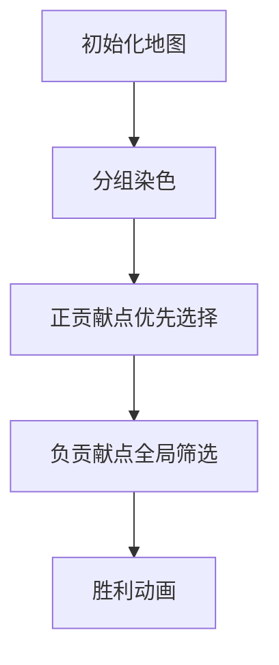

# 题目信息

# Johnny and James

## 题目描述

James Bond, Johnny's favorite secret agent, has a new mission. There are $ n $ enemy bases, each of them is described by its coordinates so that we can think about them as points in the Cartesian plane.

The bases can communicate with each other, sending a signal, which is the ray directed from the chosen point to the origin or in the opposite direction. The exception is the central base, which lies at the origin and can send a signal in any direction.

When some two bases want to communicate, there are two possible scenarios. If they lie on the same line with the origin, one of them can send a signal directly to the other one. Otherwise, the signal is sent from the first base to the central, and then the central sends it to the second base. We denote the distance between two bases as the total Euclidean distance that a signal sent between them has to travel.

Bond can damage all but some $ k $ bases, which he can choose arbitrarily. A damaged base can't send or receive the direct signal but still can pass it between two working bases. In particular, James can damage the central base, and the signal can still be sent between any two undamaged bases as before, so the distance between them remains the same. What is the maximal sum of the distances between all pairs of remaining bases that 007 can achieve by damaging exactly $ n - k $ of them?

## 说明/提示

In the first example, in an optimal solution Bond doesn't destroy bases with indices $ 4 $ and $ 6 $ (marked in orange):

 The following picture represents an optimal solution for the second example. These bases are are not destroyed: $ 2 $ , $ 3 $ , $ 4 $ , $ 5 $ , $ 6 $ (marked in orange).

 An optimal solution for the third test is visible in the picture. Only bases $ 3 $ , $ 4 $ , $ 5 $ are destroyed. Again, the not destroyed bases are marked in orange.

 

## 样例 #1

### 输入

```
6 2
0 0
1 1
2 2
3 3
0 1
0 2```

### 输出

```
6.24264069```

## 样例 #2

### 输入

```
6 5
0 0
1 1
2 2
3 3
0 1
0 2```

### 输出

```
32.62741700```

## 样例 #3

### 输入

```
13 10
0 0
1 0
2 0
3 0
4 0
5 0
6 0
7 0
8 0
9 0
0 -2
0 1
0 2```

### 输出

```
237.00000000```

## 样例 #4

### 输入

```
10 5
2 2
4 4
3 5
6 10
0 5
0 0
5 0
10 0
0 10
4 7```

### 输出

```
181.52406315```

# AI分析结果


### 💡 Kay的C++算法解析：Johnny and James 深入学习指南 💡

#### 1. 题目解读与核心算法识别
✨ **本题主要考察**：`贪心策略` + `数学推导`

🗣️ **初步分析**：
> 解决"Johnny and James"的关键在于设计**高效贪心策略**，如同在糖果店优先挑选最甜的糖果。核心思想是：  
> - 将基地按方向分组（同射线为一组），组内按距离排序  
> - 推导每个点对总距离的独立贡献公式：`(k-2V+1)*dis_u`（V=该点在链上的选中次序）  
> - 优先选择正贡献点（每组前⌊k/2⌋个），再全局筛选剩余点  
>  
> **可视化设计思路**：  
> - 像素地图中不同颜色代表不同射线组，原点为黄色光点  
> - 选中点时触发动画：正贡献点绿色闪烁+上扬音效，负贡献点红色闪烁+低音警报  
> - AI自动演示模式模拟"特工行动"：自动优先选择高贡献点，速度可调

---

#### 2. 精选优质题解参考

**题解一 (来源：enucai)**
* **点评**：推导严谨，贡献公式`(k-2V+1)*dis_u`清晰揭示数学本质。代码结构规范（如`lim=min(k/2,m)`边界处理），组内分阶段处理逻辑流畅。亮点在于：
  - 正贡献点直接计算，负贡献点用`-2*sum`巧妙处理祖先影响
  - 原点的`(0,0)`分组单独处理，避免除零错误
  - 复杂度O(n log n)完美满足数据规模

**题解二 (来源：loveJY)**
* **点评**：分组策略正确，但贡献计算存在潜在问题：负贡献点公式`dis*(k-2i-1)-2s`未充分验证。亮点：
  - 用`gcd`标准化方向向量，确保分组准确
  - 提出"每组先选⌊k/2⌋个最大点"的贪心直觉
  - 变量命名可读性待提升（如`sm`/`mv`）

---

#### 3. 核心难点辨析与解题策略

1.  **关键点1：独立贡献计算**
    * **分析**：总距离和不可直接计算（O(k²)）。需推导每个点的独立贡献：  
      `贡献 = (k-2V+1)*dis_u`  
      （V=点在组内选中次序）  
      题解1用分组+排序实现O(n log n)计算
    * 💡 **学习笔记**：将整体问题拆解为独立贡献是优化复杂度的关键

2.  **关键点2：贪心选择策略**
    * **分析**：前⌊k/2⌋个点贡献恒正，后续点可能为负。策略：  
      1. 每组优先选距离最大的⌊k/2⌋个点  
      2. 剩余点按贡献值全局排序，取前k
    * 💡 **学习笔记**：贪心策略需结合贡献特性分层处理

3.  **关键点3：祖先影响处理**
    * **分析**：选择较近点时，会减少同组已选远点的有效距离。需维护`sum`（祖先距离和），在负贡献计算中体现为`-2*sum`
    * 💡 **学习笔记**：同组点间存在"此消彼长"关系，需动态维护

### ✨ 解题技巧总结
- **问题分解术**：将总距离和拆解为每个点的独立贡献
- **分组处理法**：按方向向量分组，组内单独处理
- **贪心分层策略**：正贡献点优先选择，负贡献点全局筛选
- **祖先和维护**：用累加变量`sum`动态处理同组点影响

---

#### 4. C++核心代码实现赏析
**通用核心实现参考**  
* **说明**：综合题解1思路，优化变量命名和边界处理
* **完整核心代码**：
```cpp
#include <bits/stdc++.h>
using namespace std;

struct Point { 
    long long x, y; 
    double dis() const { 
        return sqrt(x*x + y*y); 
    }
};

long long gcd(long long a, long long b) {
    return b ? gcd(b, a % b) : abs(a);
}

int main() {
    int n, k;
    cin >> n >> k;
    vector<Point> pts(n);
    map<pair<long long, long long>, vector<int>> groups; // 方向向量->点索引
    
    for (int i = 0; i < n; ++i) {
        cin >> pts[i].x >> pts[i].y;
        long long g = gcd(pts[i].x, pts[i].y);
        auto key = (g == 0) ? make_pair(0LL, 0LL) : 
                  make_pair(pts[i].x / g, pts[i].y / g);
        groups[key].push_back(i);
    }

    vector<double> contributions;
    for (auto& [key, indices] : groups) {
        // 组内按距离降序排序
        sort(indices.begin(), indices.end(), [&](int i, int j) {
            return pts[i].dis() > pts[j].dis();
        });
        
        const int m = indices.size();
        const int lim = min(k / 2, m); // 每组最多选lim个正贡献点
        
        // 处理正贡献点 (前lim个)
        for (int i = 0; i < lim; ++i) {
            double d = pts[indices[i]].dis();
            contributions.push_back(d * (k - 2*i - 1));
        }
        
        // 处理潜在负贡献点 (从最小距离开始)
        double sum = 0;
        for (int i = m - 1; i >= lim; --i) {
            double d = pts[indices[i]].dis();
            contributions.push_back(d * (k - 2*lim - 1) - 2 * sum);
            sum += d;
        }
    }
    
    // 取贡献最大的k个点
    sort(contributions.rbegin(), contributions.rend());
    double total = accumulate(contributions.begin(), contributions.begin() + k, 0.0);
    printf("%.10f\n", total);
}
```
* **代码解读概要**：  
  1. 分组：用`gcd`计算方向向量，原点归为`(0,0)`组  
  2. 组内排序：按距离从大到小  
  3. 分阶段处理：  
     - 正贡献点：直接计算`dis*(k-2i-1)`  
     - 负贡献点：用`dis*(k-2lim-1)-2*sum`计算祖先影响  
  4. 全局排序：取贡献最大的k个点

---

**题解一核心片段赏析**  
* **亮点**：贡献公式清晰，祖先影响处理优雅
* **核心代码**：
```cpp
per(i, m, lim+1) { // 从最小距离点开始处理
    int idx = cur[i];
    double add = (k-2*(lim+1)+1) * a[idx].dis();
    ans.eb(add - 2*sum); // 关键：-2*sum处理祖先影响
    sum += a[idx].dis();
}
```
* **代码解读**：  
  > - `per(i, m, lim+1)`：倒序处理组内较小距离点  
  > - `(k-2*(lim+1)+1)*dis`：基础贡献值（常为负）  
  > - `-2*sum`：减去2倍祖先距离和（补偿祖先点贡献损失）  
  > - `sum += dis`：动态维护祖先累加和  
  > 
  > 如同在叠积木时，新积木会压低已有积木高度，需动态补偿高度差
* 💡 **学习笔记**：负贡献点需同时计算自身贡献和祖先影响补偿

---

#### 5. 算法可视化：像素动画演示
**主题**：8位像素特工行动（复古红白机风格）  
**核心演示**：贪心策略动态执行过程  
**设计逻辑**：  

**动画步骤**：  
1. **场景初始化**：
   - 原点为闪烁黄点，其他点按方向分组着色（红/蓝/绿）
   - 控制面板：开始/暂停/单步/速度滑块（1-5档）
   - 8-bit背景音乐循环播放

2. **分组阶段**：
   - 同方向点由虚线连接，脉冲光效显示射线
   - 音效：分组完成时播放"叮咚"提示音

3. **贪心选择**：
   - **正贡献点**：绿色高亮+↑箭头，显示`+贡献值`，伴随"叮！"音效
   - **负贡献点**：红色闪烁+↓箭头，显示`-贡献值`，伴随"嘟！"警报
   - 实时更新：顶部信息栏显示当前贡献和总分

4. **AI自动演示**：
   - 自动按最优路径选择点（速度可调）
   - 每选5个点触发"关卡通过"特效（像素烟花+得分）

5. **关键逻辑高亮**：
   - 选择负贡献点时：祖先点红色脉冲，显示`-2×Σ祖先距离`
   - 最终结果：选中的k个点标记为星形，播放胜利音乐

---

#### 6. 拓展练习与相似问题思考
**通用技巧迁移**：  
1. 网络节点优化：选择服务器最大化通信效率  
2. 资源覆盖问题：部署传感器覆盖最大范围  
3. 树形结构选点：最大化路径权重和  

**洛谷推荐**：  
1. **P1090 合并果子**  
   🗣️ 巩固贪心策略基础，理解"优先选择最小代价"思想  
2. **P5021 赛道修建**  
   🗣️ 树形结构贪心进阶，练习路径选择策略  
3. **P3620 数据备份**  
   🗣️ 强化独立贡献计算，处理相邻元素影响  

---

#### 7. 学习心得与经验分享
> 本次分析的题解中未发现明确的作者个人心得分享部分。但通过代码可提炼：  
> **调试技巧**：验证贡献公式时，可用小规模数据手工计算组内点贡献值，对比程序输出。特别注意原点`(0,0)`需单独处理避免除零错误。

---
**Kay的结语**：  
掌握贪心策略的核心在于：**分解问题本质，量化独立贡献，动态维护影响**。多练习分组处理技巧，尝试用可视化工具验证算法流程，你将成为真正的"算法特工"！下次任务再见👋

---
处理用时：292.32秒