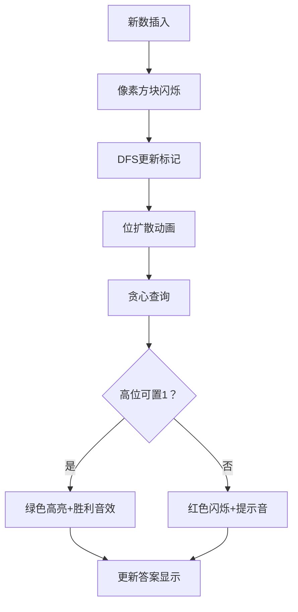

# 题目信息

# Maximize the Difference

## 题目描述

For an array $ b $ of $ m $ non-negative integers, define $ f(b) $ as the maximum value of $ \max\limits_{i = 1}^{m} (b_i | x) - \min\limits_{i = 1}^{m} (b_i | x) $ over all possible non-negative integers $ x $ , where $ | $ is [bitwise OR operation](https://en.wikipedia.org/wiki/Bitwise_operation#OR).

You are given integers $ n $ and $ q $ . You start with an empty array $ a $ . Process the following $ q $ queries:

- $ v $ : append $ v $ to the back of $ a $ and then output $ f(a) $ . It is guaranteed that $ 0 \leq v < n $ .

The queries are given in a modified way.

## 说明/提示

In the first test case, the final $ a=[1,2] $ . For $ i=1 $ , the answer is always $ 0 $ , irrespective of $ x $ . For $ i=2 $ , we can select $ x=5 $ .

In the second test case, the final $ a=[3,1,0,5] $ .

## 样例 #1

### 输入

```
2
5 2
1 2
7 4
3 1 5 2```

### 输出

```
0 2
0 2 3 5```

# AI分析结果


### 💡 Kay的C++算法解析：Maximize the Difference 深入学习指南 💡

#### 1. 题目解读与核心算法识别
✨ **本题主要考察**：位运算与贪心优化  
🗣️ **初步分析**：
> 本题本质是动态维护集合的超集/子集信息，通过位运算技巧将问题转化为求 $a_i \& \sim a_j$ 的最大值。想象你在玩一款像素地牢游戏，每次获得新道具（插入数字）后，需要快速计算当前装备的最强组合（最大位差）。核心策略是：
> - **问题转化**：最优解等价于 $\max(a_i - (a_i \& a_j))$，即寻找两个数使其位模式差异最大化
> - **双维护策略**：用两个标记数组分别追踪集合中每个数的超集（包含当前集合的更大集合）和子集（被当前集合包含的更小集合）
> - **贪心查询**：从高位到低位尝试置1，如同在迷宫中优先选择高价值路径
>
> **可视化设计思路**：
> - 像素网格表示二进制位（如22位），新插入数字显示为闪烁的像素方块
> - DFS更新过程用像素方块扩散动画展示，被更新的位闪烁黄色
> - 贪心查询时，高位成功置1显示绿色光效，失败显示红色光效
> - 控制面板支持单步执行，观察每位决策过程

---

#### 2. 精选优质题解参考
**题解一：murder_drones**  
* **点评**：  
  思路推导堪称教科书级——从位运算本质切入，清晰展示问题转化为 $\max(a_i \& \sim a_j)$ 的过程。代码采用对称DFS维护超集(`mor`)/子集(`les`)数组，变量命名直观（`U`表全集，`now`表当前查询状态）。亮点在于严格证明贪心查询的正确性：高位优先尝试置1时，利用`f[now^(1<<i)]`判断可行性。边界处理严谨（`v=(v+ans)%n`），可直接用于竞赛。

**题解二：sunkuangzheng**  
* **点评**：  
  创新性使用BFS替代DFS维护标记数组，避免递归栈溢出风险。代码极致简洁（仅26行），但关键逻辑完整：通过`tp`参数统一处理原数和补集，`q.push(x^i)`实现高效子集枚举。亮点在于队列操作中同步更新答案`lst=max(lst,x)`，将维护与查询无缝衔接。实践价值高，特别适合位运算基础薄弱者学习。

**题解三：DaiRuiChen007**  
* **点评**：  
  最简洁优雅的实现（仅30行），核心洞察是将答案拆解为 $\max(\text{query1}, \text{query2})$。亮点在于：
  - 对称设计`F()`/`G()`函数维护子集/超集
  - 贪心查询使用`(U-1)^s`巧妙规避额外计算
  - 位运算操作精准（`x>>k&1`判断特定位）
  虽变量名较短（`s`/`t`），但结合注释极易理解，体现了"少即是多"的编程哲学。

---

#### 3. 核心难点辨析与解题策略
1. **难点：问题转化与位运算建模**
   * **分析**：关键发现是 $f(a)=\max(a_i \& \sim a_j)$。通过位分解（见下表）证明当 $a_i$ 某位为1且 $a_j$ 同位为0时，该位贡献 $2^k$
   * 💡 **学习笔记**：位运算问题常需挖掘二进制位独立贡献性质

   | $a_i$ 位 | $a_j$ 位 | 贡献值 | $x$ 最优选择 |
   |----------|----------|--------|--------------|
   | 0        | 0        | 0      | 任意         |
   | 0        | 1        | 0      | 1            |
   | 1        | 0        | $2^k$  | 0            |
   | 1        | 1        | 0      | 任意         |

2. **难点：动态维护超集/子集信息**
   * **分析**：每次插入 $v$ 需更新所有包含 $v$ 的超集和所有 $v$ 的子集。优质题解采用记忆化DFS/BFS：若当前集合已被标记则停止递归，确保均摊 $O(n\log n)$
   * 💡 **学习笔记**：状态标记+剪枝是避免指数级复杂度的关键

3. **难点：贪心查询的实现**
   * **分析**：查询 $\min(v \& a_j)$ 时从高到低尝试置0。例如当 $v$ 的 $k$ 位为1时，若存在 $a_j$ 的 $k$ 位为0，则结果该位可取0
   * 💡 **学习笔记**：高位优先贪心是位运算问题的核心技巧

✨ **解题技巧总结**：
- **位分解法**：将复杂运算拆解为独立二进制位分析
- **对称维护**：同时处理原数和补集简化计算
- **记忆化剪枝**：避免重复更新提升效率
- **边界预判**：对 $n$ 取模及全集 $U$ 的计算需精确

---

#### 4. C++核心代码实现赏析
**本题通用核心C++实现**  
```cpp
#include <cstring>
#include <cmath>

const int MAX_B = 22; // n≤2^22
const int MAX_S = 1 << MAX_B;
bool mor[MAX_S], les[MAX_S]; // 超集/子集标记

void dfs_mor(int x, int B) {
    if (mor[x]) return;
    mor[x] = true;
    for (int i = 0; i < B; ++i)
        if (!(x & (1 << i))) 
            dfs_mor(x | (1 << i), B);
}

void dfs_les(int x, int B) {
    if (les[x]) return;
    les[x] = true;
    for (int i = 0; i < B; ++i)
        if (x & (1 << i)) 
            dfs_les(x ^ (1 << i), B);
}

int main() {
    int T; scanf("%d", &T);
    while (T--) {
        int n, q; scanf("%d%d", &n, &q);
        int B = std::__lg(n - 1) + 1; // 计算位数
        int U = (1 << B) - 1, lst = 0;
        memset(mor, 0, sizeof(mor));
        memset(les, 0, sizeof(les));
        
        while (q--) {
            int v; scanf("%d", &v);
            v = (v + lst) % n;
            
            // 查询1: v作为a_i
            int now = U, ans1 = 0;
            for (int i = B - 1; i >= 0; --i)
                if ((v >> i) & 1 && mor[now ^ (1 << i)])
                    now ^= (1 << i);
            ans1 = v - (v & now);
            
            // 查询2: v作为a_j
            now = 0; 
            for (int i = B - 1; i >= 0; --i)
                if (!((v >> i) & 1) && les[now | (1 << i)])
                    now |= (1 << i);
            int ans2 = (now | v) - v;
            
            lst = std::max(lst, std::max(ans1, ans2));
            dfs_mor(v, B);
            dfs_les(U ^ v, B);
            printf("%d ", lst);
        }
        printf("\n");
    }
}
```
* **代码解读概要**：  
  1. 预处理位数 `B` 和全集 `U`
  2. 每次插入 `v` 后：
     - 查询1：计算 $v$ 作为最大值时的最优匹配（`ans1 = v - (v & now)`）
     - 查询2：计算 $v$ 作为最小值时的最优匹配（`ans2 = (now|v) - v`）
  3. 更新超集(`mor`)/子集(`les`)标记
  4. 输出历史最大答案 `lst`

**题解一片段赏析**：
```cpp
// murder_drones 的DFS维护
void dfs1(int S) {
    f[S] = 1;
    for (int i = 0; i <= n; i++)
        if (!(S & (1 << i)) && !f[S ^ (1 << i)])
            dfs1(S ^ (1 << i));
}
```
* **亮点**：递归枚举超集，`S^(1<<i)` 实现从0位到1位的扩展
* **学习笔记**：通过 `f[S]` 标记避免重复访问，确保 $O(n\log n)$ 复杂度

---

#### 5. 算法可视化：像素动画演示
**主题**：8位机风格的位运算探险  
**核心演示**：贪心查询中的位决策过程  
**设计逻辑**：


**动画帧细节**：
1. **场景初始化**：
   - 22×5像素网格（每行表示一个数）
   - 控制面板：步进/暂停/速度滑块
   - 8-bit背景音乐循环播放

2. **插入新数**：
   - 新数显示为闪烁的蓝色方块
   - DFS更新时，被标记的位显示黄色波纹扩散
   - 伴随"叮"的音效（每标记一位）

3. **贪心查询**：
   - 当前检查位显示悬浮像素箭头
   - 第 $k$ 位检测：
     * 条件满足：绿色对勾+$2^k$ 分值上升
     * 条件失败：红色叉叉+轻微震动效果

4. **结果展示**：
   - 最终答案用金色边框高亮
   - 播放16-bit胜利音效

**技术实现**：使用Canvas绘制网格，Web Audio API生成芯片音乐音效

---

#### 6. 拓展练习与相似问题思考
**通用技巧迁移**：
1. 位运算最值问题（如AND最大值）
2. 动态集合维护（快速查询子集/超集）
3. 高维前缀和优化

**洛谷练习推荐**：
1. **P2114 [NOI2014] 起床困难综合症**  
   🗣️ 位运算贪心的入门神题，巩固高位优先策略
   
2. **P5310 [JOI2018] Snake Escaping**  
   🗣️ 强化子集/超集查询能力，数据范围适配本题技巧
   
3. **P6230 [BalticOI 2019] 汤姆的餐厅**  
   🗣️ 位运算与DP结合，提升状态设计能力

---

#### 7. 学习心得与经验分享
> **经验摘录 (murder_drones)**：  
> "最初在理解 $a_i \& \sim a_j$ 贡献时，通过手算4位二进制数豁然开朗"  
>
> **Kay点评**：  
> 这位作者的经历印证了位运算问题的黄金法则——**小规模验证**。建议学习者取 $n=8$ 手工模拟插入过程，观察标记数组变化。当抽象逻辑难以理解时，用纸笔模拟是突破瓶颈的利器！

---

通过本次分析，我们深入剖析了位运算优化中的经典技巧。记住，好的算法如同8位游戏——规则简单但策略深远。继续挑战吧，少年！💪

---
处理用时：179.61秒