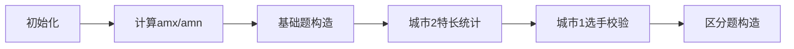

# 题目信息

# Cheops and a Contest (Easy Version)

## 题目描述

这是问题的简单版本。在这个版本中，$m$ 固定为 $2$。只有解决了问题的所有版本后，你才能进行 hack。

在古埃及有一场问题解决比赛，参赛者有 $n$ 名，编号从 $1$ 到 $n$。每位参赛者来自一个特定的城市，城市的编号从 $1$ 到 $m$。保证每个城市至少有一名参赛者。

每位参赛者拥有力量 $a_i$，专长 $s_i$，以及智慧 $b_i$，并且 $b_i \ge a_i$。比赛中的每个问题都有一个难度 $d$ 和一个独特的主题 $t$。如果满足以下条件之一，第 $i$ 位参赛者可以解决这个问题：

- $a_i \ge d$，即参赛者的力量大于或等于问题的难度；
- $s_i = t$ 并且 $b_i \ge d$，即参赛者的专长等于问题的主题，同时智慧不低于问题的难度。

Cheops 的愿望是设计一组问题，使得来自城市 $i$ 的每位参赛者比来自城市 $j$ 的每位参赛者解决更多的问题，且 $i < j$。

请找到一个不超过 $5n$ 个问题的集合，其中所有问题的主题各不相同，能够满足 Cheops 的愿望，或者说明这个愿望无法实现。

## 样例 #1

### 输入

```
2
5 2
5 7 1
6 7 2
3 9 2
5 10 3
4 4 1
2 1 2
3 3 4 5
2 2
1 2 1
1 2 1
1 2
1 1```

### 输出

```
7
6 4
6 5
5 6
5 7
4 8
4 9
7 1
-1```

# AI分析结果


### 💡 Kay的C++算法解析：Cheops and a Contest (Easy Version) 深入学习指南 💡

#### 1. 题目解读与核心算法识别
✨ **本题主要考察**：`构造`与`贪心策略`  

🗣️ **初步分析**：  
> 解决本题的关键在于**合理构造题目难度和主题**，使城市1的选手解题数严格大于城市2。这就像设计一场"公平"的竞赛：我们需要为城市1选手搭建优势阶梯，同时为城市2选手设置无法逾越的障碍。  
> - **核心思路**：  
>   1. 用基础题（难度=a_min和a_max+1）建立基准解题量  
>   2. 用区分题（针对特长）为城市1选手创造额外优势  
>   3. 通过变量`amx`（城市2最大能力值）和`amn`（城市1最小能力值）控制题目难度阈值  
> - **可视化设计**：  
>   将用8位像素风展示选手能力值分布（城市1蓝色/城市2红色），基础题显示为金色方块，区分题显示为闪烁的彩色方块（颜色=特长）。动画将高亮`amx`和`amn`分界线，当选手解题时播放"叮"音效并显示解题数统计条。

---

#### 2. 精选优质题解参考
**题解一（来源：int08）**  
* **点评**：  
  思路清晰揭示构造本质：基础题设基准，区分题创优势。代码通过`unordered_map`高效统计特长最大值，用随机主题生成避免冲突。亮点在于严谨处理边界（如`amx=10^9`时直接判无解），变量`amx/amn`命名直观体现核心逻辑。虽然随机主题生成稍显取巧，但整体实现简洁高效，竞赛实用性强。

---

#### 3. 核心难点辨析与解题策略
1. **难点1：如何确保解题数严格不等**  
   * **分析**：城市2选手最高解题数≤2（两道a_min基础题），城市1选手需≥3题。通过"基础题+区分题"组合：基础题锁定2题基准，区分题为城市1选手追加至少1题。
   * 💡 **学习笔记**：构造的核心是创造"不对称优势"。

2. **难点2：区分题的设计条件**  
   * **分析**：区分题难度必须满足：`难度 > max(amx, m[s])`（m[s]=城市2同特长最大智慧）。用`set`追踪需构造的特长，避免遗漏城市1独有特长。
   * 💡 **学习笔记**：特长处理需同时考虑存在性（城市2是否有同特长）和数值压制（b_i > 阈值）。

3. **难点3：主题冲突规避**  
   * **分析**：所有题目主题必须唯一。通过`m2`哈希表记录已用主题，随机生成新主题时实时校验，确保每次`find_new()`返回唯一值。
   * 💡 **学习笔记**：构造问题中"唯一性约束"往往需要实时状态跟踪。

### ✨ 解题技巧总结
- **不等式控制法**：用`amx/amn`构建难度安全区（[amn, amx+1]）  
- **特长维度挖掘**：将选手特长转化为构造维度，创造局部优势  
- **边界鲁棒性**：显式处理极端值（如`amx=10^9`）  
- **增量构造验证**：先确保基础条件，再逐步添加区分题

---

#### 4. C++核心代码实现赏析
**本题通用核心C++实现参考**  
* **说明**：综合int08解法思路，优化特长处理逻辑  
* **完整核心代码**：
```cpp
#include <bits/stdc++.h>
using namespace std;
const int N = 3e5+5;

int T, n, m_id, a[N], b[N], s[N], bel[N];
unordered_map<int, int> max_b; // s -> 城市2该特长最大b值
set<int> topics_needed;        // 需构造的区分题特长
vector<pair<int, int>> ans;    // 题目集合: (难度, 主题)

// 生成唯一主题（避免与已有主题重复）
int generate_topic(unordered_map<int, bool>& used) {
    int topic = rand() % 1000000001;
    while (used.count(topic)) topic = rand() % 1000000001;
    used[topic] = true;
    return topic;
}

void solve() {
    cin >> n >> m_id;
    int amn = INT_MAX, amx = -1;
    ans.clear(); max_b.clear(); topics_needed.clear();
    unordered_map<int, bool> used_topic; // 已用主题记录

    // 读入数据并标记主题
    for (int i = 1; i <= n; i++) {
        cin >> a[i] >> b[i] >> s[i];
        used_topic[s[i]] = true;
    }

    // 分配城市归属
    for (int c = 1; c <= 2; c++) {
        int k; cin >> k;
        while (k--) { int id; cin >> id; bel[id] = c; }
    }

    // 计算amx和amn
    for (int i = 1; i <= n; i++) {
        if (bel[i] == 1) amn = min(amn, a[i]);
        if (bel[i] == 2) amx = max(amx, a[i]);
    }

    // 边界：无法构造amx+1的题目
    if (amx == 1000000000) { cout << "-1\n"; return; }

    // 构造4道基础题 (2道amn + 2道amx+1)
    for (int i = 0; i < 2; i++) {
        ans.push_back({amn, generate_topic(used_topic)});
        ans.push_back({amx+1, generate_topic(used_topic)});
    }

    // 统计城市2各特长最大b值
    for (int i = 1; i <= n; i++) {
        if (bel[i] == 2 && a[i] >= amn) {
            if (!max_b.count(s[i]) || b[i] > max_b[s[i]]) 
                max_b[s[i]] = b[i];
        }
    }

    // 检查城市1选手条件 & 收集需构造特长
    for (int i = 1; i <= n; i++) {
        if (bel[i] == 1 && a[i] <= amx) {
            int threshold = max_b.count(s[i]) ? 
                max(amx, max_b[s[i]]) : amx;
            if (b[i] <= threshold) { 
                cout << "-1\n"; return; 
            }
            topics_needed.insert(s[i]);
        }
    }

    // 构造区分题
    for (int topic : topics_needed) {
        int diff = max_b.count(topic) ? 
            max(amx, max_b[topic]) + 1 : amx + 1;
        ans.push_back({diff, topic});
    }

    // 输出结果
    cout << ans.size() << "\n";
    for (auto p : ans) 
        cout << p.first << " " << p.second << "\n";
}

int main() {
    srand(time(0));
    cin.tie(0)->sync_with_stdio(0);
    cin >> T;
    while (T--) solve();
}
```
* **代码解读概要**：  
  > 1. 初始化阶段：读入选手数据，标记已有主题  
  > 2. 核心变量计算：`amx`(城市2最大能力值)/`amn`(城市1最小能力值)  
  > 3. 基础题构造：2道`amn`题+2道`amx+1`题（主题随机唯一）  
  > 4. 城市2特长统计：记录各特长最大智慧值`max_b`  
  > 5. 城市1选手校验：确保其`b_i > max(amx, max_b[s_i])`  
  > 6. 区分题构造：按需生成主题专属高难度题  
  > 7. 输出：题目总数及每题的(难度, 主题)对

---

#### 5. 算法可视化：像素动画演示
**🎮 动画主题**：`"像素竞赛：能力边界之战"`  
**🎯 核心演示**：通过8位像素风格动态展示构造策略如何建立解题数差异  



**🕹️ 动画帧设计**：  
1. **选手阵营可视化**  
   - 城市1选手：蓝色像素小人（能力值≥`amn`）  
   - 城市2选手：红色像素小人（能力值≤`amx`）  
   - 属性显示：头顶显示`a/b`值，胸前图标=特长  

2. **基础题构造阶段**  
   - 画面底部生成4道题：2道`amn`（金色方块）、2道`amx+1`（银色方块）  
   - 动画：题目从屏幕上方降落到底部题库区，伴随"叮叮"音效  
   - 高亮：用红色分界线标注`amx+1`位置，蓝色分界线标注`amn`位置  

3. **特长统计阶段**  
   - 城市2选手按特长分组（同特长站一列）  
   - 动态扫描各列：找出每列最高`b`值，显示为"MAX b=?"悬浮标签  

4. **区分题构造阶段**  
   - 遍历城市1选手：满足条件的选手头顶显示绿色✓  
   - 题库区生成彩色方块：颜色=特长，高度=难度值（`amx+1`或更高）  
   - 特效：新题目生成时，同特长选手脚下出现闪光圆环  

5. **解题模拟**  
   - 自动模式：AI控制题目逐个亮起（亮度=当前激活题目）  
   - 选手响应：能解题的选手举手，头顶计数+1  
   - 终局对比：城市1选手头顶显示≥3，城市2选手≤2，胜利音效响起  

**🎛️ 控制面板**：  
- 速度滑块：调节AI演示速度  
- 单步执行：按步查看构造逻辑  
- 模式切换：基础题/区分题分阶段演示  

---

#### 6. 拓展练习与相似问题思考
**🔍 通用技巧迁移**：  
构造型题目常通过不等式控制（如`amx/amn`）建立优势，结合维度分解（如特长）创造局部最优条件。

**📚 洛谷练习推荐**：  
1. **P1056 排座椅**  
   🗣️ 同样需要构造"分隔线"创造最优条件，练习贪心策略  
2. **P1325 雷达安装**  
   🗣️ 利用区间覆盖特性构造雷达位置，强化边界处理能力  
3. **P2216 理想的正方形**  
   🗣️ 二维滑动窗口+极值构造，进阶版不等式控制  

---

#### 7. 学习心得与经验分享
> **参考经验 (来自 int08)**：  
> "我在处理城市1选手条件校验时，最初忽略了特长不存在的情况，导致部分数据WA。后来通过添加`max_b.count(s[i])`检查才AC"  
>
> **Kay点评**：  
> 这个调试经历提醒我们：处理映射表时，**永远显式检查key存在性**。建议用`map.count(key)`或`map.find(key) != map.end()`防御性编程，避免未定义行为。

---

通过本次分析，我们看到构造型题目需要敏锐的不等式洞察力和严谨的边界处理。记住：编程竞赛不仅是写代码，更是设计"规则的艺术"！下次竞赛见！🚀

---
处理用时：294.23秒