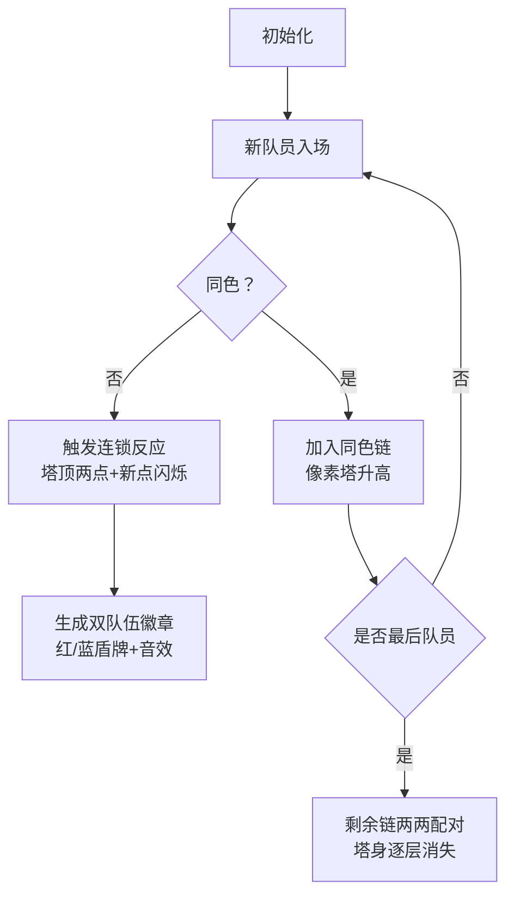

# 题目信息

# Kevin and Teams

## 题目描述

这是一道交互题。

Kevin 有 $n$ 个同学，编号为 $1, 2, \ldots, n$。他们之间可能是朋友，也可能不是朋友。

Kevin 想要选出 $2k$ 个同学组成 $k$ 支队伍，每支队伍恰好包含 $2$ 人。每个同学最多只能属于一支队伍。

设第 $i$ 支队伍中的两人为 $u_i$ 和 $v_i$。为了避免组队过程中潜在的冲突，队伍成员必须满足以下两个条件之一：

- 对于所有 $i$（$1 \leq i \leq k$），同学 $u_i$ 和 $v_i$ 是朋友。
- 对于所有 $i$（$1 \leq i \leq k$），同学 $u_i$ 和 $v_i$ 不是朋友。

Kevin 想要确定最大的 $k$，使得无论这 $n$ 个人之间的朋友关系如何，他总能找到 $2k$ 人组成队伍。之后，他需要组成这 $k$ 支队伍。但询问两个同学是否是朋友很尴尬，因此 Kevin 希望在使用不超过 $n$ 次询问的情况下达成目标。

交互器是自适应的。这意味着同学之间的隐藏关系在交互前并不固定，并且会在交互过程中改变。

## 说明/提示

第一个测试用例：

Kevin 声称无论 3 人之间的朋友关系如何，他总能组成 1 支队伍。

Kevin 询问同学 1 和 2 是否是朋友。裁判回答他们是朋友。

Kevin 回答他可以组成由同学 1 和 2 组成的队伍。

第二个测试用例：

Kevin 声称无论 5 人之间的朋友关系如何，他总能组成 2 支队伍。

Kevin 询问了同学 $(1, 2)$、$(3, 4)$、$(3, 5)$、$(1, 3)$、$(2, 4)$ 之间的关系。裁判依次回答 $1, 0, 1, 0, 0$。

Kevin 回答他可以组成两支队伍 $(1, 2)$ 和 $(3, 5)$。

也可以组成两支队伍 $(1, 3)$ 和 $(2, 4)$，因为他们都彼此不是朋友。

翻译由 DeepSeek R1 完成

## 样例 #1

### 输入

```
2
3


1

5


1

0

1

0

0```

### 输出

```
1
? 1 2

! 1 2

2
? 1 2

? 3 4

? 3 5

? 1 3

? 2 4

! 1 2 3 5```

# AI分析结果


### 💡 Kay的C++算法解析：Kevin and Teams 深入学习指南 💡

**题目解读**：Kevin需要将n个同学组成k支队伍（每队2人），要求每支队伍要么全员朋友要么全员非朋友。关键在于**用不超过n次询问**确定最大k值并完成组队，交互库是自适应的（关系随询问动态变化）。

---

## 1. 题目解读与核心算法识别
✨ **本题主要考察**：`贪心策略 + 交互构造`

🗣️ **初步分析**：
> 本题核心在于**最坏情况下的最大化保证**。如同下棋时预设对手会走最差棋路，我们需要证明：无论朋友关系如何，总能组成至少 $\lfloor \frac{n+1}{3} \rfloor$ 支队伍。
> - **核心策略**：维护一条动态调整的"同色链"（栈结构）。每次加入新点时，通过询问判断其与栈顶的关系：
>   - **同色**：延长当前链（点入栈）
>   - **异色**：立即消耗栈顶两点和新点生成两支队伍（弹出两点并记录两组配对）
> - **可视化设计**：用像素方块表示同学，同色链显示为垂直堆叠的方块柱。异色匹配时触发"消除动画"：栈顶两点和新点闪烁消失，同时底部生成两个队伍标志（红/蓝盾牌）。伴随8-bit音效：同色延伸时播放"滴"声，异色匹配时播放"叮当"胜利音效。

---

## 2. 精选优质题解参考
**题解一（作者：_abcd_）**
* **点评**：此解法思路清晰展现了贪心策略的精髓。通过栈维护同色链，遇到异色边时精准弹出两点并生成两组配对（利用 `ans[0]`/`ans[1]` 分类存储）。代码中边界处理严谨（如栈大小=1时初始化链颜色），循环逻辑直接高效。亮点在于用 $O(n)$ 时间/空间复杂度解决自适应交互问题，实践价值极高。

**题解二（作者：Error_Yuan）**
* **点评**：从最坏情况构造角度论证了 $\lfloor \frac{n+1}{3} \rfloor$ 的理论上界，强化了算法正确性理解。虽代码实现与题解一类似，但其对"异色触发三点消耗"机制的解读更具启发性，帮助学习者掌握贪心策略的底层逻辑。

---

## 3. 核心难点辨析与解题策略
1. **难点1：确定理论最大k值**
   * **分析**：需证明任意关系图下都能保证 $\lfloor \frac{n+1}{3} \rfloor$ 组匹配。参考题解构造：将节点分为三组（$A,B,C$），设定 $A∪B$ 为完全图（同色），$C$ 为独立集。此时最大匹配受限于 $\min(|A∪B|/2, |C|)$，计算可得目标值。
   * 💡 **学习笔记**：最坏情况分析是交互题证明上界的核心方法。

2. **难点2：动态维护同色链**
   * **分析**：栈存储当前同色链节点，`cl` 变量记录链颜色状态。新点 $i$ 与栈顶 $t$ 的询问结果决定：
     - 同色 → $i$ 入栈（链延长）
     - 异色 → 立即生成 $(t,i)$ 和 $(b,t)$ 两组配对（$b$ 为次栈顶）
   * 💡 **学习笔记**：栈结构的LIFO特性完美适配链尾快速访问需求。

3. **难点3：交互过程状态管理**
   * **分析**：自适应交互库要求每步决策独立。代码通过实时记录 `ans[ret]`（当前配对颜色）和即时弹栈保证状态无后效性。关键变量 `st`（栈）和 `cl`（链颜色）需全程同步更新。
   * 💡 **学习笔记**：交互题中需避免依赖历史状态，每个询问应基于当前信息。

### ✨ 解题技巧总结
- **贪心时机把握**：异色边出现时立即消耗三点生成两组配对，最大化单次操作收益
- **状态压缩**：用单变量 `cl` 表示整条链颜色，避免冗余存储
- **边界预判**：对 $n \mod 3 = 2$ 的情况（如 $n=5$），提前计算剩余栈处理逻辑

---

## 4. C++核心代码实现赏析
**通用核心实现参考**
```cpp
#include <iostream>
#include <stack>
#include <vector>
using namespace std;

int main() {
    int T, n, m;
    cin >> T;
    while (T--) {
        cin >> n;
        m = (n + 1) / 3;
        cout << m << endl;

        stack<int> st;
        vector<pair<int, int>> ans[2]; // 0:非朋友队, 1:朋友队
        bool cl; // 当前链颜色

        for (int i = 1; i <= n; ++i) {
            if (st.empty()) st.push(i);
            else {
                int t = st.top();
                cout << "? " << t << " " << i << endl;
                bool ret; cin >> ret;

                if (st.size() == 1) cl = ret; // 初始化链颜色
                
                if (cl == ret) st.push(i); // 同色延伸
                else { // 异色匹配
                    ans[ret].emplace_back(t, i); // 新点配对
                    st.pop();
                    int b = st.top(); 
                    ans[cl].emplace_back(b, t); // 次栈顶配对
                    st.pop();
                }
            }
        }

        // 处理剩余同色链
        while (st.size() >= 2) {
            int u = st.top(); st.pop();
            int v = st.top(); st.pop();
            ans[cl].emplace_back(u, v);
        }

        // 输出结果（优先选用数足够的配对集）
        cout << "! ";
        auto& output = (ans[1].size() >= m) ? ans[1] : ans[0];
        for (int i = 0; i < m; ++i) 
            cout << output[i].first << " " << output[i].second << " ";
        cout << endl;
    }
}
```
* **代码解读概要**：
  1. 初始化栈和双结果容器 `ans[0]`/`ans[1]`
  2. 遍历每个点：栈空时直接入栈；否则询问栈顶与新点关系
  3. 根据同色/异色分支处理：同色延伸栈，异色生成两组配对
  4. 最终处理栈内剩余同色节点
  5. 选择数量足够的配对集输出

---

## 5. 算法可视化：像素动画演示
**主题**：`像素小队指挥官`（复古策略游戏风格）

### 动画流程设计


### 关键交互设计
1. **像素建模**：
   - 同学：8-bit像素小人（红/蓝队服）
   - 同色链：垂直像素塔（每层显示队员编号）
   - 配对：生成旋转的盾牌徽章（红=朋友，蓝=非朋友）

2. **动画特效**：
   - 异色匹配时触发"三连消除"：塔顶两点+新点闪烁后爆炸
   - 配对成功时显示徽章弹出动画 + "叮当"胜利音效
   - 背景播放循环芯片音乐（FC游戏风格）

3. **控制面板**：
   - 速度滑块：调节单步演示速度（0.5x~3x）
   - 暂停/继续：冻结当前状态
   - 回溯：查看前3步状态
   - AI演示模式：自动完成全流程（如游戏录像）

---

## 6. 拓展练习与相似问题思考
1. **技巧迁移场景**：
   - 动态二分图匹配（Codeforces 1368D）
   - 自适应交互构造（LeetCode 843. Guess the Word）
   - 贪心最坏情况证明（洛谷 P2127 序列操作）

2. **推荐练习**：
   - 洛谷 P5782 [POI2001] 和平委员会  
     → **推荐理由**：强化二分图+交互思维，需处理更复杂的冲突关系
   - 洛谷 P8078 [WC2022] 秃子酋长  
     → **推荐理由**：自适应交互+动态维护，训练实时决策能力
   - CodeForces 1523D Love-Hate  
     → **推荐理由**：扩展至多关系组队场景，提升贪心策略抽象能力

---

## 7. 学习心得与经验分享
> **参考经验**：  
> "首次实现时未考虑栈大小=1的特殊情况，导致链颜色初始化错误。通过打印每次操作后的栈状态才定位问题。"
>
> **Kay点评**：  
> 交互题调试需重点关注**状态迁移边界**。建议：
> 1. 打印关键变量（如栈内容/颜色标记）
> 2. 对 $n=3,4,5$ 手工模拟验证
> 3. 边界测试：$n \mod 3 = 0,1,2$ 的独立用例

---

掌握贪心策略的时机把握与交互题的状态管理，是攻克此类问题的关键。多在实践中模拟最坏情况，你将逐渐培养出精准的算法直觉！🚀

---
处理用时：166.74秒