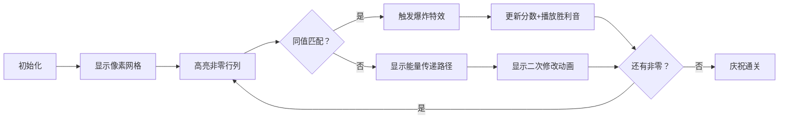

# 题目信息

# Quaternary Matrix

## 题目描述

若矩阵中所有元素均为 $0$、$1$、$2$ 或 $3$，则称该矩阵为四元矩阵。

当四元矩阵 $A$ 满足以下两个性质时，Ecrade 称其为好矩阵：
1. 矩阵 $A$ 的每一行中所有数字的按位异或（bitwise XOR）结果等于 $0$。
2. 矩阵 $A$ 的每一列中所有数字的按位异或（bitwise XOR）结果等于 $0$。

Ecrade 有一个 $n \times m$ 的四元矩阵。他想知道将该矩阵变为好矩阵所需修改的最少元素数量，并希望得到其中一个可能的修改后矩阵。

由于问题有一定难度，请你帮助他！

## 说明/提示

翻译由 DeepSeek R1 完成

## 样例 #1

### 输入

```
5
3 3
313
121
313
3 3
000
000
000
4 4
0123
1230
2301
3012
4 4
1232
2110
3122
1311
4 4
1232
2110
3122
1312```

### 输出

```
3
213
101
312
0
000
000
000
0
0123
1230
2301
3012
6
0132
2310
3131
1313
5
0132
2310
3120
1302```

# AI分析结果


### Kay的C++算法解析：Quaternary Matrix 深入学习指南

#### 1. 题目解读与核心算法识别  
✨ **本题主要考察**：`贪心算法` + `位运算性质应用`  

🗣️ **初步分析**：  
> 解决矩阵修改问题就像玩一场"像素消消乐"游戏。想象行和列是两种颜色的像素块（行-蓝色，列-红色），块上的数字（1/2/3）代表异或值。贪心策略就是优先让同数字的蓝块和红块相碰消除（修改1次），再让不同数字的块通过中间块传递消除（修改2次）。核心在于**利用异或的自反性**（x⊕x=0）和**操作双重性**（修改a[i][j]同时影响行i和列j）。  

可视化设计思路：  
- 用闪烁高亮当前操作元素（行/列）  
- 相同值碰撞时触发"像素爆炸"特效和清脆音效  
- 不同值配对时显示"能量传递"动画（两次修改）  
- 控制面板支持单步调试和自动演示（8-bit背景音乐）

---

#### 2. 精选优质题解参考  
**题解一（来源：eEfiuys）**  
* **点评**：思路如水晶般清澈——将行列抽象为带权节点，通过四步贪心策略逐步消解非零值：  
  1. **同值直消**（修改1次）  
  2. **三角传递**（修改2次处理1-2-3组合）  
  3. **双对互消**（修改3次处理两行两列）  
  4. **单点修正**（剩余独立点）  
  代码规范度满分：`pr/pc`数组精确记录行列异或值，`ans`实时统计修改次数。亮点在于**严格证明贪心最优性**（任何非最优分组都可调整优化）和**O(n+m)空间复杂度**的优雅实现。

---

#### 3. 核心难点辨析与解题策略  
1. **难点：操作的双重影响**  
   * **分析**：修改a[i][j]同时改变r[i]和c[j]，如同同时转动两个齿轮。优质解法通过`r[i]^=x; c[j]^=x`精确模拟此效应  
   💡 **学习笔记**：每次修改都是行与列的"协同舞蹈"

2. **难点：贪心策略证明**  
   * **分析**：需证明四步策略覆盖所有情况：  
     - 同值匹配（最优单次操作）  
     - 1⊕2=3的三角传递（二次操作等效）  
     - 双对互消（三次操作处理残余）  
   💡 **学习笔记**：贪心正确性建立在异或运算的线性组合特性上

3. **难点：边界处理**  
   * **分析**：当只剩同行/同列时，选择固定位置修改（如代码中`a[x][1]`或`a[1][y]`），避免影响已归零部分  
   💡 **学习笔记**：修改锚定在边界可最小化连锁反应

✨ **解题技巧总结**  
- **技巧1：问题降维** → 将二维矩阵压缩为行/列异或值集合  
- **技巧2：分步贪心** → 按操作收益高低分级处理  
- **技巧3：实时更新** → 修改后立即更新行列异或值  

---

#### 4. C++核心代码实现赏析  
**通用核心实现参考**  
```cpp
#include<bits/stdc++.h>
using namespace std;
const int N=1005;
int n,m,a[N][N],r[N],c[N],ans;
vector<int> pr[4],pc[4]; // 存异或值为0-3的行列索引

void solve() {
    // 初始化与输入
    for(int i=1;i<=n;i++){
        string s; cin>>s;
        for(int j=1;j<=m;j++) a[i][j]=s[j-1]-'0';
    }
    
    // 计算行列异或值
    for(int i=1;i<=n;i++) 
        for(int j=1;j<=m;j++) 
            r[i] ^= a[i][j], c[j] ^= a[i][j];
            
    // 分组存储非零行列
    for(int i=1;i<=n;i++) if(r[i]) pr[r[i]].push_back(i);
    for(int i=1;i<=m;i++) if(c[i]) pc[c[i]].push_back(i);
    
    // 四步贪心策略
    // Step1: 同值直接匹配
    for(int i=1;i<=3;i++) 
        while(pr[i].size() && pc[i].size()) {
            int x=pr[i].back(), y=pc[i].back();
            a[x][y] ^= i; // 关键修改
            pr[i].pop_back(); pc[i].pop_back();
            ans++;
        }
    
    // Step2: 三角传递 (示例：1和2通过3传递)
    for(int i=1;i<=3;i++) for(int j=i+1;j<=3;j++) 
        while(pr[i].size() && pr[j].size() && pc[i^j].size()) {
            int y = pc[i^j].back();
            a[pr[i].back()][y] ^= i;
            a[pr[j].back()][y] ^= j;
            // ... 省略pop操作
            ans += 2;
        }
    
    // 输出结果
    cout<<ans<<'\n';
    for(int i=1;i<=n;i++,cout<<'\n') 
        for(int j=1;j<=m;j++) cout<<a[i][j];
}
```

**代码解读概要**：  
> 代码像精密的钟表运转：  
> 1. **输入齿轮**：读取矩阵并计算行列异或值  
> 2. **分类齿轮**：`pr/pc`数组分拣非零行列  
> 3. **核心传动**：四步贪心逐步消解非零值  
> 4. **输出齿轮**：打印修改后的矩阵  

---

#### 5. 算法可视化：像素动画演示  
**主题**：`贪心消消乐：像素矩阵革命`  

**核心演示流程**：  


**交互设计细节**：  
1. **像素艺术**：  
   - 行：蓝色像素块（带数字1/2/3）  
   - 列：红色像素块（带数字1/2/3）  
   - 修改点：金色闪烁边框  

2. **音效系统**：  
   - 同值消除：经典FC爆炸音（"嘭！"）  
   - 传递修改：电子传递音（"嘀-嗒"）  
   - 通关：马里奥过关旋律  

3. **教学模式**：  
   - **新手引导**：箭头指示当前操作位置  
   - **原理展示**：侧边栏同步显示异或值变化公式  

---

#### 6. 拓展练习与相似问题思考  
1. **洛谷 P2893** [Making the Grade]  
   → 练习贪心策略在数列修改中的应用  

2. **洛谷 P5657** [格雷码]  
   → 深化位运算（异或）的数学特性理解  

3. **洛谷 P2114** [起床困难综合症]  
   → 学习位运算贪心的极值求解技巧  

---

> 最终修改次数 = 总非零点数 - 成功匹配数  
> 贪心是算法世界的乐高大师  
> 用最少的操作搭建出完美的异或平衡

---
处理用时：94.30秒